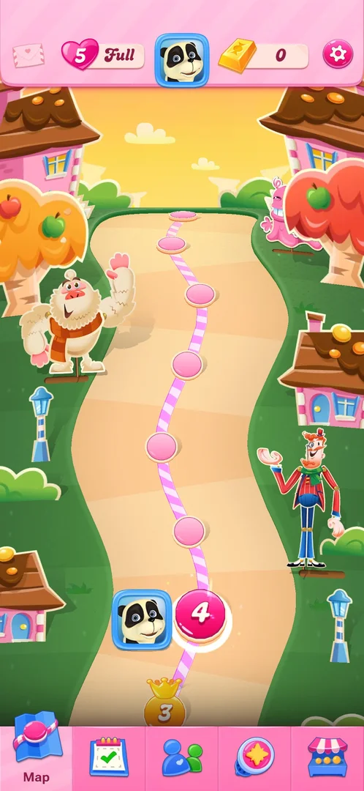
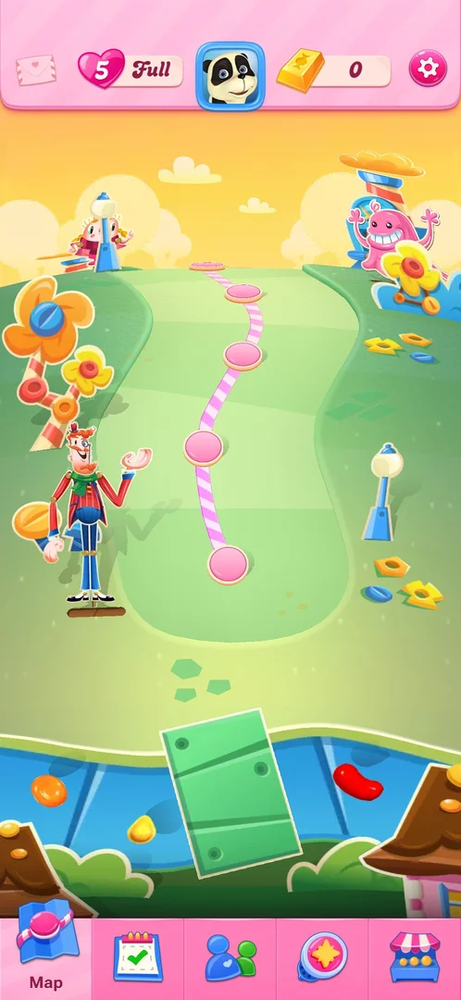
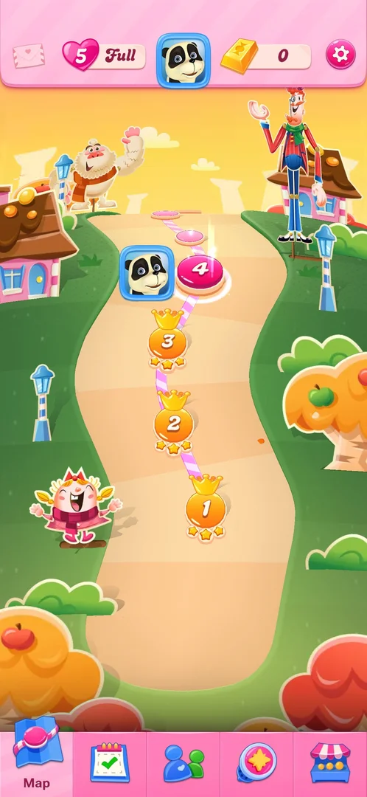
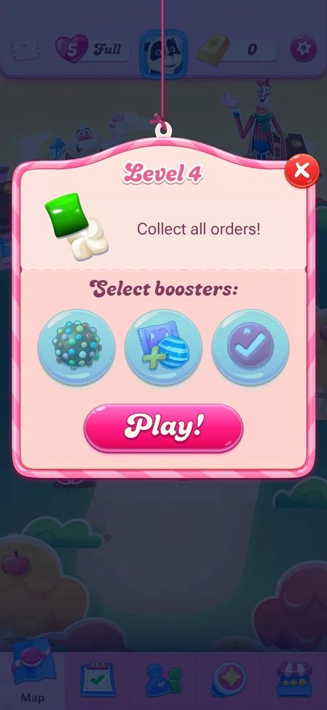

# Level map

The main screen between levels: a winding path of numbered level nodes that scrolls up and down, with a top
bar of currencies and icons and a bottom tab bar that switches between the map and four other screens. A
level is started from its node [^s2] [^s5].

## Why it appeared

After winning level 1: level 1 opened straight from the title screen with no map, and the first frame after
the win showed the Level 2 start popup over the map [^s1] [^s3].

## Where to find it

The map is the screen the game returns to after a level, and the screen it opens on once level 1 is won.
From the other tabs, the Map tab (a folded map icon) at the left end of the bottom tab bar brings it back
[^s2] [^s4].

 [^s4]
*Map, the first tab of the bottom tab bar, selected and labelled*

## What it looks like

 [^s4]
*The map at level 4: the next level is the large pink node with the avatar beside it*

A candy-coloured path climbs up the screen with pink round nodes. The next level (4 here) is a larger
highlighted node with the player's avatar beside it; won levels sit below it as orange nodes with a crown.
Characters, houses, trees and lamps line the path [^s4] [^s6].

Top bar, left to right: an envelope, a heart with the lives count and "Full" (or a timer), the avatar, a
gold bar with 0, a gear. Bottom tab bar: Map, a calendar, two figures, a star badge, a shop stall; the
selected tab is lighter and shows its name [^s4].

## What you can do

| Tab or button | What it does |
|---|---|
| [Path](#path) | Scrolls up and down along the levels |
| [Level node](#level-node) | Opens the level's start popup |
| [Top bar](#top-bar) | Envelope, lives, avatar, gold bars, gear |
| [Bottom tab bar](#bottom-tab-bar) | Map, Events, Social, Pins, Shop |

### Path

 [^s7]
*Scrolled up from level 4: plain pink nodes up to a hill; no locks or gates on the way*

A vertical swipe scrolls the map. Above the current level the path shows plain pink nodes without numbers
up to a hill, with a river and a green bridge below that stretch; no lock, gate or other marker was seen on
the path [^s7]. Scrolled down, the path starts at level 1 [^s6].

 [^s6]
*The start of the map: each won level has a crown and three stars under its number*

### Level node

 [^s5]
*Tapping the level 4 node opens the Level 4 start popup*

Tapping the current node (level 4) opened its start popup: the order, "Select boosters:" with three slots,
Play! and a red X [^s5]. After the level 1 win the Level 2 popup came up by itself, over the map, and its X
closed it to the map [^s3] [^s2]. See [Level](core-level.md#level-start-popup).

### Top bar

 [^s8]
*The heart at the left of the top bar: 4 lives and the time to the next life*

Left to right [^s2] [^s8]:

- Envelope: a tap changed nothing, see [Mailbox icon](mailbox.md).
- Heart with the lives count: "Full" at 5; after a quit, 4 and a timer (28:32). It opens the
  [Lives](lives.md) popup.
- Avatar: opens [Profile and inventory](profile.md).
- Gold bar with 0: see [Gold bars](gold-bars.md).
- Gear: opens [Settings](settings.md).

### Bottom tab bar

<!-- no-frame: the tab bar is on the map frames above -->
Left to right; the selected tab is lighter and shows its name [^s2] [^s4]:

- Map: this screen.
- Calendar: the [Events tab](events-tab.md).
- Two figures: Social, with [Candy Teams](candy-teams.md) and the [Friends list](friends.md).
- Star badge: the [Pins collection](pins.md).
- Shop stall: the [Shop](shop.md). It had a red badge "1" at level 2 (2026-10-03); at level 4 (2026-10-05)
  no tab had a badge [^s2] [^s4].

## How it works

Version 1.337.0.2.

- **Progress on the path.** A won level's node turns orange with a crown and shows its stars under the
  number (three stars each for levels 1 to 3); the avatar moves next to the next level's node [^s6]. At
  level 2 only level 1 had a crown and the avatar was beside node 2 [^s2].
- **Lives.** After level 4 was quit, the heart in the top bar showed 4 and a 28:32 timer instead of 5 and
  "Full" [^s8].
- **Gates.** None seen up to the top of the scrolled area above level 4 [^s7].

 [^s2]
*The same map at level 2 (2026-10-03), for comparison*

## Cases

| Case | What was done | Result | Source |
|---|---|---|---|
| Why it appeared <!-- case:chk-appeared --> | Won level 1 | ✅ The map shows for the first time, under the Level 2 popup | [^s1] |
| Where to find it <!-- case:chk-entry --> | Opened the game at level 4; closed the Level 2 popup earlier | ✅ The map is the home screen after level 1; the Map tab at the left of the tab bar | [^s4] [^s2] |
| What it looks like <!-- case:chk-screen --> | Looked at the map and scrolled it to both ends | ✅ A vertical winding path; levels 1 to 3 with a crown and three stars; level 4 current with the avatar; unplayed pink nodes above | [^s4] [^s6] |
| Every entry point on it <!-- case:chk-entries --> | Tapped every top bar icon and every tab; scrolled the path | ✅ Top bar: envelope, lives, avatar, gold bars, gear; tab bar: Map, Events, Social, Pins, Shop, each its own page; no locked gates on the path | [^s1] [^s7] |
| Badges, timers and counters on it <!-- case:chk-badges --> | Looked at the bar and tabs before and after quitting level 4 | ✅ Lives 5 Full, then 4 with a 28:32 timer; gold bars 0; no red badges on the tabs at level 4 | [^s8] |
| What changes on it with progress <!-- case:chk-changes --> | Compared the map at level 2 and level 4; quit level 4 | ✅ Won nodes get a crown and stars; the avatar moves to the next node; the lives timer appears after a lost life; scrolling shows more nodes and scenery | [^s6] [^s8] [^s7] |

## Not verified

- What the Shop tab badge "1" at level 2 counted, and what cleared it (gone by level 4).
- What the map shows past the top of the scrolled area (new episodes, gates): only the stretch above
  level 4 was seen.

[^s1]: session 20261003-194350-chrono-2FYKPJ, step 23 — [video at 4:41](https://youtu.be/OjVVcEHXMyI?t=281)
[^s2]: session 20261003-194350-chrono-2FYKPJ, step 7 — [video at 2:16](https://youtu.be/OjVVcEHXMyI?t=136)
[^s3]: session 20261003-194350-chrono-2FYKPJ, step 6 — [video at 1:33](https://youtu.be/OjVVcEHXMyI?t=93)
[^s4]: session 20261005-220615-chrono-2FYKPJ, step 0 — [video at 0:00](https://youtu.be/PUVQSAvSV0c?t=0)
[^s5]: session 20261005-220615-chrono-2FYKPJ, step 4 — [video at 0:55](https://youtu.be/PUVQSAvSV0c?t=55)
[^s6]: session 20261005-220615-chrono-2FYKPJ, step 3 — [video at 0:46](https://youtu.be/PUVQSAvSV0c?t=46)
[^s7]: session 20261005-220615-chrono-2FYKPJ, step 1 — [video at 0:27](https://youtu.be/PUVQSAvSV0c?t=27)
[^s8]: session 20261005-220615-chrono-2FYKPJ, step 11 — [video at 2:34](https://youtu.be/PUVQSAvSV0c?t=154)
