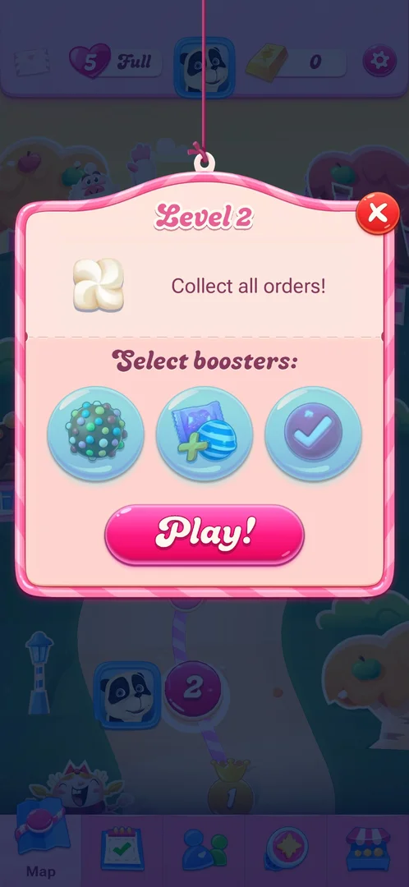
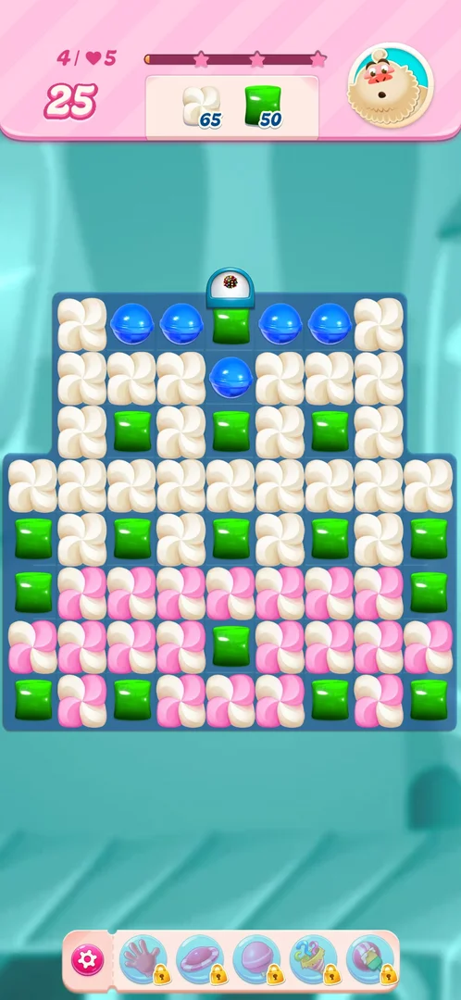
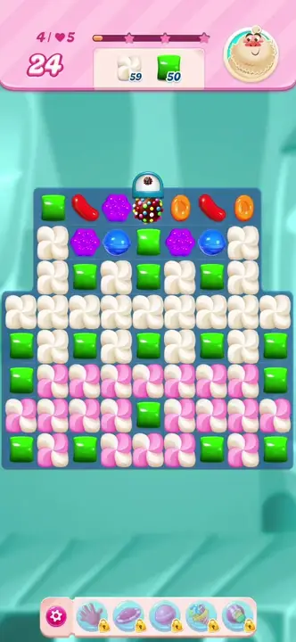
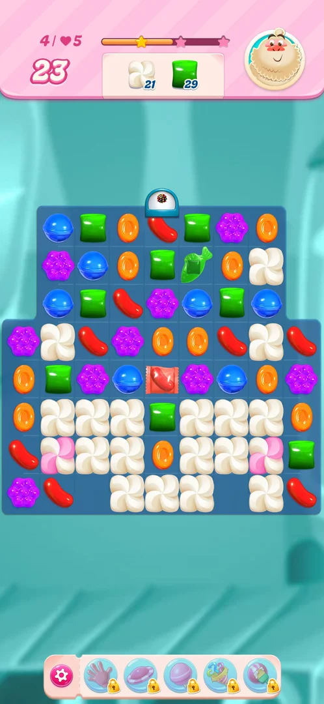

# Meringue blocker

Meringue is a swirl-shaped block that fills cells of the board in place of a candy. It does not move and
cannot be swapped; matches and blasts next to it take its layers off, and the level's order counts the
layers removed. It comes in two looks: a white swirl (one layer) and a pink and white swirl (two layers)
[^s3] [^s4].

## Why it appeared

It is part of the level layout from level 2 on: the Level 2 start popup asked to collect meringue, and
the level 2 board was the first with a blocker on it [^s1]. Levels 2, 3 and 4 all had meringue in their
order [^s1] [^s2].

 [^s1]
*Level 2's start popup: the meringue icon is the whole order*

## Where to find it

There is no button for it: it is on the board of a level that has it. From the map, tap the level's node
(here level 4); the start popup shows the meringue icon in its order, next to the other goals, and
Play! opens the board [^s2].

 [^s2]
*The white swirl next to the green candy in the order of the Level 4 popup, above Play!*

## What it looks like

 [^s3]
*Level 4 at its start: white swirls in the upper half, pink and white swirls in the lower half*

On level 4 the board is 9 cells wide and 8 rows high (the top three rows are 7 cells wide). At the start
the white swirls fill most of rows 1 to 5 and the pink and white swirls most of rows 6 to 8; green candies
sit in the gaps, and only the top row has a few other candies. The order panel at the top shows the
meringue icon with the number of layers left (65) next to the green candy (50); moves: 25 [^s3].

## What you can do

The player does not act on the meringue directly: every move is a swap of two candies, and the meringue
loses layers to the matches and blasts next to it [^s4].

## How it works

Version 1.337.0.2, level 4.

- **Layers.** A white swirl has one layer, a pink and white swirl two; a hit on a pink swirl turns it
  white [^s4].
- **Order.** The meringue number in the order panel counts layers, not cells: 65 at the start of level 4
  [^s3].
- **Plain match next to it.** The first move, a five-blue line in the top row, took 6 layers: 65 to 59;
  moves 25 to 24 [^s4].
- **Colour bomb swapped with a green.** Every green candy on the board cleared, and the meringue next to
  them lost layers: 59 to 21 in that one move, green 50 to 29, moves 24 to 23. Most pink swirls turned
  white; two pink swirls were left in row 7, and many cells of the lower half became plain candies [^s4].
  The same swap on earlier runs of level 4 took 59 to 24 and 59 to 23 (see [Colour bomb](color-bomb.md)
  and [Bomb dispenser](bomb-dispenser.md)).
- No timer, spreading or movement of the meringue was seen [^s4].

 [^s4]
*Clip 5.7 s · [original on YouTube from 1:40](https://youtu.be/PUVQSAvSV0c?t=100)*

 [^s4]
*After the bomb move: 21 layers left, two pink swirls left in row 7*

## Outcomes

The base level is [Level](core-level.md).

| Outcome | What happens | Source |
|---|---|---|
| Win: the order is done | Same as the base level: levels 2 and 3 (meringue orders) were won with the order ticked and the next level's popup opening by itself | [^s5] [^s6] |
| Out of moves | Not reached on a meringue level. Inferred: the order not met at 0 moves is the base level's out of moves; the meringue adds no other way to lose | [^s4] |
| Quit | Same as the base level: level 4 quit from the in-level settings cost a life; the map showed 4 lives and a 28:32 timer | [^s7] |

## Cases

| Case | What was done | Result | Source |
|---|---|---|---|
| Why it appeared <!-- case:chk-appeared --> | Opened the Level 2 popup | ✅ The order is meringue; the first blocker on the board | [^s1] |
| Where to find it <!-- case:chk-entry --> | Map > level 4 node | ✅ The start popup shows the white meringue icon in the order; Play! opens the board | [^s2] |
| What it looks like <!-- case:chk-screen --> | Started level 4 | ✅ White one-layer and pink two-layer swirls fill most of the 9 by 8 board | [^s3] |
| First level and tutorial <!-- case:chk-first-level --> | Started level 4 | ✅ In the order from level 2 (65 layers on level 4); no tutorial text, only the order icon | [^s2] |
| Rules <!-- case:chk-rules --> | A five-blue line next to it | ✅ Blocks its cell; pink has two layers, white one; the order counts layers (65 to 59 after the first move) | [^s4] |
| Interactions <!-- case:chk-interactions --> | Colour bomb swapped with a green | ✅ 59 to 21 layers in one move; most pink turned white; green 50 to 29, moves 24 to 23 | [^s4] |
| Ways to lose <!-- case:chk-loss --> | Two moves, then quit | ✅ No timer or spreading seen; only the move limit (25 on level 4) | [^s4] |

## Not verified

- Out of moves on a meringue level: level 4 was quit after two moves (chk-loss rests on the base level).
- What else removes meringue: striped, wrapped and fish blasts on meringue were not separated from plain
  matches.

[^s1]: session 20261003-225003-chrono-2FYKPJ, step 13 — [video at 2:05](https://youtu.be/EeHt-Knje2A?t=125)
[^s2]: session 20261005-220615-chrono-2FYKPJ, step 4 — [video at 0:55](https://youtu.be/PUVQSAvSV0c?t=55)
[^s3]: session 20261005-220615-chrono-2FYKPJ, step 5 — [video at 1:05](https://youtu.be/PUVQSAvSV0c?t=65)
[^s4]: session 20261005-220615-chrono-2FYKPJ, step 7 — [video at 1:45](https://youtu.be/PUVQSAvSV0c?t=105)
[^s5]: session 20261003-225003-chrono-2FYKPJ, step 25 — [video at 6:18](https://youtu.be/EeHt-Knje2A?t=378)
[^s6]: session 20261003-225003-chrono-2FYKPJ, step 43 — [video at 14:44](https://youtu.be/EeHt-Knje2A?t=884)
[^s7]: session 20261005-220615-chrono-2FYKPJ, step 11 — [video at 2:34](https://youtu.be/PUVQSAvSV0c?t=154)
