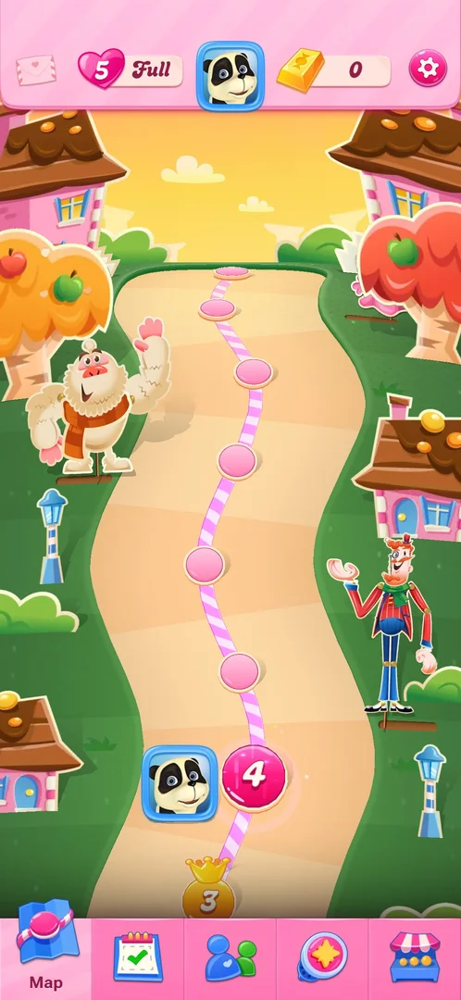
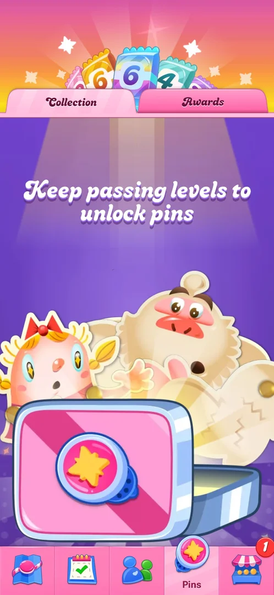
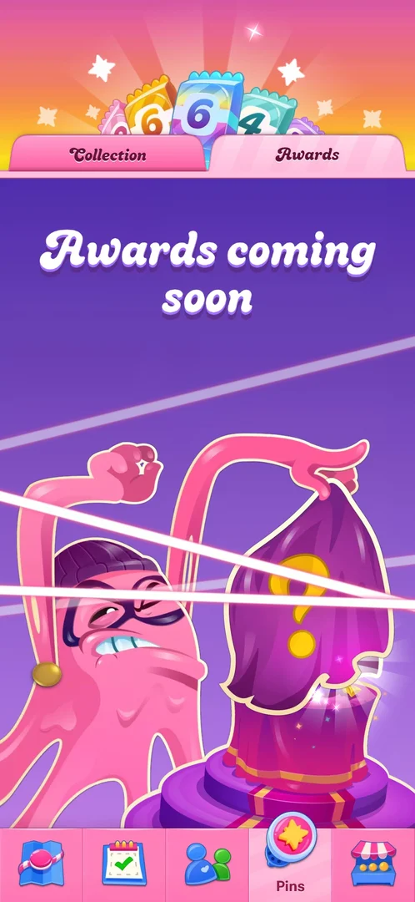

# Pins collection

A collection of pins (badges) on the map's fourth tab, with two sub-tabs, Collection and Awards. At levels
2 and 4 both were empty: Collection says "Keep passing levels to unlock pins", Awards says "Awards coming
soon" [^s1] [^s2] [^s3] [^s6].

## Why it appeared

The Pins tab is in the map's bottom bar from the first view of the map, after level 1; it opened on an
empty Collection [^s1].

## Where to find it

The star badge icon, fourth from the left in the map's bottom tab bar, between Social and Shop
[^s4] [^s5].

 [^s5]
*Star badge icon, fourth in the bottom tab bar of the map*

## What it looks like

 [^s6]
*Pins with level 4 next: Collection, still empty*

The map's top bar is replaced by a header of colourful numbered tiles; under it the two sub-tabs,
Collection and Awards. The tab is labelled "Pins" in the bottom bar. Pins opens on Collection [^s3] [^s6].

## What you can do

| Tab or button | What it does |
|---|---|
| [Collection](#collection) | The pins owned; empty at levels 2 and 4, no bar or counter |
| [Awards](#awards) | "Awards coming soon" at levels 2 and 4 |

### Collection

 [^s1]
*Collection: no pins yet*

The line "Keep passing levels to unlock pins" over an open pink box holding one star pin, with two
characters behind it. No pin is listed, and there is no progress bar or counter of pins [^s1] [^s3] [^s6].

### Awards

 [^s7]
*Awards with level 4 next: coming soon*

The heading "Awards coming soon" over a masked pink candy character (a thief) pulling a purple cloth with a
question mark off a hidden prize, behind laser-like beams [^s2] [^s7]. Nothing to tap but the sub-tabs.

## How it works

Version 1.337.0.2. By the game's own line, pins unlock by passing levels [^s1]; levels 1 to 3 won gave
no pin, and the Collection was still empty with level 4 next [^s3] [^s6]. Which level gives the first
pin, and what an award is, were not seen.

## Cases

| Case | What was done | Result | Source |
|---|---|---|---|
| Why it appeared <!-- case:chk-appeared --> | Opened the Pins tab at level 2 | ✅ There from the first map view, empty | [^s1] |
| Where to find it <!-- case:chk-entry --> | Tapped the star badge tab, fourth in the bottom bar | ✅ Pins opened on Collection | [^s3] |
| What it looks like <!-- case:chk-screen --> | Opened Collection and Awards | ✅ Both empty; Collection says "Keep passing levels to unlock pins" | [^s3] |
| The progress <!-- case:chk-progress --> | Opened Collection and Awards with level 4 next | ✅ No bar or counter, only "Keep passing levels to unlock pins"; Awards "coming soon" | [^s7] |
| The items <!-- case:chk-items --> | — | not verified: no pin owned yet |  |
| How an item is earned <!-- case:chk-earn --> | Read Collection | not verified: the line says by passing levels; none after levels 1 to 3 | [^s6] |
| Using an item <!-- case:chk-use --> | — | not verified |  |
| Completing a set <!-- case:chk-complete --> | — | not verified |  |

## Not verified

- The list of pins, owned and locked, and their conditions <!-- case:chk-items -->
- The level or event that gives the first pin <!-- case:chk-earn -->
- What can be done with a pin <!-- case:chk-use -->
- The reward for a completed set; what Awards hold <!-- case:chk-complete -->

[^s1]: session 20261003-194350-chrono-2FYKPJ, step 12 — [video at 3:12](https://youtu.be/OjVVcEHXMyI?t=192)
[^s2]: session 20261003-194350-chrono-2FYKPJ, step 13 — [video at 3:17](https://youtu.be/OjVVcEHXMyI?t=197)
[^s3]: session 20261003-230937-chrono-2FYKPJ, step 2 — [video at 0:30](https://youtu.be/QXlart4AJGo?t=30)
[^s4]: session 20261003-194350-chrono-2FYKPJ, step 7 — [video at 2:12](https://youtu.be/OjVVcEHXMyI?t=132)
[^s5]: session 20261006-000939-chrono-2FYKPJ, step 0 — [video at 0:00](https://youtu.be/CpL9KWG38IA?t=0)
[^s6]: session 20261006-000939-chrono-2FYKPJ, step 1 — [video at 0:17](https://youtu.be/CpL9KWG38IA?t=17)
[^s7]: session 20261006-000939-chrono-2FYKPJ, step 2 — [video at 0:25](https://youtu.be/CpL9KWG38IA?t=25)
