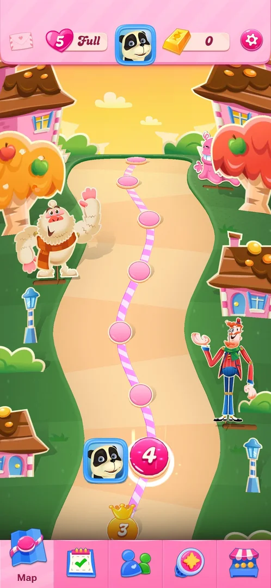
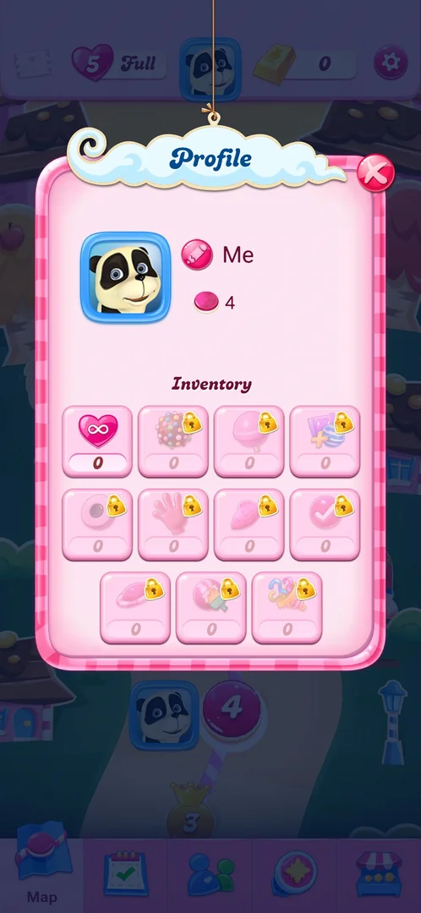
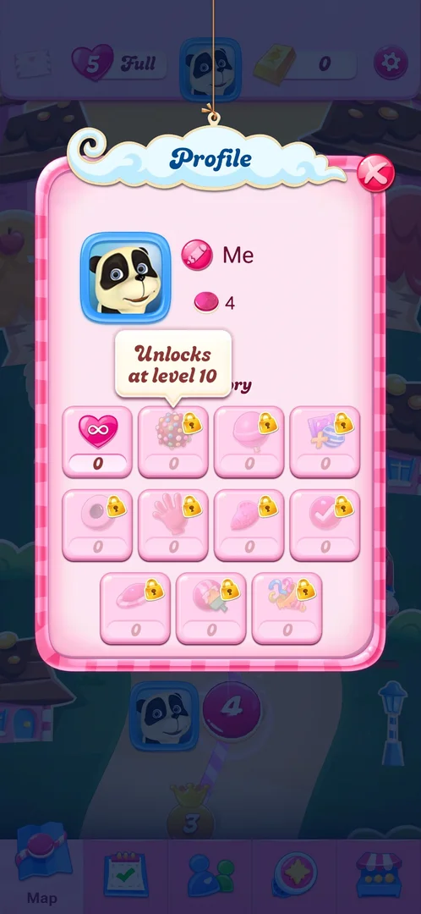
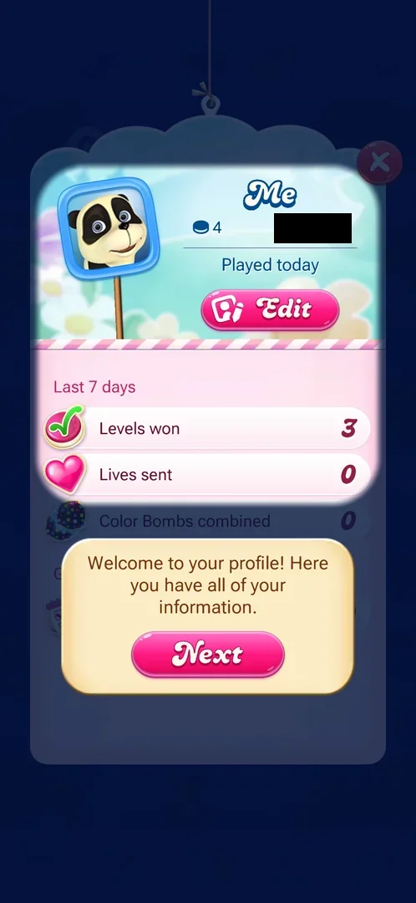
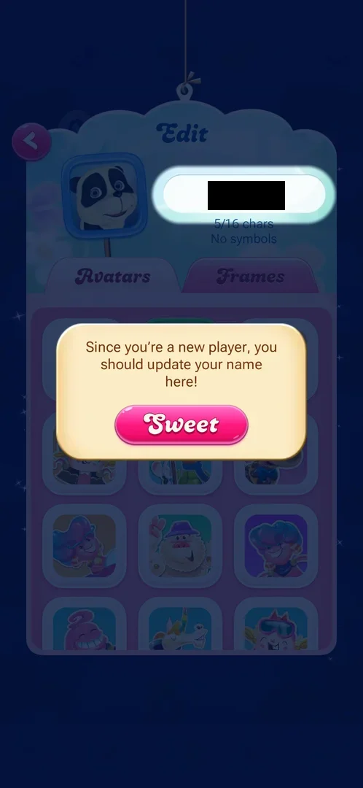
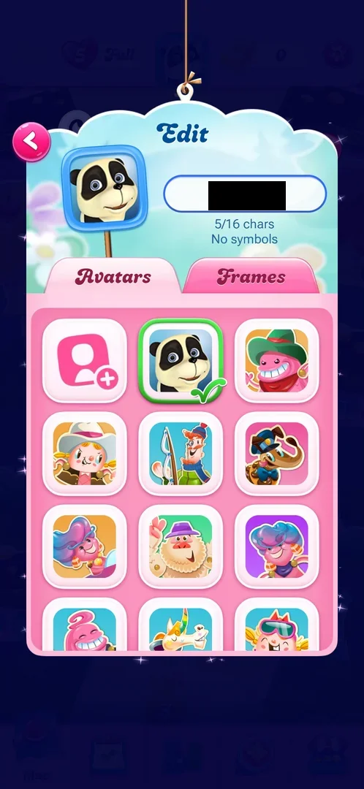
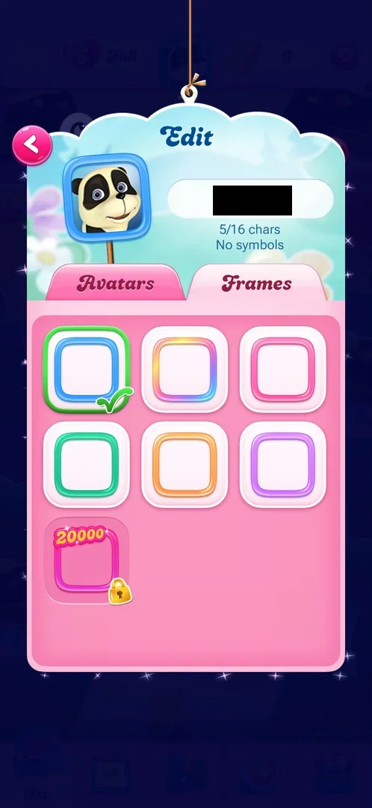
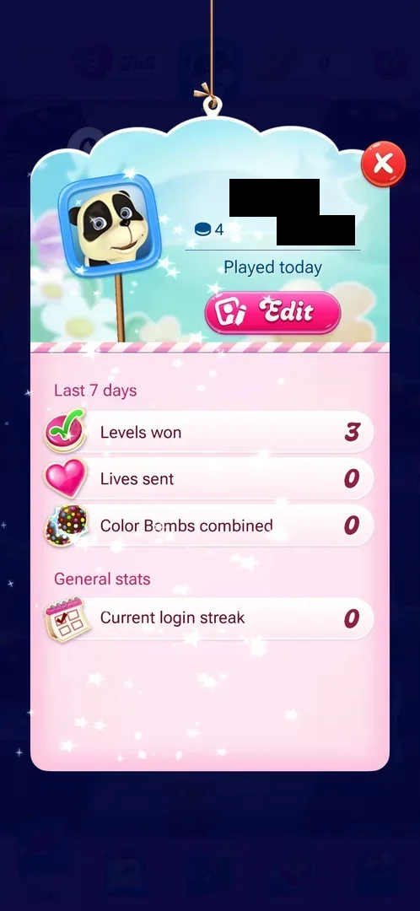

# Profile and inventory

A popup with the player's avatar, name and level, and an inventory of eleven slots: unlimited lives and ten
boosters. The pencil by the name opens a name prompt; the avatar opens a profile card with weekly stats and
an Edit screen where the name, the avatar and its frame are chosen. At level 4 every slot was at 0 and the
ten booster slots were locked, the four read unlocking at levels 7, 10, 20 and 65 [^s1] [^s3] [^s5] [^s10].

## Why it appeared

The avatar is in the middle of the map's top bar from the first view of the map, after level 1 [^s2].

## Where to find it

The avatar (a panda-like character in a blue frame) in the middle of the map's top bar, between the lives
counter and the gold bars [^s2] [^s4].

 [^s4]
*Avatar in the middle of the top bar of the map*

## What it looks like

 [^s5]
*Profile at level 4: everything at 0, all boosters locked*

A popup titled "Profile" with a red X. Top: the avatar; a pink pencil icon next to the default name "Me";
a pink candy icon with 4 (the level reached; it was 2 two sessions before). Below, "Inventory": a grid of
eleven slots with a count under each. The first, unlimited lives (a heart with an infinity sign), is open at
0; the other ten are booster icons (among them a colour bomb, a lollipop hammer, a striped and wrapped pair,
a hand, a fish) with a padlock and 0 [^s1] [^s5].

## What you can do

| Tab or button | What it does |
|---|---|
| [Name prompt](#name-prompt) | The pencil by the name: "Hi! What's your name?" with a 16-character field and Save |
| [Locked slot](#locked-slot) | A tap on a locked booster shows the level that unlocks it |
| [Profile card](#profile-card) | A tap on the avatar: name, level, location, last played, Edit, stats |
| [Edit](#edit) | The card's Edit button: name field, Avatars and Frames tabs |
| [Avatars](#avatars) | A grid of character avatars and a photo upload tile |
| [Frames](#frames) | Six free coloured frames and one locked frame |
| [Stats](#stats) | Last 7 days and General stats on the card |

The X closes the popup to the map [^s14].

### Name prompt

<!-- no-frame: the frame shows the phone's keyboard and navigation bar -->
The pencil next to the name opens a popup with a character at the top: "Hi! What's your name?", a line
saying the name is visible to other Candy players and can be changed in the profile at any time, an empty
field with a 0/16 counter, a Save button and a red X. The keyboard opens with it. Closed with the X, nothing
saved [^s7] [^s8].

### Locked slot

 [^s9]
*A tap on the colour bomb slot: "Unlocks at level 10"*

A tap on a locked inventory slot shows a tooltip with its unlock level. In the first row: the colour bomb
unlocks at level 10, the lollipop hammer at level 7, the fourth slot (striped and wrapped) at level 20; the
first slot of the second row (a round candy) at level 65 [^s9] [^s10]. The other six slots were not read.

### Profile card

 [^s11]
*The card on its first opening, with the tutorial tooltip*

A tap on the avatar in the Profile popup opens a card: the avatar on a stick, the name, a candy icon with the
level (4), a location pin with the phone's country, "Played today", a pink Edit button, and stats below. On
the first opening a tutorial tooltip, "Welcome to your profile! Here you have all of your information.", with
Next, then a second tip on the Edit screen [^s11] [^s12].

### Edit

 [^s12]
*Edit, with the tutorial tip on the name*

The card's Edit button opens "Edit" with a back arrow: the avatar, a name field with a character counter
("5/16 chars") and the rule "No symbols", and two tabs, Avatars and Frames. The tutorial tip says that a new
player should update the name here, with a Sweet button. During this tutorial the name changed from "Me" to
an auto-assigned name of five letters, without anything typed [^s12] [^s15].

### Avatars

 [^s13]
*Avatars: an upload tile and the game's characters*

A grid: first a tile with a person and a plus (upload a photo), then the current panda avatar with a green
tick, then character portraits from the game, more below the fold [^s13]. No avatar was changed.

### Frames

 [^s15]
*Frames: six free, one locked with a 20000 badge*

Seven avatar frames: blue (ticked, current), rainbow, pink, green, orange, purple, and a seventh pink frame
with a "20000" badge and a padlock [^s15]. Inferred: 20000 is its unlock condition; what it counts was not
seen.

### Stats

 [^s16]
*The card's stats with level 4 next*

Under the card's header: "Last 7 days" with Levels won (3), Lives sent (0), Color Bombs combined (0), and
"General stats" with Current login streak (0) [^s16]. The X closes the card back to the Profile popup
[^s17].

## How it works

Version 1.337.0.2. The inventory holds unlimited lives and the ten boosters; booster slots stay locked
until their level: lollipop hammer 7, colour bomb 10, striped and wrapped 20, the round candy 65 (see [Boosters](boosters.md))
[^s10]. The name is at most 16 characters, without symbols [^s7] [^s12]. The level beside the name follows
progress: 2 at the first look, 4 with level 4 next [^s1] [^s17]. The card's first opening runs a short
tutorial that assigns a name [^s15] [^s16].

## Cases

| Case | What was done | Result | Source |
|---|---|---|---|
| Why it appeared <!-- case:chk-appeared --> | Opened the avatar at level 2 | ✅ There from the first map view | [^s1] |
| Where to find it <!-- case:chk-entry --> | Tapped the avatar in the map's top bar | ✅ Profile opened | [^s5] |
| What it looks like <!-- case:chk-screen --> | Looked at the popup, then the card and its stats | ✅ Name, level 4, eleven-slot inventory; card with Edit and stats | [^s16] |
| Every entry point on it <!-- case:chk-entries --> | Tapped the pencil, three locked slots, the avatar, Edit, Frames | ✅ Name prompt; unlock tooltips (levels 7, 10, 20); card; Edit with Avatars and Frames; one frame locked at 20000 | [^s16] |
| Badges, timers and counters on it <!-- case:chk-badges --> | Read the popup, Frames and the card | ✅ Level 4 beside the name; a count (0) under each slot, padlocks on locked ones; 20000 badge on a frame; login streak 0 | [^s16] |
| Unlock levels of the inventory slots <!-- case:inventory-locks --> | Tapped four locked slots | ✅ Colour bomb 10, lollipop hammer 7, striped and wrapped 20, round candy (row 2, first) 65; six slots not tapped | [^s10] |
| The card's first-time tutorial renames the player <!-- case:auto-rename --> | Tapped Next, Next, then Sweet on the card's tutorial | ✅ The name changed from "Me" to an auto-assigned five-letter name without Save; Edit says a new player should update the name | [^s16] |
| What changes on it with progress <!-- case:chk-changes --> | Compared with the first look at level 2 | ✅ Level count grew from 2 to 4; the slots are still locked until levels 7, 10, 20, 65 | [^s17] |

## Not verified

- The unlock levels of the other six booster slots, and the slots once unlocked (task profile-unlock-slots)
- What the 20000 on the locked frame counts
- What Save in the name prompt and choosing another avatar or frame change

[^s1]: session 20261003-194350-chrono-2FYKPJ, step 18 — [video at 4:08](https://youtu.be/OjVVcEHXMyI?t=248)
[^s2]: session 20261003-194350-chrono-2FYKPJ, step 7 — [video at 2:16](https://youtu.be/OjVVcEHXMyI?t=136)
[^s3]: session 20261006-000939-chrono-2FYKPJ, step 11 — [video at 1:41](https://youtu.be/CpL9KWG38IA?t=101)
[^s4]: session 20261006-000939-chrono-2FYKPJ, step 3 — [video at 0:38](https://youtu.be/CpL9KWG38IA?t=38)
[^s5]: session 20261006-000939-chrono-2FYKPJ, step 4 — [video at 0:45](https://youtu.be/CpL9KWG38IA?t=45)
[^s7]: session 20261006-000939-chrono-2FYKPJ, step 5 — [video at 0:54](https://youtu.be/CpL9KWG38IA?t=54)
[^s8]: session 20261006-000939-chrono-2FYKPJ, step 6 — [video at 1:03](https://youtu.be/CpL9KWG38IA?t=63)
[^s9]: session 20261006-000939-chrono-2FYKPJ, step 7 — [video at 1:09](https://youtu.be/CpL9KWG38IA?t=69)
[^s10]: session 20261006-000939-chrono-2FYKPJ, step 10 — [video at 1:28](https://youtu.be/CpL9KWG38IA?t=88)
[^s11]: session 20261006-000939-chrono-2FYKPJ, step 12 — [video at 1:48](https://youtu.be/CpL9KWG38IA?t=108)
[^s12]: session 20261006-000939-chrono-2FYKPJ, step 13 — [video at 1:57](https://youtu.be/CpL9KWG38IA?t=117)
[^s13]: session 20261006-000939-chrono-2FYKPJ, step 15 — [video at 2:15](https://youtu.be/CpL9KWG38IA?t=135)
[^s14]: session 20261003-194350-chrono-2FYKPJ, step 19 — [video at 4:20](https://youtu.be/OjVVcEHXMyI?t=260)
[^s15]: session 20261006-000939-chrono-2FYKPJ, step 16 — [video at 2:25](https://youtu.be/CpL9KWG38IA?t=145)
[^s16]: session 20261006-000939-chrono-2FYKPJ, step 17 — [video at 2:36](https://youtu.be/CpL9KWG38IA?t=156)
[^s17]: session 20261006-000939-chrono-2FYKPJ, step 18 — [video at 2:49](https://youtu.be/CpL9KWG38IA?t=169)
