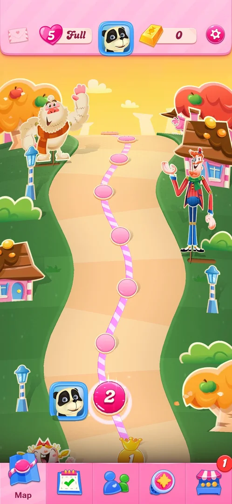
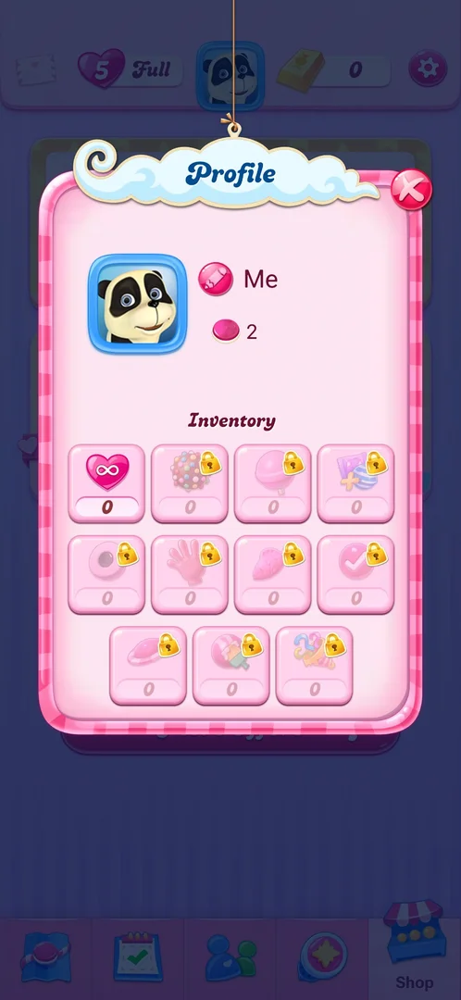

# Profile and inventory

A popup with the player's avatar, name and level, and an inventory of eleven slots: unlimited lives and ten
boosters. At level 2 every slot was at 0 and the ten booster slots had padlocks [^s1].

## Why it appeared

The avatar is in the middle of the map's top bar from the first view of the map, after level 1 [^s2].

## Where to find it

The avatar (a panda-like character in a blue frame) in the middle of the map's top bar [^s2].

 [^s2]
*Avatar in the middle of the top bar of the map*

## What it looks like

 [^s1]
*Profile at level 2: everything at 0, all boosters locked*

A popup titled "Profile" with a red X. Top: the avatar; a pink pencil icon next to the default name "Me";
a pink candy icon with 2 (the level reached). Below, "Inventory": a grid of eleven slots with a count under
each. The first, unlimited lives (a heart with an infinity sign), is open at 0; the other ten are booster
icons (among them a colour bomb, a lollipop, a striped and wrapped pair, a hand, a fish) with a padlock and
0 [^s1].

## What you can do

| Tab or button | What it does |
|---|---|
| [Name](#name) | "Me", with a pencil; not tapped |
| [Inventory](#inventory) | Eleven slots, all 0; not tapped |

The X closes the popup to the map [^s3].

### Name

<!-- no-frame: the name is on the Profile frame above -->
The default name "Me" with a pink pencil icon, and under it a pink candy icon with 2 [^s1]. Inferred: the
pencil edits the name and 2 is the level reached; not verified.

### Inventory

<!-- no-frame: the inventory is on the Profile frame above -->
Unlimited lives (open, 0) and ten boosters with padlocks, each 0 [^s1]. See [Boosters](boosters.md).

## How it works

Version 1.337.0.2. The inventory holds unlimited lives and the boosters; the booster slots are locked at
level 2 (see [Boosters](boosters.md)) [^s1].

## Cases

| Case | What was done | Result | Source |
|---|---|---|---|
| Why it appeared <!-- case:chk-appeared --> | Opened the avatar at level 2 | ✅ There from the first map view | [^s1] |
| Where to find it <!-- case:chk-entry --> | Tapped the avatar | ✅ Profile opened | [^s1] |
| What it looks like <!-- case:chk-screen --> | Looked at the popup | ✅ Name, level, inventory | [^s1] |
| Every entry point on it <!-- case:chk-entries --> | — | not verified: pencil and slots not tapped |  |
| Badges, timers and counters on it <!-- case:chk-badges --> | Read the slots | ✅ partly: eleven counters, all 0 | [^s1] |
| What changes on it with progress <!-- case:chk-changes --> | — | not verified |  |

## Not verified

- What the pencil and a tap on an inventory slot do <!-- case:chk-entries -->
- What the counters show once boosters unlock <!-- case:chk-badges -->
- What changes with progress (unlocked slots, level) <!-- case:chk-changes -->

[^s1]: session 20261003-194350-chrono-2FYKPJ, step 18 — [video at 4:08](https://youtu.be/OjVVcEHXMyI?t=248)
[^s2]: session 20261003-194350-chrono-2FYKPJ, step 7 — [video at 2:16](https://youtu.be/OjVVcEHXMyI?t=136)
[^s3]: session 20261003-194350-chrono-2FYKPJ, step 19 — [video at 4:20](https://youtu.be/OjVVcEHXMyI?t=260)
