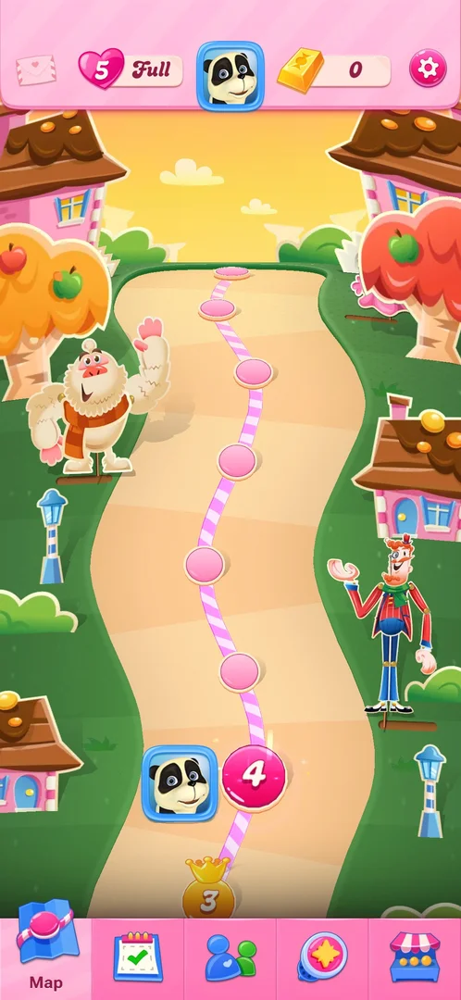
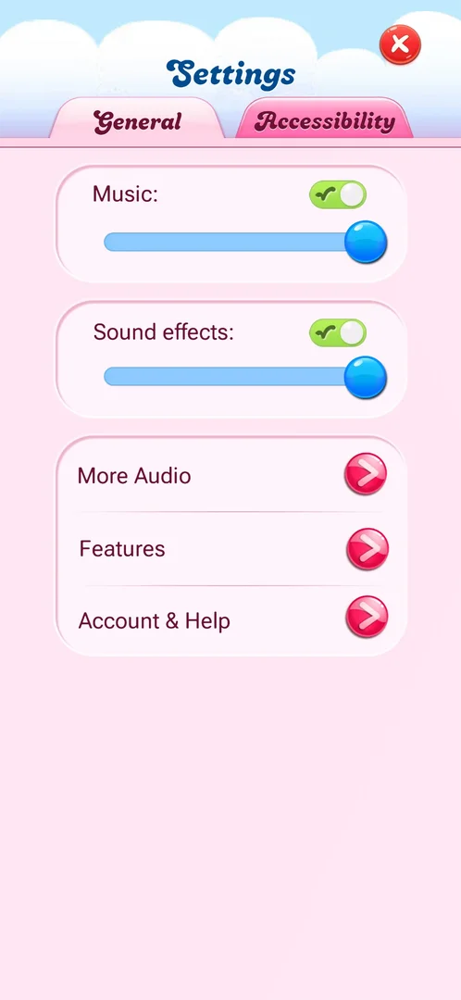
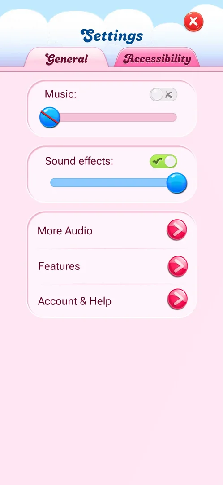
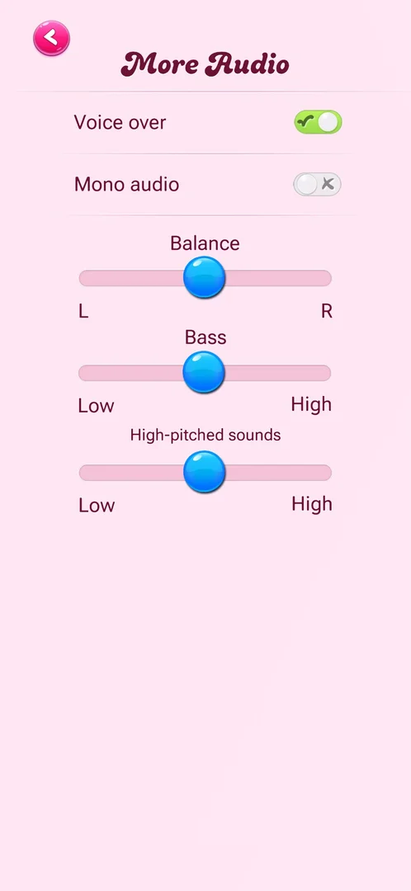
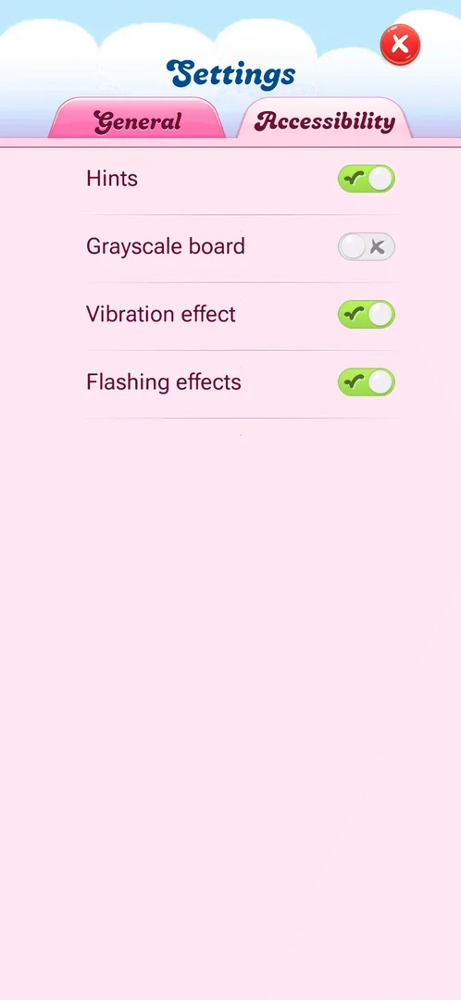

# Settings

A full-screen panel with two tabs, General and Accessibility. General has Music and Sound effects (each an
on/off toggle and a volume slider) and three rows that open sub-pages: More Audio (voice over, mono and
tone sliders), Features (four visibility toggles) and Account & Help (user id and help links).
Accessibility has four toggles: Hints, Grayscale board, Vibration effect, Flashing effects [^s1] [^s3]
[^s6] [^s7] [^s8] [^s9].

## Why it appeared

The gear is on the title screen (bottom left) from the first launch and in the map's top bar from the first
view of the map, after level 1 [^s10] [^s2].

## Where to find it

The pink gear at the right end of the map's top bar. The title screen has a gear too, bottom left [^s2]
[^s10]. A gear in the level's booster bar was not opened.

 [^s4]
*Gear at the right end of the top bar of the map*

## What it looks like

 [^s3]
*Settings opens on General*

The title "Settings" with a red X top right, the tabs General and Accessibility. On General: "Music:" with
a toggle (on) and a slider (at maximum), "Sound effects:" the same; a box with three rows, each with a red
arrow button: More Audio, Features, Account & Help [^s1] [^s3]. Each sub-page replaces the panel and has a
back arrow top left [^s6].

## What you can do

| Tab or button | What it does |
|---|---|
| [Music and Sound effects](#music-and-sound-effects) | On/off toggle and volume slider each; Music switched off and on |
| [More Audio](#more-audio) | Voice over, Mono audio, Balance, Bass, High-pitched sounds |
| [Features](#features) | Lives full, Show location, Show last time online, Show feed items about me |
| [Account & Help](#account--help) | User id with a copy button, Help center, Help deleting account, Forum, My Account |
| [Accessibility](#accessibility) | Hints, Grayscale board, Vibration effect, Flashing effects |

The X closes Settings to the map [^s11] [^s13].

### Music and Sound effects

 [^s5]
*Music switched off*

Each has an on/off toggle (green with a tick when on) and a slider, at maximum on a fresh install [^s1].
Switching Music off turns its toggle grey with a cross, empties the slider and strikes through its knob;
switching it on again restores the full slider [^s5] [^s12]. Sound effects was not changed. Whether the
music actually stops was not checked (no audio in the record).

### More Audio

 [^s6]
*More Audio: defaults*

Two toggles, Voice over (on) and Mono audio (off), and three sliders, all centred: Balance (L to R), Bass
(Low to High), High-pitched sounds (Low to High) [^s6]. Not changed.

### Features

 [^s7]
*Features: four toggles, all on*

Four toggles, all on: Lives full, Show location, Show last time online, Show feed items about me [^s7].
Not changed. Inferred: "Lives full" is a notification when lives refill and the other three control what
other players see (the location is shown on the [profile card](profile.md#profile-card)); not verified.

### Account & Help

 [^s8]
*Account & Help*

The user id with a blue copy button, then four buttons: Help center, Help deleting account, Forum, and a
blue My Account with the player's avatar [^s8]. My Account is described on [Account](account.md). The
three help links were not opened.

### Accessibility

 [^s9]
*Accessibility: defaults*

Four toggles: Hints (on), Grayscale board (off), Vibration effect (on), Flashing effects (on) [^s9]. Not
changed.

## How it works

Version 1.337.0.2. Defaults on this install: Music and Sound effects on at full volume; Voice over on,
Mono audio off, the three tone sliders centred; all four Features toggles on; Hints, Vibration effect and
Flashing effects on, Grayscale board off [^s1] [^s6] [^s7] [^s9]. Settings has no prompts or consent
dialogs: only toggles, sliders and links [^s8].

## Cases

| Case | What was done | Result | Source |
|---|---|---|---|
| Every row and tab: what each holds <!-- case:entries-seen --> | Opened More Audio, Features, Account & Help and Accessibility | ✅ As in the sections above | [^s8] |
| Why it appeared <!-- case:chk-appeared --> | Title screen and map | ✅ The gear is on both from the start | [^s1] |
| Where to find it <!-- case:chk-entry --> | Tapped the map's gear | ✅ Settings opened on General | [^s3] |
| What it looks like <!-- case:chk-screen --> | Looked at General and Accessibility | ✅ Two tabs, as above | [^s9] |
| Every option or button and what it changes <!-- case:chk-options --> | Switched Music off and on; read the other toggles | ✅ Music: toggle grey, slider emptied, knob struck through; restored when on. Others read, not changed | [^s5] |
| For a prompt: what each answer does <!-- case:chk-answers --> | Walked every tab and sub-page | ✅ Does not apply: no prompt or consent dialog in Settings | [^s8] |
| Links out <!-- case:chk-links --> | — | not verified: Help center, Help deleting account, Forum not opened |  |

## Not verified

- Where Help center, Help deleting account and Forum lead (task settings-links) <!-- case:chk-links -->
- What Sound effects, the More Audio, Features and Accessibility toggles change in play
- Whether the first-launch notification prompt comes back after Don't allow [^s14]

[^s1]: session 20261003-194350-chrono-2FYKPJ, step 20 — [video at 4:24](https://youtu.be/OjVVcEHXMyI?t=264)
[^s2]: session 20261003-194350-chrono-2FYKPJ, step 7 — [video at 2:16](https://youtu.be/OjVVcEHXMyI?t=136)
[^s3]: session 20261006-000939-chrono-2FYKPJ, step 20 — [video at 2:59](https://youtu.be/CpL9KWG38IA?t=179)
[^s4]: session 20261006-000939-chrono-2FYKPJ, step 19 — [video at 2:59](https://youtu.be/CpL9KWG38IA?t=179)
[^s5]: session 20261006-000939-chrono-2FYKPJ, step 21 — [video at 3:06](https://youtu.be/CpL9KWG38IA?t=186)
[^s6]: session 20261006-000939-chrono-2FYKPJ, step 23 — [video at 3:19](https://youtu.be/CpL9KWG38IA?t=199)
[^s7]: session 20261006-000939-chrono-2FYKPJ, step 25 — [video at 3:31](https://youtu.be/CpL9KWG38IA?t=211)
[^s8]: session 20261006-000939-chrono-2FYKPJ, step 29 — [video at 3:58](https://youtu.be/CpL9KWG38IA?t=238)
[^s9]: session 20261006-000939-chrono-2FYKPJ, step 27 — [video at 3:44](https://youtu.be/CpL9KWG38IA?t=224)
[^s10]: session 20261003-194350-chrono-2FYKPJ, step 1 — [video at 0:11](https://youtu.be/OjVVcEHXMyI?t=11)
[^s11]: session 20261003-194350-chrono-2FYKPJ, step 21 — [video at 4:35](https://youtu.be/OjVVcEHXMyI?t=275)
[^s12]: session 20261006-000939-chrono-2FYKPJ, step 22 — [video at 3:23](https://youtu.be/CpL9KWG38IA?t=203)
[^s13]: session 20261006-000939-chrono-2FYKPJ, step 31 — [video at 4:26](https://youtu.be/CpL9KWG38IA?t=266)
[^s14]: session 20261003-194350-chrono-2FYKPJ, step 3 — [video at 0:29](https://youtu.be/OjVVcEHXMyI?t=29)
