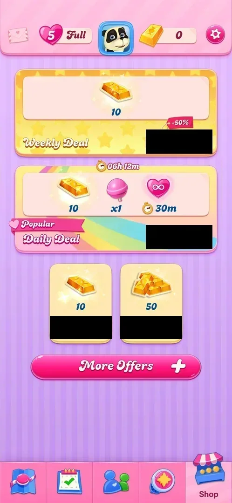
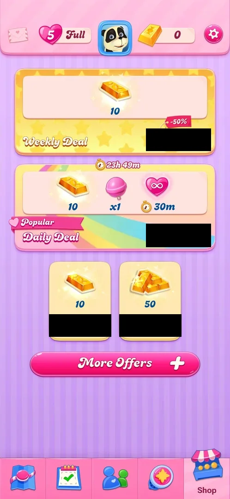
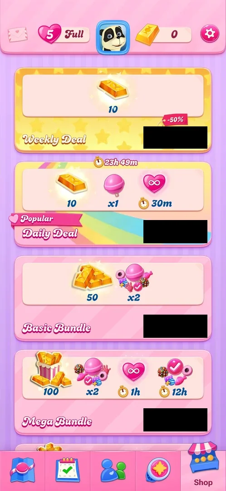

# Shop

The map's fifth tab sells gold bars, the game's premium currency, for real money: a Weekly Deal, a Daily
Deal with a timer, two plain gold bar packs and a More Offers button that lists more packs and bundles in
place [^s1] [^s6].

## Why it appeared

The Shop tab is in the map's bottom bar from the first view of the map, after level 1, with a red badge
"1" on it [^s2] [^s1]. It never opened by itself: not at the launches of 2026-10-03, 10-05 and 10-06, only
from its tab or the gold counter [^s6].

## Where to find it

The shop stall icon at the right end of the map's bottom tab bar; it carried a red badge "1" [^s2]. The
gold bar counter in the top bar opens the same Shop tab [^s7].

 [^s2]
*Shop stall icon with a red 1 badge, right end of the bottom tab bar*

## What it looks like

 [^s1]
*The Shop at level 2; the price buttons are blacked out (local currency)*

From the top: a Weekly Deal card, a Daily Deal card with a timer above it, two pack cards side by side, a
pink More Offers button with a plus. Each card has a green price button in real money; the prices are
blacked out on this page because their currency tells the phone's country [^s1].

 [^s4]
*The Shop two days later: the Daily Deal has new contents and a new timer; the price buttons are blacked out (local currency)*

 [^s5]
*The Shop on 2026-10-06 at 02:10: the Daily Deal is back to the lollipop and 30 minutes, with 23h 49m left; prices blacked out (local currency)*

On each visit the layout was the same; only the Daily Deal changed, and the Shop tab had no badge after
the first visit [^s4] [^s5].

## What you can do

| Tab or button | What it does |
|---|---|
| [Weekly Deal](#weekly-deal) | 10 gold bars, tagged -50% |
| [Daily Deal](#daily-deal) | Changes daily: 10 gold bars, 1 booster, timed unlimited lives; a timer to its end |
| [Gold bar packs](#gold-bar-packs) | 10 and 50 gold bars |
| [More Offers](#more-offers) | Lists more gold bar packs and four bundles under the cards |

No price button was tapped: each opens a real-money payment [^s1]. The Shop has no X: it is a tab, and the
Map tab at the left end of the bottom bar returns to the level map [^s9].

### Weekly Deal

<!-- no-frame: the card is on the Shop frame above -->
A yellow card with stars: 10 gold bars, a red tag "-50%" on the price button [^s1]. The same on all three
visits, without a timer [^s4] [^s5].

### Daily Deal

<!-- no-frame: the card is on the Shop frame above -->
A card with a rainbow, labelled "Popular": 10 gold bars, a lollipop "x1" and an infinity heart with "30m";
a stopwatch "06h 12m" above the card [^s1]. On 2026-10-05 the same card held 10 gold bars, a pink disc
booster "x1" and an infinity heart with "15m", with "01h 40m" above it [^s4]. On 2026-10-06 it held the
2026-10-03 contents again, with "23h 49m" above it [^s5]. The price button was the same each time [^s4]
[^s5].

### Gold bar packs

<!-- no-frame: the cards are on the Shop frame above -->
Two cards side by side: 10 gold bars and 50 gold bars [^s1].

### More Offers

 [^s6]
*More Offers expanded: the bundles replace the two pack cards and the list scrolls on; prices blacked out (local currency)*

Tapping More Offers opens no new screen: the list grows in place under the two deals [^s6]. It holds gold
bar packs of 10, 50, 100, 250, 500 and 1000 bars and four bundles: Basic, Mega, Legendary and Divine [^s8].
The Basic Bundle is 50 gold bars and two of each booster (lollipop hammer, colour bomb, fish, striped and
wrapped pair, free switch); the Mega Bundle is 100 gold bars, two of each booster, 1 hour of unlimited
lives and 12 hours of unlimited boosters [^s6]. The bundles include
unlimited lives from 1 to 18 hours [^s8].

## How it works

Version 1.337.0.2, at level 2 to 4 [^s1] [^s8]:

| Offer | Contents | Price relative to the 10-bar pack |
|---|---|---|
| Weekly Deal | 10 gold bars, label -50% | about 0.5 times |
| Daily Deal (Popular) | 10 gold bars, 1 booster, 15 or 30 min unlimited lives | about 1.8 times |
| 10 gold bars | 10 gold bars | 1 |
| 50 gold bars | 50 gold bars | about 4.3 times |
| 100 gold bars | 100 gold bars | about 8.4 times |
| 250 gold bars | 250 gold bars | about 16.4 times |
| 500 gold bars | 500 gold bars | about 28.4 times |
| 1000 gold bars | 1000 gold bars | about 46.8 times |
| Basic Bundle | 50 gold bars, 2 of each booster | about 4.7 times |
| Mega Bundle | 100 gold bars, 2 of each booster, 1h unlimited lives, 12h unlimited boosters | about 10.7 times |
| Legendary Bundle | gold bars, boosters, unlimited lives | about 43.5 times |
| Divine Bundle | gold bars, boosters, unlimited lives | about 46.8 times |

The Daily Deal rotates. Seen three times (the clock is the phone's local time):

| Seen | Contents | Timer | Inferred end |
|---|---|---|---|
| 2026-10-03 19:50 | 10 gold bars, 1 lollipop, 30 min unlimited lives | 06h 12m | about 02:02 |
| 2026-10-05 00:20 | 10 gold bars, 1 pink disc booster, 15 min unlimited lives | 01h 40m | about 02:00 |
| 2026-10-06 02:10 | 10 gold bars, 1 lollipop, 30 min unlimited lives | 23h 49m | about 01:59 |

The 2026-10-06 reading, ten minutes after 02:00, showed a fresh 24-hour timer: the deal changes at about
02:00 local time each day [^s5]. Inferred from the three readings: the price stays the same while the
contents change, and contents can repeat [^s1] [^s4] [^s5]. The Weekly Deal showed no timer [^s4].

Gold bars are spent, for example, on 6 hours of unlimited lives for 69 bars in the [Lives](lives.md) popup;
the balance shows next to the avatar in the top bar (0 on a fresh install) [^s3] [^s2]. See also
[Gold bars](gold-bars.md).

## Cases

| Case | What was done | Result | Source |
|---|---|---|---|
| Shop at level 1: Weekly Deal 10 gold bars (-50%), Daily Deal (Popular) 10 gold bars + 1 lollipop + 30m unlimited lives with a 06h12m timer, packs of 10 and 50 bars, More Offers; badge 1 on the tab <!-- case:deals-seen --> | Opened the Shop | ✅ As in the table above | [^s1] |
| Why it appeared <!-- case:chk-appeared --> | Opened the Shop tab at level 2 | ✅ There from the first map view, with a badge | [^s1] |
| Where to find it <!-- case:chk-entry --> | Tapped the shop stall; tapped the gold counter | ✅ The fifth tab of the bottom bar; the top bar gold counter opens the same tab | [^s7] |
| What it looks like <!-- case:chk-screen --> | Looked at the Shop | ✅ Weekly Deal, Daily Deal with a timer, 10 and 50 bar packs, More Offers | [^s1] [^s5] |
| Contents and price of every pack <!-- case:chk-contents --> | Opened More Offers | ✅ Packs of 10 to 1000 bars, Basic, Mega, Legendary and Divine bundles with unlimited lives of 1 to 18 hours (see How it works) | [^s8] [^s6] |
| How often it comes up by itself <!-- case:chk-frequency --> | Launched the game on 2026-10-06 and waited | ✅ Never by itself, this or earlier sessions; only from the tab or the gold counter | [^s6] |
| Its timer or limit <!-- case:chk-timer --> | Read the Daily Deal on 2026-10-03, 10-05 and 10-06 | ✅ 23h 49m left at 02:10 on 10-06: the deal changes at about 02:00 local time; the Weekly Deal shows no timer | [^s5] |
| The way to buy <!-- case:chk-buy-path --> | — | not verified: no price tapped |  |
| Daily Deal rotation <!-- case:daily-deal-rotation --> | Opened the Shop two days after the first visit | ✅ New contents (pink disc booster instead of the lollipop, 15 min instead of 30 min of unlimited lives), same price; the tab badge "1" was gone | [^s4] |
| Closing it <!-- case:chk-close --> | Tapped the Map tab | ✅ The Shop is a tab with no X; the Map tab returns to the level map | [^s9] |

## Not verified

- The game's own screens before the payment sheet: no price was tapped <!-- case:chk-buy-path -->
- When the Weekly Deal ends
- What the badge "1" on the tab counted: it was gone on the 2026-10-05 visit
- The exact contents of the Legendary and Divine bundles (only their names and unlimited lives are recorded)

[^s1]: session 20261003-194350-chrono-2FYKPJ, step 14 — [video at 3:26](https://youtu.be/OjVVcEHXMyI?t=206)
[^s2]: session 20261003-194350-chrono-2FYKPJ, step 7 — [video at 2:12](https://youtu.be/OjVVcEHXMyI?t=132)
[^s3]: session 20261003-194350-chrono-2FYKPJ, step 16 — [video at 3:53](https://youtu.be/OjVVcEHXMyI?t=233)
[^s4]: session 20261005-001914-chrono-2FYKPJ, step 2 — [video at 0:26](https://youtu.be/oC4G7CtG6t4?t=26)
[^s5]: session 20261006-020945-chrono-2FYKPJ, step 1 — [video at 0:31](https://youtu.be/bLHRGXNqFXM?t=31)
[^s6]: session 20261006-020945-chrono-2FYKPJ, step 2 — [video at 0:47](https://youtu.be/bLHRGXNqFXM?t=47)
[^s7]: session 20261005-072135-chrono-2FYKPJ, step 2 — [video at 0:24](https://youtu.be/UOyVRJxygXc?t=24)
[^s8]: session 20261005-072135-chrono-2FYKPJ, step 4 — [video at 0:47](https://youtu.be/UOyVRJxygXc?t=47)
[^s9]: session 20261006-020945-chrono-2FYKPJ, step 3 — [video at 1:02](https://youtu.be/bLHRGXNqFXM?t=62)
