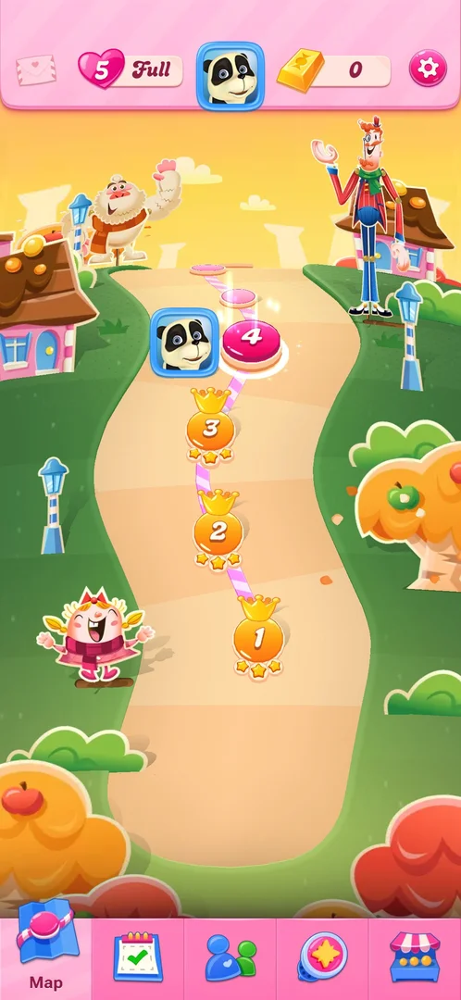
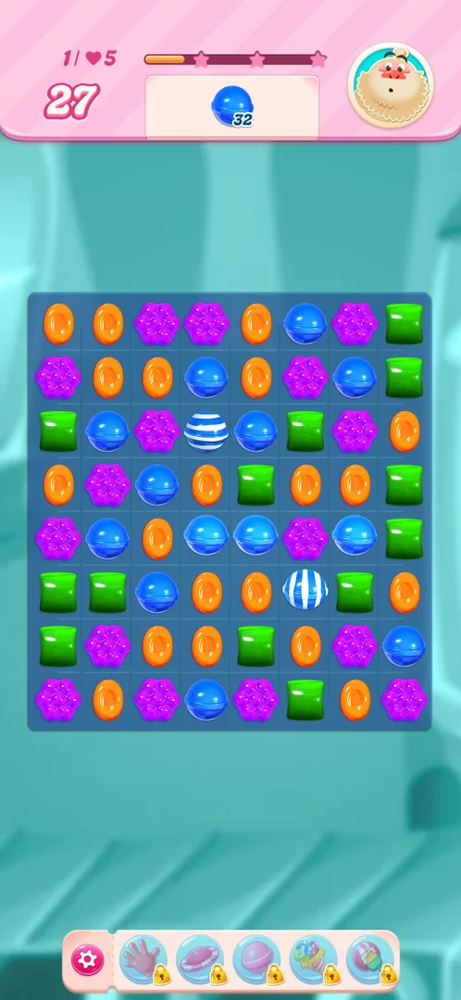
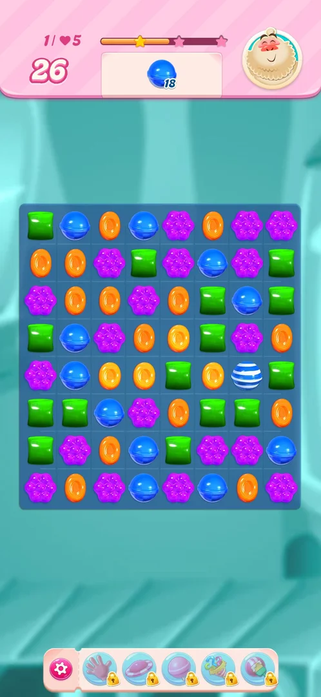
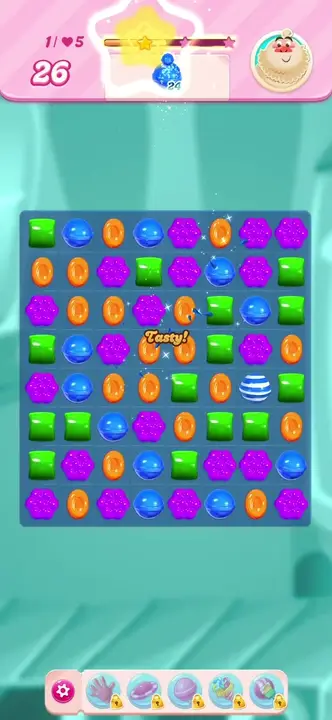

# Striped candy

A special candy made on the board by matching four candies of one colour in a line. It keeps the colour
of the match and carries white stripes; matched again with candies of its colour, it clears its whole row
or column [^s5] [^s4].

## Why it appeared

It is not unlocked: the first one came on the level 1 board in the cascade right after the first move
that matched five, next to the new [colour bomb](color-bomb.md) [^s1]. On the 2026-10-06 replay of level 1
one was made on purpose with a four-in-a-line swap; no tutorial popup came [^s4].

## Where to find it

There is no menu entry: the striped candy exists only inside levels. On the level map, the level 1 node
opens the level where it was made in this session [^s2].

 [^s2]
*The level 1 node, bottom of the path on the map, opens the level where the striped candy was made*

## What it looks like

 [^s3]
*Two blue striped candies on level 1 after the four-in-a-line swap: one made by the swap, one by the cascade*

A candy of the board's ordinary shape and colour, crossed by white stripes; here both stripes run
horizontally. The swap of four blue candies in a line made one striped candy, and the cascade after it
made a second one [^s3] [^s4].

### Result

 [^s4]
*After the striped candy was matched with two blue candies: the blue order fell from 32 to 18 in one move*

 [^s4]
*Clip 3 s · [original on YouTube from 2:50](https://youtu.be/bLHRGXNqFXM?t=170)*

## How it works

Version 1.337.0.2:

| Rule | What was seen | Source |
|---|---|---|
| Made by | Four candies of one colour in a line | [^s5] [^s3] |
| Fired by | Matching it with two or more candies of its colour | [^s5] [^s4] |
| Effect | Clears a full row or column; a vertical beam was seen on level 3 | [^s5] |
| In numbers | Level 1: one move with a blue striped candy took the blue order from 32 to 18 (14 blue) and the moves from 27 to 26 | [^s3] [^s4] |

Inferred, not verified: the stripe direction shows whether it clears a row or a column. Swapped with a
wrapped candy, a striped candy cleared three columns on level 3 (see [core-level](core-level.md)).

## Outcomes

The base level is [core-level](core-level.md).

| Outcome | What happens | Source |
|---|---|---|
| Win: order done | Not reached in this session; the striped candy only cleared part of the order | [^s4] |
| Out of moves | Not reached with a striped candy on the board; it adds no other way to lose | [^s4] |
| Quit | Level 1 was quit after the striped candy fired, the same as the base level | [^s4] |

## Cases

| Case | What was done | Result | Source |
|---|---|---|---|
| Made by a 4-in-a-line match; matching it with two of its colour fires a line that clears a full row or column <!-- case:chk-rules --> | Levels 2 and 3 | ✅ As in How it works; a vertical beam on level 3 | [^s5] |
| Why it appeared <!-- case:chk-appeared --> | Played level 1 | ✅ Came in the cascade after the first five-match, with the colour bomb | [^s1] |
| Where to find it <!-- case:chk-entry --> | Replayed level 1 from its map node | ✅ No menu entry; made by a four-in-a-line swap | [^s4] |
| What it looks like <!-- case:chk-screen --> | Made one on level 1 | ✅ A candy of its colour with white stripes, horizontal here | [^s4] |
| First level <!-- case:chk-first-level --> | Replayed level 1 | ✅ First seen on level 1; no tutorial popup on the replay | [^s4] |
| Interactions <!-- case:chk-interactions --> | Swapped it into a match with two blue candies | ✅ Fired its row: blue order 32 to 18 in one move; combos with fish, wrapped candy, colour bomb not tried this session | [^s4] |
| Ways to lose <!-- case:chk-loss --> | Played with it on level 1 | ✅ No extra way to lose; it only clears candies | [^s4] |

## Not verified

- A striped candy combined with a fish, a wrapped candy or a colour bomb in this session (only the
  striped and wrapped pair on level 3 is recorded, on [core-level](core-level.md))
- Whether the stripe direction decides a row or a column

[^s1]: session 20261003-194350-chrono-2FYKPJ, step 5 — [video at 1:12](https://youtu.be/OjVVcEHXMyI?t=72)
[^s2]: session 20261006-020945-chrono-2FYKPJ, step 5 — [video at 1:33](https://youtu.be/bLHRGXNqFXM?t=93)
[^s3]: session 20261006-020945-chrono-2FYKPJ, step 8 — [video at 2:25](https://youtu.be/bLHRGXNqFXM?t=145)
[^s4]: session 20261006-020945-chrono-2FYKPJ, step 9 — [video at 2:53](https://youtu.be/bLHRGXNqFXM?t=173)
[^s5]: session 20261003-225003-chrono-2FYKPJ, step 24 — [video at 6:09](https://youtu.be/EeHt-Knje2A?t=369)
