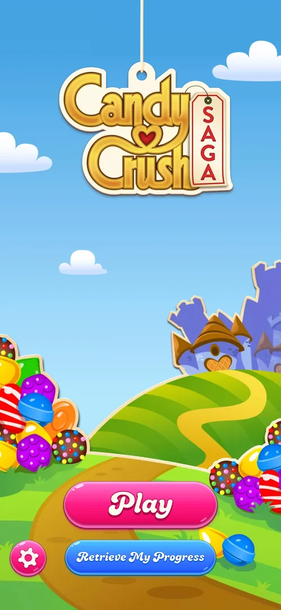

# Title screen

The first screen of the game on a fresh install: the Candy Crush Saga logo over a candy landscape, with
the button that starts playing, a button to restore progress from an account, and the settings gear
[^s1].

## Where to find it

It opens by itself when the game is launched (on a fresh install, right after the Terms of Use popup is
accepted). Closing Settings returns to it [^s1] [^s2].

<!-- no-entry: the screen the game opens on -->

## What it looks like

The logo hangs at the top; a hill with a path and a candy castle fills the middle; candy piles sit on both
sides. At the bottom: a big pink Play button, a blue Retrieve My Progress button under it, and a round pink
gear in the bottom-left corner [^s1].

 [^s1]

## What you can do

| Tab or button | What it does |
|---|---|
| [Play](level-play.md) | Starts the game: on a fresh install, straight into level 1 |
| [Retrieve My Progress](account-retrieve.md) | Account sign-in to restore saved progress (not tapped) |
| [Settings](settings.md) | The gear in the bottom-left corner opens Settings |

## How it works

- On a fresh install, Play first triggers Android's notification permission request, then loads level 1
  directly: no saga map is shown [^s3] [^s4].

## Cases

| Case | What was done | Result | Source |
|---|---|---|---|
| Open Settings from the title screen | Tapped the gear | ✅ Settings opened on the General tab | [^s5] |
| Start playing on a fresh install | Tapped Play, then declined notifications | ✅ Level 1 loaded directly | [^s3] |

## Not verified

- What the title screen shows once the player has progress (whether it is skipped and the saga map opens
  instead).

[^s1]: session 20261001-202316-chrono-2FYKPJ, step 1 — [video at 0:12](https://youtu.be/EORPFmWikL0?t=12)
[^s2]: session 20261001-202316-chrono-2FYKPJ, step 3 — [video at 0:33](https://youtu.be/EORPFmWikL0?t=33)
[^s3]: session 20261001-202316-chrono-2FYKPJ, step 4 — [video at 0:39](https://youtu.be/EORPFmWikL0?t=39)
[^s4]: session 20261001-202316-chrono-2FYKPJ, step 5 — [video at 0:46](https://youtu.be/EORPFmWikL0?t=46)
[^s5]: session 20261001-202316-chrono-2FYKPJ, step 2 — [video at 0:22](https://youtu.be/EORPFmWikL0?t=22)
