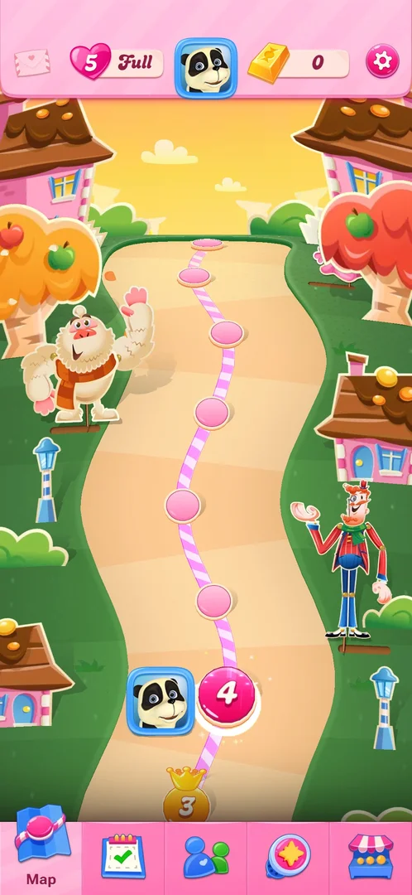
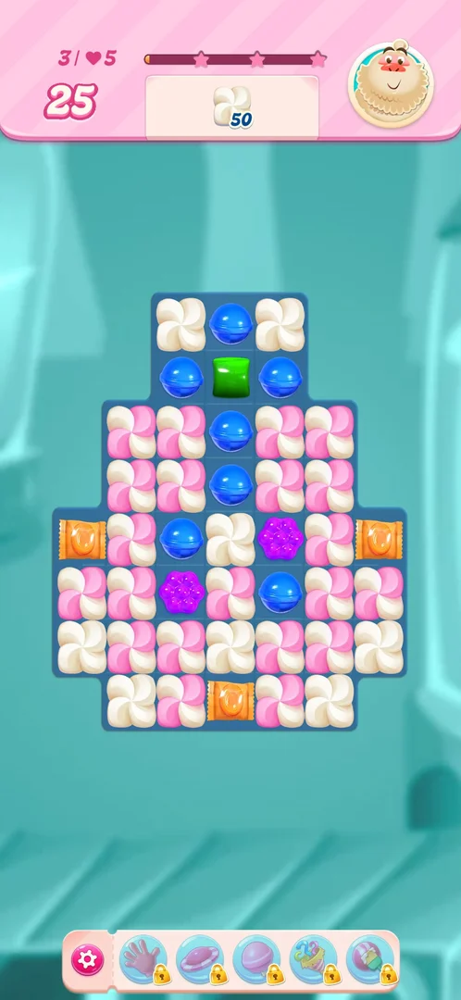
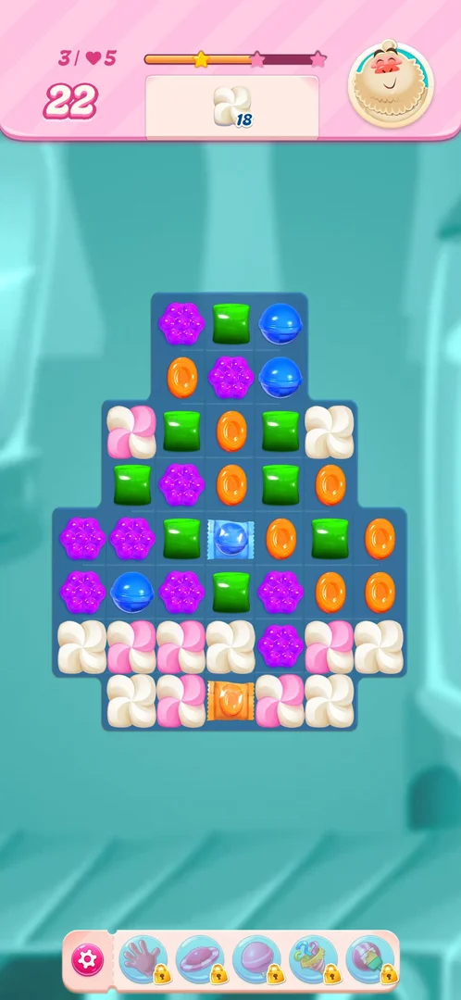
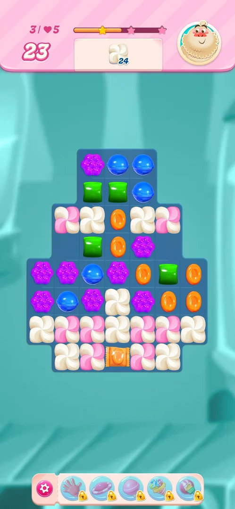
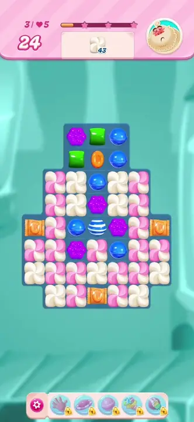
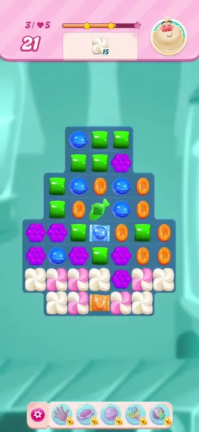

# Wrapped candy

A special candy: an ordinary candy inside a wrapper of the same colour. The game's tip says an L or T
match of five candies makes one; on level 3 three of them are already on the board at the start. Matched
with candies of its colour, it explodes and clears the cells around it, and the blast also takes layers
off meringue next to it [^s1] [^s3] [^s6].

## Why it appeared

It is not unlocked. The loading screen after Play! on level 2 shows a "Wrapped Candy" tip (five candies
in a T turning into a wrapped candy); the next level, level 3, starts with orange wrapped candies on the
board [^s1] [^s3].

## Where to find it

There is no menu entry: the wrapped candy exists only inside levels. On the level map, the level 3 node
(the gold crown) opens the Level 3 popup; its Play! button starts the level whose board has wrapped
candies from the start [^s2] [^s3].

 [^s2]
*The level 3 node (gold crown, bottom of the path) opens the level that starts with wrapped candies*

## What it looks like

 [^s3]
*Level 3 at the start: three orange wrapped candies already on the board*

A candy of an ordinary colour inside a shiny wrapper of that colour, twisted at both ends like a sweet.
Orange ones are placed on level 3 from the start; a blue one was made on the board during the level [^s3]
[^s4].

 [^s4]
*A blue wrapped candy in the centre of the board, made in the cascade after an orange three-match*

### Result

 [^s5]
*After a striped candy fired along the middle row: both side wrapped candies went off, the order fell from 43 to 24*

 [^s5]
*Clip 5.7 s · [original on YouTube from 2:35](https://youtu.be/ITw93fSFUf0?t=155)*

 [^s7]
*Clip 5.3 s · [original on YouTube from 3:48](https://youtu.be/ITw93fSFUf0?t=228)*

## How it works

Version 1.337.0.2:

| Rule | What was seen | Source |
|---|---|---|
| Made by | An L or T match of five (the level 2 loading tip); in this session one came from a cascade after an orange three-match | [^s1] [^s4] |
| Pre-placed | Level 3 starts with three orange wrapped candies | [^s3] |
| Fired by | Matching it in a line of three with candies of its colour | [^s7] |
| Effect | Explodes and clears a 3x3 area around it; meringue in the blast loses layers | [^s7] [^s6] |
| Set off by a blast | A striped candy's row blast set off both wrapped candies in that row, with no match of their own | [^s5] |
| In numbers | Level 3: the striped row blast with the two wrapped candies took the order from 43 to 24 in one move; the blue wrapped candy's move took it from 15 to 2, cascade included | [^s5] [^s7] |
| Booster | The Level 3 popup offers a starting booster drawn as a wrapped and a striped candy | [^s3] |

Inferred, not verified: the 3x3 size is read from the cells cleared in the frames, not from a game text.
An earlier session swapped a striped candy with a wrapped candy on level 3 and cleared three columns at
once (see [core-level](core-level.md)).

## Outcomes

The base level is [core-level](core-level.md).

| Outcome | What happens | Source |
|---|---|---|
| Win: order done | The same as the base level: level 3 was won with 20 moves left, then Sugar Crush and back to the map | [^s6] |
| Out of moves | Not reached; the wrapped candy adds no other way to lose | [^s6] |
| Quit | Not tried with a wrapped candy on the board | [^s6] |

## Cases

| Case | What was done | Result | Source |
|---|---|---|---|
| Why it appeared <!-- case:chk-appeared --> | Played level 2 and then level 3 | ✅ Tip on the level 2 loading screen; level 3 starts with wrapped candies | [^s1] |
| Where to find it <!-- case:chk-entry --> | Opened level 3 from its map node, Play! | ✅ The board starts with orange wrapped candies | [^s6] |
| What it looks like <!-- case:chk-screen --> | Looked at the level 3 board | ✅ A candy in a wrapper of its colour: orange at the start, a blue one made later | [^s6] |
| First level <!-- case:chk-first-level --> | Replayed level 3 | ✅ Pre-placed on level 3 at the start; tip on the level 2 loading screen | [^s6] |
| Rules <!-- case:chk-rules --> | Matched the blue wrapped candy in a column of three blue | ✅ Exploded in a 3x3 area: order 15 to 2 with the cascade; a wrapped candy can also come from a cascade | [^s6] |
| Interactions <!-- case:chk-interactions --> | Fired a blue striped candy along the row of the two side wrapped candies | ✅ Both went off without a match of their own; meringue in the blasts lost layers | [^s6] |
| Ways to lose <!-- case:chk-loss --> | Played level 3 with wrapped candies to a win | ✅ No extra way to lose; won with 20 moves left | [^s6] |

## Not verified

- Making a wrapped candy with an L or T match of five in play (only the tip and a cascade were seen)
- A wrapped candy combined with a colour bomb or another wrapped candy
- Whether the explosion goes off a second time after the candies fall

[^s1]: session 20261003-225003-chrono-2FYKPJ, step 14 — [video at 2:14](https://youtu.be/EeHt-Knje2A?t=134)
[^s2]: session 20261006-043504-chrono-2FYKPJ, step 5 — [video at 1:17](https://youtu.be/ITw93fSFUf0?t=77)
[^s3]: session 20261006-043504-chrono-2FYKPJ, step 7 — [video at 1:37](https://youtu.be/ITw93fSFUf0?t=97)
[^s4]: session 20261006-043504-chrono-2FYKPJ, step 10 — [video at 3:05](https://youtu.be/ITw93fSFUf0?t=185)
[^s5]: session 20261006-043504-chrono-2FYKPJ, step 9 — [video at 2:40](https://youtu.be/ITw93fSFUf0?t=160)
[^s6]: session 20261006-043504-chrono-2FYKPJ, step 13 — [video at 4:23](https://youtu.be/ITw93fSFUf0?t=263)
[^s7]: session 20261006-043504-chrono-2FYKPJ, step 12 — [video at 3:53](https://youtu.be/ITw93fSFUf0?t=233)
