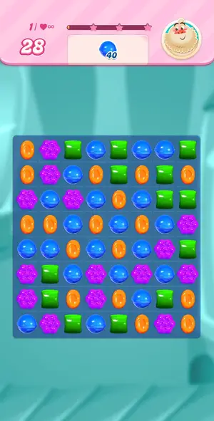
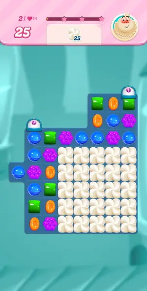
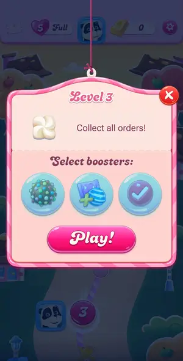
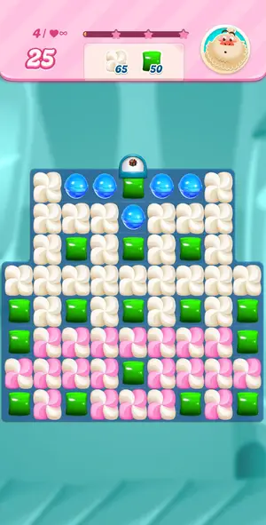

# Levels: Candy Crush Saga

Every level the agents met, as its board looked at the start (the ad strips cropped). The notes tell where a new element or rule appears.

| level 1 | level 2 | level 3 | level 4 |
|---|---|---|---|
|  |  |  |  |

## Tries

| Level | Mechanic | Result | Time | Note |
|---|---|---|---|---|
| level 1 | core-match | 1 won | 92 s | bomb on blue, 3 moves |
| level 2 | core-match | 1 won | 294 s | level 2 won in 10 moves; no win screen: goal ticked, moves counter 0, board refilled, then Level 3 popup auto-opened ~6s later. Meringue cleared by blasting striped candies and matches above it |
| level 3 | core-match | 1 won | 500 s | level 3 won, 15 moves used; order done with 10 moves left, no Sugar Crush, no win screen, Level 4 popup opened by itself ~6s later. Striped+wrapped swap = 3-column blast |
| level 4 | core-match | 3 quit | — | level 4 quit after colour bomb study: 5-blue line on the top row then dispenser bomb swapped with green cleared 41 meringue + 18 green in one move |
