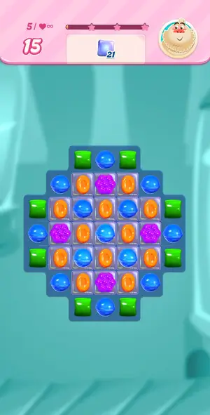
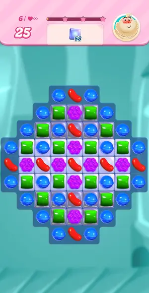

# Levels: Candy Crush Saga

Every level the agents met, as its board looked at the start (the ad strips cropped). The notes tell where a new element or rule appears.

| level 1 | level 2 | level 3 | level 4 | level 5 |
|---|---|---|---|---|
|  |  |  |  |  |

| level 6 |
|---|
|  |

## Tries

| Level | Mechanic | Result | Time | Note |
|---|---|---|---|---|
| level 1 | core-match | 1 won | 156 s | 6 moves of 28: 4-in-row stripes, then a colour bomb on blue cleared the order; Sugar Crush spends remaining moves automatically |
| level 2 | core-match | 1 won | 183 s | 6 moves of 25: matches next to meringue, then colour bomb + blue triggered two striped and a fish; level 3 loads straight after (no path screen) |
| level 3 | core-match | 1 won | 383 s | 13 moves of 25, 6.1 min: meringue blocks refills (empty cells under meringue); colour-bomb clears DO damage meringue adjacent to cleared candies; fish + wrapped orange combo cleared the bottom |
| level 4 | core-match | 1 won | 526 s | Level 4: 65 meringue + 50 green in 17 moves, 8 min. Colour bombs from cascades; swap bomb with target colour. Swap that makes no match is rejected (fish with plain candy). |
| level 5 | core-match | 1 won | 256 s | Level 5 jelly 21 in 15 moves, won with 5 left, 4 min. Match inside jelly cells; look for vertical/horizontal swaps bringing a same-colour neighbour into jelly rows. |
| level 6 | core-match | 1 won | 258 s | Level 6 jelly 58 (double jelly mid rows) 25 moves, won in 8 moves, 4 min: bomb colour that sits on jelly cells, wrapped candy into lines, 4-in-row striped. |
