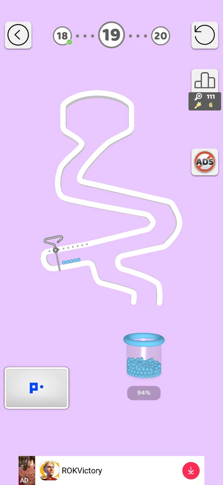
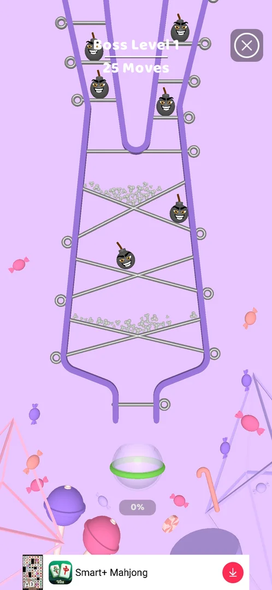

# How to play: Pull the Pin

The player reads this before every level and works in the local copy
`state/com.maroieqrwlk.unpin/playbook.md`; the dream merges it here. Level times: `sw.py playbook`.

## pin-pull: Pull the pins

- Goal: every ball in the cup, painted (the % under the cup) [s:20260930-192115-chrono-2FYKPJ#4].
- Controls: tap a pin's ring; the rod and swipes do nothing [s:20260930-192115-chrono-2FYKPJ#4]. A hook
  pin with a dotted track is a slider: swipe it along the dots [s:20261001-153137-chrono-2FYKPJ#17].
  > ⚠️ Previously (241.3.1, 2026-09-30): "swipes and taps on the rod do nothing" — still true for ordinary
  > pins, wrong for slider pins (level 19) [s:20260930-192115-chrono-2FYKPJ#4] [s:20261001-153137-chrono-2FYKPJ#10].
- It is not physics and never about reaction: look once, work out the whole order, pull it in one call.

### Rules: the zone model

A level is a set of places (compartments) separated by walls and pins. Pulling a pin lets the content
of a place pour where its way down leads: through a floor pin straight down, along a slope pin to its low
end, across a removed divider into the neighbour. What matters is only what ends up together:

| Together / where | Result |
|---|---|
| colour + grey | all that colour; a few coloured balls paint a whole pile [s:20260930-192115-chrono-2FYKPJ#7] [s:20260930-192115-chrono-2FYKPJ#62] |
| bomb + balls (any) | lost: the blast throws the balls out ("Balls fell out of the level") [s:20261001-145738-chrono-2FYKPJ#10] [s:20261001-150634-chrono-2FYKPJ#17] [s:20261001-162240-chrono-2FYKPJ#6] |
| bomb + bomb | both vanish, other bombs close by may go too; balls behind pins stay [s:20261001-102608-chrono-2FYKPJ#2] [s:20261001-102608-chrono-2FYKPJ#20] [s:20261001-160324-chrono-2FYKPJ#8] [s:20261001-164104-chrono-2FYKPJ#17] |
| bomb out of the level (gap in the wall, outer side of an arch) | good [s:20260930-192115-chrono-2FYKPJ#83] [s:20261001-102608-chrono-2FYKPJ#60] [s:20261001-145738-chrono-2FYKPJ#2] |
| balls out of the level (a pin that plugs the outer wall) | lost [s:20261001-075644-chrono-2FYKPJ#3] [s:20261001-075644-chrono-2FYKPJ#36] |
| grey ball in the cup | lost at once [s:20260930-201034-chrono-2FYKPJ#50] |
| bomb in the cup | lost [s:20261001-145738-chrono-2FYKPJ#16] [s:20261001-160324-chrono-2FYKPJ#6] |
| colour in the cup of another colour (colour bucket levels) | lost at once [s:20261001-153137-chrono-2FYKPJ#24] [s:20261001-153137-chrono-2FYKPJ#27] |
| a bomb that never needs to move | stays parked: never pull its pin [s:20261001-150634-chrono-2FYKPJ#19] [s:20261001-153137-chrono-2FYKPJ#2] |

A pile that passes through a place meets what rests there: balls running past a parked bomb lose
(level 10 stage 3 lost that way, not to a wall gap [s:20261001-075644-chrono-2FYKPJ#3]). Level 16 was not
won by greys detonating bombs: the two bombs met each other first, the greys came 0.35 s later
[s:20261001-150634-chrono-2FYKPJ#2]. Checked on 28 recorded boards: the model agrees with 44 of 46
recorded pin orders; the two misses were pulls 1-2 s apart (see Risks). Level 11 on 2026-10-04: the
library order E W F B, played with `--gap 5`, lost twice with "Balls fell out of the level"
[s:20261004-004411-chrono-2FYKPJ#19] [s:20261004-004411-chrono-2FYKPJ#23]: on 241.5.1 one grey stays on the C
half of the V shelf after E (004411 shot 30), so C has to be pulled right after E; E C W F B won first try
[s:20261004-005453-chrono-2FYKPJ#2].

> ⚠️ Previously (2026-10-04, lab note): the L11 losses were put down to the four pulls landing within 2 s
> (no `--gap`). The transcript shows both runs used `--gap 5` [s:20261004-004411-chrono-2FYKPJ#19].

### Method: solver (`state/com.maroieqrwlk.unpin/solvers/pin-pull.py`)

Status 2026-10-04 (lab, 01:10): the solver now plays ONE PULL PER ROUND: each round pulls one pin, the next
round reads the frame (the pull settled, the bombs met) and pulls the next. `solve --run --rounds 6` plays
a whole level in one call; the note says `This round plays E only (each pull settles before the next)`.
It follows the level when the game zooms or shifts the view after a pull (level 11 after the bombs meet:
`recognised after the view moved`), and a `--board` run carries its board to the next rounds. Rings are
read on the Space theme (dark starry background, Collections > Themes) as well as the default one.
Since 2026-10-04 (lab, 01:30) it also sees golden star-wand pins (a yellow star where the ring would be,
level 12 pin B) and keeps the level across rounds: a frame that fits no board by its rings alone is still
the remembered level when the pins not yet pulled pass the ring check there (`kept from the last round`).
A level stopped half-way (`--rounds` ran out, an ad) continues with the same `solve --run` in the same level.
Earlier status: the solver plays the known levels by itself, with no board. On the start frame it
finds the rings and matches them against its level library (`LIBRARY_JSON` embedded in the solver, generated from the local `state/com.maroieqrwlk.unpin/solvers/boards/`; levels 3-26,
level 10 with its 4 stages), then plays the order already won on the phone; the note starts with `library
board L10-s3 recognised`. Between stages it keeps a memory: after a stage it says `stage 1/4 (L10-s1) was
played; the next stage is not on this frame` until the next stage's rings appear; pins it already sent
whose rings are gone count as pulled, so a half-played stage is finished, not restarted. Checked offline on
the start frames of levels 1-10 of 2026-10-03 (all four L10 stages recognised, the right order on the
rings) and refused on map, popup, ad and post-pull frames. Levels 1-2 (and any grey stack) are read from
the frame (`read from the frame: P1(608,490) ...`). A level the library does not know and that is not a
stack is refused with `no board and the frame is not a known level`: only then write a board.

It does not match when two library boards have the same rings, the camera scrolled, or a popup or the
tutorial hand covers rings: it then says why and plays nothing. Look at the frame and run it again.

Write the level once as a board (JSON, pixels of the 730-px frame); the solver searches every pin
order, shortest first, with the rules above and returns the full order, what each pull does, and the
`taps` string with the gap. It refuses a board it cannot model, and a frame where the pins are not seen
as rings (a popup, a scrolled camera, a stale board). Example (level 11; the board files stay local in
`state/com.maroieqrwlk.unpin/solvers/boards/`, the published solver carries them in `LIBRARY_JSON`):

```json
{"level": "level 11",
 "places": {
  "G":   {"has": ["grey"],   "exits": [{"to": "BOX", "via": ["E"]}, {"to": "BOX", "via": ["C"]}]},
  "BR":  {"has": ["bomb"],   "exits": [{"to": "CH", "via": ["E"]}]},
  "POP": {"has": ["colour"], "exits": [{"to": "BR", "via": ["W"]}, {"to": "out", "via": ["P"]}]},
  "BOX": {"exits": [{"to": "CH", "via": ["F"]}, {"to": "BR", "via": ["V"]}]},
  "CH":  {"has": ["bomb"],   "exits": [{"to": "cup", "via": ["B"]}]}},
 "pins": {"E": [570, 470], "W": [512, 392], "P": [612, 530], "C": [105, 505], "F": [105, 597],
          "B": [167, 821], "V": [420, 385]}}
```

How to write it (one look at the start frame):
1. Pins: a short name and the ring centre `[x, y]`. A slider: `{"swipe": [x1, y1, x2, y2]}` along the dots.
   A divider whose removal makes two places one: `{"at": [x, y], "joins": [["A", "B"]]}`.
2. Places: every compartment that holds something now, and every compartment where things would come
   to rest (the floor above the exit pin, a chamber under a shelf). `has`: `colour` (or the colour name on
   colour bucket levels), `grey`, `bomb`; an empty place has no `has`.
3. Exits of each place, in order: `{"to": PLACE | "cup" | "cup:yellow" | "out" | "?", "via": [pins that must
   all be out]}`. The first exit whose pins are all out takes the whole pile, so put the exit that needs
   more pins first (crossed pins: `[{"to": "BOT", "via": ["X1","X2"]}, {"to": "out", "via": ["X1"]}]`).
   `"via": []` = always free (a pile running along a slope pin to its low end; a junction a steering pin
   switches: level 20 `J: [{"to": "cup:yellow", "via": ["M"]}, {"to": "cup:blue", "via": []}]`).
   `"to": ["A", "B"]` = the pile lands on both (a shelf over two compartments).
4. A bomb parked over a passage the balls must cross: put it in that passage with a balls-only free
   exit, `{"to": "cup", "via": [], "only": "balls"}` after its own exit (level 21 `BZ`) -- only when the balls
   really pass by. A bomb resting on a pin the balls also rest on needs that pin (level 10 stage 3 `FT`: the
   balls stayed on pin E after the bombs met, 2026-10-03).
5. Unsure where a pile goes when a pin leaves: `"to": "?"`; the solver never lets anything go there.
6. Optional: `"stage": "2/4"` (multi stage), `"max_moves": 10` (challenge, boss), `"scrolling": true`,
   `"try": ["E", "W"]` (check an order you have in mind instead of searching).

### Level plan

1. `level start "level N" --mechanic pin-pull --plan "solver"`. Look at the start frame once.
2. Every level, every stage, first: `python harness/sw.py solve pin-pull --run --rounds 6 --gap 5 --why "solver"`
   with no board. Always give `--rounds 6` (one pull per round: with `--rounds 1` it pulls one pin and stops)
   and `--gap 5` (`--gap 7` when the note says gap 7). Read the note:
   - `library board LN recognised` or `read from the frame`: it plays; check only the final frame.
   - Multi Stage: `stage k/4 ... was played; the next stage is not on this frame`: close the ad if one came
     (`launch` after a Play Store skip), then the same `solve --run` again; it recognises the next stage.
   - `no board and the frame is not a known level`: a new level (27 on, or a changed one). Write the board to
     `E:/Sleepwalker/state/com.maroieqrwlk.unpin/solvers/boards/LN.json` (or `LN-s2.json`) as above, then
     `solve pin-pull --board <absolute path> --run --gap 5`. Say in `level end --note` that the board was
     written; the lab adds it to the library.
   - `board refused` / `no order gets every ball into the cup`: fix what it names, once.
3. Do not tap pins by hand and do not replay a library order with `taps`: the run already does it, and
   hand taps count as the solver bypassed. A pin the solver left on the board is a solver bug: run `solve
   --run` again (its memory plays the rest) and name the pin in `level end --note`.
4. Won: `level end won`. Not won: compare with `Expect`, write in `level end --note` where the game differed
   (which pull, what moved).
- Multi Stage (puzzle icon on the map; 3-4 boards in a row): the solver's memory handles the stages (above).
  A retry from the fail screen restarts at stage 1; the solver recognises whichever stage is on the frame.
- Challenge (10 moves) and Boss (25 moves) levels are tall and the camera follows the balls
  [s:20261001-154701-chrono-2FYKPJ#11] [s:20261001-165538-chrono-2FYKPJ#6]: the first frame shows the whole
  level zoomed out. Write the board from it with `"scrolling": true` and `"max_moves"`; the solver gives
  the order by pin name; pull one pin per call and read each next ring on the current frame. Not yet won
  with this method.

### Colour bucket levels (two colours, two cups)

First met on level 20 [s:20261001-153137-chrono-2FYKPJ#23]. Each colour must reach the cup of its own
colour; a colour in the other cup loses at once [s:20261001-153137-chrono-2FYKPJ#24]
[s:20261001-153137-chrono-2FYKPJ#27]. A steering pin decides which cup a channel feeds.
- Release first the colour whose way the steering pin already sets; pull the steering pin only after that
  colour stopped running, then release the other colour [s:20261001-153137-chrono-2FYKPJ#42].
- Failed plans on level 20: both top pins at once; yellow first; middle pin then both colours; middle then
  blue (4 losses, 129 s to the win) [s:20261001-153137-chrono-2FYKPJ#24] [s:20261001-153137-chrono-2FYKPJ#34].
  The right order still lost once with pulls about 4 s apart [s:20261001-154701-chrono-2FYKPJ#4]: use `--gap 7`.

### Slider pins

A pin with a dotted track does not come out on a tap: swipe it along the dots, in steps if it stops
(level 19: tap the top pin, then slide the hook pin right twice) [s:20261001-153137-chrono-2FYKPJ#10]
[s:20261001-153137-chrono-2FYKPJ#18].



### Challenge and boss levels

- Challenge: on Play after the level 20 win a popup offers "Challenge 1" (10 moves, +300 coins) or
  No, thanks [s:20261001-154701-chrono-2FYKPJ#11]. It was lost 4 times in 692 s: greys or a bomb in the cup,
  a bomb on greys, popcorn on a bomb, pins pulled 0.5-0.7 s apart [s:20261001-154701-chrono-2FYKPJ#37].
  After "Challenge failed!" the next Play opens the normal level 21 [s:20261001-160324-chrono-2FYKPJ#1].
  Unless the goal is the challenge itself, tap No, thanks.
- Boss: level 27 is "Boss Level 1": tall, 25 moves, popcorn at the top, 7 bombs, greys in a funnel; the
  first frame is zoomed out and the camera follows the balls [s:20261001-165538-chrono-2FYKPJ#6]. Try 1 lost
  in 112 s (the middle bomb's pin dropped it onto the grey shelf) [s:20261001-165538-chrono-2FYKPJ#11]; try 2
  lost after 526 s and 31 taps with 2 moves left and the popcorn never released: coordinates read on the
  zoomed-out frame were wrong after the camera moved, and the agent then pulled pins without a plan
  [s:20261001-165538-chrono-2FYKPJ#46]. Get rid of a bomb by dropping another bomb onto it, never onto the
  balls [s:20261001-165538-chrono-2FYKPJ#18]. Level 27 was then passed with Skip for a video
  [s:20261001-220948-chrono-2FYKPJ#8]. Rule: after 2 lost tries on a boss, lose and Skip (full reward; the win
  streak is lost); plan the next boss with a scrolling board and read every ring on the current frame.



### Risks

- Timing: the model assumes each pull settles before the next. Pulls 1-3 s apart lost level 7 (the floor
  opened before the greys were painted) [s:20260930-201034-chrono-2FYKPJ#50], level 14 (a pin pulled while
  balls still rolled on it) [s:20261001-102608-chrono-2FYKPJ#42] and level 20 (the steering pin pulled while
  blue still ran) [s:20261001-154701-chrono-2FYKPJ#4]. Keep `--gap 5`, 7 when the note says.
- Pull only the pins of the plan, never one more "to be sure" (level 14 lost on an extra pin).
- Bombs and balls released into one place by the same pull count as a loss in the solver, even if the
  bombs might meet first: it prefers separate pulls.
- Rings closer than 32 px (level 14 H/LR, level 21 B1/D): a tap can pull the neighbour
  [s:20261001-160324-chrono-2FYKPJ#6]; the solver warns, tap the far side of the ring.
- The ring check only proves the frame shows rings at those places: a position misread onto a grey-ball
  pile can pass. It reports rings whose centre is more than 9 px away: correct them.
- Orders the solver found shorter than the recorded wins are untested on the phone: level 14 (no V2),
  level 23 stage 1 (no V: both top piles fall together into the X), stage 2 (TR not pulled). If one fails,
  use the verified order from the library.

### Pitfalls

- A run that stops mid-level with `not a known level` (a ring moved, a pin the solver does not see): run the
  same `solve --run --rounds 6 --gap 5` once more; if it refuses again, write the board of what is left
  (`boards/LN-after-X.json`, like `L8-after-T`, `L12-after-A`) and say in `level end --note` which pin it missed.
- Space theme (dark background): rings read since 2026-10-04 (checked on 7 recorded L10-s4 frames). Levels 1-2
  (grey stacks) are still read only on the default grey background.

- With no board the solver knows the library levels (3-26) and grey stacks; on a new purple level it says
  "not a known level ... not a grey-background level": that is expected, write the board. Its floor contents come from pixel colour: a floor read as
  `empty` or the wrong kind means a misread, give the board instead and say so in `level end --note`.
- `--board` needs an absolute path (the solver runs in a temporary folder).
- `level-frames` start frames are mostly the shot after the first pull; the board is the shot before.
- A pin can answer a second late: wait before deciding a tap missed [s:20260930-201034-chrono-2FYKPJ#48].
- Golden (star-wand) pins are plain pins for the board (a golden pin pulled counts 5 league points); in a
  board give the star centre and `"gold": true` [s:20261001-102608-chrono-2FYKPJ#7]. A level can get one
  later: level 12 pin B was a ring in 2026-10-01 and a star on 2026-10-04 [s:20261004-005453-chrono-2FYKPJ#9].
- Rotating parts, keys or chests inside a level: not seen up to level 27. A piece the board cannot
  describe: play that part by hand and look after it.
- Ads: after a WIN never `restart` (it reverts the level; coins and keys stay) [s:20261001-054205-chrono-2FYKPJ#11];
  a playable with no close: `launch`, back, the X at top right (670,180) after a few seconds, the skip at top
  left (45,110); mid-level and after a loss `restart` is safe. After Retry an ad can eat the next taps:
  check the frame before the batch. A Multi Stage retry from the fail screen restarts at stage 1
  [s:20261001-162240-chrono-2FYKPJ#18]; Retry Stage (video) replays only that stage.

### Level library (verified orders; boards in the local `state/com.maroieqrwlk.unpin/solvers/boards/`, embedded in the solver as `LIBRARY_JSON`; the solver recognises these levels by itself)

| Level | Verified order (`taps`, 730-px frame) | Note |
|---|---|---|
| 9 | `262,347 445,393 445,797 322,830` | chain: colour down through three grey piles |
| 10 s1 / s2 | `608,570 120,718` / `255,442 592,624 222,826 540,683` | s1: side bombs roll out over the arches |
| 10 s3 / s4 | `253,765 617,636 360,597 609,725` / `132,396 608,496 122,630 570,728` | s3: upper bomb onto the lower one, then the colour, then the pin both sat on |
| 11 | `570,470 105,505 512,392 105,597 167,821` (E C W F B) | E first: bomb onto bomb; C drops a grey left on the V shelf; pulls 5 s apart (E W F B with gap 5 lost twice, 2026-10-04: a grey stayed on the C half) |
| 12 | `143,525 221,626` (A B) | bomb parked; B is a golden star-wand pin (since 241.5.1); after A: `boards/L12-after-A.json` |
| 13 | `365,432 484,517 267,617 481,797` | divider makes the centre bombs meet |
| 14 | `118,422 591,402 361,350 613,622 596,609` | never pull the lower-left chute (118,630) |
| 15 s1-s4 | `185,497 557,494 160,450 163,810` / `383,343 198,493 118,775 582,817` / `578,437 377,298` / `488,532 130,645 330,385 440,440` | s3: bomb parked behind (262,298) |
| 16 | `307,456 421,463 493,420 222,408 209,806` | both bombs meet in the centre first |
| 17 | `123,607 238,828 452,293 285,838` | both bombs parked |
| 18 | `475,450 411,450 152,770 477,793` | bomb parked |
| 19 | `420,468 153,820>285,765`, then swipe `240,775>360,745` | slider pin |
| 20 | `400,458 229,820 335,457` gap 7 | blue first while the steering pin is in |
| 21 | `178,630 105,515 600,470 575,610` | (178,630), not the ring (132,660) under it |
| 22 | `280,490 310,768 360,490` gap 7 | yellow first while the diagonal is in |
| 23 s1-s4 | `365,300 175,520 555,560 160,565` / `243,405 458,405 142,772 572,772` / `290,392 537,405 612,580 518,765 474,840` / `203,835 620,645 503,445 498,845` | s3: vertical first, bombs meet; s4: left divider before the long pin |
| 24 | `385,305 195,400 605,635 160,852` | vertical first, bombs meet |
| 25 / 26 | `385,908 400,467` / `440,545` | trivial |
| 27 boss | not won (lost 112 s and 526 s, then Skip) | tall, 25 moves; see Challenge and boss levels |

### Level times (pin-pull, `sw.py playbook`, 2026-10-02)

Mechanic `pin-pull`: mastered; 32 won, 15 lost, 7 quit; typical 1.1 min, best 0.3 min; budget 5 min.
First-try wins with a known order take 21-64 s (levels 18, 22, 24-26)
[s:20261001-153137-chrono-2FYKPJ#2] [s:20261001-160324-chrono-2FYKPJ#30] [s:20261001-164104-chrono-2FYKPJ#19]
[s:20261001-164104-chrono-2FYKPJ#29]. Over the budget: level 23 (Multi Stage, about 15 min with a loss, a
quit and ads) [s:20261001-162240-chrono-2FYKPJ#45], the level 21 challenge (692 s)
[s:20261001-154701-chrono-2FYKPJ#37] and the level 27 boss (526 s) [s:20261001-165538-chrono-2FYKPJ#46].

Levels 1-8 (241.3.1, old log format, rough): 25-65 s of play each; level 5 (4 stages) 2.7 min
[s:20260930-192115-chrono-2FYKPJ#72] [s:20260930-201034-chrono-2FYKPJ#65].

| Level | Result and time | Source |
|---|---|---|
| 9 | won 4 times in 48-59 s with one order (replays after ad reverts) | [s:20261001-054205-chrono-2FYKPJ#6] [s:20261001-054205-chrono-2FYKPJ#46] |
| 10 | stage 3 lost 38 s; won 29 s after Jump to Level | [s:20261001-075644-chrono-2FYKPJ#3] [s:20261001-075644-chrono-2FYKPJ#17] |
| 11 | lost 45 s, 21 s, 25 s (guesses); won 137 s (E first); 2026-10-04: lost 66 s and 112 s (E W F B, gap 5), won 72 s (E C W F B) | [s:20261001-075644-chrono-2FYKPJ#36] [s:20261001-102608-chrono-2FYKPJ#5] [s:20261004-005453-chrono-2FYKPJ#2] |
| 12 / 13 | won 40 s / 59 s, replay 47 s; 2026-10-04: L12 won 97 s (golden pin B unseen, played from a board), L13 four rounds then the session was interrupted | [s:20261001-102608-chrono-2FYKPJ#15] [s:20261001-102608-chrono-2FYKPJ#33] [s:20261004-005453-chrono-2FYKPJ#9] |
| 14 | lost 121 s (an extra pin), won 49 s | [s:20261001-102608-chrono-2FYKPJ#50] |
| 15 | stages 1-3 won; stage 4 won 34 s | [s:20261001-102608-chrono-2FYKPJ#69] [s:20261001-145738-chrono-2FYKPJ#3] |
| 16 | lost 22 s and 23 s (bench); won 177 s | [s:20261001-145738-chrono-2FYKPJ#17] [s:20261001-150634-chrono-2FYKPJ#12] |
| 17 / 18 | won 157 s / 78 s, then 25 s in one batch | [s:20261001-150634-chrono-2FYKPJ#21] [s:20261001-153137-chrono-2FYKPJ#2] |
| 19 | won 84 s (slider found), 35 s after an ad revert | [s:20261001-153137-chrono-2FYKPJ#10] [s:20261001-153137-chrono-2FYKPJ#18] |
| 20 | won 129 s after 4 losses; 78 s after 1 loss | [s:20261001-153137-chrono-2FYKPJ#42] [s:20261001-154701-chrono-2FYKPJ#7] |
| 21 | won 47 s after 1 loss; 34 s replay | [s:20261001-160324-chrono-2FYKPJ#10] [s:20261001-160324-chrono-2FYKPJ#20] |
| 22 | won 57 s, first try | [s:20261001-160324-chrono-2FYKPJ#30] |
| 23 | won 299 s (after a 414 s loss and a 203 s quit); 220 s | [s:20261001-162240-chrono-2FYKPJ#45] [s:20261001-164104-chrono-2FYKPJ#9] |
| 24 / 25 / 26 | won 64 s / 27 s / 21 s and 22 s | [s:20261001-164104-chrono-2FYKPJ#19] [s:20261001-164104-chrono-2FYKPJ#24] [s:20261001-165538-chrono-2FYKPJ#2] |
| 27 boss | lost 112 s and 526 s; passed by Skip (190 s) | [s:20261001-165538-chrono-2FYKPJ#46] [s:20261001-220948-chrono-2FYKPJ#8] |

### What made levels fast, and plans that failed

- Fast: replaying a stored order in one `taps` batch (level 9 four times in under a minute, level 18 in
  25 s) [s:20261001-054205-chrono-2FYKPJ#46] [s:20261001-153137-chrono-2FYKPJ#2]; clearing bombs first by
  letting them collide (levels 11-15 in 0.5-1 min each) [s:20261001-102608-chrono-2FYKPJ#2]
  [s:20261001-102608-chrono-2FYKPJ#20].
- Most session time went to ads and to replays after ad reverts, not to puzzles: 4 restarts after wins cost
  about 15 min on level 9 [s:20261001-054205-chrono-2FYKPJ#52]; the same mistake reverted the wins of levels
  14, 19 and 21 [s:20261001-102608-chrono-2FYKPJ#29] [s:20261001-153137-chrono-2FYKPJ#15]
  [s:20261001-160324-chrono-2FYKPJ#16].
- Failed: guessing orders on a hard board (level 11: three losses, then handoff)
  [s:20261001-075644-chrono-2FYKPJ#36]; asking the advisor (`sw.py ask`, 49-180 s each) and then not
  following its answer [s:20261001-075644-chrono-2FYKPJ#28] [s:20261001-154701-chrono-2FYKPJ#11]; pulls closer
  than the plan's gap (level 20, the challenge) [s:20261001-154701-chrono-2FYKPJ#4]; a stored stage batch sent
  to a Multi Stage level without looking: it had resumed at stage 3 [s:20261001-162240-chrono-2FYKPJ#32];
  level 23 stage 4 with (620,645) then (503,445): the greys leak to the cup, lost by two models
  [s:20261001-162240-chrono-2FYKPJ#18] [s:20261001-164104-chrono-2FYKPJ#3].

### Fresh-install levels 2-8 (2026-10-03, all first try)
| Level | Order (`taps`, 730-px frame) |
|---|---|
| 3 | `363,300 605,500` |
| 4 | `610,594` (bomb parked) |
| 5 s1-s4 | `605,598` / `222,312 508,312` gap 0.3, then `168,772 560,772` / `130,482 133,620 556,620` then `122,686 605,662` / `607,443 295,305 410,305` |
| 6 | `197,625 190,385 392,298` (bomb dropped out of the level first) |
| 7 | `122,466 190,748 552,752` gap 6 |
| 8 | `607,493`, then `190,822 600,750` (bombs meet in the U) |

### 2026-10-03 session 20261003-211035: level 10 has 4 stages
- L10 now has 4 stages (the library had 3). The lab fixed the s3 board (the last pin E at 609,725 is part of the
  order: D Fp C E) and added s4 (`boards/L10-s4.json`); the solver recognises all four.
  s4 (vertical colour tube in the middle, grey bins left/right, a bottom bin): upper-left diagonal (130,397),
  upper-right (607,495), middle floor (120,632), bottom (570,728) - won.
- Interstitials come after s1 and after s3; their skip button (45,108) opens the Play Store; `launch` returns to the next stage.
- Win flow of a multi stage level: Puzzle Piece Found -> Bronze League board -> Level completed with the x2-x5 bar.
  Do NOT take the multiplier video when progress matters: its playable end card hung and the restart reverted the win. Take "Get N".

## Dream 2026-10-04: corrections (241.5.1)

- A win is saved only after the post-win flow ends (Puzzle Piece, league board, coin screen): never end a session or restart on a win screen [s:20261003-193015-chrono-2FYKPJ#7] [s:20261003-211035-chrono-2FYKPJ#23].
- On the coin-multiplier screen take "Get N" unless the video is the goal: a stuck playable plus a restart reverted the L10 win [s:20261003-211035-chrono-2FYKPJ#21-23]. On the league board tap Next Level at (520,1270): the left half is the +5 golden pins video [s:20261004-005453-chrono-2FYKPJ#10].
- Interstitial end cards: the top-left skip (45,108) opens the Play Store (5 times in 4 sessions); the Play Store sheet has its own Close at its top left, or `launch` [s:20261003-211035-chrono-2FYKPJ#7] [s:20261003-214021-chrono-2FYKPJ#28] [s:20261004-004411-chrono-2FYKPJ#21] [s:20261004-005453-chrono-2FYKPJ#4]. Some playables show a faint X at (683,70) after about 55 s [s:20261004-005453-chrono-2FYKPJ#11-12]. A rewarded end card that keeps reopening the store with a dead Next: restart after one launch-and-back [s:20261004-003223-chrono-2FYKPJ#2-10].
- Leave a level with the back arrow (free, keeps the stage); Restart plays an interstitial [s:20261003-214021-chrono-2FYKPJ#24] [s:20261003-214021-chrono-2FYKPJ#27].
- The map tutorial overlay shows a staged map: read node levels from the real map [s:20261003-203702-chrono-2FYKPJ#6].
- If the solver sees no rings on a dark theme, equip the default theme (Collections > brush > Themes > first tile) [s:20261004-004411-chrono-2FYKPJ#7-9]. A golden star-wand pin is a normal pin for the board: `"gold": true` [s:20261004-005453-chrono-2FYKPJ#8]. Close the race popup before `solve` [s:20261004-004411-chrono-2FYKPJ#17].
- If a library order loses, compare the end frame with the solver's Expect before replaying it: L11 E W F B (gap 5) lost with "Balls fell out of the level" [s:20261004-004411-chrono-2FYKPJ#19]; a grey stays on the C half after E, and E C W F B wins [s:20261004-005453-chrono-2FYKPJ#2]. L10 has 4 stages now, not 3 [s:20261003-211035-chrono-2FYKPJ#14].

| Level | Result | Seconds | Source |
|---|---|---|---|
| 1-2 | won | 20 / 27 | [s:20261003-193015-chrono-2FYKPJ#3] [s:20261003-193015-chrono-2FYKPJ#7] |
| 2-9 (L5 multi-stage 147 s) | won, first try each | median 39.5 | [s:20261003-203702-chrono-2FYKPJ#18] |
| 10 stage 4 (default theme) | won by the solver | 25 | [s:20261004-004411-chrono-2FYKPJ#13] |
| 11 | won (E C W F B) | 72 | [s:20261004-005453-chrono-2FYKPJ#2] |
| 12 hard (golden pin) | won | 97 | [s:20261004-005453-chrono-2FYKPJ#9] |
| 13 | won (V T M B), flow cut | 60 | [s:20261004-005453-chrono-2FYKPJ#16] |
