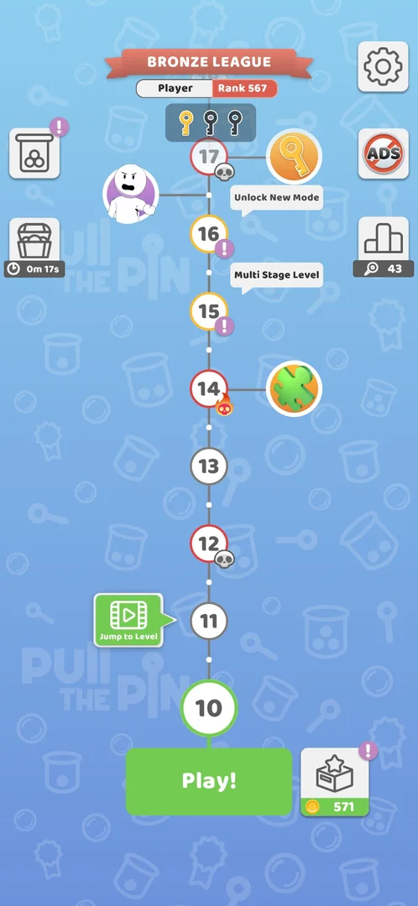
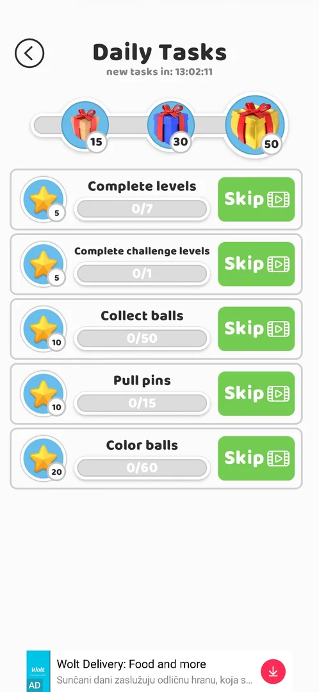

# Routes

Positions in the 730x1583 frame. Skills (status candidate): `jump-to-level`, `defeat-skip-video`.

## From the level map
- Settings: gear at the top right (668,115) [s:20261001-081207-chrono-2FYKPJ#15]; on levels 1–3 at the
  top left (58,113); back (66,121) [s:20260930-192115-chrono-2FYKPJ#10] [s:20260930-192115-chrono-2FYKPJ#20].
- No ADS: top right (670,268) — **do not tap**, it opens a payment sheet [s:20260930-192115-chrono-2FYKPJ#21].
- Level map: appears by itself after level 3 [s:20260930-192115-chrono-2FYKPJ#26].
- Collections: coin box right of Play! (584,1360); tabs at y 225: gacha 88, trophies 199, puzzles 310,
  skins 420 [s:20261001-081207-chrono-2FYKPJ#10] [s:20261001-081207-chrono-2FYKPJ#13]; skin lists:
  Themes (212,450), Trails (516,450), Walls (212,755), Pins (516,755), Balls (212,1060)
  [s:20260930-201034-chrono-2FYKPJ#19] [s:20260930-201034-chrono-2FYKPJ#22].
- All You Can Play! (modes): jar at the top left (60,268), after level 8 [s:20261001-081207-chrono-2FYKPJ#7].
- Timed chest: top left under the jar (60,420); (60,270) before the jar exists
  [s:20260930-192115-chrono-2FYKPJ#90] [s:20260930-201034-chrono-2FYKPJ#73].
- Daily Tasks: left icon (60,422) once level 14 is won [s:20261001-102608-chrono-2FYKPJ#57].
  
- Leagues: podium with a magnifier and the pin count on the right (668,430); the Bronze League banner at
  the top is not tappable [s:20261001-081207-chrono-2FYKPJ#1] [s:20261001-081207-chrono-2FYKPJ#17].
- Level race: flag on the right (668,580); close with "Tap to continue" (365,1197) — back and taps
  outside the panel do nothing [s:20261001-081207-chrono-2FYKPJ#3] [s:20261001-081207-chrono-2FYKPJ#6].
- Jump to Level (skill `jump-to-level`): green video button left of the next node (224,1083) → rewarded
  video, about 30 s → X at the top left (46,109) after "Reward granted" → league screen, Next Level
  (364,1270) → Tap to continue (364,1200); the level counts as won with the full reward
  [s:20261001-054205-chrono-2FYKPJ#53] [s:20261001-054205-chrono-2FYKPJ#56].

## In and after a level
- Restart in a level: circular arrow at the top right (669,113) [s:20260930-201034-chrono-2FYKPJ#39].
- After a win (241.5.1): league screen first ("+5 golden pins" video at (200,1270), Next Level at
  (364,1270)), then "Level completed!" with the coins, then Tap to continue (365,1200)
  [s:20261001-054205-chrono-2FYKPJ#7] [s:20261001-102608-chrono-2FYKPJ#6]. The back arrow (60,115) on
  the league screen returns to the win screen, not the map, and does not avoid the interstitial
  [s:20261001-054205-chrono-2FYKPJ#47] [s:20261001-054205-chrono-2FYKPJ#49].
- Golden pins: "+5 golden pins" on the league screen → video; it may end in the Play Store: `launch`
  returns [s:20261001-102608-chrono-2FYKPJ#6] [s:20261001-102608-chrono-2FYKPJ#7].
- Key chest room: comes by itself after the league screen of the win that brings the 3rd key; tap 3 of
  9 chests, then "No, thanks" (364,1262) or "Get X3 keys" (video) [s:20261001-054205-chrono-2FYKPJ#32]
  [s:20261001-054205-chrono-2FYKPJ#36].
- On the puzzle-piece screen tap continue at y about 1280: a tap at y 1200 hits "Get Another" and plays
  a video [s:20261001-102608-chrono-2FYKPJ#51].
- Lose, then Skip (skill `defeat-skip-video` from the defeat screen): with a win streak the popup
  "Watch your streak!" comes first — No, thanks (365,1298) → defeat screen, Skip (365,1105) → video,
  "Skip video" (110,110) after about 25 s → X (45,110) → league screen, Next Level (515,1270) → Tap to
  continue (365,1200); the map then shows the next level [s:20261001-220948-chrono-2FYKPJ#3]
  [s:20261001-220948-chrono-2FYKPJ#8].
- Multi Stage, stage failed: Retry Stage (216,1077) → an ad of 35-50 s closed at (680,70) → the same
  stage again [s:20261001-164104-chrono-2FYKPJ#4] [s:20261001-164104-chrono-2FYKPJ#5].
