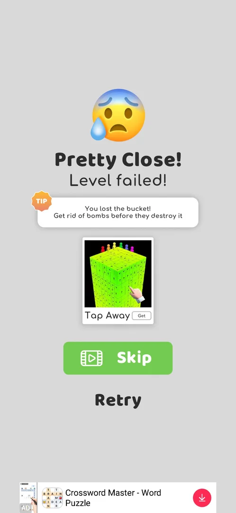

# Tactics

The full method, rules and the level library with verified orders are in the [playbook](playbook.md).

## Pins
- Tap the pin's ring, not the rod [s:20260930-192115-chrono-2FYKPJ#4]. A pin with a dotted track is a
  slider: swipe it along the dots [s:20261001-153137-chrono-2FYKPJ#10].
- Where rings overlap, the tap goes to the ring drawn on top; aim at the far side of the ring you want
  (level 14; level 21 hit the diagonal's ring instead and lost) [s:20261001-102608-chrono-2FYKPJ#41]
  [s:20261001-160324-chrono-2FYKPJ#6].
- Pull the pins above the coloured balls first so they land on the grey ones; open the way to the
  cup last [s:20260930-192115-chrono-2FYKPJ#8] [s:20260930-192115-chrono-2FYKPJ#64].
- Wait until the painting finishes (about 15 s on level 7) before opening the way to the cup;
  opening it 3 s after the top pin lost level 7 [s:20260930-201034-chrono-2FYKPJ#50] [s:20260930-201034-chrono-2FYKPJ#57].
- Never pull a sloped pin over a wall gap while balls roll on it, and never an extra pin "to be sure"
  (level 14 lost) [s:20261001-102608-chrono-2FYKPJ#42].

## Bombs
- Clear bombs first by letting them collide: a bomb that falls onto another bomb removes both, and nearby
  bombs may go too (level 11: the right shelf pin first; level 13: one divider made four bombs go)
  [s:20261001-102608-chrono-2FYKPJ#2] [s:20261001-102608-chrono-2FYKPJ#20]. On levels 23 s3 and 24 the
  vertical pin first makes the bombs meet [s:20261001-162240-chrono-2FYKPJ#22] [s:20261001-164104-chrono-2FYKPJ#17].
- Or keep a bomb parked and never pull its pin, or drop it off the field through a pin with no wall below
  [s:20260930-192115-chrono-2FYKPJ#60] [s:20260930-192115-chrono-2FYKPJ#83] [s:20261001-145738-chrono-2FYKPJ#3].
- Bombs into the cup lose ("You lost the bucket!"), bombs onto balls throw the balls out ("Balls fell
  out of the level"): level 16 lost both ways before the bombs were made to meet in the centre
  [s:20261001-145738-chrono-2FYKPJ#10] [s:20261001-145738-chrono-2FYKPJ#16] [s:20261001-160324-chrono-2FYKPJ#6].

  

## Level types
- Multi Stage: look at the frame after Play or a restart before sending a stored stage batch — the
  level resumes at the first unfinished stage [s:20261001-162240-chrono-2FYKPJ#31] [s:20261001-162240-chrono-2FYKPJ#32].
  Level 23 stage 4: never (503,445) straight after (620,645); pull a left divider (203,835) or (497,845)
  first [s:20261001-162240-chrono-2FYKPJ#18] [s:20261001-164104-chrono-2FYKPJ#3] [s:20261001-164104-chrono-2FYKPJ#9].
- Colour bucket (two cups): release the colour the steering pin already routes, pull the steering pin
  after it stopped, then the other colour (level 20: blue, middle, yellow, `--gap 7`)
  [s:20261001-153137-chrono-2FYKPJ#42] [s:20261001-154701-chrono-2FYKPJ#7].
- Challenge (popup on Play 21): decline with No, thanks unless the challenge is the goal; it cost 11.5
  of 16 min and was not won [s:20261001-154701-chrono-2FYKPJ#37].
- Boss levels: after 2 lost tries lose and Skip for a video — Skip pays the full win (+18 coins, a league
  pin, gift %, next level), only the win streak is lost [s:20261001-220948-chrono-2FYKPJ#8].
- To lose on purpose: release the grey balls before they are painted, or drop greys onto a bomb
  [s:20260930-201034-chrono-2FYKPJ#50] [s:20261001-220948-chrono-2FYKPJ#2].

## Old levels (241.3.1)
- Level 7 (hard): the horizontal pin, then the left diagonal, then the right diagonal, with a pause
  for the painting [s:20260930-192115-chrono-2FYKPJ#93] [s:20260930-192115-chrono-2FYKPJ#95].
- Level 8: the top right pin first (greys fall onto colour, the bombs leave), then bottom left,
  then the middle [s:20260930-201034-chrono-2FYKPJ#63] [s:20260930-201034-chrono-2FYKPJ#65].
