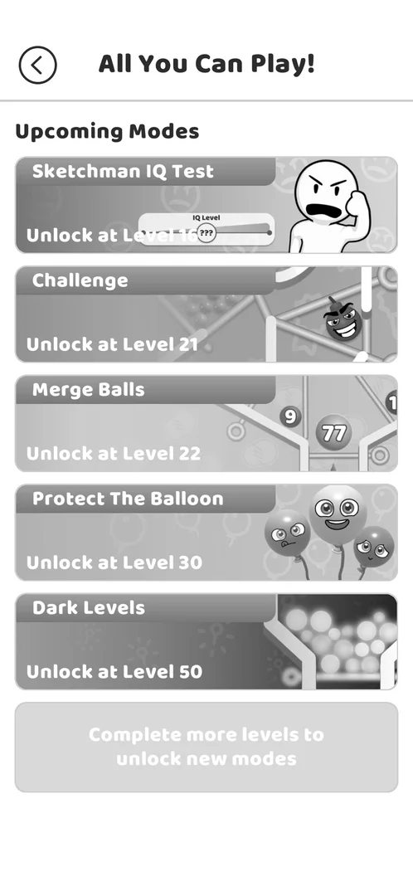
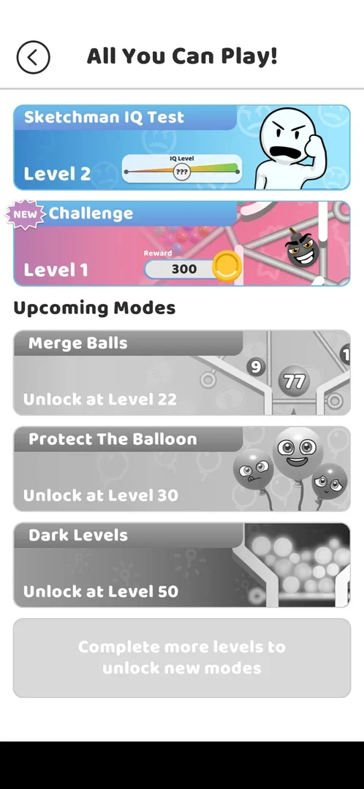

# All You Can Play! (modes menu)

A menu of extra game modes, opened from the jar icon at the top left of the map. At level 10 it held five
modes, all locked, each with the level that unlocks it; none can be played yet and the menu gives nothing by
itself [^s1] [^s3]. The icon looks like a jar of balls, but the screen is a list of modes, not a collection
that fills up [^s3].

## Why it appeared

On the map from at least level 10, with a purple ! badge on the icon [^s1]. When the icon first showed up
is not known: this session started at level 10.

## Where to find it

The map: the jar icon at the top left, above the chest with **OPEN**, with a purple **!** badge at its top
right corner [^s2]. A tap on it opens **All You Can Play!** [^s1].

 [^s2]
*The map at level 10: the jar icon top left with the ! badge, above the OPEN chest*

## What it looks like

 [^s1]
*All You Can Play!: five greyed mode cards under Upcoming Modes, each with the level that unlocks it*

A back arrow and the title **All You Can Play!** at the top, then the heading **Upcoming Modes** and one
card per mode: the mode's name, a picture of it and the line "Unlock at Level N" [^s1]. The whole list is
in greyscale while the modes are locked [^s1]. Under the cards a grey box reads "Complete more levels to
unlock new modes" [^s1]. The game's banner ad sits at the bottom [^s3].

On version 241.5.2, after the level 20 win, the jar on the map carried a **NEW** badge, and the list had two
playable cards in colour above Upcoming Modes: Sketchman IQ Test (Level 2, its IQ Level gauge) and Challenge
with its own **NEW** badge (Level 1, Reward 300); Merge Balls (level 22), Protect The Balloon (30) and Dark
Levels (50) were still greyed [^s6] [^s7]. See [Sketchman IQ Test](mode-iq-test.md) and
[Challenge](mode-challenge.md).

 [^s7]
*All You Can Play! after the level 20 win: two open modes, the new one marked NEW (a local banner ad blacked out)*

## What you can do

| Tab or button | What it does |
|---|---|
| [Mode cards](#mode-cards) | Locked: a tap does nothing |
| [Back arrow](#back-arrow) | Back to the map |

### Mode cards

<!-- no-frame: the cards are on the screen frame above; a tap on a locked card changed nothing on screen -->

| Mode | Unlocks at | Page |
|---|---|---|
| Sketchman IQ Test | level 16 | [mode-iq-test](mode-iq-test.md) |
| Challenge | level 21 | [mode-challenge](mode-challenge.md) |
| Merge Balls | level 22 | [mode-merge-balls](mode-merge-balls.md) |
| Protect The Balloon | level 30 | [mode-protect-balloon](mode-protect-balloon.md) |
| Dark Levels | level 50 | [mode-dark-levels](mode-dark-levels.md) |

Sources: [^s1] [^s3]. A tap on the locked Sketchman IQ Test card did nothing: no tooltip, no message, the
screen stayed the same [^s3].

### Back arrow

<!-- no-frame: the arrow is at the top left of the screen frame above; it led to the map frame under Where to find it -->

The round back arrow at the top left returns to the map [^s4]. After the first visit the ! badge on the jar
icon was gone [^s4] [^s6].

## How it works

Version 241.5.1.

- Five modes, each locked to a level: 16, 21, 22, 30, 50 [^s1].
- The ! badge on the icon clears after the menu is opened once [^s4].
- The badge came back after a force-stop of the app that also reverted the level 10 win [^s5]. Inferred: the
  "seen" state of the badge is saved with the rest of the progress, so it was lost with the reverted win;
  not verified.
- The game's own map shows an "Unlock New Mode" label next to level 17 [^s2]; inferred: winning level 16
  unlocks the first mode (Sketchman IQ Test), not verified.

## Cases

| Case | What was done | Result | Source |
|---|---|---|---|
| Tapping a locked mode card does nothing (no tooltip) <!-- case:locked-card-tap --> | Tapped the Sketchman IQ Test card | ✅ Nothing happened | [^s3] |
| Holds 5 upcoming modes: IQ Test L16, Challenge L21, Merge Balls L22, Protect The Balloon L30, Dark Levels L50; banner ad at the bottom <!-- case:contents --> | Opened the menu at level 10 | ✅ Five locked modes | [^s3] |
| Back arrow returns to map; the ! badge on the icon clears after the first open <!-- case:back --> | Tapped the back arrow | ✅ The map, the badge gone | [^s4] |
| After the restart that reverted L10 the ! badge on the jar icon came back <!-- case:badge-returns --> | Force-stopped and relaunched the app | ✅ The badge was back | [^s5] |
| Why it appeared <!-- case:chk-appeared --> | Looked at the map at level 10 | ✅ On the map with a ! badge | [^s1] |
| Where to find it: the screen and the button that open it <!-- case:chk-entry --> | Tapped the jar icon on the map | ✅ The jar icon, top left of the map (left open in the map) | [^s2] |
| What it looks like: its screen <!-- case:chk-screen --> | Opened it | ✅ The modes list, frame above (left open in the map) | [^s1] |
| Every entry point on it <!-- case:chk-entries --> | Read the cards | not verified: five locked modes seen; none opened |  |
| Badges, timers and counters on it and what each points to <!-- case:chk-badges --> | Won level 20, opened the jar | ✅ When a mode unlocks the jar on the map shows NEW and the new mode's card carries NEW too (Challenge after the level 20 win); a purple ! on the jar earlier (level 10, the Sketchman unlock) | [^s7] |
| What changes on it with progress <!-- case:chk-changes --> | — | not verified: no mode unlocked yet |  |

## Not verified

- Where to find it: the jar icon is the entry (frame above); the map still has the item open <!-- case:chk-entry -->
- What it looks like: the modes list (frame above); the map still has the item open <!-- case:chk-screen -->
- Every entry point on it: what an unlocked mode card opens <!-- case:chk-entries -->
- What changes on it with progress: the card of an unlocked mode, at level 16 or later <!-- case:chk-changes -->
- When the jar icon first shows up on the map (before level 10).

[^s1]: session 20261003-211035-chrono-2FYKPJ, step 1 — [video at 0:19](https://youtu.be/Mpfk4cqdltQ?t=19)
[^s2]: session 20261003-211035-chrono-2FYKPJ, step 0 — [video at 0:00](https://youtu.be/Mpfk4cqdltQ?t=0)
[^s3]: session 20261003-211035-chrono-2FYKPJ, step 2 — [video at 0:53](https://youtu.be/Mpfk4cqdltQ?t=53)
[^s4]: session 20261003-211035-chrono-2FYKPJ, step 3 — [video at 1:07](https://youtu.be/Mpfk4cqdltQ?t=67)
[^s5]: session 20261003-211035-chrono-2FYKPJ, step 23 — [video at 11:41](https://youtu.be/Mpfk4cqdltQ?t=701)

[^s6]: session 20261006-012240-chrono-2FYKPJ, step 18 — [video at 10:17](https://youtu.be/jf_j5LiHuRs?t=617)
[^s7]: session 20261006-012240-chrono-2FYKPJ, step 19 — [video at 11:16](https://youtu.be/jf_j5LiHuRs?t=676)
