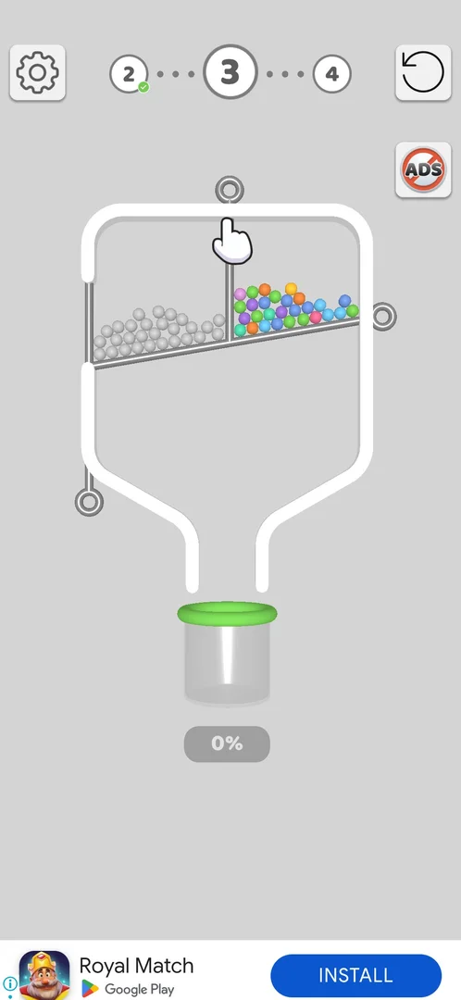
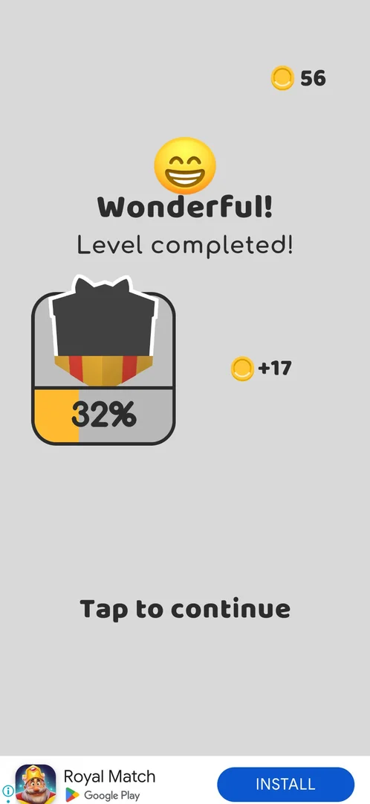

# Banner ad

A strip of advertising along the bottom edge of the screen, present from the first level on and on every
screen of the game seen so far: level boards, win screens, the league screen, the map and Daily Rewards
[^s1] [^s5]. It has no close button; a tap on it opens a Google Play sheet for the advertised app [^s5].

## Why it appeared

From level 1: banner at the bottom of the level and win screens [^s1].

## Where to find it

It needs no control: it sits at the bottom of every game screen by itself [^s1] [^s5]. It is not drawn
over the full-screen interstitial video ads [^s5].

 [^s2]
*Level 3 board: the banner strip along the bottom edge, the (i) AdChoices icon at its left end*

## What it looks like

 [^s3]
*The level 2 win screen: the banner shows an app icon, the app name with "Google Play" under it and a blue INSTALL button; the (i) icon at the far left*

The strip takes about the bottom 6% of the screen height [^s5]. Most creatives seen are app-install
cards (icon, app name, INSTALL); others are full-width image banners (a solitaire game with PLAY NOW, a
sudoku game) [^s5]. The creative changes every few screens [^s5].

## How it works

Version 241.5.1.

- Shown continuously from level 1 on every screen seen [^s1] [^s5].
- Cannot be closed: there is no X on it, only the (i) AdChoices icon at its left edge. Back was not tried
  on it [^s6].
- The only removal offered is the paid No Ads (ADS) button on the level screen and the map; it was not
  tapped [^s5].
- A tap on the banner opens a Google Play overlay sheet over the game (Install, X). Returning to the game
  brings back the same screen with the win kept [^s5]. Right after the return the banner was once drawn
  a little higher, with a grey strip under it [^s5].

## Cases

| Case | What was done | Result | Source |
|---|---|---|---|
| Comes by itself at the bottom of the screen from level 1 <!-- case:chk-entry --> | Played levels 1-9 | ✅ No control needed; it is there from level 1 | [^s1] |
| Bottom banner (store install ad) on the level and win screens <!-- case:chk-screen --> | Looked at every screen | ✅ App-install cards and image banners | [^s1] |
| Banner, bottom of the level, win and settings screens <!-- case:chk-kind --> | Opened Settings | ✅ A banner, also under Settings | [^s4] |
| Not applicable: a banner, not a rewarded video <!-- case:chk-reward --> | — | ✅ Nothing is given for it | [^s1] |
| Bottom strip on every screen seen: level boards (from L3; L1-L2 too), win screens, league screen, map, daily rewards; not over interstitials. Creatives rotate (app install cards, image banners) <!-- case:where --> | Played levels 2-9, opened the map, Pull Fest, Daily Rewards and Collections | ✅ On every screen except interstitials | [^s5] |
| No close button: only an (i) AdChoices icon at its left edge; removal only via the paid No Ads button (not tapped) <!-- case:close --> | Looked for a close control | ✅ None | [^s5] |
| A tap opens a Google Play overlay sheet over the game (Install, X); launch returns to the game with the screen and win intact <!-- case:tap --> | Tapped the banner on a win screen, then returned to the game | ✅ Store sheet; the game screen and the win kept | [^s5] |
| Always on: shown continuously on every screen from the first level; creative refreshes every few screens <!-- case:chk-frequency --> | Played levels 2-9 | ✅ Always on | [^s5] |
| Cannot be closed: no X on it, only the (i) AdChoices icon at its left edge (Back not tried on it) <!-- case:chk-close --> | Looked for a close control | ✅ Cannot be closed | [^s6] |
| Why it appeared <!-- case:chk-appeared --> | Played level 1 | ✅ There from level 1 | [^s1] |

## Not verified

- Whether Back does anything to the banner.
- What the No Ads purchase removes (the banner, the interstitials or both); see the No Ads page.

[^s1]: session 20261003-193015-chrono-2FYKPJ, step 3 — [video at 1:22](https://youtu.be/JjeHh2uiLgE?t=82)
[^s2]: session 20261003-203702-chrono-2FYKPJ, step 3 — [video at 1:00](https://youtu.be/cirqlD7KGWI?t=60)
[^s3]: session 20261003-203702-chrono-2FYKPJ, step 2 — [video at 0:44](https://youtu.be/cirqlD7KGWI?t=44)
[^s4]: session 20261003-193015-chrono-2FYKPJ, step 5 — [video at 1:53](https://youtu.be/JjeHh2uiLgE?t=113)
[^s5]: session 20261003-203702-chrono-2FYKPJ, step 49 — [video at 19:12](https://youtu.be/cirqlD7KGWI?t=1152)
[^s6]: session 20261003-203702-chrono-2FYKPJ, step 50 — [video at 19:43](https://youtu.be/cirqlD7KGWI?t=1183)
