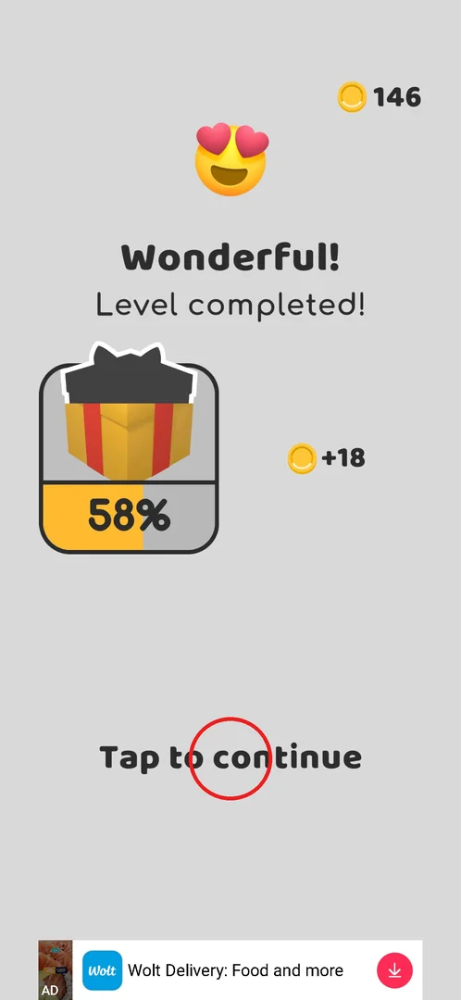
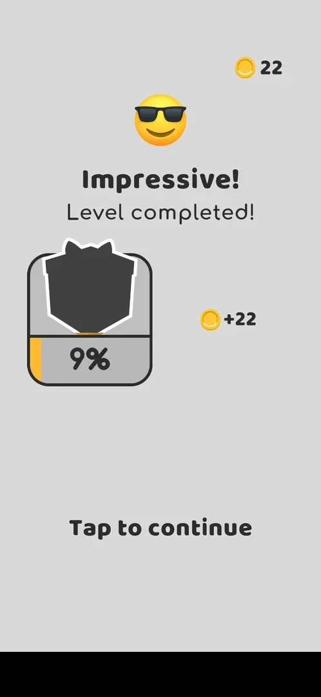
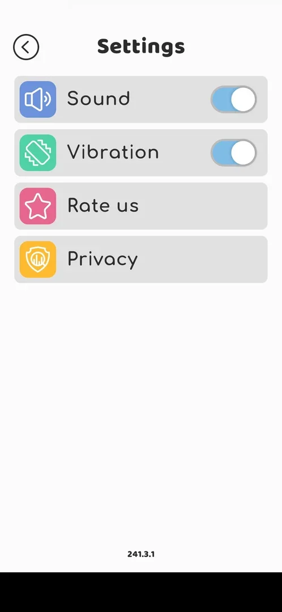
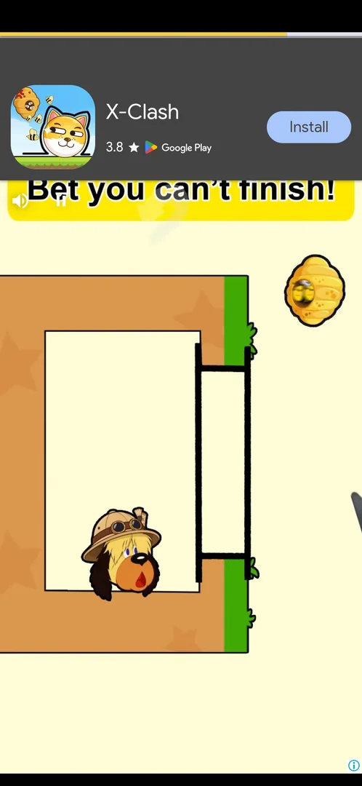
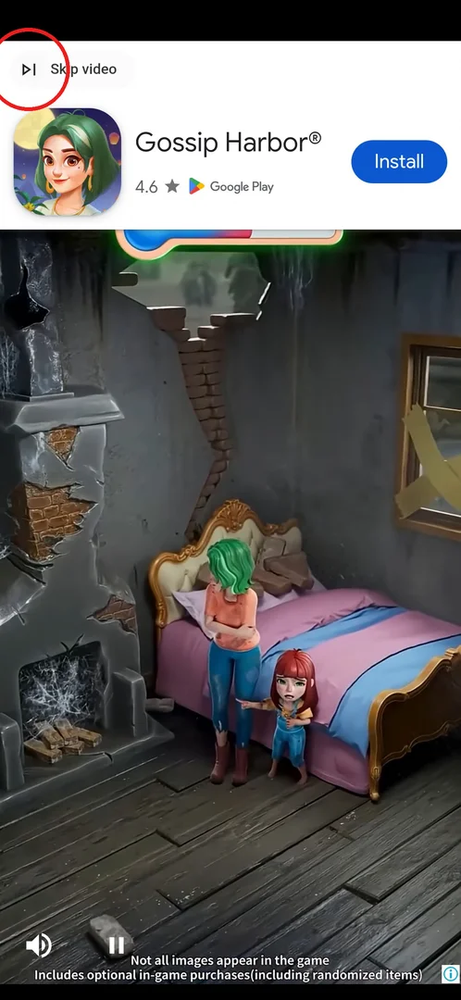
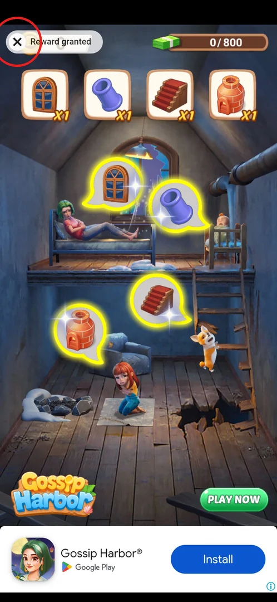
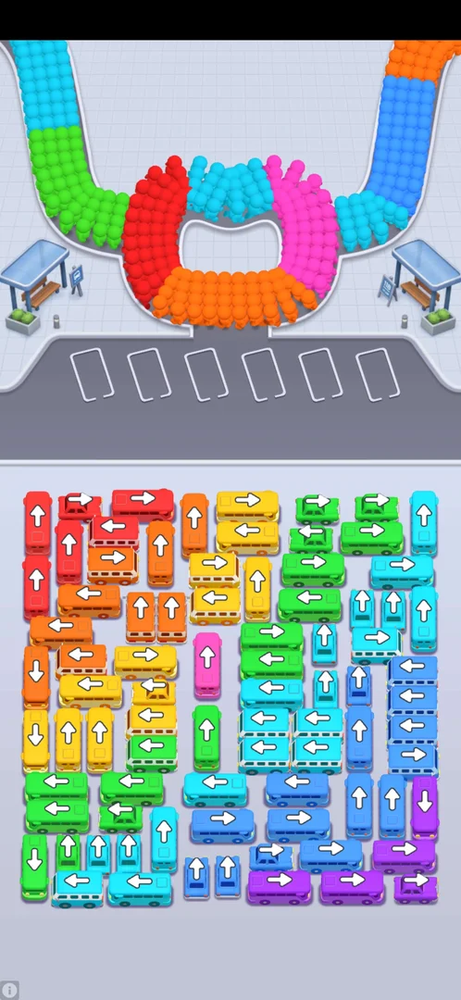

# Banner and interstitial ads

> Recheck on v241.5.1: documented on 241.3.1; Google Play has 241.5.1.

The game runs two kinds of forced ads that the player does not ask for: a banner strip that sits at the
bottom of the screen from level 1 [^s2], and full-screen interstitials (videos and playable ads) that
start after the level 6 win and then come after wins, restarts and retries [^s4] [^s9]. Interstitials
last 20–60 s, often have no close button for a long time, and some open Google Play on their own. The
only way offered to remove them is the paid [No ADS](no-ads.md) button [^s10].

## Where to find it

<!-- no-entry: ads have no screen or button of their own; the banner is always on, and interstitials are triggered by leaving a level-result screen -->

There is nothing to open. The banner is visible on levels, result screens, the map and menus [^s2] [^s3].
The first interstitial appeared after tapping **Tap to continue** on the level 6 win screen, about 20
minutes into the first session (circled) [^s1] [^s4].

 [^s1]

## What it looks like

<!-- no-screen: an ad is drawn over whatever screen is open; the frames below show the banner and the interstitial states -->

The banner is a thin strip at the very bottom, with a small "AD" label and an install/download button of
the advertised app; it is there already on the level 1 win screen [^s2].

 [^s2]

## What you can do

| Tab or button | What it does |
|---|---|
| [Banner](#banner) | Always on; nothing to do with it except avoid tapping it |
| [Interstitial](#interstitial) | Full-screen ad after a level result; wait it out |
| [Skip video](#skip-video) | Appears at the top left of a video ad after a while; skips to the end card |
| [Close](#close) | The cross on the end card ("Reward granted") returns to the game |
| [Store overlay](#store-overlay) | A tap on the ad header can open Google Play; Back returns to the game |
| [Stuck ad](#stuck-ad) | Some playable ads never show a close button; only restarting the game helps |

### Banner

The same strip stays at the bottom of the Settings screen and the level map, so it covers the bottom of
every screen [^s3].

 [^s3]

### Interstitial

The first interstitial came after Tap to continue on the level 6 win: a playable ad with a progress bar
at the top and no close button at first [^s4]. In the first session there was one after every win from
level 6 on (levels 6 and 7) [^s11]. In the second session interstitials also
followed **Restart** in the level, **Retry** on the "So Close! Level failed!" screen, a level win, and
closing the puzzle piece from the timed chest [^s12]
[^s13] [^s9] [^s7].

 [^s4]

### Skip video

On a video interstitial a **Skip video** button appears at the top left after about 30 s; it jumps to the
ad's end card [^s7] [^s8].

 [^s7]

### Close

The end card shows "Reward granted" with a cross at the top left; the cross returns to the game (here to
the level map) [^s8]. One ad after Retry was closed with a cross at the top right instead
[^s13], and the end card after the level 8 win was closed with Back
[^s14].

 [^s8]

### Store overlay

A tap where the skip button sits (top left) opened a Google Play overlay of the advertised game instead
of closing the ad, after the level 6 win and again after the level 7 win; Back returned to the game
[^s5] [^s15]. The ad after Retry opened Google Play by itself at its end
[^s13].

<!-- no-frame: personal data (Google Play, status bar) -->

### Stuck ad

After level 7 a video ad showed no close button for more than 50 s, with only a progress bar at the
bottom [^s11]. After Restart on level 7 a playable ad had no close button for
more than 40 s; Back and taps in the corners did nothing, and the player had to close the game from the
recent apps and launch it again [^s6] [^s16].

 [^s6]

## How it works

Version 241.3.1.

- **Banner:** from level 1, on every screen seen (levels, results, map, Settings) [^s2] [^s3].
- **First interstitial:** after the level 6 win, about 20 minutes of play [^s4].
- **Triggers seen:** level win, Restart in a level, Retry after a loss, closing the timed-chest puzzle
  piece [^s11] [^s12]
  [^s13] [^s7].
- **Length:** 20–60 s; a close button often appears only at the very end, or never [^s9]
  [^s13].
- **Removing ads:** No ADS opens a Google Play payment sheet "Remove Ads", RSD 999; nothing was bought
  [^s10].
- Rewarded videos (Get Another, Jump to Level, Spin for a video) use the same Skip video → "Reward granted"
  flow but are the player's choice; they are described on their own pages
  [^s17].

## Cases

| Case | What was done | Result | Source |
|---|---|---|---|
| Banner | Played from level 1 | Banner at the bottom from level 1 | [^s2] |
| Interstitials | Played levels 6–8 | From the level 6 win; then after wins, Restart, Retry and the chest puzzle; 20–60 s, often no close button; some open Google Play | [^s4] [^s9] |
| Skip button | Tapped the skip area at the top left | Opened a Google Play overlay; Back returned to the game | [^s5] |
| Stuck ad | Waited | After level 7 an ad had no close button for more than 50 s | [^s11] |
| Stuck ad after Restart | Waited, pressed Back, tapped the corners | No way out for over 40 s; the game had to be restarted | [^s6] [^s16] |
| Skip and close a video ad | Skip video, then the cross on "Reward granted" | Back on the level map | [^s7] [^s8] |

## Not verified

- How often interstitials come and the minimum gap between them.
- Whether a level interrupted by an interstitial is saved: after the first session ended during the
  ad after the level 7 win, the game reopened on level 7 again (inferred)
  [^s18].

[^s1]: session 20260930-192115-chrono-2FYKPJ, step 86 — [video at 20:00](https://youtu.be/BVqoYRE5kRU?t=1200)
[^s2]: session 20260930-192115-chrono-2FYKPJ, step 4 — [video at 0:52](https://youtu.be/BVqoYRE5kRU?t=52)
[^s3]: session 20260930-192115-chrono-2FYKPJ, step 10 — [video at 2:14](https://youtu.be/BVqoYRE5kRU?t=134)
[^s4]: session 20260930-192115-chrono-2FYKPJ, step 87 — [video at 20:18](https://youtu.be/BVqoYRE5kRU?t=1218)
[^s5]: session 20260930-192115-chrono-2FYKPJ, step 88 — [video at 20:50](https://youtu.be/BVqoYRE5kRU?t=1250)
[^s6]: session 20260930-201034-chrono-2FYKPJ, step 40 — [video at 9:07](https://youtu.be/JGEX3-Rfkdw?t=547)
[^s7]: session 20260930-201034-chrono-2FYKPJ, step 75 — [video at 24:03](https://youtu.be/JGEX3-Rfkdw?t=1443)
[^s8]: session 20260930-201034-chrono-2FYKPJ, step 76 — [video at 25:09](https://youtu.be/JGEX3-Rfkdw?t=1509)
[^s9]: session 20260930-201034-chrono-2FYKPJ, step 59 — [video at 17:25](https://youtu.be/JGEX3-Rfkdw?t=1045)

[^s10]: session 20260930-192115-chrono-2FYKPJ, step 22 — [video at 3:54](https://youtu.be/BVqoYRE5kRU?t=234)
[^s11]: session 20260930-192115-chrono-2FYKPJ, step 97 — [video at 23:14](https://youtu.be/BVqoYRE5kRU?t=1394)
[^s12]: session 20260930-201034-chrono-2FYKPJ, step 43 — [video at 10:42](https://youtu.be/JGEX3-Rfkdw?t=642)
[^s13]: session 20260930-201034-chrono-2FYKPJ, step 54 — [video at 15:31](https://youtu.be/JGEX3-Rfkdw?t=931)
[^s14]: session 20260930-201034-chrono-2FYKPJ, step 69 — [video at 22:15](https://youtu.be/JGEX3-Rfkdw?t=1335)
[^s15]: session 20260930-201034-chrono-2FYKPJ, step 61 — [video at 18:27](https://youtu.be/JGEX3-Rfkdw?t=1107)
[^s16]: session 20260930-201034-chrono-2FYKPJ, step 46 — [video at 11:15](https://youtu.be/JGEX3-Rfkdw?t=675)
[^s17]: session 20260930-192115-chrono-2FYKPJ, step 34 — [video at 7:51](https://youtu.be/BVqoYRE5kRU?t=471)
[^s18]: session 20260930-201034-chrono-2FYKPJ, step 0 — [video at 0:00](https://youtu.be/JGEX3-Rfkdw?t=0)
