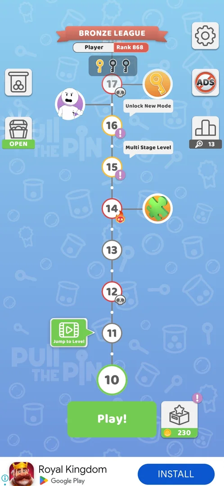
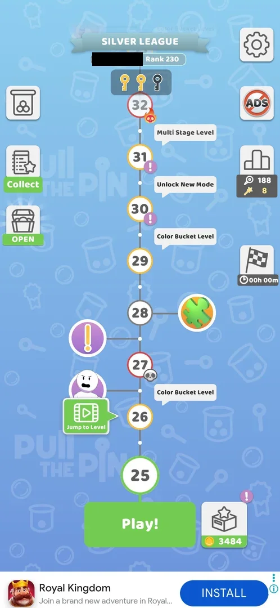

# Bonus levels (character node)

A node on the map with a cartoon character's portrait, set beside the level path and joined to it by a short
line; the game's map tutorial calls these bonus levels [^s1]. At level 10 the next such node sat between
levels 16 and 17 and could not be opened yet [^s2]. On version 241.5.2 that node turned out to be the face
of the Sketchman IQ Test mode: it left the map when the mode unlocked after the level 15 win, and no bonus
level was offered [^s3] [^s4]. The next node, a grandmother's portrait between levels 21 and 22, went the same way when the Challenge mode unlocked with the level 20 win [^s5] [^s6]. A third node, a stick figure between levels 26 and 27, was gone after the level 25 win, and a purple ! node between levels 27 and 28 after the level 26 win, with no mode unlock, popup or bonus level [^s8] [^s11] [^s9]. No bonus level was played, so what one is like is not known.

## Why it appeared

The map tutorial after the level 3 win: a tooltip "Discover bonus levels as you go" at a character node
between levels 8 and 9 [^s1]. Later a node was seen between levels 16 and 17 [^s2].

## Where to find it

The map: a round portrait of an angry stick-figure character at the left of the level path, linked to the
path between level 16 and level 17 [^s2]. At level 10 a tap on it did nothing [^s2]. Inferred from the
node's place: it opens once the path reaches it, after level 16; not verified.

 [^s2]
*The map at level 10: the character portrait left of the path, between levels 16 and 17; a tap on it did nothing*

 [^s8]
*The map at level 25: the stick-figure portrait left of the path between levels 26 and 27, with Jump to Level under it, and a purple ! node between levels 27 and 28 (the player's name blacked out); after the level 25 win the stick figure was gone*

 [^s9]
*The map at level 27, after the level 26 win: neither the stick-figure node nor the ! node is left; the next character node is a grandmother's portrait between levels 33 and 34 (the player's name blacked out)*

## What it looks like

<!-- no-screen: the node could not be opened at level 10; no bonus level was played -->

Not seen: the node was not reachable [^s2].

## How it works

Version 241.5.1.

- Nodes seen: between levels 8 and 9 (the tutorial) [^s1], between levels 16 and 17 [^s2].
- Before the path reaches it the node gives no reaction to a tap and no tooltip [^s2].
- Whether the node between levels 8 and 9 was played, skipped or left behind on the way to level 10 is not
  known.

Version 241.5.2.

- The node between levels 16 and 17 shows the angry stick figure of the [Sketchman IQ Test](mode-iq-test.md)
  card. It was on the map at level 15 and gone after the level 15 win, when the mode unlocked; the
  Jump to Level button took its place beside level 17 [^s3] [^s4].
- The next character node, a grandmother's portrait, is linked to the path between levels 21 and 22, where the
  map's "Unlock New Mode" labels sit; Challenge unlocks at level 21 and Merge Balls at level 22 [^s3] [^s4].
  Inferred: character nodes mark mode unlocks, not bonus levels; not verified, and what the tutorial's
  "bonus levels" are stays open.
- The grandmother's node was on the map at level 20 and gone after the level 20 win, when the Challenge mode
  unlocked (the jar showed NEW); no bonus level was offered [^s5] [^s6] [^s7]. The next character
  node is an angry stick figure linked to the path between levels 26 and 27 [^s6]. Inferred from two nodes
  out of two: character nodes are mode markers; not verified for the next one.
- The stick-figure node between levels 26 and 27 and a purple ! node between levels 27 and 28 were on the map
  at level 25 [^s8]. On the map at level 26, after the level 25 win, the stick figure was gone and the ! node
  was still there [^s11]; on the map at level 27, after the level 26 win, the ! node was gone too. No popup,
  mode unlock or bonus level came either time, and Jump to Level moved to level 28 [^s9]. Play! on level 27 opened the Boss Level! popup of the
  [hard levels](hard-levels.md) [^s10]. This node marked no mode unlock, so the mode-marker inference above
  holds for two nodes of three. The next character node, a grandmother's portrait, sits between levels 33 and
  34 [^s9].
- The grandmother's node between levels 33 and 34 [^s9]: Play! on level 33 opened a
  "Challenge Level!" popup with a grandmother in its picture ("Only 81% of the players pass on the first
  attempt!", Let's go! +450 coins, No, thanks); No, thanks gave an ordinary level 33 board, whose win counted
  [^s12]. See [Boss level](boss-level.md). On the map at level 34 the node was gone [^s13]. Inferred from the
  grandmother in the popup's picture: this node announced the opt-in harder board of level 33; not verified.
- The map at level 34 shows the next nodes: an angry stick figure between levels 36 and 37, a purple ! node
  between levels 39 and 40, and a puzzle-piece node beside level 39 [^s13].

## Outcomes

| Outcome | As the base or what differs | Frame |
|---|---|---|
| win <!-- case:under-win --> | not verified: no bonus level played | — |
| restart <!-- case:under-restart --> | not verified | — |
| quit <!-- case:under-quit --> | not verified | — |
| exit app <!-- case:under-exit-app --> | not verified | — |
| balls fell out <!-- case:under-balls-out --> | not verified: the "Balls fell out of the level!" loss was seen so far only on level 11, an ordinary level (see [Pin-pull level](core-level.md#level-failed)) | — |

## Cases

| Case | What was done | Result | Source |
|---|---|---|---|
| Tapping the character node before reaching it (progress L10): no reaction, no tooltip <!-- case:tap-before-reached --> | Tapped the node between levels 16 and 17 at level 10 | ✅ Nothing happened | [^s2] |
| The character node between L16 and L17 was the Sketchman face of the Sketchman IQ Test mode: it vanished from the map when the mode unlocked after the L15 win, no bonus level was offered <!-- case:sketchman-node-was-mode --> | Won level 15, back to the map | ✅ The node gone, the mode unlocked, no bonus level | [^s4] |
| The grandmother's node between levels 21 and 22 <!-- case:granny-node-was-mode --> | Won level 20, back to the map | ✅ The node gone when Challenge unlocked, no bonus level offered; the next node, a stick figure, between levels 26 and 27 | [^s6] |
| The nodes beside levels 26 to 28 after the level 26 win <!-- case:l27-node-vanished --> | Won level 26, back to the map | ✅ No stick-figure node and no ! node; no popup or bonus level; Jump to Level moved to 28; the next character node between 33 and 34 (the stick figure had already gone after the level 25 win, next row) | [^s9] |
| When the stick-figure node went <!-- case:stickman-gone-after-l25 --> | Won level 25, back to the map; then won level 26 | ✅ The stick figure was gone after the level 25 win (on the map at 25, not at 26); the ! node by 27-28 went after the level 26 win; no bonus level either time | [^s11] [^s9] |
| The nodes ahead on the map at level 34 <!-- case:next-nodes --> | Won level 33 (after the Challenge Level! popup, declined), looked at the map at level 34 | ✅ The grandmother's node by 33-34 gone; an angry stick figure between 36 and 37, a purple ! node between 39 and 40, a puzzle-piece node beside 39 | [^s12] [^s13] |
| Why it appeared <!-- case:chk-appeared --> | Won level 3 | ✅ The map tutorial's tooltip | [^s1] |
| Where to find it <!-- case:chk-entry --> | Tapped the node at level 10 | not verified: the node is on the map, but it did not open |  |
| What it looks like <!-- case:chk-screen --> | — | not verified: not opened |  |
| How it is announced <!-- case:chk-announce --> | — | not verified: the tutorial tooltip only; no popup when the node is reached |  |
| What differs in play from the base level <!-- case:chk-differs --> | — | not verified |  |
| Its win <!-- case:chk-win --> | — | not verified |  |
| Each loss <!-- case:chk-loss --> | — | not verified |  |
| Retry and continue offers <!-- case:chk-retry --> | — | not verified |  |
| Where and how often it comes up <!-- case:chk-frequency --> | Looked at the map | not verified: nodes after levels 8, 16, 21, 26, 27, 33, 36 and 39 seen | [^s9] [^s13] |

## Not verified

- Colours mixed (the Color Bucket fail) under a bonus level, if one has colour cups: as the base, or what differs <!-- case:under-colour-mix -->
- Where to find it: what opens the node (reaching it on the path, after level 16) <!-- case:chk-entry -->
- What it looks like: the bonus level's screen <!-- case:chk-screen -->
- How it is announced when the path reaches the node <!-- case:chk-announce -->
- What differs in play from the base level: the board, the rules, the limits, stages, a timer <!-- case:chk-differs -->
- Its win: the win screen and the reward, against the base level's <!-- case:chk-win -->
- Each loss: its fail screen and what the loss costs <!-- case:chk-loss -->
- Retry and continue offers after a loss and their price <!-- case:chk-retry -->
- Where and how often it comes up beyond the nodes after levels 8, 16, 21, 26, 27, 33, 36 and 39; whether any character node is a bonus level and not a mode marker; what the stick-figure node by 26-27 was, since it left with no mode unlock <!-- case:chk-frequency -->
- Win screen under Bonus levels: as the base, or what differs <!-- case:under-win -->
- Restart under Bonus levels: as the base, or what differs <!-- case:under-restart -->
- Quit under Bonus levels: as the base, or what differs <!-- case:under-quit -->
- Exit the app under Bonus levels: as the base, or what differs <!-- case:under-exit-app -->
- Balls fell out under Bonus levels: as the base, or what differs <!-- case:under-balls-out -->

[^s1]: session 20261003-203702-chrono-2FYKPJ, step 6 — [video at 1:57](https://youtu.be/cirqlD7KGWI?t=117)
[^s2]: session 20261003-211035-chrono-2FYKPJ, step 4 — [video at 1:22](https://youtu.be/Mpfk4cqdltQ?t=82)
[^s3]: session 20261005-151039-chrono-2FYKPJ, step 0 — [video at 0:00](https://youtu.be/r5lFTdFC8_s?t=0)
[^s4]: session 20261005-151039-chrono-2FYKPJ, step 17 — [video at 5:51](https://youtu.be/r5lFTdFC8_s?t=351)

[^s5]: session 20261006-012240-chrono-2FYKPJ, step 0 — [video at 0:00](https://youtu.be/jf_j5LiHuRs?t=0)
[^s6]: session 20261006-012240-chrono-2FYKPJ, step 18 — [video at 10:17](https://youtu.be/jf_j5LiHuRs?t=617)
[^s7]: session 20261006-012240-chrono-2FYKPJ, step 19 — [video at 11:16](https://youtu.be/jf_j5LiHuRs?t=676)
[^s8]: session 20261006-061608-chrono-2FYKPJ, step 9 — [video at 4:08](https://youtu.be/OfYU2WgEiQU?t=248)
[^s9]: session 20261006-061608-chrono-2FYKPJ, step 19 — [video at 8:34](https://youtu.be/OfYU2WgEiQU?t=514)
[^s10]: session 20261006-061608-chrono-2FYKPJ, step 20 — [video at 9:45](https://youtu.be/OfYU2WgEiQU?t=585)
[^s11]: session 20261006-061608-chrono-2FYKPJ, step 14 — [video at 5:39](https://youtu.be/OfYU2WgEiQU?t=339)
[^s12]: session 20261006-145232-chrono-2FYKPJ, step 10 — [video at 3:16](https://youtu.be/2PFrqVa_52w?t=196)
[^s13]: session 20261006-145232-chrono-2FYKPJ, step 18 — [video at 5:45](https://youtu.be/2PFrqVa_52w?t=345)
