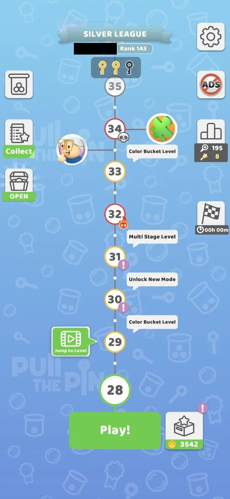
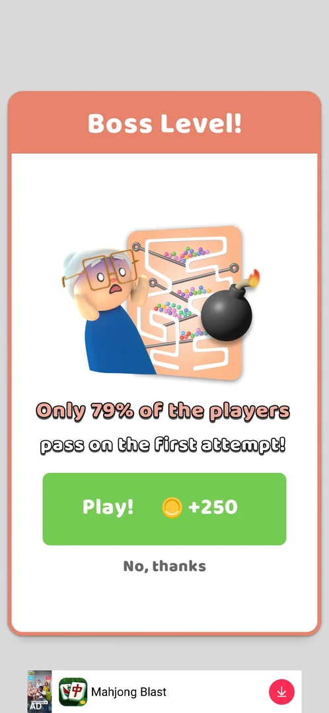
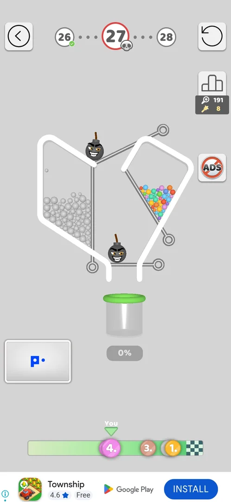
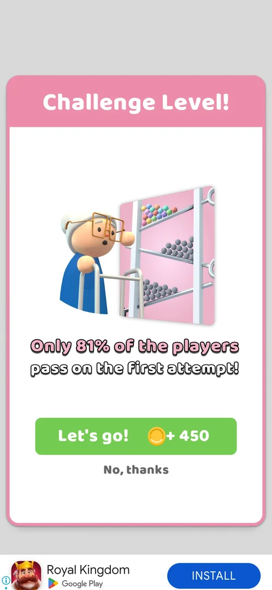
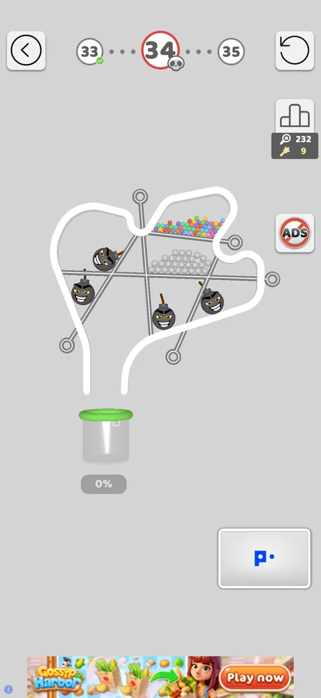

# Boss level (opt-in popup on a skull node)

A level on the map whose **Play!** opens a "Boss Level!" popup before the board: the player is offered a
harder board for +250 coins, or can turn it down with **No, thanks** and play an ordinary board for the same
level [^s1] [^s3]. Seen once, at level 27 (version 241.5.2). At level 34, the next node with the same grey
skull badge, Play! opened an ordinary board with no popup [^s8]; at level 33, a node with no skull, a
similar popup titled "Challenge Level!" came instead (+450 coins) [^s7]. The boss board itself was never
played. The level is one of the skull-marked levels described on [Hard levels](hard-levels.md).

## Why it appeared

Tapping **Play!** on the level 27 skull node opened the "Boss Level!" popup (a frightened grandmother beside a
maze board, "Only 79% of the players pass on the first attempt!", Play! +250 coins and No, thanks) [^s1].
The skull badge alone does not bring it: level 12, also with a grey skull badge, went straight to its board
from Play! [^s6], and so did level 34, twice [^s8].

Hypothesis, not verified: the popup comes with a grandmother character node on the map, not with the skull
badge. The map at level 28 showed a grandmother face between levels 33 and 34 [^s2]; the opt-in popup then
came on level 33 ("Challenge Level!") and not on level 34 [^s7] [^s8]. Whether a grandmother node stood by
level 27 was not checked.

## Where to find it

The level map: the boss level is a node with a red ring and a grey skull badge at its lower right; the popup
comes on **Play!** under the map when that node is the current level [^s1] [^s2]. A flame skull (red, with a
flame) marks a hard level instead: level 32 [^s2]. On the map at level 28 the next grey skull is level 34, with
a puzzle-piece node beside it and a grandmother face between 33 and 34 [^s2]; the map at level 31 shows the
same [^s4]. On the map at level 33 the grandmother face is no longer in view, and the next grey skull after
34 is level 40 [^s7]; once level 34 is the current node, its skull badge is not drawn on the big current
node [^s8].

 [^s2]
*The map at level 28: the next boss node is level 34, the grey skull badge at its lower right; level 32 carries the flame skull of a hard level (the player's name blacked out)*

## What it looks like

 [^s1]
*The Boss Level! popup on Play! of level 27: "Only 79% of the players pass on the first attempt!", Play! with +250 coins, and No, thanks*

A popup over a grey screen, from top to bottom [^s1]:

- the title "Boss Level!" on a salmon header;
- a picture: a frightened grandmother beside a tall maze board with four pins, coloured balls and a lit bomb;
- the line "Only 79% of the players pass on the first attempt!";
- a green **Play!** button with a coin and **+250**;
- **No, thanks** in grey text under it.

A banner ad sits under the popup [^s1].

## What you can do

| Tab or button | What it does |
|---|---|
| [Play! +250](#play-250) | Not tried: by its label, plays the boss board for 250 coins |
| [No, thanks](#no-thanks) | Opens a small ordinary board for the same level [^s3] |
| [Challenge Level!](#challenge-level) | A similar opt-in popup seen on level 33: Let's go! +450 or No, thanks [^s7] |
| [Level 34 without the popup](#level-34-without-the-popup) | Play! on the level 34 skull node opened a board directly [^s8] |

### Play! +250

<!-- no-frame: Play! +250 was not tapped; the button is on the popup frame above -->

The green button of the popup, with a coin and +250 [^s1]. Not tapped: the boss board, its rules and when the
250 coins are paid were not seen.

### No, thanks

 [^s3]
*No, thanks: level 27 opens as a small board with two bombs, grey and coloured balls and four pins; the header still shows 27 with the red ring and skull*

The board is not the maze of the popup's picture: two compartments (grey balls, coloured balls), a bomb on the
top pin and one over the floor pin, four pins in all [^s3]. It was won on the first try with four pulls, the
top pin first so that the two bombs meet and vanish [^s3]. The win counted as level 27: the map moved on to
level 28 [^s5].

### Challenge Level!

 [^s7]
*Play! on level 33 (no skull badge): "Challenge Level!", "Only 81% of the players pass on the first attempt!", Let's go! with +450 coins, and No, thanks*

The same layout as the Boss Level! popup with other content [^s7]:

- the title "Challenge Level!" on a pink header;
- a picture: a grandmother with large glasses and a walking frame beside a board of three slanted shelves,
  coloured balls on the top one and grey balls on the two below;
- "Only 81% of the players pass on the first attempt!";
- a green **Let's go!** button with a coin and **+450**;
- **No, thanks** under it.

The first frame after Play! shows the popup without its two buttons; the next frame, about 14 s later, shows
them [^s7]. No, thanks was taken: level 33 opened as an ordinary board (a jar of blue balls on one pin, two
hook gates swiped out along dotted tracks) and was won; the header showed 33 with a plain ring and no
skull [^s7]. Inferred, not verified: Challenge Level! and Boss Level! are the same opt-in offer with different
titles, pictures and coin bonuses; Let's go! was not tapped.

### Level 34 without the popup

 [^s8]
*Play! on the level 34 grey skull node: the board opens at once, no Boss Level! popup; the header keeps the red ring and skull*

Play! on level 34 opened this board directly [^s8]. The player went back to the map with the back arrow and
tapped Play! again: the same board, again no popup [^s8]. The board has four bombs, five pins, a shelf of
coloured balls over a block of grey balls, and one cup at 0% [^s8]. It was not played.

## How it works

Version 241.5.2.

- Nodes with the grey skull badge seen: levels 12, 27, 34 and 40 [^s6] [^s1] [^s7]. Only level 27 brought
  the Boss Level! popup; 12 and 34 opened a board directly [^s6] [^s8].
- Level 33, without a skull badge, brought the Challenge Level! popup [^s7].
- Shown on the popups: 79% of players pass the boss on the first attempt, Play! +250 coins [^s1]; 81% pass
  the challenge, Let's go! +450 coins [^s7]. Inferred from the labels, not seen: the coins are paid for
  winning the harder board.
- The offer is optional: No, thanks gives a different, smaller board for the same level, and its win advances
  the map [^s3] [^s5] [^s7].
- Whether the boss can still be played after it was declined and the level won was not seen.

## Outcomes

Seen only with the boss declined; the boss board was not played.

| Outcome | As the base or what differs | Frame |
|---|---|---|
| win <!-- case:under-win --> | not verified for the boss board; the board after No, thanks was won as a usual level and counted as level 27 [^s3] [^s5] | — |
| restart <!-- case:under-restart --> | not verified: the boss board not played | — |
| quit <!-- case:under-quit --> | not verified: the boss board not played | — |
| exit app <!-- case:under-exit-app --> | not verified: the boss board not played | — |
| balls fell out <!-- case:under-balls-out --> | not verified: the boss board not played | — |
| colours mixed <!-- case:under-colour-mix --> | not verified: the boss board not played | — |

## Cases

| Case | What was done | Result | Source |
|---|---|---|---|
| The popup <!-- case:chk-announce --> | Tapped Play! on the map at level 27 (grey skull) | ✅ "Boss Level!": 79% pass on the first attempt, Play! +250 coins, No, thanks; no map badge beyond the skull | [^s1] |
| Declined <!-- case:declined --> | Tapped No, thanks on the popup | ✅ A small level 27 board (2 bombs, grey and coloured balls, 4 pins) opened; its win counted as level 27 | [^s3] [^s5] |
| Where to find it <!-- case:chk-entry --> | Looked at the map at level 28 | ✅ A node with a red ring and a grey skull badge (27, next 34); a flame skull marks a hard level (32); Play! on it opens the popup | [^s1] [^s2] |
| The next boss <!-- case:next-boss-l34 --> | Won levels 28 to 30, looked at the map at level 31 | ✅ The next grey skull node is level 34, 7 levels after 27 | [^s4] |
| No popup on level 34 <!-- case:l34-no-popup --> | Won level 33 (after declining its Challenge Level! popup), tapped Play! on the level 34 skull node, went back to the map and tapped Play! again | ✅ Both times the level 34 board opened directly, no Boss Level! popup; level 33 had shown Challenge Level! (+450, No, thanks) | [^s7] [^s8] |
| Challenge Level! on level 33 <!-- case:challenge-popup-l33 --> | Tapped Play! on level 33 (a grandmother face on the map between 33 and 34), then No, thanks | ✅ "Challenge Level!": the Boss Level! layout with a grandmother at a shelf board, 81% pass on the first attempt, Let's go! +450 coins, No, thanks; No, thanks opened an ordinary level 33 board whose win counted | [^s2] [^s7] |
| Why it appeared <!-- case:chk-appeared --> | Tapped Play! on level 27 | ✅ The popup came before the board; the skull badge alone does not bring it (12, 34) | [^s1] [^s6] [^s8] |
| What it looks like <!-- case:chk-screen --> | Opened the popup | not verified in the map; the popup is shown above, the boss board not seen | [^s1] |
| What differs in play <!-- case:chk-differs --> | — | not verified: the boss board not played |  |
| Its win <!-- case:chk-win --> | — | not verified |  |
| Each loss <!-- case:chk-loss --> | — | not verified |  |
| Retry and continue offers <!-- case:chk-retry --> | — | not verified |  |
| Where and how often <!-- case:chk-frequency --> | Looked at the maps at levels 28, 31, 33 and 34; played 33 and opened 34 | not verified in the map: the popup at 27 (Boss) and 33 (Challenge); skull nodes 12, 27, 34, 40 | [^s2] [^s4] [^s7] [^s8] |

## Not verified

- What it looks like: the boss board behind Play! +250 (the popup is shown above) <!-- case:chk-screen -->
- What differs in play from the base level: the boss board's size, rules and limits <!-- case:chk-differs -->
- Its win: the win screen and whether the +250 coins are paid on it <!-- case:chk-win -->
- Each loss of the boss board and what it costs <!-- case:chk-loss -->
- Retry and continue offers after a boss loss, and whether a retry offers the boss again <!-- case:chk-retry -->
- Where and how often: the popup came at 27 (Boss) and 33 (Challenge), not at the skull nodes 12 and 34; what brings it (hypothesis: the grandmother node) <!-- case:chk-frequency -->
- Win under the boss: as the base, or what differs <!-- case:under-win -->
- Restart under the boss: as the base, or what differs <!-- case:under-restart -->
- Quit under the boss: as the base, or what differs <!-- case:under-quit -->
- Exit the app under the boss: as the base, or what differs <!-- case:under-exit-app -->
- Balls fell out under the boss: as the base, or what differs <!-- case:under-balls-out -->
- Colours mixed under the boss, if it has colour cups: as the base, or what differs <!-- case:under-colour-mix -->

[^s1]: session 20261006-061608-chrono-2FYKPJ, step 20 — [video at 10:04](https://youtu.be/OfYU2WgEiQU?t=604)
[^s2]: session 20261006-091133-chrono-2FYKPJ, step 0 — [video at 0:00](https://youtu.be/nKqzeXFw6rA?t=0)
[^s3]: session 20261006-061608-chrono-2FYKPJ, step 21 — [video at 10:50](https://youtu.be/OfYU2WgEiQU?t=650)
[^s4]: session 20261006-091133-chrono-2FYKPJ, step 46 — [video at 20:26](https://youtu.be/nKqzeXFw6rA?t=1226)
[^s5]: session 20261006-061608-chrono-2FYKPJ, step 34 — [video at 20:10](https://youtu.be/OfYU2WgEiQU?t=1210)
[^s6]: session 20261004-005453-chrono-2FYKPJ, step 9 — [video at 8:17](https://youtu.be/rH_NzK3D4WA?t=497)
[^s7]: session 20261006-145232-chrono-2FYKPJ, step 10 — [video at 3:16](https://youtu.be/2PFrqVa_52w?t=196)
[^s8]: session 20261006-145232-chrono-2FYKPJ, step 21 — [video at 6:40](https://youtu.be/2PFrqVa_52w?t=400)
