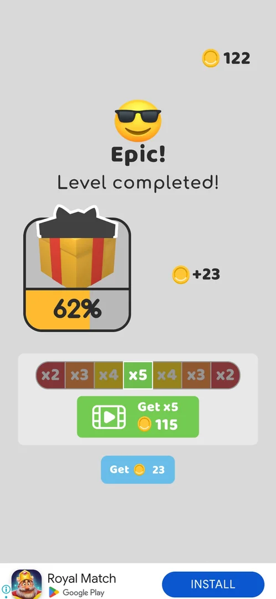
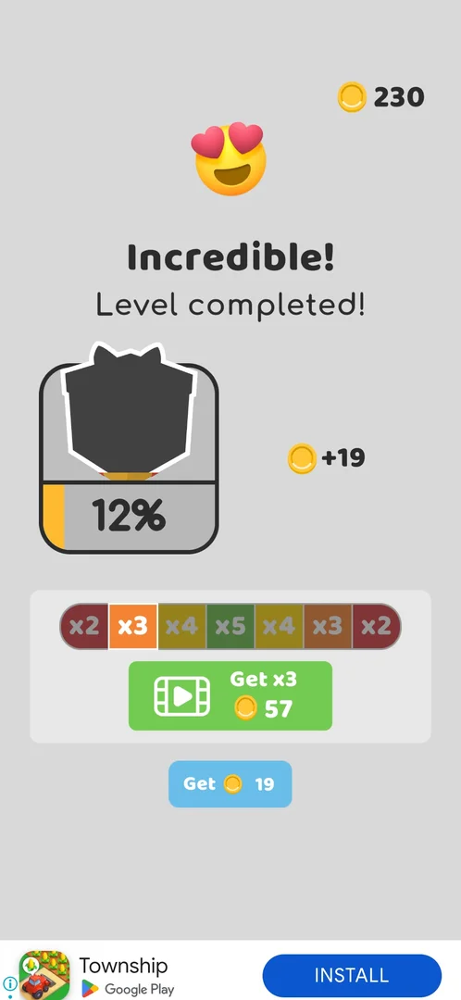
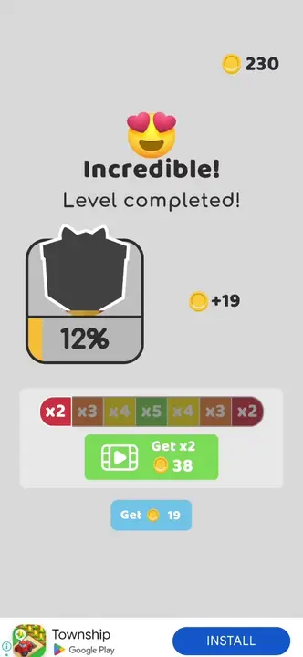
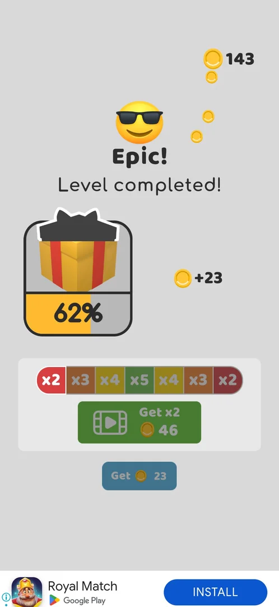

# Win coin multiplier (video)

An offer on a level's win screen: a bar of multipliers from x2 to x5 with a moving highlight, a green video
button that multiplies the level's coins by the value under the highlight, and a plain button that takes the
base coins [^s1]. It was seen on the win screens of levels 5 and 10, both Multi Stage levels; the win screens
of levels 2-4 and 6-9 had no multiplier [^s1] [^s3] [^s5].

## Why it appeared

First on the level 5 (Multi Stage) win screen [^s1]; again on the level 10 (Multi Stage) win screen [^s5].

## Where to find it

The win screen ("Level completed!") of a Multi Stage level, under the gift card and the coins earned: the
multiplier bar, the green **Get xN** button with a video icon, and the blue **Get N** button under it [^s1]
[^s5]. After level 10 it came last in the win flow: Puzzle Piece Found, then the Bronze League leaderboard,
then this screen [^s5]. There is no other entry to it.

 [^s1]
*Level 5 win screen: the green Get x5 (115) video button under the x2-x5 bar, Get 23 under it*

## What it looks like

 [^s5]
*Level 10 win screen: "Incredible! Level completed!", the gift card at 12%, +19 coins; the bar lit on x3, so the video button reads Get x3 · 57; Get 19 under it*

A grey panel under the coins earned. The bar reads x2 x3 x4 x5 x4 x3 x2; one cell is lit and the lit cell
sweeps back and forth along the bar, and the video button's label follows it: **Get x5 · 115** while x5 is
lit, **Get x2 · 46** while x2 is lit (level 5); **Get x3 · 57** while x3 is lit (level 10) [^s1] [^s2] [^s5].
The plain button always shows the base amount (**Get · 23** after level 5, **Get · 19** after level 10) [^s1]
[^s5].

 [^s6]
*Clip 4 s · [original on YouTube from 7:39](https://youtu.be/Mpfk4cqdltQ?t=459); level 10: the highlight moves, the tap locks x5, the rewarded video starts*

### Popup

 [^s6]
*Right after the tap on the video button: the screen fades; the bar is frozen on x5 and the button reads Get x5 · 95*

### Result

 [^s2]
*After Get 23 (level 5): the bar stopped on x2 (Get x2 · 46), both buttons greyed, coins fly to the balance top right*

## How it works

Version 241.5.1.

| Win of | Base (Get N) | Video at x2 | x3 | x5 |
|---|---|---|---|---|
| Level 5 | 23 | 46 | — | 115 |
| Level 10 | 19 | — | 57 | 95 |

Sources: [^s1] [^s2] [^s5] [^s6]. The amount is the base coins times the lit multiplier.

- The factor is the one lit at the moment of the tap: tapped while x5 was lit, the bar froze on x5 and the
  button read Get x5 · 95 [^s6].
- Get N credits the base coins without a video: the bar stops, both buttons grey out and the coins fly to
  the balance (122 before, 145 after on the map, level 5) [^s2].
- After level 10 the rewarded video was watched to its end, then a playable end card of the
  advertised game opened the Play Store; back in the game the end card stayed up and neither its Next label,
  Back nor a relaunch closed it [^s6] [^s8]. A force-stop and relaunch put the map back at level 10 with 230
  coins: neither the multiplied coins nor the level 10 win were kept [^s7]. See
  [Pin-pull level](core-level.md).
- Whether the multiplied coins are credited after a video that closes normally is not known.

## Cases

| Case | What was done | Result | Source |
|---|---|---|---|
| Get 23 (no video): base coins credited, multiplier skipped <!-- case:decline --> | Tapped Get 23 on the level 5 win screen | ✅ +23 coins, no video | [^s2] |
| Get N (no video) closes the win screen with the base coins <!-- case:plain-close --> | Tapped Get 23 on the level 5 win screen | ✅ The base coins, then the map | [^s2] |
| Win screen: moving x2-x5 bar, 'Get x5 (115)' video button and 'Get 23' plain button <!-- case:chk-screen --> | Won level 5 | ✅ Seen | [^s1] |
| Rewarded video on the win screen that multiplies the level's coins <!-- case:chk-kind --> | Won level 5 | ✅ A rewarded-video offer | [^s1] |
| Why it appeared <!-- case:chk-appeared --> | Won level 5 | ✅ First on the level 5 win screen | [^s1] |
| Appears on the 'Incredible! Level completed!' screen after a multi stage win, after Puzzle Piece Found and the Bronze League screen; shows +19 base coins and a gift progress (12%) <!-- case:where --> | Won level 10 | ✅ Last screen of the win flow | [^s5] |
| A highlight sweeps back and forth over x2 x3 x4 x5 x4 x3 x2; the video button label follows it (Get x3 57); the factor locks at the moment of the tap (tapped at x5: 95 coins) <!-- case:bar-pick --> | Tapped the video button while x5 was lit | ✅ Locked on x5, Get x5 · 95 | [^s6] |
| Rewarded video end card (playable) had no working close; Next, Back and launch kept it up; restart reverted the win and the reward <!-- case:stuck-ad --> | Watched the video; tried Next, Back, relaunch; then force-stopped | ✅ Stuck; the restart lost the win and the reward | [^s7] |
| After the video the multiplied coins are credited <!-- case:video-reward --> | Watched the x5 video after level 10 | not verified: the end card hung and the restart reverted the win |  |
| Where to find it <!-- case:chk-entry --> | Won levels 2-10 | not verified: only the level 5 and 10 win screens had it |  |
| How often it shows <!-- case:chk-frequency --> | Won levels 2-10 | not verified: twice in 9 wins (levels 5 and 10, both Multi Stage) |  |
| Rewarded: what watching gives <!-- case:chk-reward --> | Watched one video | not verified: the reward was never credited (stuck end card) |  |
| How it closes <!-- case:chk-close --> | Watched one video | not verified: its end card could not be closed |  |

## Not verified

- After the video the multiplied coins are credited, when the video's end card closes normally <!-- case:video-reward -->
- Where to find it: which win screens carry the offer (levels 5 and 10, both Multi Stage, so far) <!-- case:chk-entry -->
- How often it shows: every Multi Stage level, every Nth win, or another rule <!-- case:chk-frequency -->
- Rewarded: whether watching the video credits the multiplier locked at the tap <!-- case:chk-reward -->
- How it closes: the video's close control and what comes after it, when it works <!-- case:chk-close -->

[^s1]: session 20261003-203702-chrono-2FYKPJ, step 18 — [video at 5:47](https://youtu.be/cirqlD7KGWI?t=347)
[^s2]: session 20261003-203702-chrono-2FYKPJ, step 19 — [video at 6:01](https://youtu.be/cirqlD7KGWI?t=361)
[^s3]: session 20261003-203702-chrono-2FYKPJ, step 26 — [video at 8:53](https://youtu.be/cirqlD7KGWI?t=533)
[^s5]: session 20261003-211035-chrono-2FYKPJ, step 16 — [video at 6:59](https://youtu.be/Mpfk4cqdltQ?t=419)
[^s6]: session 20261003-211035-chrono-2FYKPJ, step 17 — [video at 7:42](https://youtu.be/Mpfk4cqdltQ?t=462)
[^s7]: session 20261003-211035-chrono-2FYKPJ, step 23 — [video at 11:41](https://youtu.be/Mpfk4cqdltQ?t=701)
[^s8]: session 20261003-211035-chrono-2FYKPJ, step 21 — [video at 10:14](https://youtu.be/Mpfk4cqdltQ?t=614)
