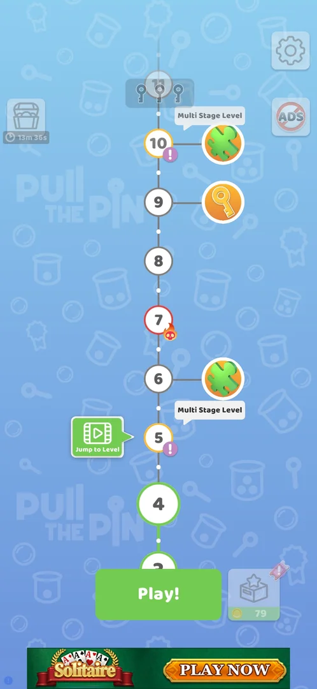
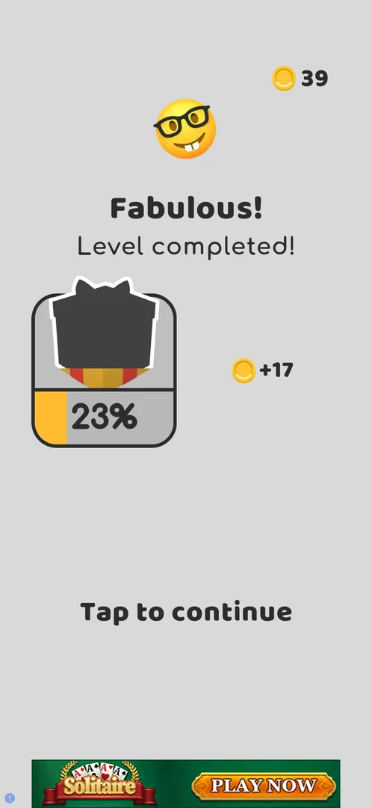
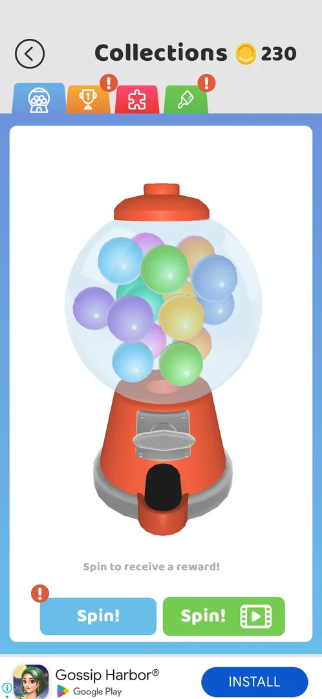
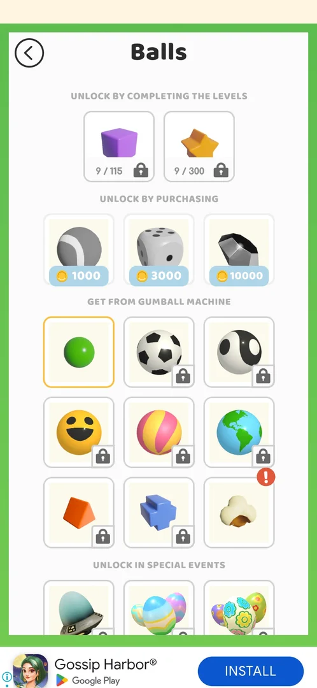
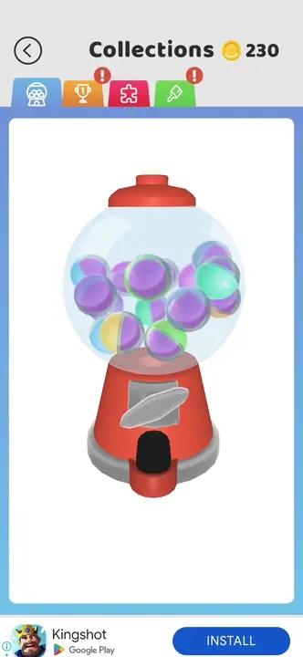

# Coins

The game's soft currency. Coins are paid for each level won (17-24 per level in levels 1-9), by Daily
Rewards and, on some win screens, multiplied by a video [^s1] [^s5]. They are spent only in Collections, on
cosmetics: gumball machine spins (350) and ball skins (1000, 3000, 10000) [^s5] [^s6]. There is no coin
shop and no offer to buy coins was seen [^s5].

## Why it appeared

First level win: +22 coins [^s1].

## Where to find it

- The win screen after each level: **+N** with a coin icon right of the gift card, and the balance with a
  coin icon top right [^s1].
- The map (shown after each win from level 3 on): the box button bottom right of **Play!** shows the coin
  balance; it opens Collections, whose header shows the balance again [^s2] [^s3].
- The level screen shows no coin balance [^s1].

 [^s2]
*The map after the level 3 win: the box button right of Play! with the coin balance 79*

 [^s1]
*The level 1 win screen: +22 right of the gift card; the balance top right still counts up (17)*

## What it looks like

Coins have no screen of their own. On a win screen a stream of coins flies from **+N** up to the balance,
which counts up while they land (17 in the level 1 frame) [^s1]. In Collections the balance sits in the
header next to the title (230 in the frame under Gumball Spin!) [^s3].

 [^s7]
*The level 2 win screen (first session): +17, balance 39*

## What you can do

| Tab or button | What it does |
|---|---|
| [Gumball Spin!](#gumball-spin) | A spin of the gumball machine for 350 coins (the first was free) |
| [Balls skins](#balls-skins) | Ball skins for 1000, 3000 or 10000 coins |

### Gumball Spin!

 [^s3]
*The gumball tab: the blue Spin! for coins (left) and the green Spin! for a video (right)*

The blue **Spin!** button on the gumball tab of Collections. The first spin cost nothing and gave the ball
skin Popcorn; the balance stayed 230 [^s6]. After it the button costs 350 coins and is greyed while the
balance is below 350; a tap with 230 does nothing: no popup, no shop offer [^s6] [^s8]. Details on the
Collections page.

### Balls skins

Collections, skins tab, **Balls**: the "Unlock by purchasing" row has three skins for 1000, 3000 and 10000
coins [^s5]. A tap on the 1000-coin skin with 230 coins does nothing (no popup) [^s5].

 [^s4]
*Balls skins: the "Unlock by purchasing" row at 1000, 3000 and 10000 coins*

## How it works

Version 241.5.1.

| Source | Coins | Balance after |
|---|---|---|
| Level 1 win (first session) | +22 | 22 (inferred: 39 − 17) |
| Level 2 win (first session) | +17 | 39 |
| Level 2 win (replayed: the first win was not saved) | +17 | 56 |
| Level 3 win | +23 | 79 |
| Daily Rewards, day 1 | +25 | 104 (inferred: 79 + 25; 102 shown mid-count) |
| Level 4 win | +18 | 122 |
| Level 5 win, Get 23 (no video) | +23 | 145 |
| Level 6 win | +18 | 163 |
| Level 7 win | +24 | 187 |
| Level 8 win | +19 | 206 |
| Level 9 win | +24 | 230 |

Sources: [^s1] [^s7] [^s3] [^s5]. The level 9 amount is inferred from the balances (206 before, 230 in
Collections).

- Sources seen: level wins (17-24 each), the x2-x5 video multiplier on the level 5 win screen (23 or up to
  115), Daily Rewards (day 1 +25; days 2-6 +50, +100, +150, +250, +500) [^s5].
- Sinks seen: the gumball spin (350, first one free) and Balls skins (1000, 3000, 10000) [^s5] [^s6]. The
  other skin categories (Themes, Trails, Walls, Pins) were not opened [^s5].
- Coins buy only cosmetics: no booster, continue or level skip for coins was seen [^s5].
- At a low balance the coin buttons are greyed; no refill or buy-coins screen appears [^s5].

 [^s6]
*Clip 3 s · [original on YouTube from 21:46](https://youtu.be/cirqlD7KGWI?t=1306); the free first spin, the balance stays 230*

## Cases

| Case | What was done | Result | Source |
|---|---|---|---|
| Sources seen: level win 17-24 coins (L2-L9), x2-x5 video multiplier on some win screens (L5: 23 or 115), Daily Rewards day 1 +25 (day 2-6: 50/100/150/250/500) <!-- case:chk-sources --> | Won levels 1-9, claimed Daily Rewards day 1 | ✅ Wins, the video multiplier, Daily Rewards | [^s5] |
| Coin sink: gumball Spin costs 350 coins (first spin was free, balance stayed 230); the coin button is greyed while balance < 350 <!-- case:sink-gumball --> | Spun the gumball machine once | ✅ Free first spin; then 350 | [^s6] |
| Not enough coins: Spin 350 with 230 does nothing (no popup, no shop offer); balance unchanged <!-- case:chk-empty --> | Tapped Spin! with 230 coins | ✅ Nothing happens | [^s8] |
| Ball skins for coins: 1000, 3000, 10000; a tap with 230 coins does nothing (no popup) <!-- case:sink-skins --> | Opened Balls skins, tapped the 1000 skin | ✅ Nothing happens | [^s5] |
| Map: box button bottom right of Play! shows the coin balance and opens Collections; also shown at the top of win screens and in the Collections header <!-- case:chk-entry --> | Tapped the box button on the map | ✅ Opens Collections | [^s5] |
| No coin shop of its own: the balance lives in the Collections header; no IAP coin packs seen <!-- case:chk-screen --> | Opened Collections | ✅ No coin shop | [^s5] |
| Balance after L9 and day-1 reward: 230; win screens animate coins into the counter <!-- case:chk-balance --> | Won to level 9 | ✅ 230 | [^s5] |
| Gumball spin 350 (first spin free), ball skins 1000/3000/10000; other skin categories not opened <!-- case:chk-sinks --> | Opened the gumball tab and Balls skins | ✅ Two sinks seen | [^s5] |
| Coins only buy cosmetics (gumball spins, skins); no booster or continue seen for coins <!-- case:chk-effect --> | Looked through Collections | ✅ Cosmetics only | [^s5] |
| No refill/buy-coins screen seen; at low balance the coin buttons are just greyed <!-- case:chk-refill --> | Tapped coin buttons with too few coins | ✅ No refill | [^s5] |
| Why it appeared <!-- case:chk-appeared --> | Won level 1 | ✅ +22 coins on the first win screen | [^s1] |

## Not verified

- The prices in the other skin categories (Themes, Trails, Walls, Pins).
- Whether a level loss or a restart costs or pays anything.

[^s1]: session 20261003-193015-chrono-2FYKPJ, step 3 — [video at 1:22](https://youtu.be/JjeHh2uiLgE?t=82)
[^s2]: session 20261003-203702-chrono-2FYKPJ, step 5 — [video at 1:43](https://youtu.be/cirqlD7KGWI?t=103)
[^s3]: session 20261003-203702-chrono-2FYKPJ, step 53 — [video at 21:25](https://youtu.be/cirqlD7KGWI?t=1285)
[^s4]: session 20261003-203702-chrono-2FYKPJ, step 60 — [video at 23:56](https://youtu.be/cirqlD7KGWI?t=1436)
[^s5]: session 20261003-203702-chrono-2FYKPJ, step 61 — [video at 24:05](https://youtu.be/cirqlD7KGWI?t=1445)
[^s6]: session 20261003-203702-chrono-2FYKPJ, step 55 — [video at 22:15](https://youtu.be/cirqlD7KGWI?t=1335)
[^s7]: session 20261003-193015-chrono-2FYKPJ, step 7 — [video at 2:25](https://youtu.be/JjeHh2uiLgE?t=145)
[^s8]: session 20261003-203702-chrono-2FYKPJ, step 56 — [video at 22:45](https://youtu.be/cirqlD7KGWI?t=1365)
