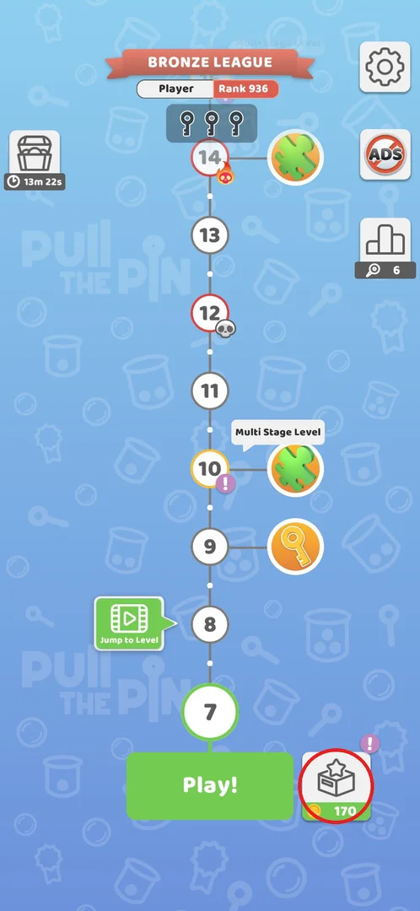
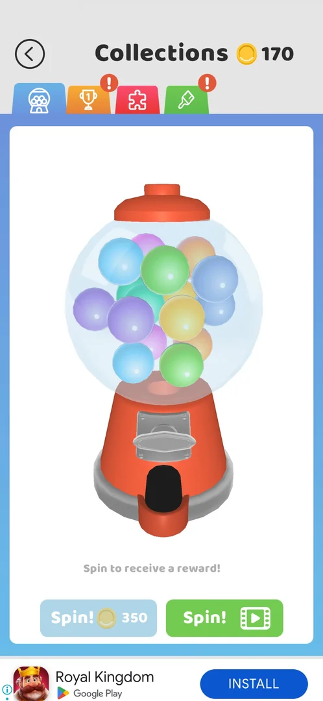
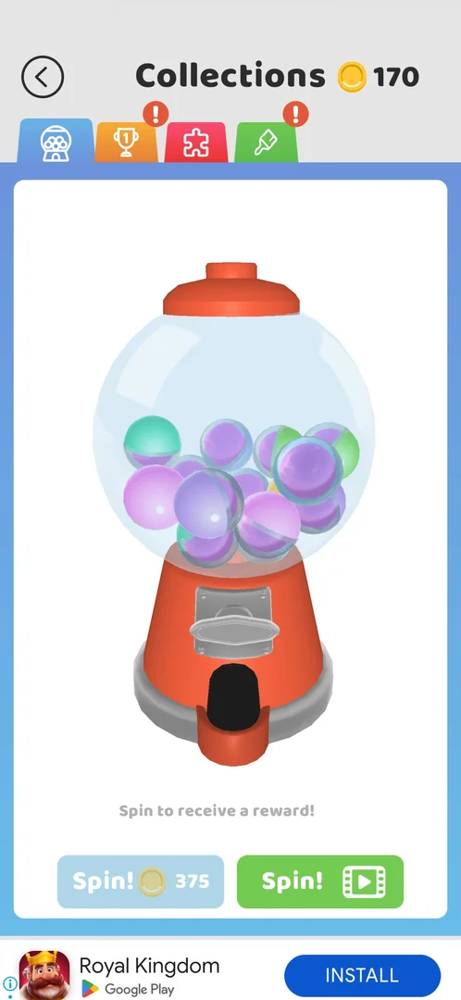
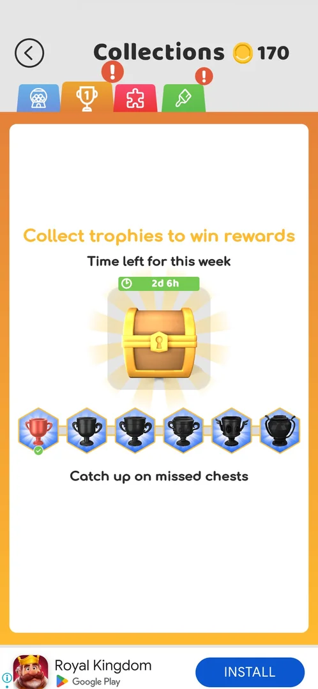

# Collections menu (gacha, trophies, puzzles, skins)

> Recheck on v241.5.1: documented on 241.3.1; Google Play has 241.5.1.

Collections is the game's hub for everything the player collects outside the levels: a gumball
machine that gives random puzzle pieces and skins, a weekly trophy chest, the puzzle albums and the
skin wardrobe. It is one screen with four tabs and the coin balance in the header [^s1] [^s2].

## Where to find it

On the level map, the box button with the coin balance right of the green **Play!** button (circled)
opens Collections [^s1] [^s2]. The map's tutorial points at it with "Check your items
collection!" [^s3]. A "Tap to continue" overlay on the map can eat the first tap: the first tap
on the box only cleared the overlay, the second opened Collections [^s4] [^s2]. A purple
**!** on the box was seen while tabs inside had red badges (the link is inferred) [^s5] [^s1].

 [^s5]

## What it looks like

A grey header with a back arrow, the title **Collections** and the coin balance; below it a row of
coloured tabs, and the selected tab's content in a white card. The gacha tab (blue) is open first.
Red **!** badges mark tabs with something new — here trophies and skins [^s1]. A banner ad sits at the
bottom [^s1]. Inside a puzzle album the back arrow at the top left returns to the album list [^s6].

 [^s1]

## What you can do

| Tab or button | What it does |
|---|---|
| [Gumball machine](#gumball-machine) | Blue tab with the machine icon: spin the machine for a random puzzle piece or skin — see [Gacha](gacha.md) |
| [Trophies](#trophies) | Orange tab with a trophy: weekly trophy track with a chest |
| [Puzzles](#puzzles) | Red tab with a puzzle piece: puzzle albums assembled from pieces — see [Puzzle collection](puzzle-collection.md) |
| [Skins](#skins) | Green tab with a brush: themes, trails, walls, pins and balls — see [Skins](skins.md) |

### Gumball machine

A gumball machine, "Spin to receive a reward!" and two buttons: **Spin!** for coins and **Spin!** for
a video [^s7]. The first spin was free and gave a puzzle piece [^s8]; after it the coin spin read
350 coins [^s9], and after the video spin it read 375 coins [^s7]. Tapping it with 62 coins did nothing, no popup or offer [^s10]. The video
spin plays a full ad (about 30 s, "Reward granted") and gave the ball skin Popcorn [^s11]. After a
puzzle piece, **Get Another** for a video gave one more piece, and was offered only once [^s12].

 [^s7]

### Trophies

"Collect trophies to win rewards", "Time left for this week 2d 6h" (at 2026-09-30 20:13), one chest
and 6 trophies with the first one checked, and a "Catch up on missed chests" line; tapping the chest
or the trophies does nothing [^s13] [^s14]. In the first session this tab was not there: Collections
had only three tabs [^s2] [^s15].

 [^s13]

### Puzzles

Four albums: Landscapes, Landmarks, Animals, Food, each shown by its full picture [^s15]. An album opens
a list of 3x3 puzzles and an album reward; Landscapes has 6 puzzles (Volcano, Desert, Forest, Beach,
House, River) [^s16] [^s17].

 [^s15]

### Skins

Five categories: Themes, Trails, Walls, Pins, Balls [^s18] [^s19]. Themes and Pins unlock through
gift boxes (15 each, one base item selected) and in special events [^s20] [^s21]; Walls
unlock with Daily Tasks (12), in special events, and one by reaching the Diamond League — none is
sold for coins [^s22].

 [^s18]

## How it works

On v241.3.1:

- Gacha: first spin free, then one rewarded video or coins per spin; the coin price read 350 after the
  free spin [^s9] and 375 after the video spin [^s7].
- Weekly trophies: the week had 2d 6h left on 2026-09-30 20:13, so it ends about 2026-10-03 02:00
  (computed) [^s14].
- Puzzles: 9 pieces per puzzle; pieces come from the gacha and, apparently, from Multi Stage levels
  [^s23].

## Cases

| Case | What was done | Result | Source |
|---|---|---|---|
| Open | Tapped the coin box on the map | Collections with four tabs, gacha open | [^s1] |
| Open under the tutorial overlay | Tapped the box with "Tap to continue" on the map | First tap only cleared the overlay | [^s4] |
| Free spin | First Spin! | A puzzle piece, coins unchanged | [^s8] |
| Coin spin without coins | Spin! for 350 with 62 coins | Nothing happens | [^s10] |
| Video spin | Spin! for a video | ~30 s ad, then the ball skin Popcorn | [^s11] |
| Trophies tab | Opened it, tapped the chest and a trophy | Weekly track shown; taps do nothing | [^s13] [^s14] |

## Not verified

- How trophies are earned, what the chest gives at the week end, and what "Catch up on missed chests" does.
- What made the trophies tab appear between the two sessions.
- When the free gacha spin comes back.
- Does the coin price grow with each spin (350 after the free spin, 375 after the video spin).

[^s1]: session 20260930-201034-chrono-2FYKPJ, step 1 — [video at 0:26](https://youtu.be/JGEX3-Rfkdw?t=26)
[^s2]: session 20260930-192115-chrono-2FYKPJ, step 29 — [video at 5:32](https://youtu.be/BVqoYRE5kRU?t=332)
[^s3]: session 20260930-192115-chrono-2FYKPJ, step 27 — [video at 5:08](https://youtu.be/BVqoYRE5kRU?t=308)
[^s4]: session 20260930-192115-chrono-2FYKPJ, step 28 — [video at 5:21](https://youtu.be/BVqoYRE5kRU?t=321)
[^s5]: session 20260930-201034-chrono-2FYKPJ, step 0 — [video at 0:00](https://youtu.be/JGEX3-Rfkdw?t=0)
[^s6]: session 20260930-192115-chrono-2FYKPJ, step 40 — [video at 8:55](https://youtu.be/BVqoYRE5kRU?t=535)
[^s7]: session 20260930-201034-chrono-2FYKPJ, step 4 — [video at 1:46](https://youtu.be/JGEX3-Rfkdw?t=106)
[^s8]: session 20260930-192115-chrono-2FYKPJ, step 30 — [video at 5:44](https://youtu.be/BVqoYRE5kRU?t=344)
[^s9]: session 20260930-192115-chrono-2FYKPJ, step 35 — [video at 8:07](https://youtu.be/BVqoYRE5kRU?t=487)
[^s10]: session 20260930-192115-chrono-2FYKPJ, step 36 — [video at 8:17](https://youtu.be/BVqoYRE5kRU?t=497)
[^s11]: session 20260930-201034-chrono-2FYKPJ, step 3 — [video at 1:24](https://youtu.be/JGEX3-Rfkdw?t=84)
[^s12]: session 20260930-192115-chrono-2FYKPJ, step 34 — [video at 7:51](https://youtu.be/BVqoYRE5kRU?t=471)
[^s13]: session 20260930-201034-chrono-2FYKPJ, step 5 — [video at 1:54](https://youtu.be/JGEX3-Rfkdw?t=114)
[^s14]: session 20260930-201034-chrono-2FYKPJ, step 7 — [video at 2:16](https://youtu.be/JGEX3-Rfkdw?t=136)
[^s15]: session 20260930-192115-chrono-2FYKPJ, step 37 — [video at 8:26](https://youtu.be/BVqoYRE5kRU?t=506)
[^s16]: session 20260930-192115-chrono-2FYKPJ, step 38 — [video at 8:35](https://youtu.be/BVqoYRE5kRU?t=515)
[^s17]: session 20260930-192115-chrono-2FYKPJ, step 39 — [video at 8:46](https://youtu.be/BVqoYRE5kRU?t=526)
[^s18]: session 20260930-201034-chrono-2FYKPJ, step 8 — [video at 2:26](https://youtu.be/JGEX3-Rfkdw?t=146)
[^s19]: session 20260930-192115-chrono-2FYKPJ, step 41 — [video at 8:59](https://youtu.be/BVqoYRE5kRU?t=539)
[^s20]: session 20260930-192115-chrono-2FYKPJ, step 42 — [video at 9:08](https://youtu.be/BVqoYRE5kRU?t=548)
[^s21]: session 20260930-201034-chrono-2FYKPJ, step 13 — [video at 3:14](https://youtu.be/JGEX3-Rfkdw?t=194)
[^s22]: session 20260930-201034-chrono-2FYKPJ, step 11 — [video at 2:53](https://youtu.be/JGEX3-Rfkdw?t=173)
[^s23]: session 20260930-192115-chrono-2FYKPJ, step 31 — [video at 6:05](https://youtu.be/BVqoYRE5kRU?t=365)
