# Collections

The game's collection screen, opened from the box button on the map. It has four icon tabs: a gumball
machine that gives ball skins, weekly trophies with a chest, puzzle albums, and skins in five categories
(Themes, Trails, Walls, Pins, Balls) [^s1] [^s3] [^s4] [^s5] [^s6]. The header shows the coin balance; coins
are spent here on gumball spins and ball skins [^s3] [^s14]. Each skin category lists how its items are
unlocked; tapping an owned skin equips it, and an equipped theme changes the look of the levels [^s9] [^s15].

## Why it appeared

On the map from its first visit after L3 (box button with the coin balance, 'Check your items collection!' tooltip) [^s1].

## Where to find it

The map: the box button bottom right, right of **Play!**, with the coin balance under it [^s2]. On the first
map visit a tutorial tooltip points at it: "Check your items collection!" [^s1]. A red ! badge on the button
marks something new inside [^s2].

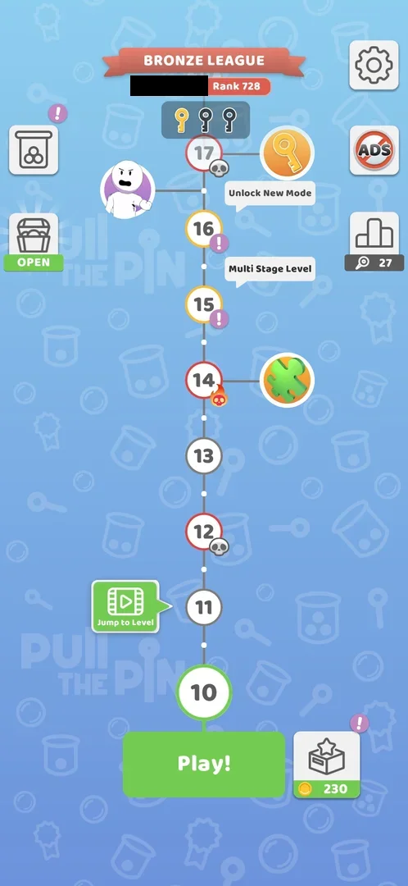 [^s2]
*Map at level 10: the box button right of Play!, balance 230, a red ! badge on it (the player's name in the league banner blacked out)*

## What it looks like

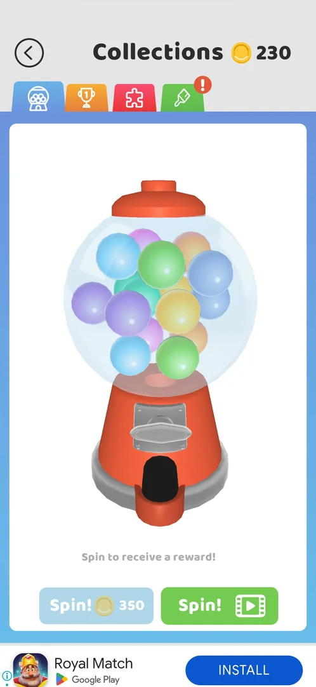 [^s3]
*Collections at 230 coins: the gumball tab open; the coin Spin! (350) greyed out, the video Spin! green*

A back arrow top left, the title **Collections** and the coin balance (230) [^s3]. Under it four icon tabs,
each with its own colour: gumball machine (blue), trophy (orange), puzzle piece (red), brush (green). The
screen opens on the gumball tab [^s3]. A red ! badge sits on a tab that holds something new: on the trophy and
brush tabs at the first visit, on the brush tab at level 10 [^s1] [^s3].

## What you can do

| Tab or button | What it does |
|---|---|
| [Gumball machine](#gumball-machine) | Spin for a ball skin: Spin! for coins (the first free, then 350) or Spin! for a video |
| [Trophies](#trophies) | Weekly trophies toward a chest |
| [Puzzles](#puzzles) | Four puzzle albums filled with pieces found in levels |
| [Landscapes album](#landscapes-album) | One album: its puzzles and its collection reward |
| [Skins](#skins) | Five skin categories |
| [Themes](#themes) | Level themes (background and cup) |
| [Theme equipped](#theme-equipped) | Tapping an owned skin equips it |
| [Trails](#trails) | Trails behind the balls |
| [More trails](#more-trails) | The lower part of the Trails list |
| [Walls](#walls) | Wall skins |
| [Pins](#pins) | Pin skins |
| [Balls](#balls) | Ball skins, including the ones bought for coins |

### Gumball machine

 [^s1]
*The gumball tab at the first visit: "Spin to receive a reward!", the blue Spin! (with a ! badge) and the green video Spin!*

A gumball machine full of coloured balls, the line "Spin to receive a reward!" and two buttons: a blue
**Spin!** and a green **Spin!** with a video icon [^s1]. The blue Spin! was free the first time: the machine
turned, a capsule dropped and the result screen "Congrats! You get a new skin!" showed the ball skin
**Popcorn** with a NEW badge and a **Collect** button [^s17]. After that the blue Spin! costs 350 coins and
does nothing with 230 [^s18] [^s19]; at level 10, with 230 coins, it is greyed out [^s3]. The video Spin!
was not tapped.

 [^s17]
*Clip 3 s · [original on YouTube from 21:46](https://youtu.be/cirqlD7KGWI?t=1306); the free first spin*

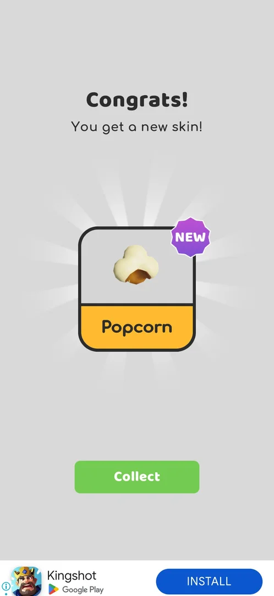 [^s17]
*The spin's result: "Congrats! You get a new skin!", the ball skin Popcorn (NEW), Collect*

### Trophies

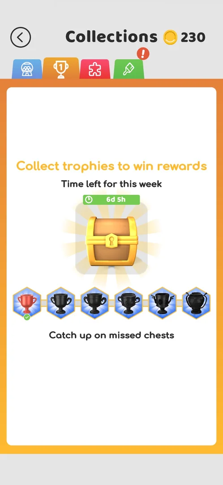 [^s4]
*The trophies tab: a chest with the week's timer (6d 5h), six trophies, the first ticked*

"Collect trophies to win rewards", "Time left for this week" with a 6d 5h timer, a golden chest, a row of
six trophies (the first, red, ticked; five dark) and "Catch up on missed chests" [^s4]. The tab looked the
same at the first visit and at level 10: one trophy reached, 6d 5h left [^s1] [^s4]. Inferred: the six
trophies match the six Pull Fest league cups, and the first was ticked after the Pull Fest Bronze League
began; not verified.

### Puzzles

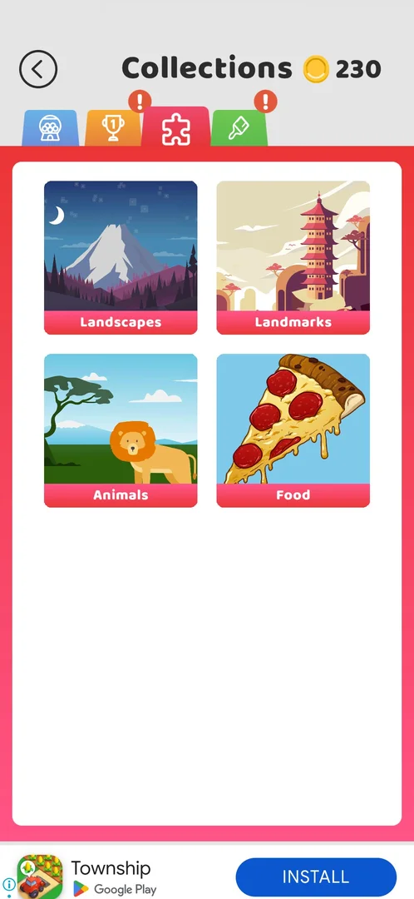 [^s5]
*The puzzles tab: four albums, Landscapes, Landmarks, Animals, Food*

Four album cards: **Landscapes**, **Landmarks**, **Animals**, **Food** [^s5]. Tapping a card opens the album.
The pieces come from the puzzle-piece levels on the map: see [Puzzle piece collection](puzzle-pieces.md).

### Landscapes album

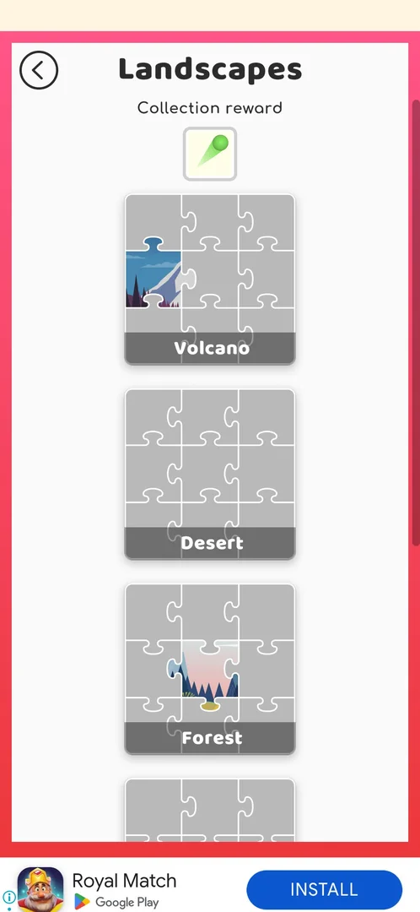 [^s7]
*The Landscapes album: the collection reward (a green trail) at the top, then the 9-piece puzzles Volcano, Desert, Forest*

At the top "Collection reward" with a green trail skin; under it the album's puzzles, each a picture cut into
9 pieces with its name: Volcano, Desert, Forest, Beach, House, River (six) [^s7] [^s20]. At level 10 two
pieces were owned: one in Volcano (part of a mountain), one in Forest [^s7]. The green trail is the second
trail in the "Unlock by collecting puzzles" group of [Trails](#trails) [^s10]. Inferred: the reward is given
when all the album's puzzles are complete; not reached.

### Skins

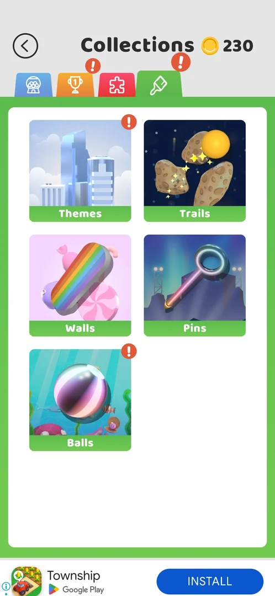 [^s6]
*The skins tab: Themes (!), Trails, Walls, Pins, Balls (!)*

Five category cards: **Themes** (! badge), **Trails**, **Walls**, **Pins**, **Balls** (! badge) [^s6]. Each
opens a list of skins in groups; the group title says how its skins are unlocked. A locked skin carries a
padlock; the equipped one has a yellow frame [^s8] [^s14].

### Themes

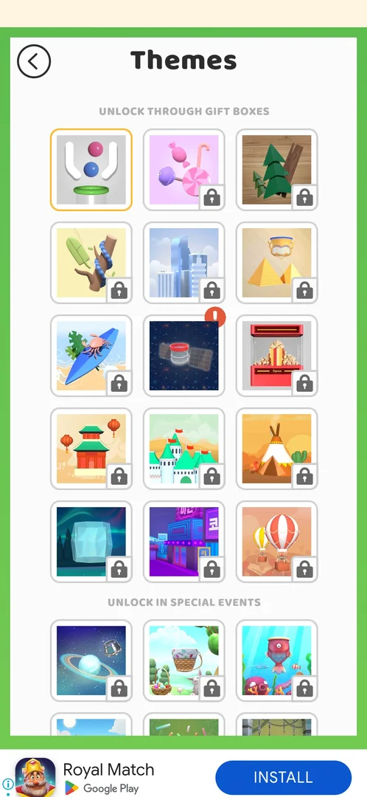 [^s8]
*Themes: 15 under "Unlock through gift boxes", then "Unlock in special events", all locked but the default and Space*

"Unlock through gift boxes": 15 themes; the default (white) was equipped, the Space theme (a satellite on a
starry sky) was owned and marked new with a ! badge, the other 13 locked. Below, "Unlock in special
events": more themes, all locked [^s8]. Space was the gift of the [Gift unlock progress bar](unlock-progress.md)
at level 9.

### Theme equipped

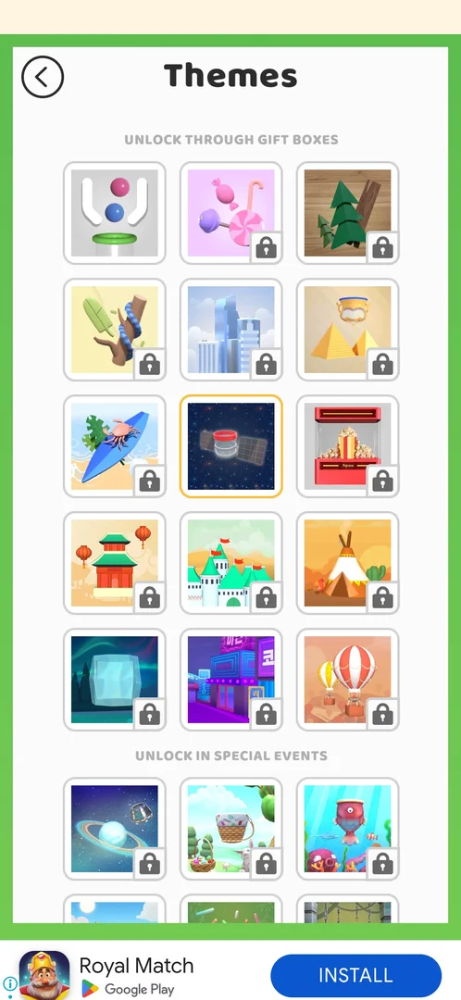 [^s9]
*Themes after a tap on Space: the yellow frame moved from the default to Space; no confirmation*

A tap on the owned Space theme equipped it at once: the yellow frame moved to it, with no confirmation and
no cost [^s9]. In the next level the background was a starry sky with asteroids and the cup a satellite with
solar panels [^s15].

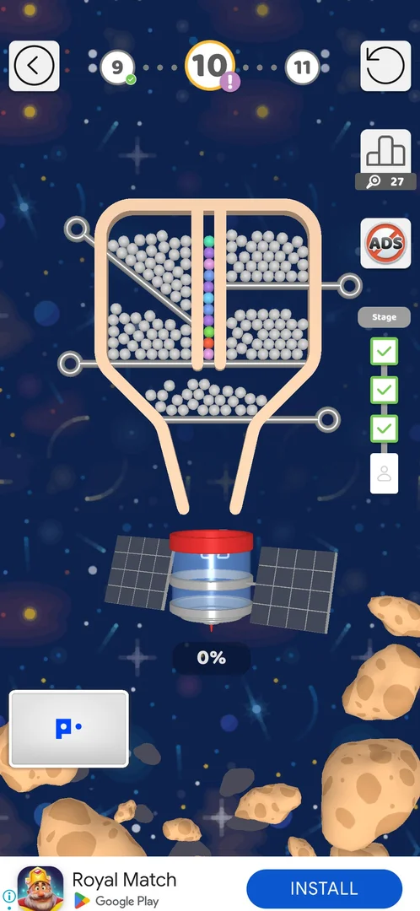 [^s15]
*Level 10 after the Space theme was equipped: the background and the cup changed*

### Trails

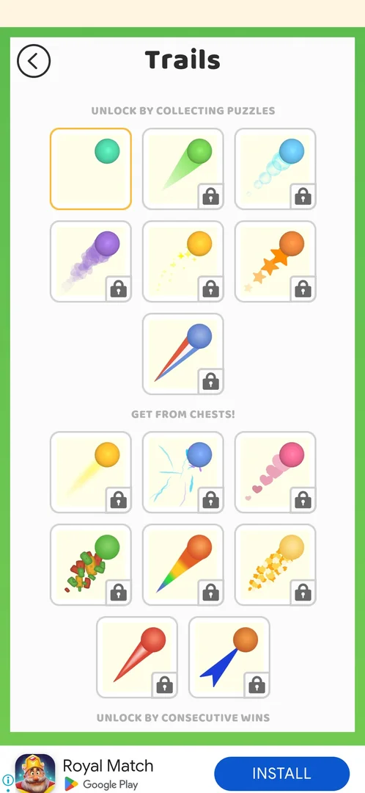 [^s10]
*Trails: "Unlock by collecting puzzles" (7, the default owned), "Get from chests!" (8), then "Unlock by consecutive wins"*

"Unlock by collecting puzzles": 7 trails, the default (no trail) owned and equipped, 6 locked; "Get from
chests!": 8 trails, all locked; then the group "Unlock by consecutive wins" starts [^s10].

### More trails

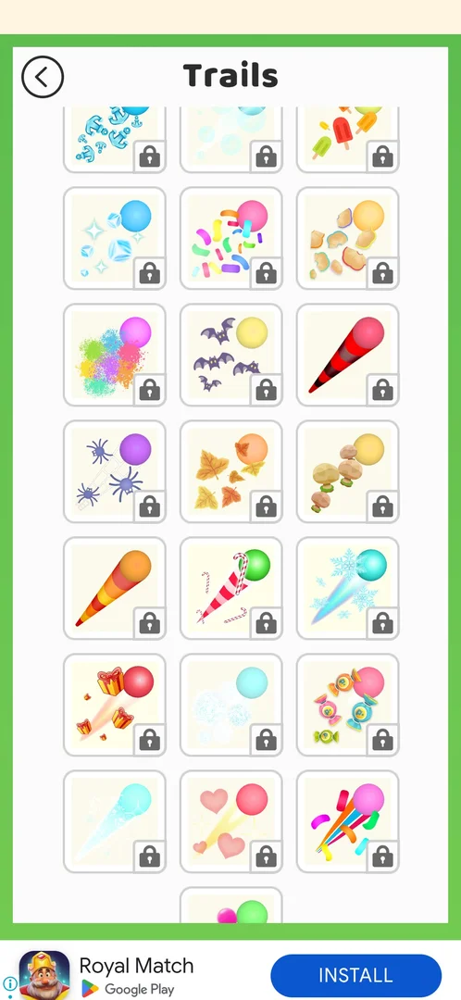 [^s11]
*Further down the Trails list: about 25 more trails (anchors, bats, spiders, leaves, candy canes, snowflakes, gifts, hearts), all locked*

The list goes on with about 25 more trails, all locked (among them bats, spiders, autumn leaves, candy canes,
snowflakes, gifts, hearts) [^s11]. The frame does not show which group each belongs to; inferred: the
seasonal ones are event trails.

### Walls

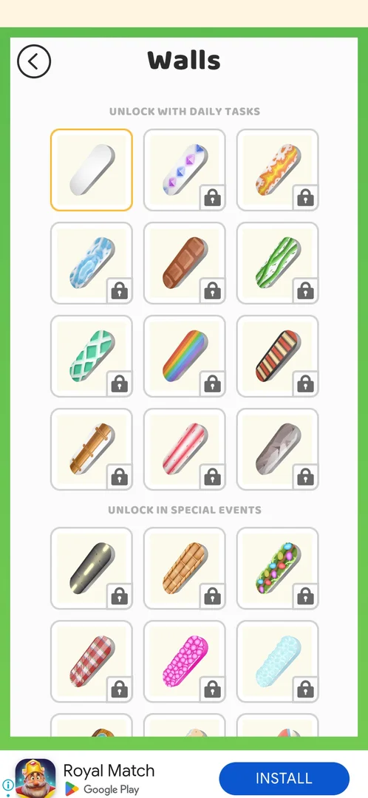 [^s12]
*Walls: 12 under "Unlock with daily tasks", the default owned; then "Unlock in special events"*

"Unlock with daily tasks": 12 walls, the default owned, 11 locked; then "Unlock in special events", locked
[^s12]. No daily tasks screen was found in the game so far.

### Pins

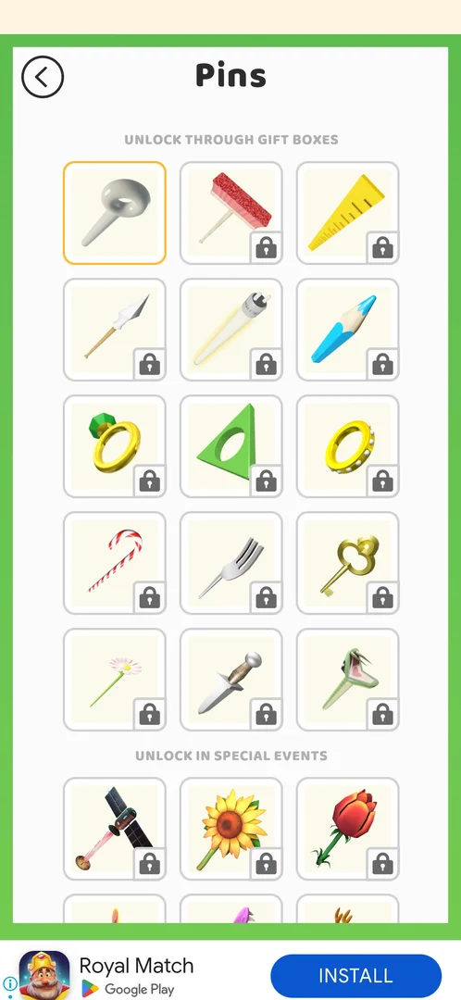 [^s13]
*Pins: 15 under "Unlock through gift boxes", the default owned; then "Unlock in special events"*

"Unlock through gift boxes": 15 pins, the default owned, 14 locked; then "Unlock in special events", locked
[^s13].

### Balls

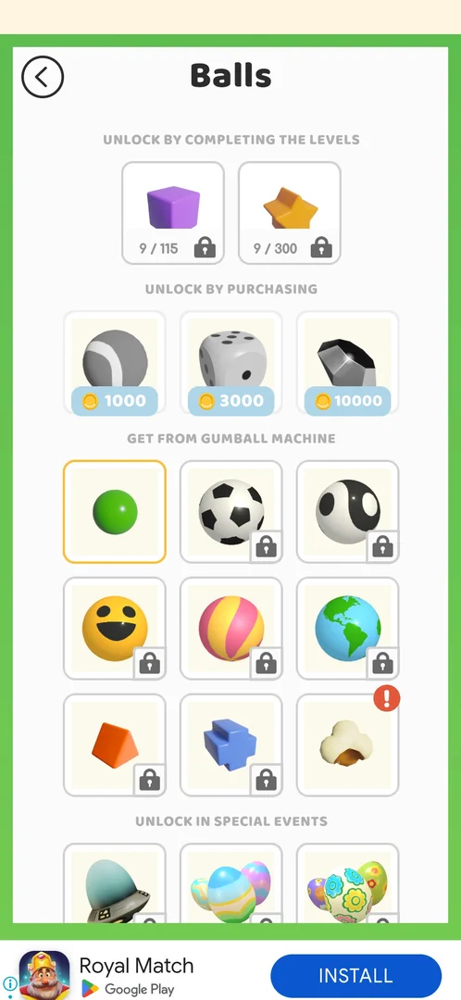 [^s14]
*Balls: by levels (9/115, 9/300), for coins (1000, 3000, 10000), from the gumball machine (9), in special events*

Four groups [^s14]:

- "Unlock by completing the levels": a cube at 9/115 and a star at 9/300 levels completed;
- "Unlock by purchasing": three balls for 1000, 3000 and 10000 coins;
- "Get from gumball machine": 9 balls; the green default equipped, Popcorn owned with a ! badge, 7 locked;
- "Unlock in special events": more balls, locked.

## How it works

Version 241.5.1.

| Item | How it is earned | Source |
|---|---|---|
| Gumball spin | First free, then 350 coins, or a video | [^s17] [^s18] [^s3] |
| Themes (15) | Gift boxes; more in special events | [^s8] |
| Trails (7) | Collecting puzzles (the Landscapes album gives the green one) | [^s10] [^s7] |
| Trails (8) | Chests | [^s10] |
| Trails, further groups | Consecutive wins; others not labelled in the frame | [^s10] [^s11] |
| Walls (12) | Daily tasks; more in special events | [^s12] |
| Pins (15) | Gift boxes; more in special events | [^s13] |
| Balls (2) | 115 and 300 levels completed (9 done at level 10) | [^s14] |
| Balls (3) | 1000, 3000, 10000 coins | [^s14] |
| Balls (9) | Gumball spins | [^s14] |
| Balls, events group | Special events | [^s14] |
| Trophies | Not seen; weekly chest, 6d 5h left | [^s4] |
| Puzzle pieces | Puzzle-piece levels on the map; 9 per puzzle | [^s7] |

Owned at level 10: the default of each category, the Space theme and the Popcorn ball [^s16]. Equipping is
free and instant [^s9].

## Cases

| Case | What was done | Result | Source |
|---|---|---|---|
| Why it appeared <!-- case:chk-appeared --> | Won level 3, the map appeared | ✅ The box button and its tooltip on the first map | [^s1] |
| Map: box button bottom right (shows coin balance, ! badge when something new) <!-- case:chk-entry --> | Tapped the box button on the map | ✅ It opens Collections | [^s2] |
| Collections screen with coin balance and 4 tabs: gumball machine, trophies, puzzles, skins <!-- case:chk-screen --> | Opened all four tabs | ✅ The frames above | [^s3] |
| Progress: trophies 1 of 6 (6d 5h left), Landscapes 2 pieces, ball skins 9/115 and 9/300 levels <!-- case:chk-progress --> | Opened Trophies, the Landscapes album and Balls | ✅ As listed | [^s16] |
| Items: Themes 15 gift-box + event, Trails 7 puzzle + 8 chest + consecutive wins + more, Walls 12 daily-task + event, Pins 15 gift-box + event, Balls 2 level-count + 3 coin + 9 gumball + event <!-- case:chk-items --> | Opened all five skin categories | ✅ Owned at level 10: the defaults, Space theme, Popcorn ball | [^s16] |
| How items are earned, by group title: gift boxes, puzzles, chests, consecutive wins, daily tasks, gumball spin (350 coins or video), coins, levels completed, special events <!-- case:chk-earn --> | Read every group title; one free gumball spin earlier | ✅ Only the gumball spin and the gift bar were seen giving an item | [^s16] |
| Using an item: tapping an owned skin equips it at once <!-- case:chk-use --> | Tapped the owned Space theme, then played level 10 | ✅ Equipped with no confirmation; the level showed the Space background and cup | [^s9] |
| Completing a set <!-- case:chk-complete --> | Opened the Landscapes album | not verified: the album's listed reward is the green trail; no album or trophy row completed | [^s7] [^s16] |

## Not verified

- Completing a set: what an album gives when it is complete, and the weekly trophy chest's contents <!-- case:chk-complete -->:
  no album or trophy row was completed by level 10 [^s16].

  > ⚠️ **Previously** (corrected 2026-10-06): the Cases table showed this case as verified (✅ "Its reward is
  > the green trail; no album or trophy row completed"). The green trail is only the reward the Landscapes
  > album lists [^s7]; no set was completed, so what completing one gives was not seen.
- The video Spin! and what a paid spin can give (task exp-gumball-spin).
- Where the daily tasks that unlock walls are (task exp-daily-tasks).
- A tap on a locked skin: the session's case record says it does nothing, but no such tap is in its steps.
- Which group the lower trails belong to (consecutive wins or special events).

[^s1]: session 20261003-203702-chrono-2FYKPJ, step 53 — [video at 21:25](https://youtu.be/cirqlD7KGWI?t=1285)
[^s2]: session 20261003-214021-chrono-2FYKPJ, step 0 — [video at 0:00](https://youtu.be/siJO2QCuGxI?t=0)
[^s3]: session 20261003-214021-chrono-2FYKPJ, step 1 — [video at 0:31](https://youtu.be/siJO2QCuGxI?t=31)
[^s4]: session 20261003-214021-chrono-2FYKPJ, step 2 — [video at 0:43](https://youtu.be/siJO2QCuGxI?t=43)
[^s5]: session 20261003-214021-chrono-2FYKPJ, step 3 — [video at 0:54](https://youtu.be/siJO2QCuGxI?t=54)
[^s6]: session 20261003-214021-chrono-2FYKPJ, step 7 — [video at 1:34](https://youtu.be/siJO2QCuGxI?t=94)
[^s7]: session 20261003-214021-chrono-2FYKPJ, step 4 — [video at 1:05](https://youtu.be/siJO2QCuGxI?t=65)
[^s8]: session 20261003-214021-chrono-2FYKPJ, step 8 — [video at 1:47](https://youtu.be/siJO2QCuGxI?t=107)
[^s9]: session 20261003-214021-chrono-2FYKPJ, step 9 — [video at 2:02](https://youtu.be/siJO2QCuGxI?t=122)
[^s10]: session 20261003-214021-chrono-2FYKPJ, step 11 — [video at 2:25](https://youtu.be/siJO2QCuGxI?t=145)
[^s11]: session 20261003-214021-chrono-2FYKPJ, step 12 — [video at 2:46](https://youtu.be/siJO2QCuGxI?t=166)
[^s12]: session 20261003-214021-chrono-2FYKPJ, step 14 — [video at 3:04](https://youtu.be/siJO2QCuGxI?t=184)
[^s13]: session 20261003-214021-chrono-2FYKPJ, step 16 — [video at 3:30](https://youtu.be/siJO2QCuGxI?t=210)
[^s14]: session 20261003-214021-chrono-2FYKPJ, step 18 — [video at 3:54](https://youtu.be/siJO2QCuGxI?t=234)
[^s15]: session 20261003-214021-chrono-2FYKPJ, step 21 — [video at 4:51](https://youtu.be/siJO2QCuGxI?t=291)
[^s16]: session 20261003-214021-chrono-2FYKPJ, step 20 — [video at 4:21](https://youtu.be/siJO2QCuGxI?t=261)
[^s17]: session 20261003-203702-chrono-2FYKPJ, step 54 — [video at 21:49](https://youtu.be/cirqlD7KGWI?t=1309)
[^s18]: session 20261003-203702-chrono-2FYKPJ, step 55 — [video at 22:15](https://youtu.be/cirqlD7KGWI?t=1335)
[^s19]: session 20261003-203702-chrono-2FYKPJ, step 56 — [video at 22:45](https://youtu.be/cirqlD7KGWI?t=1365)
[^s20]: session 20261003-214021-chrono-2FYKPJ, step 5 — [video at 1:16](https://youtu.be/siJO2QCuGxI?t=76)
