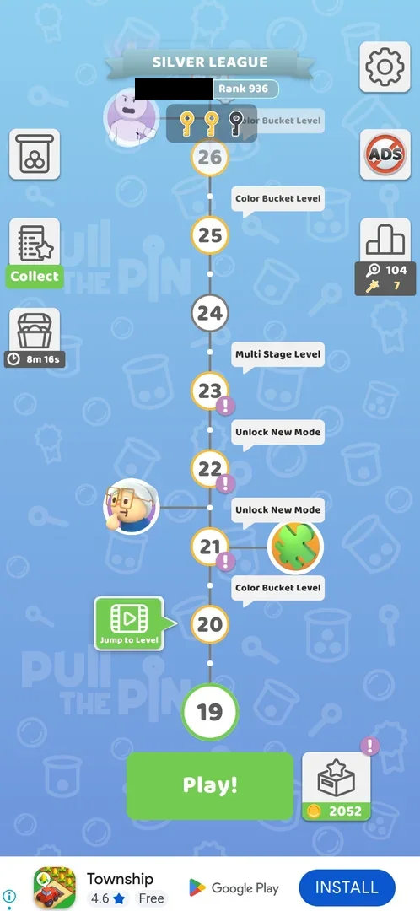
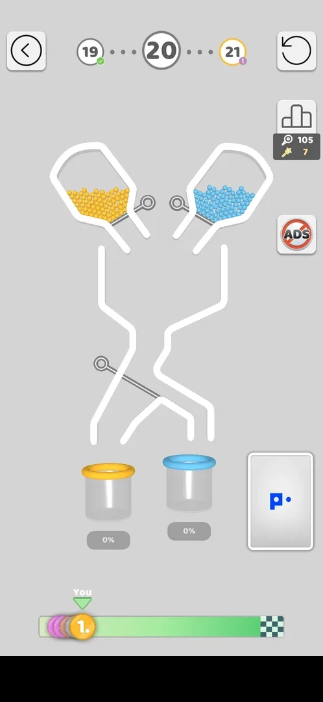
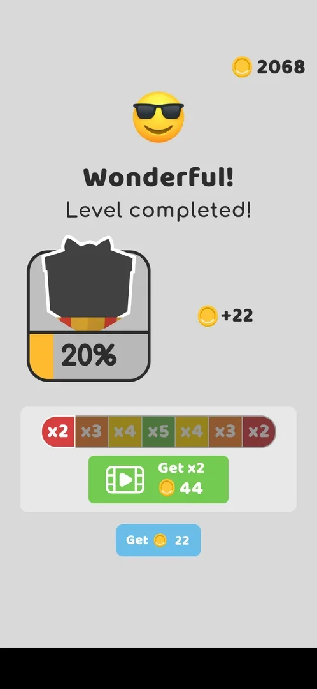
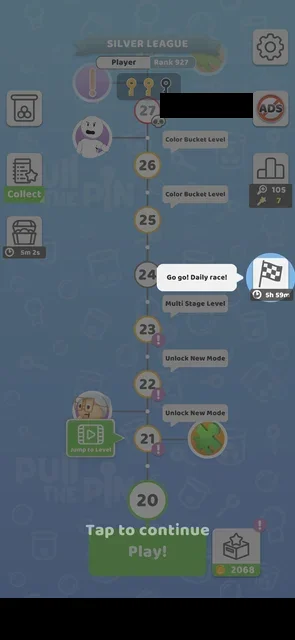

# Color Bucket Level

A pin-pull level with several cups, one per colour: each colour of balls has to end in the cup of its own
colour, and each cup has its own fill percentage [^s1]. Balls that reach a
cup of another colour turn grey, and grey balls cannot be collected: the level is lost
[^s2]. Level 20 is the first one, with a yellow and a blue cup; it was lost
once, stalled once at 98% and won on the third try, and the win is the same as an ordinary level's
[^s3] [^s4].

## Why it appeared

Announced on the level map by a "Color Bucket Level" bubble, already shown at progress 11-13
[^s5]; first played at level 20 [^s1].

## Where to find it

The map: a "Color Bucket Level" speech bubble sits just above the level's node; it is played with **Play!**
like any level [^s6] [^s1]. With level 19
current, bubbles stood above levels 20, 25 and 26; once level 20 was current its bubble was gone and the two
others stayed [^s6] [^s7]. After the level 20
win, with level 21 current, the bubbles above 25 and 26 were still there and one more, faded, showed at the top
of the visible map, about level 29-30 [^s8]. Inferred from the bubbles: levels
25, 26 and one near 29-30 are Color Bucket levels too; not verified by playing them.

 [^s6]
*The map at level 19: the "Color Bucket Level" bubble above level 20, the next one (Play! opens it) (the player's name blacked out)*

## What it looks like

 [^s1]
*Level 20: two hoppers, crossing channels, a yellow and a blue cup each with its own percentage (a local banner ad blacked out)*

Level 20 as it opens: two hoppers at the top, yellow balls on the left and blue on the right, each closed by a
slanted pin; under them two channels that cross, with a diagonal pin across the middle; at the bottom a cup
with a yellow rim and a cup with a blue rim, each with **0%** under it. The top bar, the restart button, the
league and ADS buttons are those of an ordinary level; the race bar ran under the board because a
[Level race](race.md) was on [^s1].

## How it works

Version 241.5.2, level 20.

- Each cup counts only its own colour: in the first try the blue cup reached 93% while the yellow cup stayed
  at 0% with grey specks falling over it [^s9].
- The pull order blue pin, middle pin, yellow pin mixed the colours and lost the level in the first try; the fail screen's tip says grey balls cannot be collected and coloured balls spread
  the paint [^s2].
- With the yellow pin pulled 0.5 s after the middle pin, the blue cup filled and the yellow cup stopped at
  98%; after 15 s neither a win nor a fail screen had come, and the level was left by the back arrow
  [^s3] [^s10].
- The same order with time between the pulls won at the first try, in 55 s: the blue pin, a wait of 6 s until
  all the blue balls had passed the middle pin into the blue cup, the middle pin, then the yellow pin 6 s
  later; the win flow started within 5 s of the last pull [^s11]. Inferred: on
  this board the order alone is not enough, the yellow balls must not arrive while the middle pin is still
  leaving; a cup stopped short of 100% gives no end screen.

*Level 20: the middle and yellow pins are pulled, balls reach the wrong cup and fall grey over the yellow cup, the blue cup at 93%* (clip dropped: per-dream clip limit) [^s9]
*Clip 6.8 s · [original on YouTube from 13:10](https://youtu.be/PZ3ujKA8euo?t=790); the colours mix and the yellow cup gets nothing (a local banner ad blacked out)*

 [^s2]
*The fail screen of the colour mix: So Close! Level failed!, the grey-balls tip, Skip for a video and Retry (a local banner ad blacked out)*

## Outcomes

| Outcome | As the base or what differs | Frame |
|---|---|---|
| win <!-- case:under-win --> | As the base: the league board first (Silver League, pins 123, golden pins 7, total score 158, rank 776, +5 golden pins by video or Next Level!), then "Wonderful! Level completed!" with the win-streak dial, then the coin screen: +22 coins, the post-win gift meter at 20%, the x2-x5 bar with Get x2 44 (video) and Get 22; Get 22 led to the map at level 21 with 2090 coins [^s11] [^s4] [^s8] |  |
| restart <!-- case:under-restart --> | not verified: the restart button was not used | — |
| quit <!-- case:under-quit --> | As the base: the back arrow returned to the map at once, no cost [^s12] |  |
| exit app <!-- case:under-exit-app --> | not verified | — |
| balls fell out <!-- case:under-balls-out --> | not verified: no ball left the board | — |
| colours mixed <!-- case:under-colour-mix --> | Its own loss: balls in a cup of another colour turn grey; "So Close! Level failed!" with the tip on grey balls, Skip (video) and Retry; with a win streak running, "Watch your streak!" comes first [^s2] |  |

 [^s4]
*The last screen of the level 20 win: the same coin screen as an ordinary level, +22 coins (a local banner ad blacked out)*

## Cases

| Case | What was done | Result | Source |
|---|---|---|---|
| Why it appeared <!-- case:chk-appeared --> | Looked at the map | ✅ A "Color Bucket Level" bubble, seen from progress 11-13 | [^s5] |
| Map: the level 20 node with the 'Color Bucket Level' bubble; Play! opens it <!-- case:chk-entry --> | Played level 20 from Play! | ✅ No own entry | [^s7] |
| A 'Color Bucket Level' bubble beside the node on the map <!-- case:chk-announce --> | Looked at the map at level 19 | ✅ Bubbles above levels 20, 25 and 26 | [^s6] |
| Two hoppers, crossing channels with a middle pin, two coloured cups with their own fill % <!-- case:chk-screen --> | Opened level 20 | ✅ Seen | [^s1] |
| Several cups, one per colour, each with its own %; balls in the wrong cup fail the level <!-- case:chk-differs --> | Played level 20 | ✅ The colour mix lost the level | [^s2] |
| Its win <!-- case:chk-win --> | Won level 20 at the third try | ✅ As the base: league board, "Wonderful! Level completed!" with the streak dial, +22 coins with the gift meter (20%) and the x2-x5 bar (Get x2 44 / Get 22); Get led to the map at level 21 | [^s4] |
| The loss <!-- case:chk-loss --> | Lost level 20 | ✅ The fail screen as the base, with the grey-balls tip; Watch your streak! first; no coin cost | [^s2] |
| Retry <!-- case:chk-retry --> | Tapped Retry | ✅ Free; an interstitial played (a tap on it opened the Play Store), then level 20 from the start; Skip by video not tried | [^s13] |
| Timing of the pulls on level 20 <!-- case:timing --> | Pulled blue, middle, yellow with 6 s between the pulls | ✅ Won at the first try in 55 s; the same order with the yellow pin 0.5 s after the middle one had stalled at 98% yellow with no end screen | [^s11] |
| Later Color Bucket levels on the map <!-- case:later-levels --> | Looked at the map at level 21 | ✅ Bubbles above levels 25 and 26 and a faded one near the top of the visible map (about level 29-30); not played | [^s8] |
| Where and how often it comes up <!-- case:chk-frequency --> | Looked at the map at levels 19 and 21 | ✅ Not at a regular interval: level 20, then bubbles above 25 and 26 and one near 29-30; to be confirmed on reaching level 25 | [^s8] |

## Not verified

- Whether levels 25, 26 and the one near 29-30 are played as Color Bucket levels (known from the map bubbles only), and how many cups and colours they have
- Restart under Color Bucket Level <!-- case:under-restart -->
- Exit the app under Color Bucket Level <!-- case:under-exit-app -->
- Balls fell out under Color Bucket Level <!-- case:under-balls-out -->
- What happens when a cup stops short of 100% with no ball left to fall (the 98% stall): no screen within 15 s, longer not tried

[^s1]: session 20261005-235042-chrono-2FYKPJ, step 35 — [video at 13:02](https://youtu.be/PZ3ujKA8euo?t=782)
[^s2]: session 20261005-235042-chrono-2FYKPJ, step 39 — [video at 14:06](https://youtu.be/PZ3ujKA8euo?t=846)
[^s3]: session 20261005-235042-chrono-2FYKPJ, step 45 — [video at 16:29](https://youtu.be/PZ3ujKA8euo?t=989)
[^s4]: session 20261006-012240-chrono-2FYKPJ, step 17 — [video at 9:48](https://youtu.be/jf_j5LiHuRs?t=588)
[^s5]: session 20261005-013818-chrono-2FYKPJ, step 1 — [video at 0:29](https://youtu.be/q_WyVbvA1og?t=29)
[^s6]: session 20261005-235042-chrono-2FYKPJ, step 23 — [video at 7:46](https://youtu.be/PZ3ujKA8euo?t=466)
[^s7]: session 20261005-235042-chrono-2FYKPJ, step 30 — [video at 11:21](https://youtu.be/PZ3ujKA8euo?t=681)
[^s8]: session 20261006-012240-chrono-2FYKPJ, step 18 — [video at 10:17](https://youtu.be/jf_j5LiHuRs?t=617)
[^s9]: session 20261005-235042-chrono-2FYKPJ, step 37 — [video at 13:38](https://youtu.be/PZ3ujKA8euo?t=818)
[^s10]: session 20261005-235042-chrono-2FYKPJ, step 46 — [video at 17:42](https://youtu.be/PZ3ujKA8euo?t=1062)
[^s11]: session 20261006-012240-chrono-2FYKPJ, step 16 — [video at 9:16](https://youtu.be/jf_j5LiHuRs?t=556)
[^s12]: session 20261005-235042-chrono-2FYKPJ, step 33 — [video at 12:35](https://youtu.be/PZ3ujKA8euo?t=755)
[^s13]: session 20261005-235042-chrono-2FYKPJ, step 42 — [video at 15:36](https://youtu.be/PZ3ujKA8euo?t=936)
