# Pin-pull level

The core level of Pull the Pin: a container holds balls on pins; the player pulls the pins out, and the balls
fall through a funnel into a cup under it. The cup's fill percentage is shown under it; the level is won when
the balls reach the cup [^s1] [^s4]. Levels 1-3 are played back to back with no menu; from then on each level
is started from the map with **Play!**, and the level screen has a back arrow to the map, the level path, a
restart button and side buttons [^s1] [^s6].

## Why it appeared

First launch, after the intro comic: level 1 opens with a tutorial hand [^s1].

## Where to find it

On a fresh install the game asks for notification permission (an Android dialog), then plays a 5-panel
intro comic. Tapping **Tap to Skip** under the picture opens level 1 directly; no main menu comes before
it [^s1]. After each win, **Tap to continue** on the win screen opens the next level [^s2]; after level 3 it
leads to the map, where **Play!** opens the current level (see [Level path](level-path.md)) [^s12].

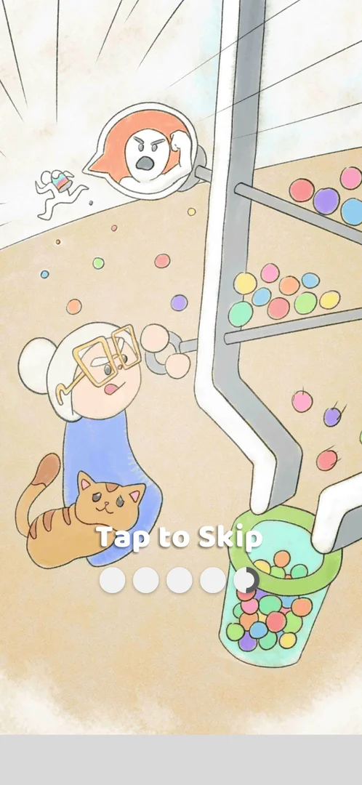 [^s1]
*The last panel of the intro comic: Tap to Skip under the picture, five progress dots under it*

## What it looks like

 [^s6]
*Level 10, stage 4 of 4: back arrow top left, level path in the middle, restart top right; league button, ADS and the Stage column on the right*

What matters on the screen at level 10, from top to bottom [^s6] [^s11]:

- top: the back arrow (to the map) top left, the level path in the middle (the previous level ticked, the
  current one large with a ! badge, the next), the restart button top right;
- on the right: the league button with the pin count (27; see [Pull Fest Ranking](pull-fest.md)), the crossed-out
  ADS button ([Remove Ads](no-ads.md)) and, on a Multi Stage level, the **Stage** column with a box per stage
  (ticked when done; see [Multi Stage level](multi-stage.md));
- the container: balls resting on pins, each pin with a ring handle sticking out;
- a funnel at the bottom of the container, the cup under it and its fill percentage (0% at the start); the
  cup and the background follow the equipped theme (here Space: a satellite on a starry sky; see
  [Collections](collections.md#theme-equipped));
- a native ad tile bottom left and a banner ad along the bottom edge ([Banner ad](banner-ad.md)).

In levels 1-2 the top left held the gear (Settings) instead of the back arrow, and there was no league
button or ad tile yet [^s1] [^s3].

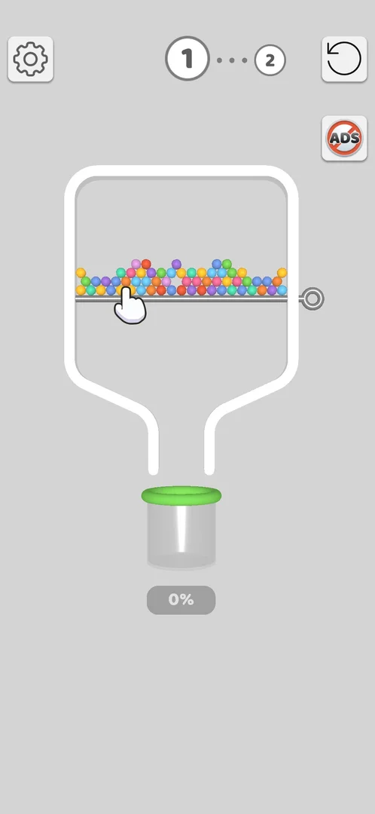 [^s1]
*Level 1 with the tutorial hand on the pin; gear top left, level path in the middle, restart top right, ADS under it*

## What you can do

| Tab or button | What it does |
|---|---|
| [Pin](#pin) | Pulling a pin out drops the balls on it |
| [Restart](#restart) | Asks to confirm, then plays an ad and reloads the current stage |
| [Back arrow](#back-arrow) | Returns to the map at once |
| [Settings](settings.md) | The gear opens Settings: top left of the level in levels 1-2, top right of the map at level 10 |
| [Remove Ads](no-ads.md) | The ADS button under restart |
| [Level failed](#level-failed) | The fail screen: Skip (video) or Retry |

### Pin

In level 1 the only pin holds all the balls; one tap pulls it and the balls pour into the cup while the
percentage under it climbs (43%, 95%, 98% in the clip) [^s4].

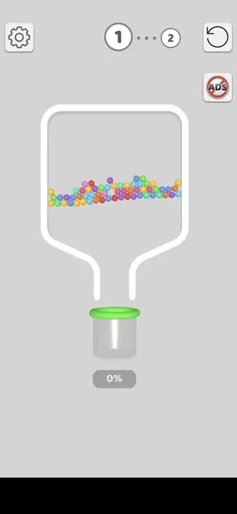 [^s4]
*Clip 3 s · [original on YouTube from 1:20](https://youtu.be/JjeHh2uiLgE?t=80)*

In level 2 two pins split the container: coloured balls on the top pin, grey balls on the lower one. The
top pin was pulled first, then the lower one [^s2]. After the top pin, the lower layer shows only
coloured balls, and the cup fills with coloured balls; inferred: a grey ball takes on colour when a
coloured ball touches it [^s2].

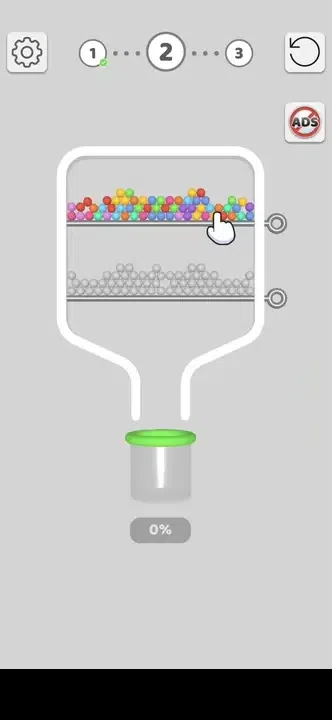 [^s2]
*Clip 10.9 s · [original on YouTube from 2:14](https://youtu.be/JjeHh2uiLgE?t=134)*

### Restart

 [^s3]
*The restart button top right of the level screen, above the ADS button*

The restart button opens a popup [^s7]:

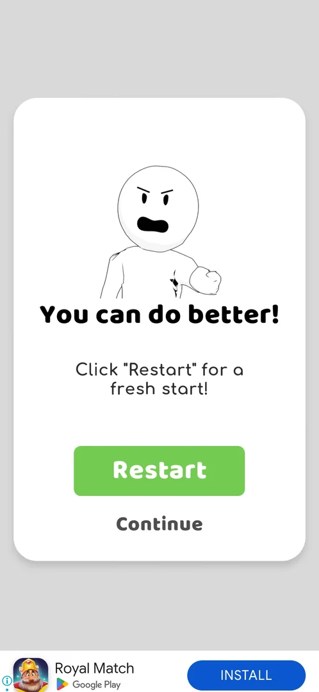 [^s7]
*The restart popup: "You can do better!", a green Restart and a Continue under it*

A drawing of an angry stick figure, the title "You can do better!", a line inviting a fresh start, a green
**Restart** and **Continue** under it [^s7].

- **Continue** closes the popup; the stage goes on unchanged [^s8].
- **Restart** greys the screen out with an ad's loading logo and plays an
  [interstitial video ad](interstitial.md); its skip control at top left opened the Play Store, and
  relaunching the game brought back the same stage, reloaded, with the earlier stages still ticked [^s10]
  [^s11].
- No coins were charged: the balance stayed 230 [^s9] [^s11].

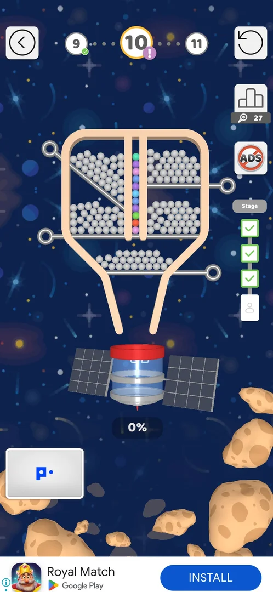 [^s11]
*Level 10 after Restart: stage 4 reloaded at 0%, stages 1-3 still ticked in the Stage column*

### Back arrow

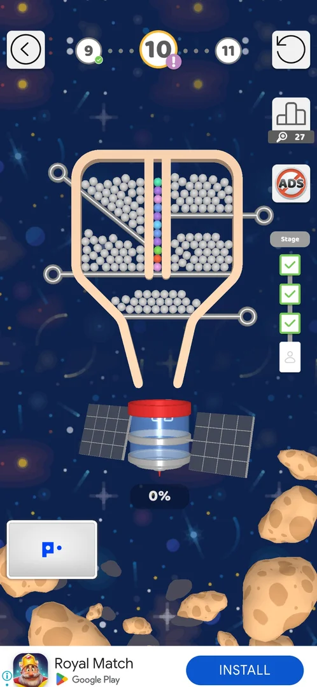 [^s8]
*The back arrow top left of the level screen, left of the level path*

The back arrow top left returns to the map at once: no confirmation, no cost, coins still 230 [^s9]. Tapping
**Play!** on the map reopened level 10 at stage 4, stages 1-3 ticked [^s12].

### Result

When the cup is filled, a green tick replaces the percentage under the cup and confetti falls, then the
win screen opens: an emoji, a praise word ("Awesome!" after level 1, "Fabulous!" after level 2),
"Level completed!", the gift card with its progress bar ([Gift unlock progress bar](unlock-progress.md)),
the coins earned ([Coins](coins.md)), the coin balance top right and **Tap to continue** at the bottom
[^s4] [^s2].

 [^s4]
*The level 1 win screen: Tap to continue at the bottom opens level 2*

If the app is left before the screens after a win are over, the win is lost. Level 13 was won and the
app was left on the Bronze League board that follows the win; on the next launch the map stood at 13
again with **Play!** under it, while the league panel kept the 49 pins of that win [^s17].

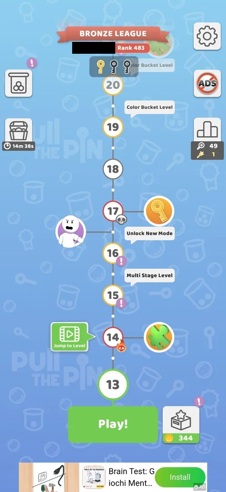 [^s17]
*The map the day after the level 13 win: node 13 is still the current level; the league panel right shows 49 pins (the player's name in the league banner blacked out)*

### Level failed

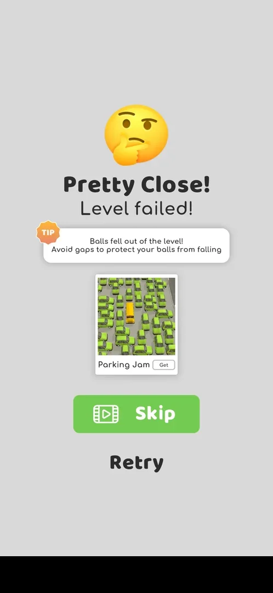 [^s14]
*The fail screen after level 11: the tip names the cause; the green Skip (video) and Retry (the banner ad blacked out)*

Level 11 was lost twice the same way: balls left the container through a gap in its right wall, beside a
short shelf held by a pin, while the coloured balls ran into the cup [^s13] [^s14]. The fail screen came
right after: an emoji (angry the first time, thinking the second), "Pretty Close!", "Level failed!", an orange
**TIP** card with the cause ("Balls fell out of the level!") and an advice line on avoiding gaps, an ad tile
for another game, a green **Skip** with a video icon and **Retry** under it [^s13] [^s14].

- **Retry** is free: it greyed the screen out with the ad network's loading logo and played an
  [interstitial video ad](interstitial.md); its skip icon at top left opened the Play Store, and launching
  the game again brought level 11 back from the start, cup at 0% [^s15] [^s16].
- **Skip** (a rewarded video) was not tried [^s14].
- No coins or lives were taken; there is no offer of extra moves or a revive [^s14].

A second kind of loss came on level 20, a [Color Bucket Level](color-bucket-level.md) with a yellow and a blue
cup: balls reached a cup of another colour and fell grey over the yellow cup while the blue cup stood at 93%
[^s18]. The fail screen was the same, with "So Close!", a worried emoji and a tip that grey balls cannot be
collected and coloured balls spread the paint; Skip (video) and Retry [^s19]. With a
[Win streak](win-streak.md) running, "Watch your streak!" came before it [^s19]. Retry was free and played an
interstitial before level 20 started again [^s20].

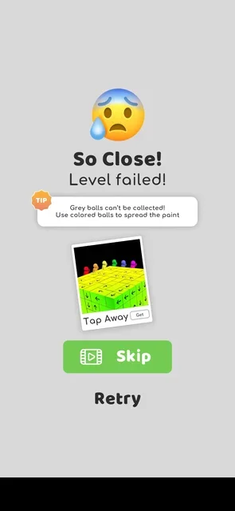 [^s19]
*The fail screen of a colour mix (a local banner ad blacked out)*

## How it works

Version 241.5.1.

- Level 1: one pin, won with one move in 20 s [^s4]. Level 2: two pins, won with two moves (top pin
  first) in 27 s [^s2].
- A tutorial hand points at the pin to pull in level 1 and at the top pin in level 2 [^s1] [^s3].
- Reward per win: +22 coins after level 1, +17 after level 2; the gift bar +12% and +11% [^s4] [^s2].
- Banner ads run at the bottom of the level and the win screen from level 1 [^s4].
- Rules as recorded by level 10: pins are pulled by a tap on their ring, slider pins by a swipe; the goal is
  all balls coloured and in the cup; a level is recorded as lost when a grey ball or a bomb reaches the cup or
  balls fall outside it [^s11]. The last of these was seen at level 11: balls that leave the container
  through a gap in its wall fail the level ("Balls fell out of the level!") [^s14]. A grey ball or a bomb
  reaching the cup has not been seen yet. On a board with colour cups, balls in a cup of another colour turn
  grey and fail the level ("So Close! Level failed!", version 241.5.2) [^s19].
- Elements seen by level 10: grey and coloured balls, bombs, slider pins, colour buckets [^s11].
- Hook gates (level 33, version 241.5.2): a pin bent into a hook at its top end, standing across a channel at
  the end of a dotted track. It has no ring to tap; it is swiped out along its dots, which opens the channel.
  Level 33 had one plain pin under a jar of blue balls and two hook gates below it; the pin and then both hooks
  (the lower one first) were opened and the level was won [^s22] [^s23].

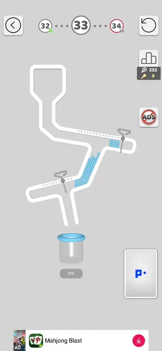 [^s23]
*Clip 4.1 s · [original on YouTube from 4:03](https://youtu.be/2PFrqVa_52w?t=243)*

- Restart: a confirmation popup, then an interstitial, then the current stage only is reloaded; free
  [^s10] [^s11].
- Loss: no coin cost; the fail screen offers Skip (video) and a free Retry, which plays an interstitial and
  reloads the level from the start [^s14] [^s15].
- Quit: the back arrow leaves for the map with no confirmation and no cost [^s9].
- Stage progress inside a Multi Stage level is kept across a quit to the map, a restart and an app exit:
  level 10 was left at stage 4 in the previous session, and after the app was closed and relaunched it opened
  at stage 4 with stages 1-3 ticked [^s6] [^s12].
- A win is saved only when the screens after it are over. After the level 10 win (Puzzle Piece Found,
  Bronze League, Level completed with the coin multiplier) the multiplier's video ended on an ad card that
  would not close; a force-stop and relaunch put the map back at level 10 with 230 coins, as before the
  level [^s5]. The Pull Fest pins from that level (27) were kept
  [^s5]. The same happened after the level 13 win: the app was left on the Bronze League board after the
  win, and the next launch put the map back at level 13, with the league's 49 pins kept (version 241.5.2)
  [^s17]. Once more after the level 21 win (6 October): after the coin screen a playable ad had no close for
  50 s and the Back key did nothing; the game was restarted and the map was back at level 21, but the +16
  coins of the win (2156) and the league pins (150) were kept [^s21]. The win streak counted that win too
  (see [Win streak meter](win-streak.md)). See [Win coin multiplier](coin-multiplier.md) and
  [Pull Fest Ranking](pull-fest.md).

## Cases

| Case | What was done | Result | Source |
|---|---|---|---|
| No menu: the app opens straight into the current level; the level screen is the hub <!-- case:chk-entry --> | Fresh install: skipped the intro comic | ✅ Level 1 opened directly | [^s1] |
| The level screen: gear, level path, restart, ADS, the pins, the cup with its fill percentage, a banner <!-- case:chk-screen --> | Opened level 1 and level 2 | ✅ All seen | [^s1] |
| Win screen <!-- case:chk-win --> | Won level 1 and level 2 | ✅ Praise word, Level completed!, +22 / +17 coins, gift bar +12% / +11%, Tap to continue opens the next level | [^s4] |
| Why it appeared <!-- case:chk-appeared --> | First launch | ✅ Level 1 after the intro comic, with a tutorial hand | [^s1] |
| Rules: tap pin rings, swipe slider pins; all balls coloured and in the cup; lost on a grey ball or bomb in the cup or balls thrown out <!-- case:chk-rules --> | Pulled pins in levels 1-10 | ✅ Recorded; the loss part not yet seen in play | [^s11] |
| The HUD: back arrow, level path, restart, league button (27), ADS, Stage column, board, cup with fill %, native ad tile, banner <!-- case:chk-hud --> | Opened level 10 | ✅ All seen | [^s6] |
| Restart: "You can do better!" (Restart / Continue); Continue closes it; Restart plays an interstitial and reloads only the current stage; no coin cost <!-- case:chk-restart --> | Tapped restart, Continue; then restart, Restart | ✅ Stage 4 reloaded, stages 1-3 kept, coins 230 | [^s11] |
| Quit: the back arrow returns to the map at once, no confirmation, no cost; Play reopens the level at the same stage <!-- case:chk-quit --> | Tapped the back arrow at stage 4, then Play! | ✅ Map, then level 10 at stage 4 | [^s9] |
| Exit the app mid-level: the stage progress survives <!-- case:chk-exit-app --> | Left level 10 at stage 4 in the previous session; relaunched the app | ✅ Level 10 opened at stage 4, stages 1-3 ticked | [^s6] |
| A force-stop during the post-win screens (stuck rewarded-ad end card after the coin multiplier video) reverted the L10 win: map back at 10, coins 230 (multiplier reward not credited), league pins kept; the win is saved only when the post-win flow ends <!-- case:win-flow-revert --> | Won level 10, watched the multiplier video, force-stopped on the stuck end card, relaunched | ✅ Level 10 to play again, coins 230, pins 27 kept | [^s5] |
| Level elements: grey balls, coloured balls, bombs, slider pins, colour buckets <!-- case:chk-elements --> | Levels 1-10 | ✅ Seen; no page of their own yet | [^s11] |
| Balls fell out <!-- case:balls-out --> | Played level 11 twice with the same order of four pulls | ✅ Balls left through a gap in the right wall; "Pretty Close! Level failed!" with the tip "Balls fell out of the level!"; Skip (video) and Retry; no coin cost | [^s13] [^s14] |
| After a loss: the retry and continue offers <!-- case:chk-retry --> | Tapped Retry on the fail screen | ✅ Retry is free, plays an interstitial and reloads the level from the start; Skip (video) not tried; no extra moves or revive | [^s15] [^s16] |
| Leaving the app on the post-win league board reverted the L13 win: map back at 13 the next day; the league's 49 pins stayed <!-- case:win-reverted-league-board --> | Won level 13; the app was left on the Bronze League board; relaunched the next day | ✅ Level 13 to play again, pins 49 kept | [^s17] |
| Colours mixed on a colour-bucket board <!-- case:colour-mix --> | Lost level 20 (Color Bucket) | ✅ Balls in the wrong cup turn grey; "So Close! Level failed!" with the grey-balls tip; Skip (video) / Retry; a running win streak shows "Watch your streak!" first | [^s19] |
| A playable ad with no close after the level 21 win; the game restarted <!-- case:win-revert-playable-ad --> | Won level 21; after the coin screen a playable ad had no close for 50 s, Back did nothing; restarted the game | ✅ The map back at level 21; the +16 coins (2156) and the league pins (150) kept | [^s21] |
| Hook gates <!-- case:hook-gates --> | Level 33: pulled the pin under the jar, then swiped the lower and the upper hook along their dotted tracks | ✅ A hook gate has no ring and is not tapped; swiped along its dots it slides aside and opens its channel; level 33 won | [^s22] [^s23] |
| Each loss <!-- case:chk-loss --> | Lost level 11 by balls falling out, level 20 by mixed colours | not verified: a grey ball or a bomb in the single cup not seen | [^s19] |

## Not verified

- Each loss: a grey ball or a bomb in the cup not seen yet; seen: balls fell out, colours mixed <!-- case:chk-loss -->
- What Skip on the fail screen does after its video (task exp-fail-skip).
- Whether a restart on a single-stage level also brings an interstitial.
- Each level element (bombs, slider pins, colour buckets, hook gates) with the level it first shows on.

[^s1]: session 20261003-193015-chrono-2FYKPJ, step 2 — [video at 0:55](https://youtu.be/JjeHh2uiLgE?t=55)
[^s2]: session 20261003-193015-chrono-2FYKPJ, step 7 — [video at 2:25](https://youtu.be/JjeHh2uiLgE?t=145)
[^s3]: session 20261003-193015-chrono-2FYKPJ, step 4 — [video at 1:43](https://youtu.be/JjeHh2uiLgE?t=103)
[^s4]: session 20261003-193015-chrono-2FYKPJ, step 3 — [video at 1:22](https://youtu.be/JjeHh2uiLgE?t=82)
[^s5]: session 20261003-211035-chrono-2FYKPJ, step 23 — [video at 11:41](https://youtu.be/Mpfk4cqdltQ?t=701)
[^s6]: session 20261003-214021-chrono-2FYKPJ, step 21 — [video at 4:51](https://youtu.be/siJO2QCuGxI?t=291)
[^s7]: session 20261003-214021-chrono-2FYKPJ, step 22 — [video at 5:10](https://youtu.be/siJO2QCuGxI?t=310)
[^s8]: session 20261003-214021-chrono-2FYKPJ, step 23 — [video at 5:23](https://youtu.be/siJO2QCuGxI?t=323)
[^s9]: session 20261003-214021-chrono-2FYKPJ, step 24 — [video at 5:37](https://youtu.be/siJO2QCuGxI?t=337)
[^s10]: session 20261003-214021-chrono-2FYKPJ, step 27 — [video at 6:07](https://youtu.be/siJO2QCuGxI?t=367)
[^s11]: session 20261003-214021-chrono-2FYKPJ, step 29 — [video at 7:04](https://youtu.be/siJO2QCuGxI?t=424)
[^s12]: session 20261003-214021-chrono-2FYKPJ, step 25 — [video at 5:50](https://youtu.be/siJO2QCuGxI?t=350)
[^s13]: session 20261004-004411-chrono-2FYKPJ, step 19 — [video at 5:56](https://youtu.be/KwWbRYgzFFk?t=356)
[^s14]: session 20261004-004411-chrono-2FYKPJ, step 23 — [video at 7:27](https://youtu.be/KwWbRYgzFFk?t=447)
[^s15]: session 20261004-004411-chrono-2FYKPJ, step 20 — [video at 6:20](https://youtu.be/KwWbRYgzFFk?t=380)
[^s16]: session 20261004-004411-chrono-2FYKPJ, step 22 — [video at 7:05](https://youtu.be/KwWbRYgzFFk?t=425)
[^s17]: session 20261005-013818-chrono-2FYKPJ, step 1 — [video at 0:29](https://youtu.be/q_WyVbvA1og?t=29)

[^s18]: session 20261005-235042-chrono-2FYKPJ, step 37 — [video at 13:12](https://youtu.be/PZ3ujKA8euo?t=792)
[^s19]: session 20261005-235042-chrono-2FYKPJ, step 39 — [video at 13:40](https://youtu.be/PZ3ujKA8euo?t=820)
[^s20]: session 20261005-235042-chrono-2FYKPJ, step 42 — [video at 15:04](https://youtu.be/PZ3ujKA8euo?t=904)
[^s21]: session 20261006-033538-chrono-2FYKPJ, step 11 — [video at 3:53](https://youtu.be/j9sNlnJxE4Y?t=233)
[^s22]: session 20261006-145232-chrono-2FYKPJ, step 14 — [video at 4:24](https://youtu.be/2PFrqVa_52w?t=264)
[^s23]: session 20261006-145232-chrono-2FYKPJ, step 13 — [video at 4:07](https://youtu.be/2PFrqVa_52w?t=247)
