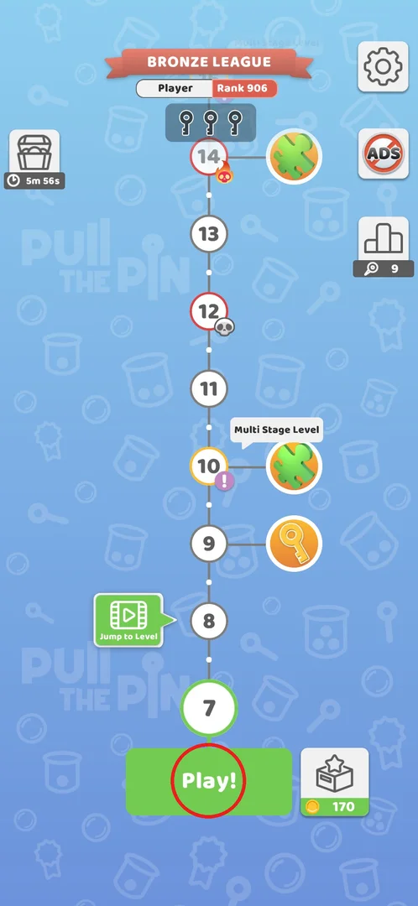
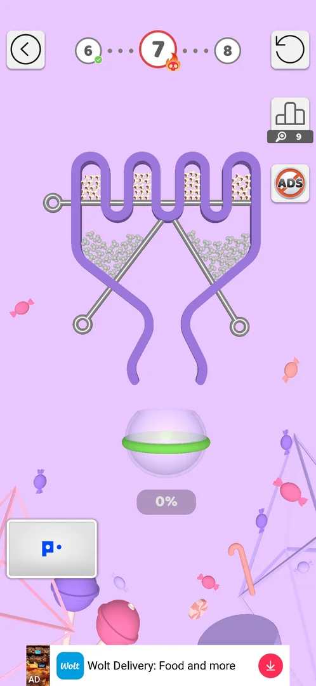
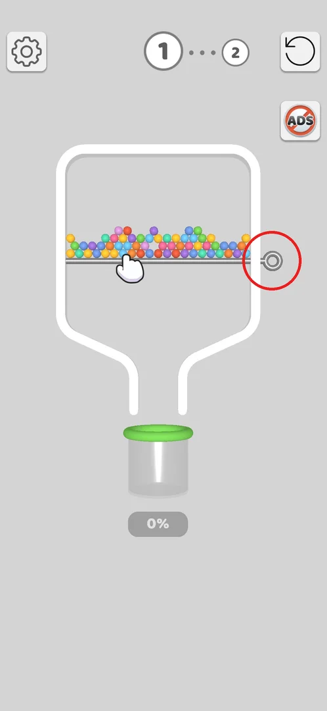
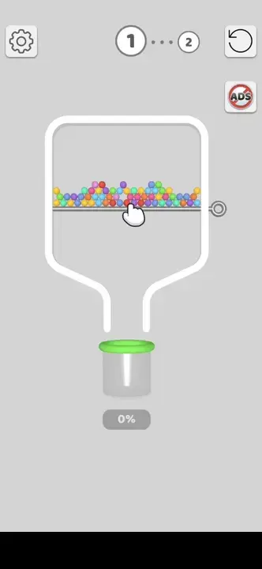
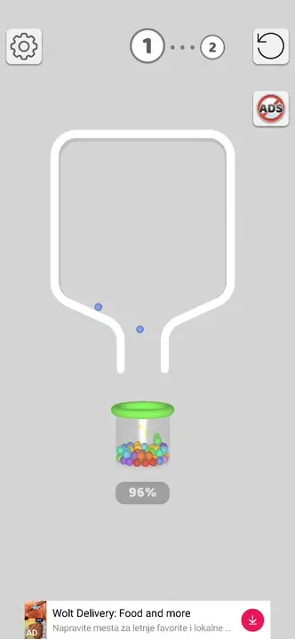
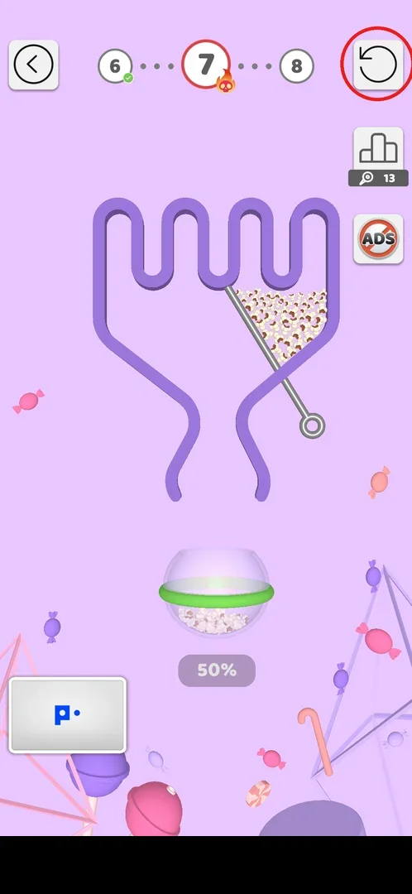
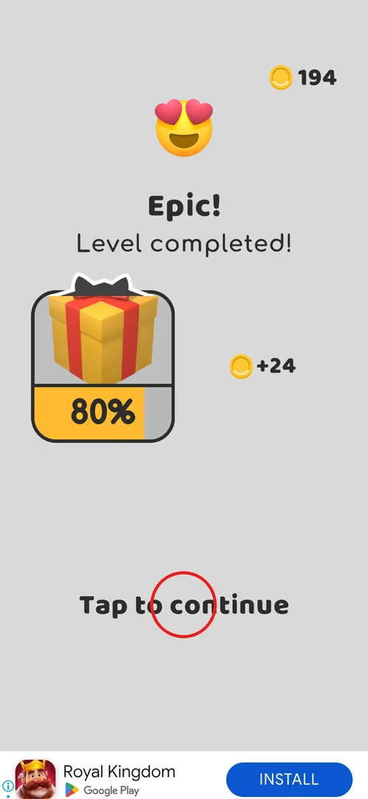
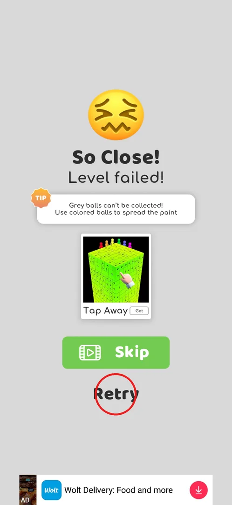
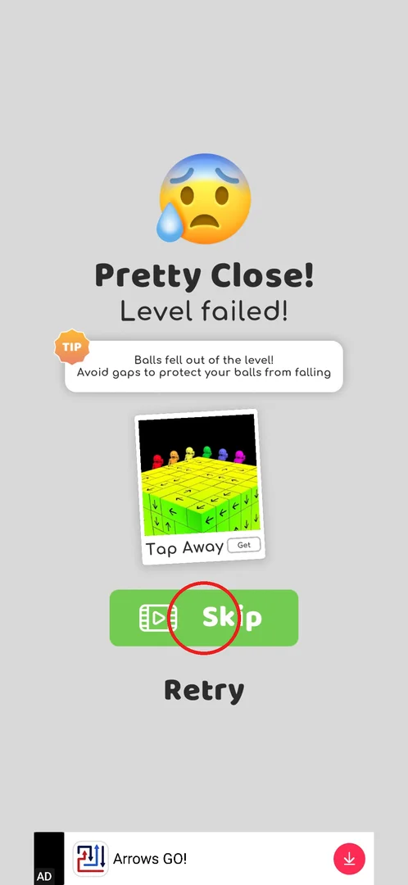
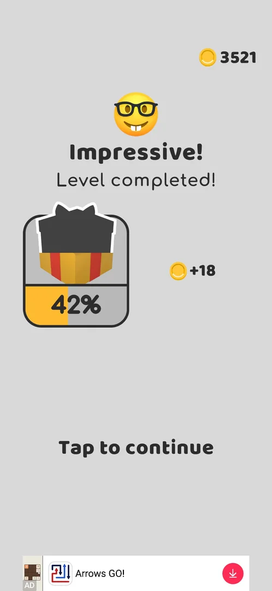

# Core level: pulling pins

> Recheck on v241.5.1: documented on 241.3.1; Google Play has 241.5.1.

The level is the whole game: a container of balls held in place by pins, and a cup below it. The player
pulls the pins one by one so that coloured balls fall into the cup and fill it to 100% [^s3] [^s4]. Grey
balls are the obstacle: they turn coloured only when coloured balls touch them, and the colour spreads
through the whole pile [^s5]; a grey ball that reaches the cup unpainted loses the level [^s6]. A win
pays coins and fills the gift bar; a loss offers a retry, or a skip of the level for a video [^s6] [^s8] [^s22].

## Where to find it

The game opens straight on level 1, with no menu [^s3]. Later every level starts from the level map:
the current level is the big green circle at the bottom of the path, and **Play!** under it (circled)
opens it [^s1].

 [^s1]

## What it looks like

The board fills the middle of the screen: a container drawn in the theme's colour, pins (grey rods with
a ring at one end) across it, the balls on the pins, and below it the cup with a fill percentage (0% at
the start) [^s2]. At the top are a back arrow (a gear on level 1), the path of the previous, current and
next levels, and the restart button; under them the leaderboard and No ADS buttons, and the banner ad at
the very bottom [^s2] [^s3]. A red circle with a flame-and-skull badge on the current level marks a hard
level (level 7 here) [^s2].

 [^s2]

## What you can do

| Tab or button | What it does |
|---|---|
| [Pin ring](#pin-ring) | A tap on a pin's ring pulls the pin out; the only move in the game |
| [Restart](#restart) | Asks for confirmation, then an interstitial ad and a fresh board |
| [Win](#win) | The cup is full: coins, gift progress, Tap to continue |
| [Defeat](#defeat) | A grey ball fell into the cup or balls fell out: tip, Skip for a video, Retry |
| [Skip](#skip) | On the defeat screen: a rewarded video, then the level counts as passed |

### Pin ring

A pin comes out only on a tap on its **ring**. A swipe along the rod or a tap on the rod does nothing,
even though the level 1 tutorial hand points at the rod [^s4]. The order of the pins is the whole
puzzle: on level 7 the top pin is pulled first so the coloured popcorn paints the greys, then the lower
pins let everything into the cup [^s12].

 [^s3]

*Clip 16 s · [original on YouTube from 0:29](https://youtu.be/BVqoYRE5kRU?t=29)*

*Clip 16 s · [original on YouTube from 0:45](https://youtu.be/BVqoYRE5kRU?t=45)*

### Restart

The circular arrow at the top right restarts the level at any moment [^s7] [^s9].

 [^s7]

It first asks "You can do better! Click 'Restart' for a fresh start!" with **Restart** and **Continue**
[^s9]. Restart plays an interstitial ad, then the board starts again from 0% [^s10].

 [^s9]

### Win

When the cup is full the level ends with a praise word ("Impressive!", "Epic!") and "Level completed!",
the coins for the level, the coin balance at the top right, and the gift bar that grows with every win
(9% after level 1, 80% after level 7) [^s4] [^s8]. **Tap to continue** goes on [^s8]. On some levels a
leaderboard screen with **Next Level!** comes first [^s17].

 [^s8]

### Defeat

A grey ball in the cup ends the level at once with "So Close! Level failed!", the tip "Grey balls
can't be collected! Use colored balls to spread the paint", a cross-promo card of another game,
**Skip** (with a video icon) and **Retry** (circled) [^s6]. There is no continue for coins [^s6]. Retry
plays an interstitial of about 60 s with no close button, then the level from 0% [^s11].

 [^s6]

The heading and the tip follow the loss: on level 27 (v241.5.1) the screen read "Pretty Close! Level
failed!" with the tip "Balls fell out of the level! Avoid gaps to protect your balls from falling"
[^s20]. When the player has a win streak, a [Watch your streak!](win-streak.md) popup comes before the
defeat screen; the defeat screen appears after **No, thanks** [^s20] [^s23].

### Skip

**Skip** (green, with a video icon) on the defeat screen plays a rewarded video of about 25 s; it can be
closed once the ad shows "Reward granted" [^s22]. After it the game goes on exactly as after a win: the
league screen (league pins +1, 251 to 252; rank 723 to 717) with **Next Level!**, then "Impressive!
Level completed!" with +18 coins and the gift bar (42%), and the map with the next level current (v241.5.1)
[^s21] [^s22].

 [^s20]

 [^s21]

## How it works

- Only a tap on a pin's ring moves it [^s4].
- Grey balls are painted by touching coloured balls, and the paint spreads through the pile [^s5]; a
  grey ball reaching the cup unpainted is an instant loss [^s6].
- Restart and Retry both cost an interstitial ad [^s10] [^s11].
- Skip on the defeat screen costs one rewarded video and pays like a win: coins, one league pin, gift
  progress, and the next level opens (v241.5.1) [^s21] [^s22]. A win streak is lost first unless it is
  kept on the streak popup [^s22] [^s23].
- Progress seems to be saved only after the reward screen: level 7, cut off by an ad in the previous
  session, had to be played again (inferred, unverified) [^s18]. On v241.5.1 the same happened four
  times in one session: a post-win ad that could not be closed forced a game restart, and the restart
  put the player back on the level just won, while the coins, keys and gift % of that win were kept
  [^s19].

Coins for a win (v241.3.1):

| Level | Coins for the win | Source |
|---|---|---|
| 1 / 2 / 3 | +22 / +17 / +23 | [^s4] [^s13] [^s5] |
| 5 / 6 / 7 (hard) | +23 / +18 / +24 | [^s14] [^s15] [^s16] |
| 7 (replay, session 2) | +24 | [^s8] |
| 8 | +19 | [^s17] |
| 27 (passed with Skip, v241.5.1) | +18 | [^s21] |

## Cases

| Case | What was done | Result | Source |
|---|---|---|---|
| Pull a pin | Swipe, tap on the rod, tap on the ring (level 1) | Only the ring works | [^s4] |
| Defeat | Opened the way to the cup before the greys were painted (level 7) | "So Close! Level failed!", tip, cross-promo, Skip (video), Retry; no continue for coins | [^s6] |
| Retry | Retry on the defeat screen | About 60 s interstitial with no close button, then the level from 0% | [^s11] |
| Restart button | Restart in a level | Confirmation dialog; Restart → interstitial → fresh board | [^s9] [^s10] |
| Skip for a video | Lost level 27 on purpose, No, thanks on the streak popup, Skip on the defeat screen (v241.5.1) | Rewarded video, then league pin +1, +18 coins, gift 42%, the map moved to level 28 | [^s21] [^s22] |
| Post-win ad without close | Restarted the game during the ad (v241.5.1, 4 times) | The level index went back to the level just won; coins, keys and gift % kept | [^s19] |

## Not verified

- Defeat by a bomb reaching the cup.
- Post-win ad without close: the loss of the level completion on restart — re-check on another device
  or network.

[^s1]: session 20260930-201034-chrono-2FYKPJ, step 46 — [video at 11:15](https://youtu.be/JGEX3-Rfkdw?t=675)
[^s2]: session 20260930-201034-chrono-2FYKPJ, step 47 — [video at 11:39](https://youtu.be/JGEX3-Rfkdw?t=699)
[^s3]: session 20260930-192115-chrono-2FYKPJ, step 1 — [video at 0:09](https://youtu.be/BVqoYRE5kRU?t=9)
[^s4]: session 20260930-192115-chrono-2FYKPJ, step 4 — [video at 0:52](https://youtu.be/BVqoYRE5kRU?t=52)
[^s5]: session 20260930-192115-chrono-2FYKPJ, step 25 — [video at 4:26](https://youtu.be/BVqoYRE5kRU?t=266)
[^s6]: session 20260930-201034-chrono-2FYKPJ, step 50 — [video at 12:12](https://youtu.be/JGEX3-Rfkdw?t=732)
[^s7]: session 20260930-201034-chrono-2FYKPJ, step 56 — [video at 16:21](https://youtu.be/JGEX3-Rfkdw?t=981)
[^s8]: session 20260930-201034-chrono-2FYKPJ, step 58 — [video at 16:55](https://youtu.be/JGEX3-Rfkdw?t=1015)
[^s9]: session 20260930-201034-chrono-2FYKPJ, step 39 — [video at 8:55](https://youtu.be/JGEX3-Rfkdw?t=535)
[^s10]: session 20260930-201034-chrono-2FYKPJ, step 40 — [video at 9:07](https://youtu.be/JGEX3-Rfkdw?t=547)
[^s11]: session 20260930-201034-chrono-2FYKPJ, step 54 — [video at 15:31](https://youtu.be/JGEX3-Rfkdw?t=931)
[^s13]: session 20260930-192115-chrono-2FYKPJ, step 8 — [video at 1:47](https://youtu.be/BVqoYRE5kRU?t=107)
[^s14]: session 20260930-192115-chrono-2FYKPJ, step 72 — [video at 15:49](https://youtu.be/BVqoYRE5kRU?t=949)
[^s15]: session 20260930-192115-chrono-2FYKPJ, step 86 — [video at 20:00](https://youtu.be/BVqoYRE5kRU?t=1200)
[^s16]: session 20260930-192115-chrono-2FYKPJ, step 96 — [video at 22:51](https://youtu.be/BVqoYRE5kRU?t=1371)
[^s17]: session 20260930-201034-chrono-2FYKPJ, step 67 — [video at 20:19](https://youtu.be/JGEX3-Rfkdw?t=1219)
[^s18]: session 20260930-201034-chrono-2FYKPJ, step 0 — [video at 0:00](https://youtu.be/JGEX3-Rfkdw?t=0)
[^s19]: session 20261001-054205-chrono-2FYKPJ, step 51
[^s20]: session 20261001-220948-chrono-2FYKPJ, step 3 — [video at 1:10](https://youtu.be/cPj7O98vvl0?t=70)
[^s21]: session 20261001-220948-chrono-2FYKPJ, step 7 — [video at 3:15](https://youtu.be/cPj7O98vvl0?t=195)
[^s22]: session 20261001-220948-chrono-2FYKPJ, step 8 — [video at 3:41](https://youtu.be/cPj7O98vvl0?t=221)
[^s23]: session 20261001-220948-chrono-2FYKPJ, step 2 — [video at 0:50](https://youtu.be/cPj7O98vvl0?t=50)

[^s12]: session 20260930-201034-chrono-2FYKPJ, step 55 — [video at 16:02](https://youtu.be/JGEX3-Rfkdw?t=962)
