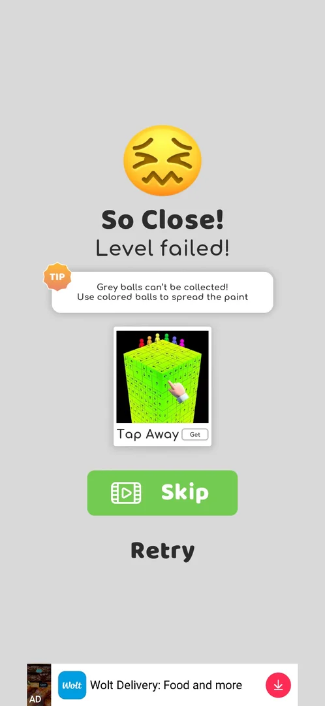
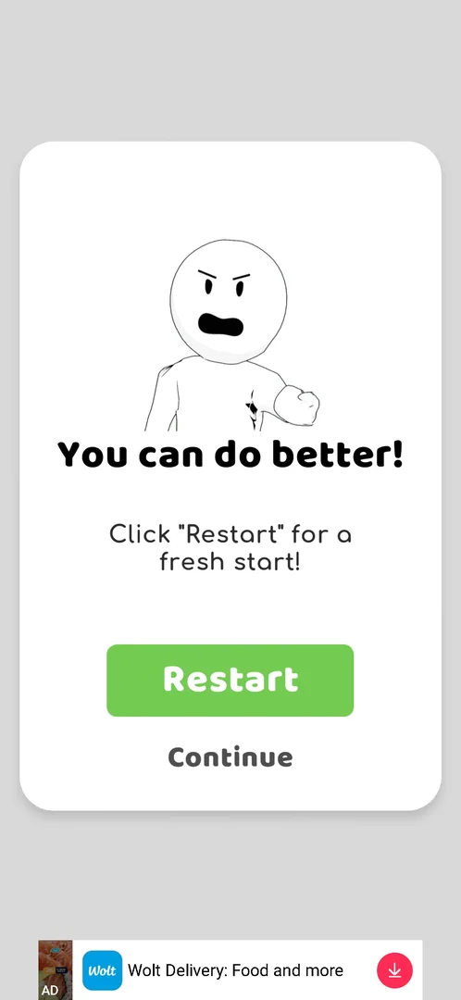

# Core level: pulling pins

> Recheck on v241.5.1: documented on 241.3.1; Google Play has 241.5.1.

The game opens straight on level 1 with no menu [s:20260930-192115-chrono-2FYKPJ#1]. A level is a container of balls held by
pins; coloured balls must reach the cup at the bottom. Grey balls turn coloured when coloured balls
touch them, and the colour spreads through the whole pile [s:20260930-192115-chrono-2FYKPJ#25].

## How it works
- A pin comes out only on a tap on its **ring**; a swipe along the rod or a tap on the rod does
  nothing [s:20260930-192115-chrono-2FYKPJ#4].
- Grey balls that reach the cup unpainted lose the level at once [s:20260930-201034-chrono-2FYKPJ#50].
- Restart (circular arrow, top right) asks "You can do better! Click 'Restart' for a fresh start!"
  with Restart and Continue; Restart plays an interstitial, then a fresh board [s:20260930-201034-chrono-2FYKPJ#39] [s:20260930-201034-chrono-2FYKPJ#40].
- Progress seems to be saved only after the reward screen: level 7, cut off by an ad in the previous
  session, had to be played again (unverified) [s:20260930-201034-chrono-2FYKPJ#0].

*Clip 16 s · [original on YouTube from 0:29](https://youtu.be/BVqoYRE5kRU?t=29)*

*Clip 16 s · [original on YouTube from 0:45](https://youtu.be/BVqoYRE5kRU?t=45)*

## Cases
| Case | What was done | Result | Source |
|---|---|---|---|
| Pull a pin | Swipe, tap on the rod, tap on the ring | Only the ring works | [s:20260930-192115-chrono-2FYKPJ#4] |
| Defeat | Opened the way to the cup before the greys were painted (level 7) | "So Close! Level failed!", tip, cross-promo, Skip (video), Retry; no continue for coins | [s:20260930-201034-chrono-2FYKPJ#50] |
| Retry | Retry on the defeat screen | About 60 s interstitial with no close button, then the level from 0% | [s:20260930-201034-chrono-2FYKPJ#54] |
| Restart button | Restart in a level | Confirmation dialog; Restart → interstitial → fresh board | [s:20260930-201034-chrono-2FYKPJ#40] |

## Numbers (v241.3.1)
| Level | Coins for the win | Source |
|---|---|---|
| 1 / 2 / 3 | +22 / +17 / +23 | [s:20260930-192115-chrono-2FYKPJ#4] [s:20260930-192115-chrono-2FYKPJ#8] [s:20260930-192115-chrono-2FYKPJ#25] |
| 5 / 6 / 7 (hard) | +23 / +18 / +24 | [s:20260930-192115-chrono-2FYKPJ#72] [s:20260930-192115-chrono-2FYKPJ#86] [s:20260930-192115-chrono-2FYKPJ#96] |
| 8 | +19 | [s:20260930-201034-chrono-2FYKPJ#67] |

## Not verified
- Defeat by a bomb reaching the cup.
- Skip for a video on the defeat screen: does the level count.
