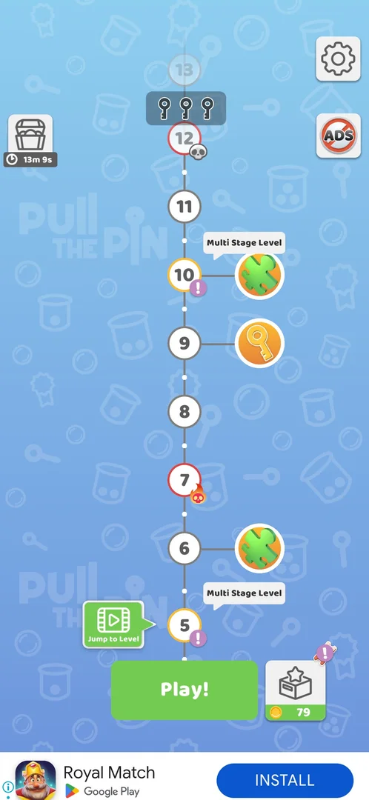
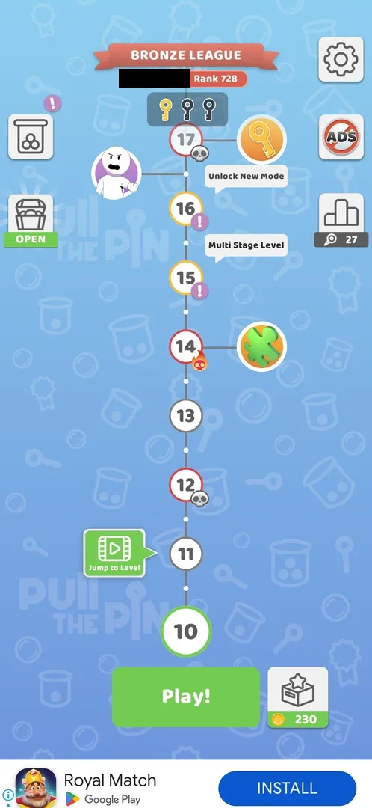
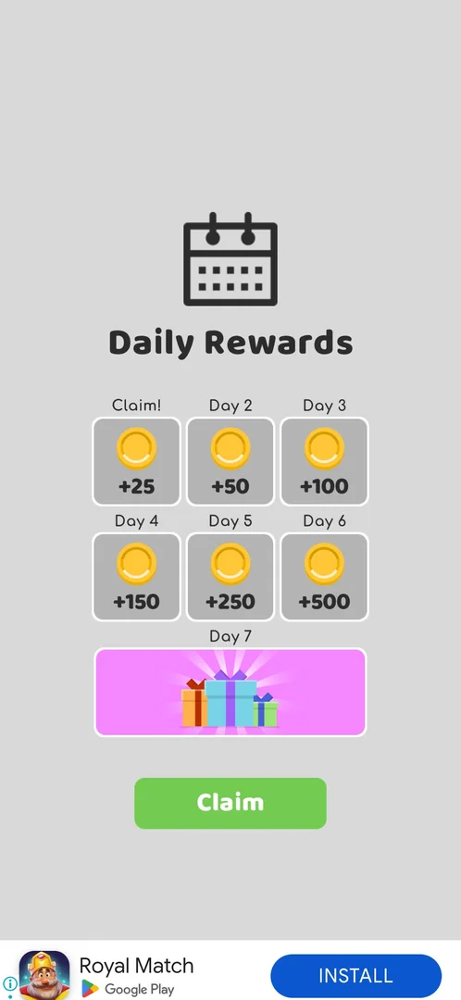
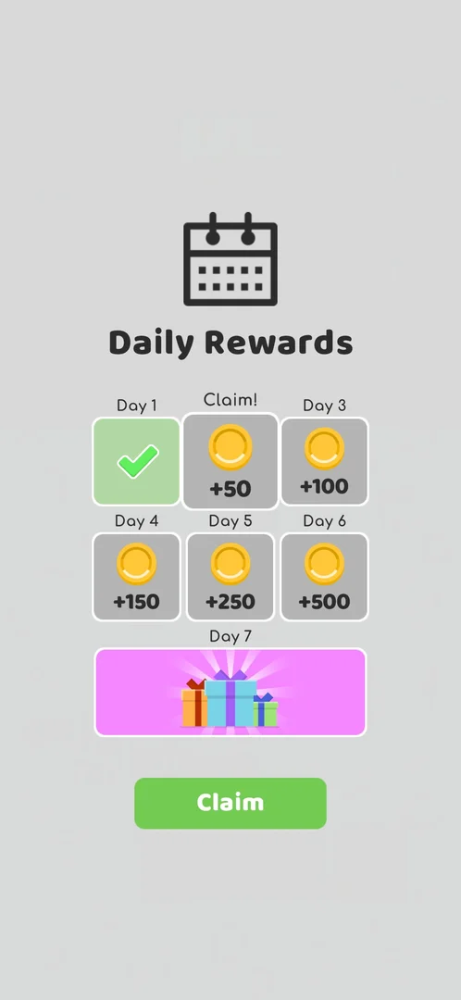
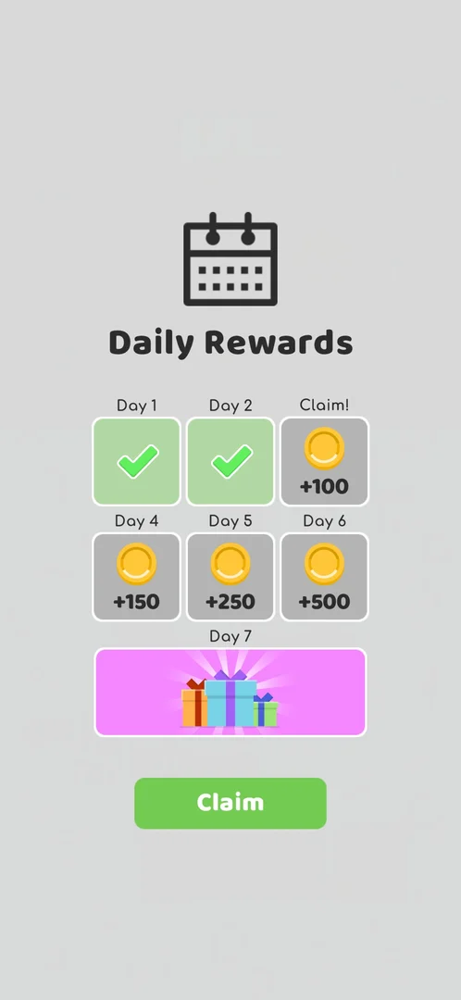
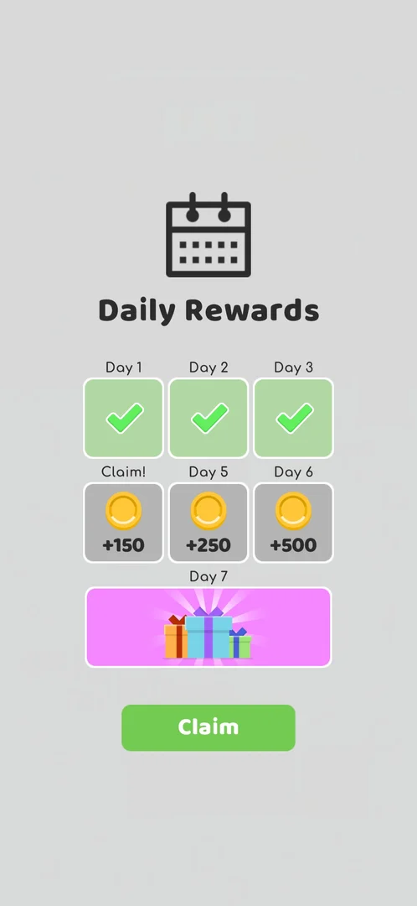
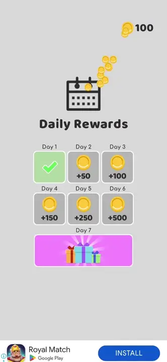
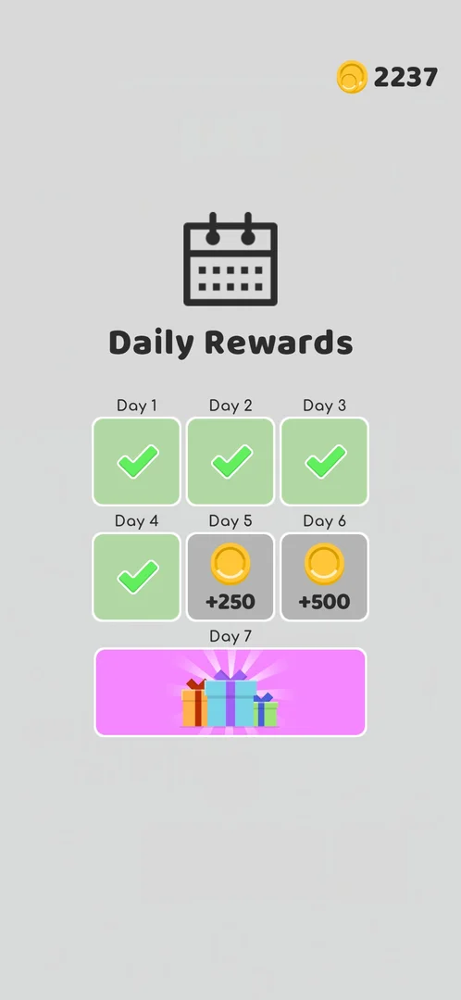

# Daily Rewards

A seven-day login calendar: days 1-6 pay coins (+25 up to +500), day 7 gift boxes. It comes up by itself as a
popup over the map, once a day; the player claims the day's reward with **Claim** [^s1] [^s3] [^s4] [^s6]. There is
no button that opens it [^s4].

## Why it appeared

Popup on the second Play! tap on the map after the L3 win (first map visit) [^s1].

## Where to find it

It opens by itself: after the level 3 win the map appeared; the first tap on **Play!** brought the map
tutorial, the second the Daily Rewards popup instead of level 4 [^s2] [^s1]. The map has no button for it:
at level 10 the map shows the gear, ADS, the league button, the jar, the chest and the Collections box, and
none of them is Daily Rewards [^s4]. On a relaunch the same day (21:40, the first popup was at 20:37) the
popup did not come again, neither at launch nor on a later return to the map [^s4]. On 5 October (01:38) it
came up at once when the app was launched, before the map, with day 2 to claim [^s5]; the same day at 12:50
it came up again at launch, with day 3 to claim [^s8]. On 6 October a launch at 01:22 went straight to the map
with no popup [^s12]; the next launch, at 03:10, brought it with day 4 to claim [^s10].

 [^s2]
*The map after the level 3 win: Play!, whose second tap brought the Daily Rewards popup*

 [^s4]
*The map at level 10, same day: gear and ADS top right, the league button, the jar and the chest on the sides, the Collections box right of Play!; no Daily Rewards button (the player's name in the league banner blacked out)*

## What it looks like

 [^s1]
*Daily Rewards: a calendar icon, days 1-6 with coins, day 7 with gift boxes, the green Claim button*

 [^s5]
*The popup at launch on 5 October (version 241.5.2): Day 1 green with a tick, Day 2 (+50) labelled Claim!, Claim at the bottom*

A calendar icon and the title **Daily Rewards**, a grid of six coin tiles (Day 1 to Day 6) and a wide pink
Day 7 tile with gift boxes, then a green **Claim** button [^s1]. The day that can be claimed is labelled
**Claim!** instead of its day number [^s1]. A claimed day stays green with a tick on the following
days [^s5] [^s8].

 [^s8]
*The popup at launch on 5 October 12:50 (version 241.5.2): Days 1 and 2 ticked, Day 3 (+100) labelled Claim!*

 [^s10]
*The popup at launch on 6 October 03:10 (version 241.5.2): Days 1 to 3 ticked, Day 4 (+150) labelled Claim!*

### Result

 [^s3]
*After Claim: the Day 1 tile turns green with a tick; coins fly to the balance top right (102 mid-count)*

 [^s3]
*Clip 3 s · [original on YouTube from 2:29](https://youtu.be/cirqlD7KGWI?t=149); after Claim the game goes straight to level 4*

 [^s11]
*After Claim on day 4: the Day 4 tile ticked, the balance counting up at the top right (2237)*

## How it works

Version 241.5.1; the calendar and its rewards were the same in 241.5.2 [^s5].

| Day | Reward |
|---|---|
| 1 | +25 coins |
| 2 | +50 coins |
| 3 | +100 coins |
| 4 | +150 coins |
| 5 | +250 coins |
| 6 | +500 coins |
| 7 | Gift boxes (contents not shown) |

Source: [^s1]. Claim on day 1 credited +25 (balance 79 before, 102 shown while counting, 122 after the level
4 win of +18) and opened level 4 [^s3]. Inferred: the balance after the claim was 104. Claim on day 2 credited +50: the map showed 344 coins
right after it [^s6]. Claim on day 3 ticked the Day 3 tile and the coins flew to the balance (482
mid-count); the map then showed 489 [^s9]. Inferred: +100, from 389. Claim on day 4 ticked the Day 4 tile with the
balance at 2237 mid-count [^s11]; the map then showed 2240 [^s11]. Inferred: +150, from 2090, the balance on the
Challenge screen in the previous session, the last one seen before [^s13].

It shows once per day: the first map visit of the day brings it; a relaunch of the app the same day did not
[^s4]. It is a popup, not a board to play [^s4].

Claims so far: day 1 on 3 October at 20:37, day 2 on 5 October at 01:38 (about 29 h later), day 3 on 5
October at 12:50 (about 11 h after day 2, the same local date), day 4 on 6 October at 03:10 (about 14 h after
day 3) [^s1] [^s5] [^s8] [^s10]. A launch on 6 October at 01:22, after local midnight and about 12.5 h after
the day 3 claim, showed no popup [^s12].
No Daily Rewards popup is recorded in the sessions of 4 October between 00:10 and 01:00 (a launch at
00:55 went straight to the map) [^s7]. Inferred: the next day opens neither 24 h after the last claim (day 3 came 11 h after day 2) nor at local
midnight (day 2 and day 3 were claimed on the same local date, and the 01:22 launch on 6 October, after
local midnight, had no popup); a whole calendar day with no claim did not reset the calendar to day 1.
Hypothesis: the day changes at midnight UTC, not verified. The phone's clock is UTC+2 (inferred from the
recorder's timestamps), so midnight UTC is 02:00 local; this fits all six launches: the popup at 20:37 (3 Oct),
01:38 (5 Oct), 12:50 (5 Oct) and 03:10 (6 Oct), none at 21:40 (3 Oct), 00:55 (4 Oct) and 01:22 (6 Oct).

## Cases

| Case | What was done | Result | Source |
|---|---|---|---|
| Claim day 1: +25 coins (79 -> 102 shown), day 1 ticked <!-- case:claim-day1 --> | Tapped Claim | ✅ +25 coins, Day 1 ticked | [^s3] |
| 7-day calendar: d1 +25, d2 +50, d3 +100, d4 +150, d5 +250, d6 +500 coins, d7 gift boxes <!-- case:chk-calendar --> | Read the popup | ✅ Seen | [^s1] |
| Day 1 claimed with Claim: +25 coins, day ticked <!-- case:chk-today --> | Tapped Claim | ✅ Credited | [^s3] |
| Daily Rewards popup over the map with the 7-day calendar and Claim <!-- case:chk-screen --> | Tapped Play! twice on the first map | ✅ Popup seen | [^s1] |
| Why it appeared <!-- case:chk-appeared --> | Tapped Play! twice on the first map | ✅ Opened by itself on the second tap | [^s1] |
| No button: the popup opens by itself on the first map visit of a day (day 1 at 20:37); a relaunch the same day (21:40) did not show it again <!-- case:chk-entry --> | Relaunched the app the same day, played, returned to the map | ✅ No popup and no button for it | [^s4] |
| The next day <!-- case:chk-next-day --> | Launched on 5 October at 01:38 and at 12:50, on 6 October at 01:22 and 03:10 | ✅ The next day's tile comes up by itself at launch, before the map: day 2, day 3 and day 4 (+150) were claimed this way; the day changed between 01:22 and 03:10 local on 6 October (no popup at 01:22, day 4 at 03:10), so not at local midnight; the exact hour is not known | [^s12] [^s10] |
| A missed day <!-- case:chk-missed --> | — | not verified |  |
| Not a board: a calendar popup only <!-- case:chk-play --> | Read the popup | ✅ A calendar with Claim, nothing to play | [^s4] |
| Day 2 claimed on the launch popup: +50 coins, balance 344 on the map <!-- case:claim-day2 --> | Launched the app on 5 October, tapped Claim | ✅ +50 coins, the map showed 344 | [^s6] |
| Day 4 claimed on the launch popup | Launched the app on 6 October at 03:10, tapped Claim | ✅ Day 4 ticked; the map showed 2240 (inferred +150) | [^s11] |

## Not verified

- The hour at which the next day opens: between 01:22 and 03:10 local on 6 October; hypothesis midnight UTC (02:00 local), not verified (follow-up experiment exp-daily-rewards-utc-reset)
- A missed day: whether the streak resets (follow-up task daily-rewards-missed); 4 October passed with no claim and day 2 still followed, but no popup was recorded that day, so it is not known whether the game counted it as missed <!-- case:chk-missed -->
- What the day 7 gift boxes hold.

[^s1]: session 20261003-203702-chrono-2FYKPJ, step 8 — [video at 2:20](https://youtu.be/cirqlD7KGWI?t=140)
[^s2]: session 20261003-203702-chrono-2FYKPJ, step 7 — [video at 2:10](https://youtu.be/cirqlD7KGWI?t=130)
[^s3]: session 20261003-203702-chrono-2FYKPJ, step 9 — [video at 2:32](https://youtu.be/cirqlD7KGWI?t=152)
[^s4]: session 20261003-214021-chrono-2FYKPJ, step 30 — [video at 7:39](https://youtu.be/siJO2QCuGxI?t=459)
[^s5]: session 20261005-013818-chrono-2FYKPJ, step 0 — [video at 0:00](https://youtu.be/q_WyVbvA1og?t=0)
[^s6]: session 20261005-013818-chrono-2FYKPJ, step 1 — [video at 0:29](https://youtu.be/q_WyVbvA1og?t=29)
[^s7]: session 20261004-005453-chrono-2FYKPJ, step 0 — [video at 0:00](https://youtu.be/rH_NzK3D4WA?t=0)
[^s8]: session 20261005-125008-chrono-2FYKPJ, step 0 — [video at 0:00](https://youtu.be/rULKLs8ztsM?t=0)
[^s9]: session 20261005-125008-chrono-2FYKPJ, step 1 — [video at 0:34](https://youtu.be/rULKLs8ztsM?t=34)
[^s10]: session 20261006-030951-chrono-2FYKPJ, step 0 — [video at 0:00](https://youtu.be/nuXkt-gY2qg?t=0)
[^s11]: session 20261006-030951-chrono-2FYKPJ, step 1 — [video at 0:20](https://youtu.be/nuXkt-gY2qg?t=20)
[^s12]: session 20261006-012240-chrono-2FYKPJ, step 0 — [video at 0:00](https://youtu.be/jf_j5LiHuRs?t=0)
[^s13]: session 20261006-012240-chrono-2FYKPJ, step 20 — [video at 11:48](https://youtu.be/jf_j5LiHuRs?t=708)
