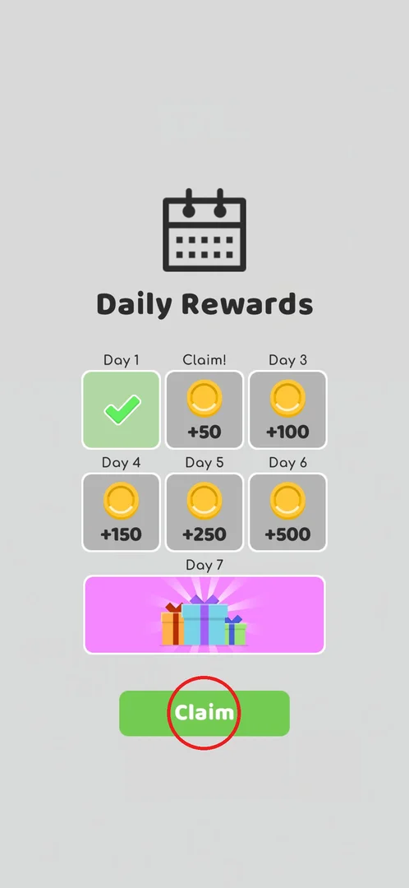
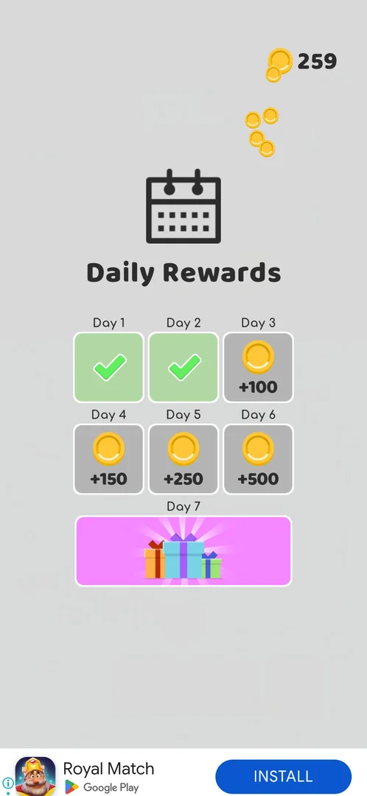

# Daily rewards (7 days)

A 7-day login calendar that gives free coins: you open the game on a new day, a **Daily Rewards** popup
comes up by itself, and one tap on **Claim** takes that day's reward. Days 1–6 pay 25, 50, 100, 150, 250
and 500 coins, and day 7 is a gift set [^s2]. You do nothing else here: there are no tabs, no ad to watch
and nothing to buy.

## Where to find it

<!-- no-entry: the popup has no button or icon of its own; the game opens it by itself -->

There is no button to open it. The first time, it appeared about 13 minutes into the first session: on the
level map (level 4, 62 coins) the player tapped **Jump to Level** (circled), watched the video ad, closed it,
and the popup came up over level 4 a few seconds later [^s1] [^s2]. The next morning it came up on its own
when the game was launched, over the level map [^s3]. The player did not find out whether the first popup was
caused by the ad or just by the time played.

 [^s1]

## What it looks like

A full-screen popup on a grey background: a calendar icon and the title **Daily Rewards**, then a grid of
seven cells. Days 1–6 are grey cells with a coin and the amount (+25 … +500); day 7 is a wide pink cell
with a pile of gift boxes. The day you can take now is labelled **Claim!** instead of "Day N", and a green
**Claim** button sits under the grid. Days already taken turn green with a tick [^s2] [^s3].

 [^s2]

## What you can do

| Tab or button | What it does |
|---|---|
| [Claim](#claim) | The only button: takes today's reward |
| [After Claim](#after-claim) | What the popup shows after Claim: the day ticked, coins added |

### Claim

The green **Claim** button takes the reward of the cell labelled **Claim!**. On the next morning that was
day 2 (+50); day 1 was already ticked [^s3]. No close button or ad offer was seen on the popup.

 [^s3]

### After Claim

After **Claim** the day's cell turns green with a tick, the coins fly to the counter at the top right and
the **Claim** button disappears; the next day (here day 3, +100) waits for tomorrow [^s4]. The same
happened on day 1 [^s5].

 [^s4]

## How it works

- Rewards (v241.3.1 and v241.5.1): day 1 — 25 coins, day 2 — 50, day 3 — 100, day 4 — 150, day 5 — 250,
  day 6 — 500, day 7 — a gift set [^s2] [^s3].
- One day per claim: after day 1 was claimed the popup showed day 2 still locked [^s5].
- Day 2 was available about 10 hours after day 1 (day 1 at ~19:34, day 2 at 05:42 the next morning), so the
  next day does not wait for a full 24 hours; the player inferred that it opens with the next calendar day
  [^s4].
- The popup comes up by itself: after a video ad in the first session, on launch the next day [^s2] [^s3].

## Cases

| Case | What was done | Result | Source |
|---|---|---|---|
| Claim day 1 (+25 coins) | Claim on the first popup (v241.3.1) | ✅ +25 coins (62 → 87); day 1 ticked | [^s5] |
| Claim day 2 the next day | Launched the game the next morning, ~10 h after day 1, Claim (v241.5.1) | ✅ +50 coins (209 → 259); day 2 ticked | [^s4] |
| Miss a day: does the streak reset | — | not verified |  |
| Day 7: what the gift set contains | — | not verified |  |

## Not verified

- Miss a day: does the streak reset
- Day 7: what the gift set contains
- What opens the popup the first time (the Jump to Level ad or the time played)
- Whether the popup can be closed without claiming

[^s1]: session 20260930-192115-chrono-2FYKPJ, step 53 — [video at 10:47](https://youtu.be/BVqoYRE5kRU?t=647)
[^s2]: session 20260930-192115-chrono-2FYKPJ, step 56 — [video at 12:30](https://youtu.be/BVqoYRE5kRU?t=750)
[^s3]: session 20261001-054205-chrono-2FYKPJ, step 0
[^s4]: session 20261001-054205-chrono-2FYKPJ, step 1
[^s5]: session 20260930-192115-chrono-2FYKPJ, step 57 — [video at 12:48](https://youtu.be/BVqoYRE5kRU?t=768)
