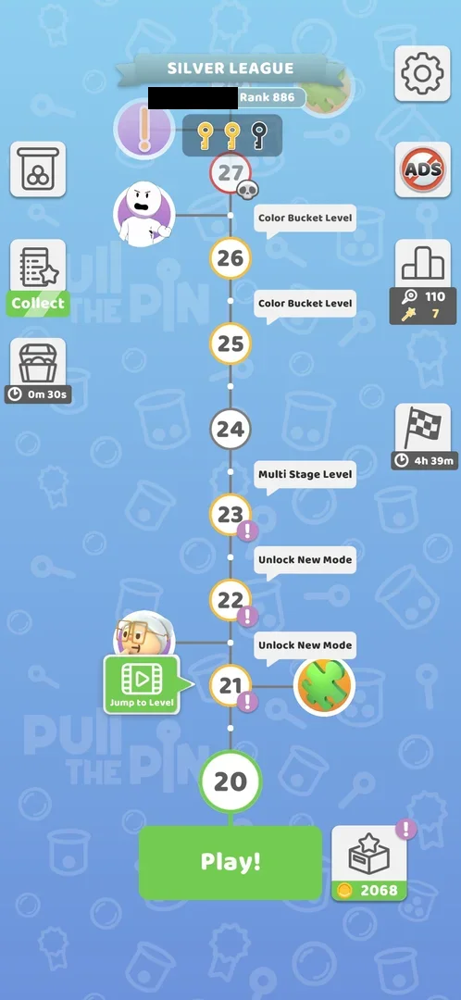
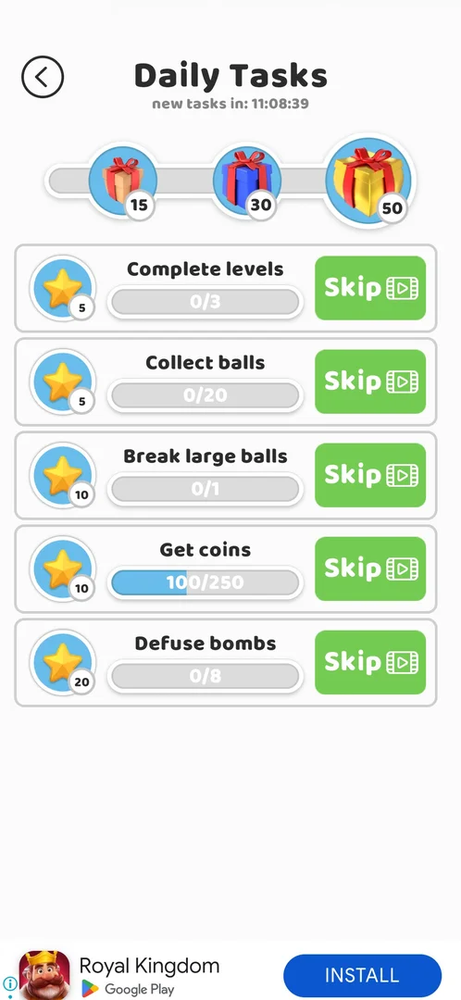
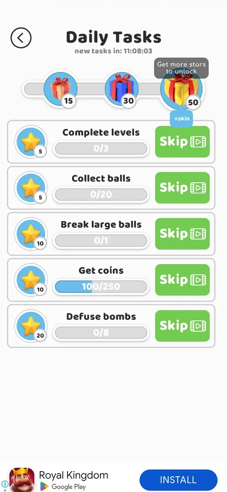
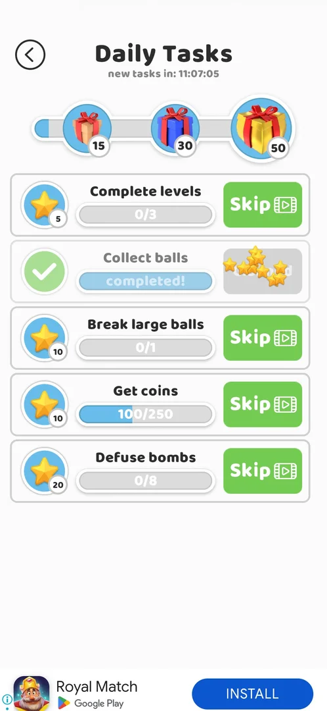
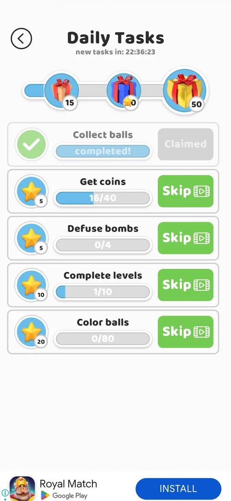

# Daily tasks

A list of five daily tasks opened from a button on the map. Each task fills by normal play (levels won,
balls collected, bombs defused, coins earned) and pays stars; a completed task is claimed with **Collect**
and its stars fill a bar with three gifts, at 15, 30 and 50 stars. Any task can be completed at once with
**Skip**, which plays a rewarded video. At local midnight the whole list is replaced by five new tasks and
the bar starts again from 0 [^s1] [^s2] [^s3].

## Why it appeared

The map button (a clipboard with a star, with the tooltip "Take a look on Daily tasks!") was first shown on
the map after the level 14 win [^s4].

## Where to find it

The map: the clipboard-with-star button in the left column, under the jar button and above the chest with
its timer [^s5]. When a task is completed and not yet claimed, a green
**Collect** label shows under the button [^s6]. Tapping it opens the Daily
Tasks screen [^s1]; the phone's back key returned to the map
[^s7].

 [^s6]
*The map at level 20 (version 241.5.2): the clipboard-with-star button in the left column, with the green Collect label under it (the player's name in the league banner blacked out)*

## What it looks like

 [^s1]
*The Daily Tasks screen on 5 October at 12:51: the countdown, the gift bar and five task rows*

From the top [^s1]:

- the back arrow and the title **Daily Tasks**, with **new tasks in:** and a countdown (11:08:39 at 12:51
  local time) under it;
- a progress bar with three gift boxes on it, marked 15, 30 and 50 (the 50 gift larger and gold);
- five task rows: a star with the task's reward in stars, the task name, a progress bar with a counter, and
  a green **Skip** button with a video icon; a completed row shows **completed!** and a **Collect** button
  instead [^s3].

## What you can do

| Tab or button | What it does |
|---|---|
| [Gifts](#gifts) | Tap a gift: a tooltip with its content; locked until the bar reaches it |
| [Skip](#skip) | Plays a rewarded video, then the task is completed and pays its stars |
| [Collect](#collect) | On a completed task: claims its stars into the bar |
| [Next day](#next-day) | Not a button: the list as it stands after local midnight |
| [Back arrow](#back-arrow) | Leaves the screen (the back key returned to the map) |

### Gifts

 [^s8]
*The 50-star gift tapped with 0 stars: "Get more stars to unlock" above it, "+skin" below*

Tapping a gift that the bar has not reached shows **Get more stars to unlock** and its content: +74 coins at
15 stars, +149 coins at 30 stars, a skin at 50 stars [^s8]. Claiming a gift was
not tried (the bar did not reach 15 stars).

### Skip

 [^s2]
*After the video: Collect balls reads completed! with a green tick; its stars fly from the Skip button to the bar*

 [^s2]
*Clip 4.1 s · [original on YouTube from 2:32](https://youtu.be/rULKLs8ztsM?t=152); the clip starts as the "Reward granted" screen closes*

**Skip** on Collect balls (0/20, 5 stars) started a rewarded video of about 30 s; after its "Reward granted"
screen was closed, the row showed **completed!** with a green tick, five stars flew into the bar, the bar
moved a little toward the 15 gift, and the button became a grey **Claimed** [^s2].
No offer screen comes before the video [^s2].

### Collect

 [^s9]
*After Collect on the completed Collect balls row: the row greyed out with a check, the button reads Claimed, 10 stars in the bar toward the 15 gift*

A task completed by play shows **completed!** and a green **Collect** button. Collect on Collect balls
(10 stars) turned the row grey with a green check, the button became a grey **Claimed**, and the 10 stars
went into the bar, two thirds of the way to the 15 gift [^s9].

### Next day

 [^s3]
*The list on 6 October at 01:23: a new set of five tasks, the bar back at 0 with the same gifts, the countdown to the next midnight*

At 01:23 on 6 October the countdown read 22:36:39, that is to 00:00 local time; the five tasks were all new,
with other targets and star values than on 5 October, the bar was back at 0 with the same gifts 15/30/50, and
play after midnight already counted (Collect balls completed, Complete levels 1/10)
[^s3].

### Back arrow

<!-- no-frame: the arrow is at the top left of the screen frames above; the back key led to the map frame under Where to find it -->

The back arrow sits at the top left [^s1]. The phone's back key returned to the
map [^s7]; the arrow was tapped on 6 October and also returned to the map
[^s10].

## How it works

Version 241.5.2.

| Task | 5 October: progress, stars | 6 October: progress, stars |
|---|---|---|
| Complete levels | 0/3, 5 | 1/10, 10 |
| Collect balls | 0/20, 5 | completed, 10 |
| Break large balls | 0/1, 10 | — |
| Get coins | 100/250, 10 | 16/40, 5 |
| Defuse bombs | 0/8, 20 | 0/4, 5 |
| Color balls | — | 0/80, 20 |

Sources: 5 October [^s1], 6 October [^s3].

- Each day's five tasks pay 50 stars in all, as much as the last gift needs (both days)
  [^s1] [^s3].
- Gifts: 15 stars +74 coins, 30 stars +149 coins, 50 stars a skin [^s8]; the same
  three marks on the second day [^s3].
- Reset: at 00:00 local time the list, the targets and the star values change and the bar starts at 0
  [^s3]. The stars of 5 October were not carried over (the bar was empty);
  whether an unclaimed gift survives the reset was not seen.
- Get coins counts coins from any source: it already stood at 100/250 when the screen was first opened, right
  after the +100 coin claim of Daily Rewards day 3, before any level was played
  [^s1] ([Daily Rewards](daily-rewards.md)).
- It is not a board to play: the tasks fill during the levels [^s2].

## Cases

| Case | What was done | Result | Source |
|---|---|---|---|
| Why it appeared: the map button with the tooltip "Take a look on Daily tasks!" first shown after the level 14 win <!-- case:chk-appeared --> | Won level 14, returned to the map | ✅ The button and its tooltip on the map | [^s4] |
| Map, left column, clipboard-with-star button under the modes jar <!-- case:chk-entry --> | Tapped the button on the map | ✅ The Daily Tasks screen opened | [^s5] |
| Daily Tasks screen: back arrow, "new tasks in" countdown, star bar with 3 gifts (15, 30, 50 stars), 5 task rows with star reward, progress bar and Skip (video) <!-- case:chk-screen --> | Opened the screen | ✅ Seen | [^s1] |
| Stars from tasks fill a bar with 3 gifts: 15 stars +74 coins, 30 stars +149 coins, 50 stars a skin; a locked gift says "Get more stars to unlock" <!-- case:chk-today --> | Tapped each of the three gifts | ✅ Tooltips with the contents | [^s8] |
| Tasks today: Complete levels 0/3 (5 stars), Collect balls 0/20 (5), Break large balls 0/1 (10), Get coins 100/250 (10), Defuse bombs 0/8 (20); 50 stars in all <!-- case:chk-calendar --> | Read the screen | ✅ Seen | [^s1] |
| Get coins counts coins from any source: the Daily Rewards day 3 claim (+100) showed as 100/250 before any level <!-- case:counts-all-sources --> | Claimed Daily Rewards day 3, opened Daily tasks | ✅ Get coins 100/250 | [^s1] |
| The next day: what renews and when <!-- case:chk-next-day --> | Opened the screen at 01:23 the next day | ✅ At local midnight five new tasks with new targets and star values (Collect balls 10, Get coins 16/40 5, Defuse bombs 0/4 5, Complete levels 1/10 10, Color balls 0/80 20); the bar back at 0, gifts 15/30/50 again; play after midnight already counted | [^s3] |
| Collect on a completed task <!-- case:claim-stars --> | Tapped Collect on Collect balls | ✅ The row grey with a check and Claimed; 10 stars in the bar (10 of 15) | [^s9] |
| A missed day: what is lost or reset <!-- case:chk-missed --> | — | not verified |  |
| Not a board: a task list; tasks fill by normal play (levels, balls, bombs, coins) <!-- case:chk-play --> | Read the screen | ✅ A list, nothing to play | [^s2] |
| Skip (video) on a task: rewarded video, then the task is completed and its stars go to the bar <!-- case:skip-video --> | Tapped Skip on Collect balls, watched the video | ✅ completed!, 5 stars to the bar, Claimed | [^s2] |

## Not verified

- A missed day: what is lost or reset when a whole day passes without opening the game <!-- case:chk-missed -->
- Claiming a gift: the bar never reached 15 stars (experiment daily-tasks-gift-claim).
- Whether a reached but unclaimed gift survives the midnight reset.
- Whether Skip can be used on every task and as many times as there are tasks.

[^s1]: session 20261005-125008-chrono-2FYKPJ, step 2 — [video at 1:02](https://youtu.be/rULKLs8ztsM?t=62)
[^s2]: session 20261005-125008-chrono-2FYKPJ, step 7 — [video at 2:35](https://youtu.be/rULKLs8ztsM?t=155)
[^s3]: session 20261006-012240-chrono-2FYKPJ, step 1 — [video at 0:30](https://youtu.be/jf_j5LiHuRs?t=30)
[^s4]: session 20261005-014031-chrono-2FYKPJ, step 21 — [video at 9:18](https://youtu.be/7nClZQUPXn4?t=558)
[^s5]: session 20261005-125008-chrono-2FYKPJ, step 1 — [video at 0:34](https://youtu.be/rULKLs8ztsM?t=34)
[^s6]: session 20261006-012240-chrono-2FYKPJ, step 0 — [video at 0:00](https://youtu.be/jf_j5LiHuRs?t=0)
[^s7]: session 20261005-125008-chrono-2FYKPJ, step 8 — [video at 2:48](https://youtu.be/rULKLs8ztsM?t=168)
[^s8]: session 20261005-125008-chrono-2FYKPJ, step 5 — [video at 1:37](https://youtu.be/rULKLs8ztsM?t=97)
[^s9]: session 20261006-012240-chrono-2FYKPJ, step 2 — [video at 0:45](https://youtu.be/jf_j5LiHuRs?t=45)
[^s10]: session 20261006-012240-chrono-2FYKPJ, step 3 — [video at 1:04](https://youtu.be/jf_j5LiHuRs?t=64)
