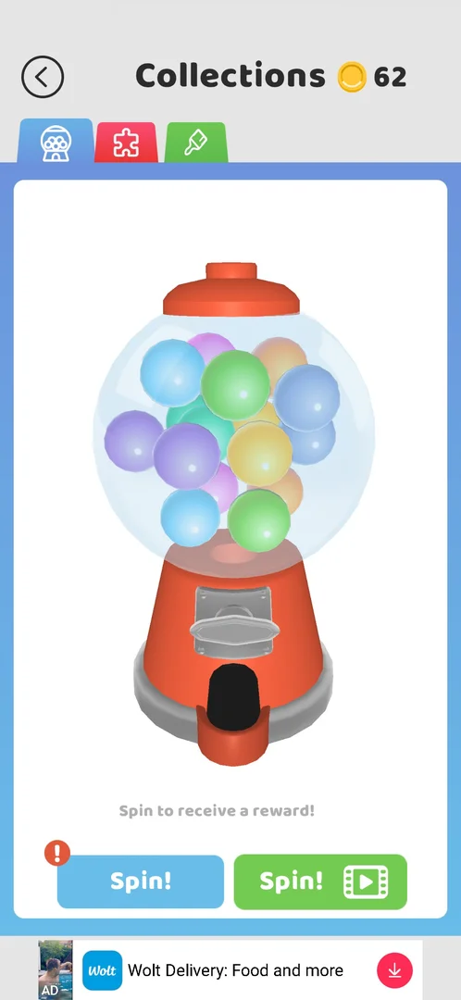
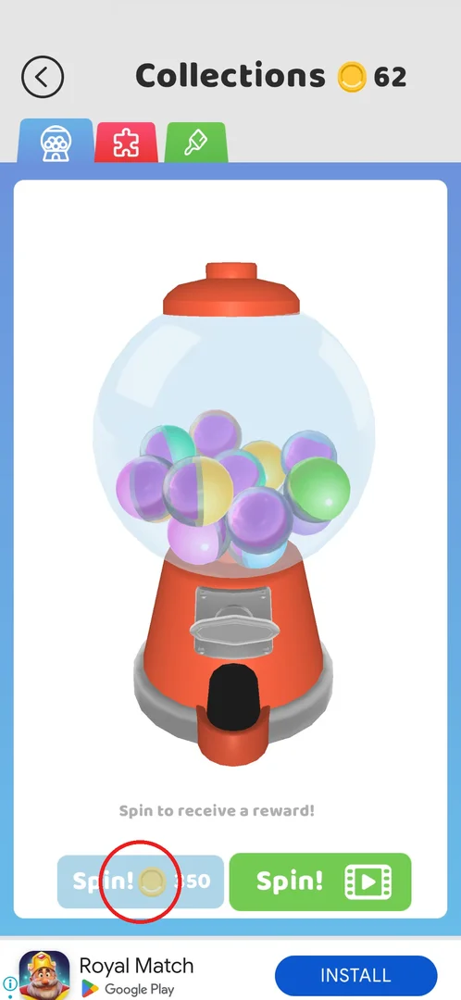
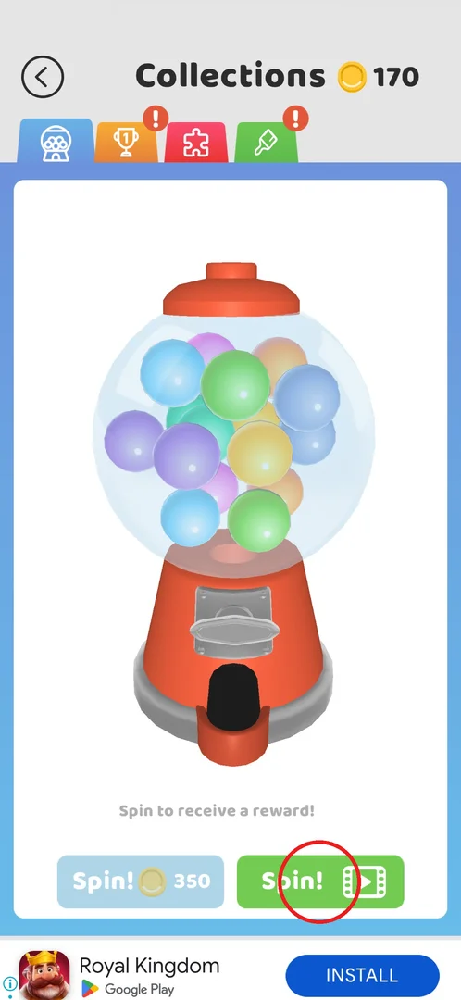
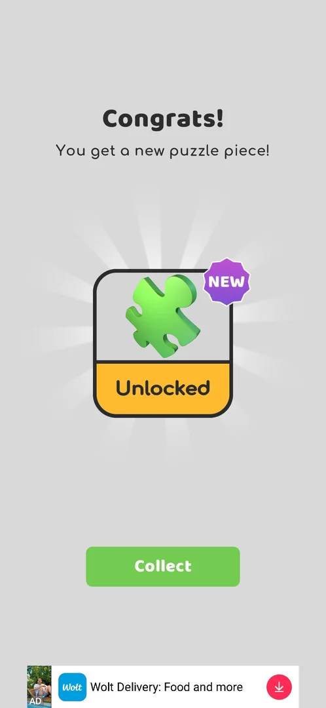
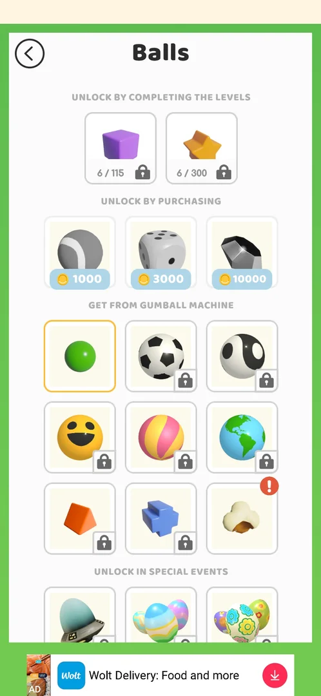

# Collections: Spin machine (gacha)

> Recheck on v241.5.1: documented on 241.3.1; Google Play has 241.5.1.

A gumball machine on the first tab of [Collections](collections.md): one spin gives a random collectible —
a puzzle piece for the [puzzle albums](puzzle-collection.md) or a ball skin for [Skins](skins.md). The first
spin is free; after that a spin costs coins (350 after the free spin) or one rewarded video [^s1].

## Where to find it

Level map → the gift-box button with the coin balance at the bottom right, next to Play! (circled). It
opens Collections on the machine tab [^s2]. During the map tutorial the box is
introduced as "Check your items collection!" [^s3].

 [^s12]

## What it looks like

Collections header with the back arrow and the coin balance; tabs along the top — the machine (blue,
first), the puzzle (red) and the brush (green); by the next session an orange trophy tab had appeared
between the machine and the puzzle [^s4]. The machine tab shows a gumball machine, the line
"Spin to receive a reward!" and two buttons: the blue Spin! (with a red "!" while the free spin is
available) and the green Spin! with a video icon. A banner ad sits below.

 [^s2]

## What you can do

| Tab or button | What it does |
|---|---|
| [Spin! (coins)](#spin-coins) | The first spin is free; afterwards it costs coins (350, then 375 after the video spin) and is greyed out when the balance is short |
| [Spin! (video)](#spin-video) | Watch a rewarded ad (~30 s), then spin |

### Spin! (coins)

The first tap was free: no coins were taken (balance stayed 62) and the reward was a puzzle piece
[^s5]. After it the button reads "Spin! 350" with a coin and is greyed out at 62 coins
[^s1]; tapping it then does nothing — no popup, no offer to buy coins
[^s6]. It was still greyed at 170 coins in the next session [^s4]; after the video spin it read
"Spin! 375" [^s8].

 [^s1]

### Spin! (video)

Starts a full rewarded ad of about 30 s; after "Reward granted" the ad is closed with the cross at the top
left, and the machine gives its reward — here "Congrats! You get a new
skin!", the Popcorn ball, marked NEW, with Collect [^s7]. Collect returns to Collections
[^s8].

 [^s4]

 [^s7]

### Popup

Every spin ends in a "Congrats!" popup with the item card (NEW, Unlocked) and Collect. A puzzle piece then
opens the "Puzzle Piece Found" grid with an extra Get Another button (one more piece for a video, offered
once) — see [Puzzles](puzzle-collection.md) [^s9] [^s10].

 [^s5]

### Result

The ball skins the machine can give are the 9 balls of the "GET FROM GUMBALL MACHINE" block in the Balls
list (Collections → brush → Balls): the green default ball, Popcorn (won by the video spin) and 7 locked
ones [^s11].

 [^s11]

## How it works

Version 241.3.1:

- First spin: free; the blue button carries a red "!" while it is available [^s5].
- Next spins: coins, or one rewarded video (~30 s) [^s7]. The coin price read 350 after the free spin
  [^s1] and 375 after the video spin [^s8].
- Rewards seen: a puzzle piece (free spin), a ball skin (video spin). Which pool, in what proportion, is not
  known (inferred: puzzle pieces and the 9 gumball-machine balls).
- Not enough coins: the coin button is greyed and a tap does nothing [^s6].

## Cases

| Case | What was done | Result | Source |
|---|---|---|---|
| Free spin | The first Spin! with 62 coins | Free (balance stays 62); a puzzle piece | [^s5] |
| Coin spin | Spin! 350 with 62 coins | Nothing happens: no popup, no offer | [^s6] |
| Video spin | Green Spin!, ~30 s ad, closed after "Reward granted" | "Congrats! You get a new skin!" — Popcorn ball, Collect | [^s7] |
| Free spin refresh | — | not verified | |

## Not verified

- When the free spin comes back.
- What a paid coin spin gives — never had enough coins.
- Does the coin price grow with each spin (350 after the free spin, 375 after the video spin).
- The reward odds and whether duplicates can drop.

[^s1]: session 20260930-192115-chrono-2FYKPJ, step 35 — [video at 8:07](https://youtu.be/BVqoYRE5kRU?t=487)
[^s2]: session 20260930-192115-chrono-2FYKPJ, step 29 — [video at 5:32](https://youtu.be/BVqoYRE5kRU?t=332)
[^s3]: session 20260930-192115-chrono-2FYKPJ, step 27 — [video at 5:08](https://youtu.be/BVqoYRE5kRU?t=308)
[^s4]: session 20260930-201034-chrono-2FYKPJ, step 1 — [video at 0:26](https://youtu.be/JGEX3-Rfkdw?t=26)
[^s5]: session 20260930-192115-chrono-2FYKPJ, step 30 — [video at 5:44](https://youtu.be/BVqoYRE5kRU?t=344)
[^s6]: session 20260930-192115-chrono-2FYKPJ, step 36 — [video at 8:17](https://youtu.be/BVqoYRE5kRU?t=497)
[^s7]: session 20260930-201034-chrono-2FYKPJ, step 3 — [video at 1:24](https://youtu.be/JGEX3-Rfkdw?t=84)
[^s8]: session 20260930-201034-chrono-2FYKPJ, step 4 — [video at 1:46](https://youtu.be/JGEX3-Rfkdw?t=106)
[^s9]: session 20260930-192115-chrono-2FYKPJ, step 31 — [video at 6:05](https://youtu.be/BVqoYRE5kRU?t=365)
[^s10]: session 20260930-192115-chrono-2FYKPJ, step 34 — [video at 7:51](https://youtu.be/BVqoYRE5kRU?t=471)
[^s11]: session 20260930-201034-chrono-2FYKPJ, step 19 — [video at 4:09](https://youtu.be/JGEX3-Rfkdw?t=249)
[^s12]: session 20260930-201034-chrono-2FYKPJ, step 0 — [video at 0:00](https://youtu.be/JGEX3-Rfkdw?t=0)
