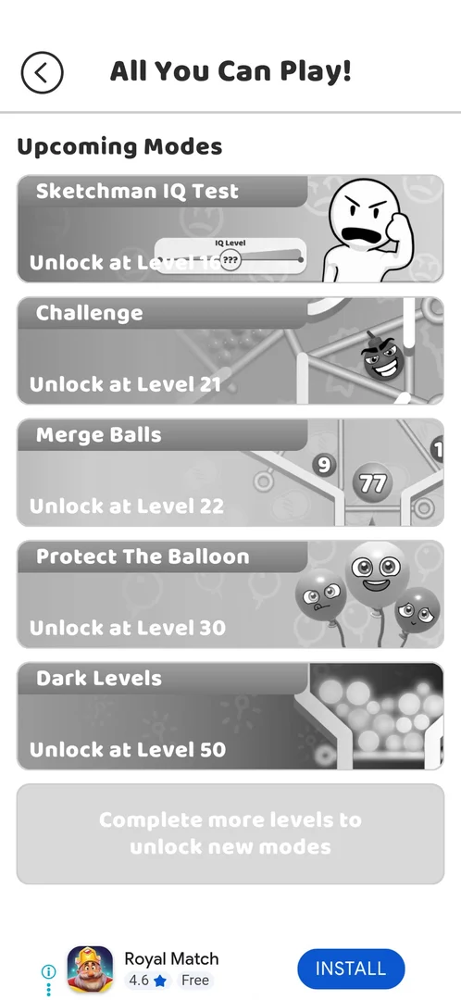

# All You Can Play! modes menu

> Recheck on v241.5.1: documented on 241.3.1; Google Play has 241.5.1.

A jar button at the top left of the map, present after level 8 [s:20260930-201034-chrono-2FYKPJ#69] [s:20260930-201034-chrono-2FYKPJ#70].

## Cases
| Case | What was done | Result | Source |
|---|---|---|---|
| Button | Finished level 8 | The jar button appeared | [s:20260930-201034-chrono-2FYKPJ#69] |
| Open | Tapped it | 5 upcoming modes with unlock levels; a locked mode does nothing on tap | [s:20260930-201034-chrono-2FYKPJ#70] [s:20260930-201034-chrono-2FYKPJ#71] |

## Not verified
- Every mode's rules and rewards (from level 16).
