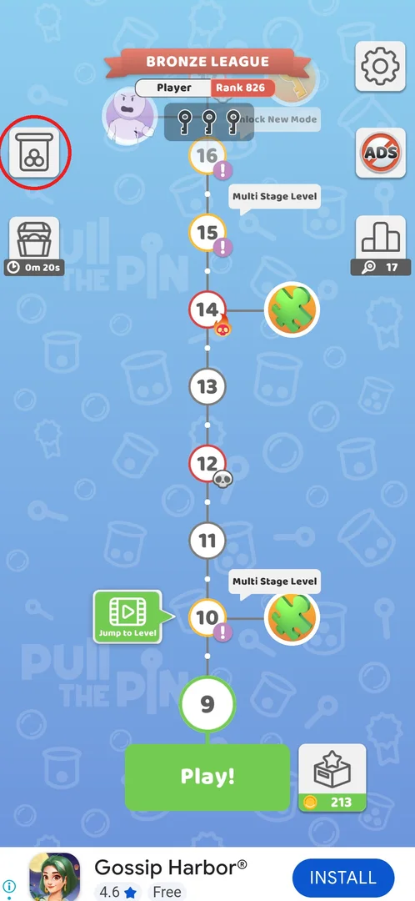
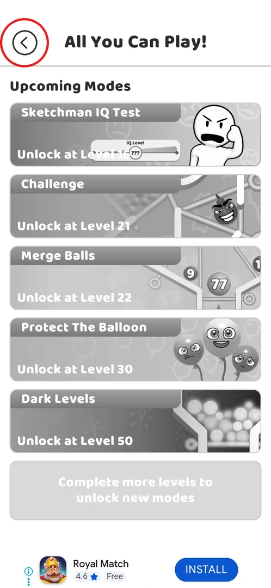
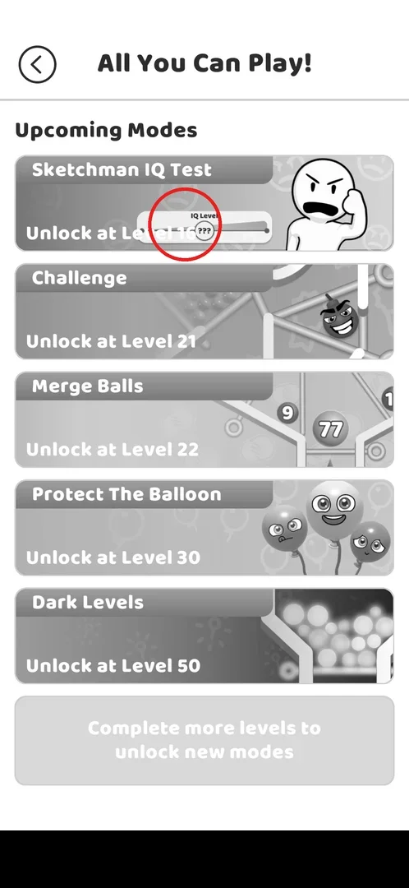

# All You Can Play! modes menu

> Recheck on v241.5.1: documented on 241.3.1; Google Play has 241.5.1.

All You Can Play! is the menu of the game's extra modes beyond the main level map. It appears after
level 8 and lists five upcoming modes, each with the level at which it unlocks; on 241.3.1, at
level 9, all of them were still locked [^s1] [^s2].

## Where to find it

On the level map, the jar button with balls on the left edge, above the chest button. It was not
there before; it appeared on the map after level 8 was finished [^s1] [^s2].

 [^s1]

## What it looks like

A full screen titled "All You Can Play!" with a back arrow at the top left and the section "Upcoming
Modes": five greyed-out cards, each with the mode's name and "Unlock at Level N", and below them a
grey bar "Complete more levels to unlock new modes". A banner ad sits at the bottom [^s2].

 [^s2]

## What you can do

| Tab or button | What it does |
|---|---|
| [Back arrow](#back-arrow) | Returns to the level map |
| [Locked mode](#locked-mode) | A tap on a locked mode card does nothing |

### Back arrow

The round back arrow at the top left closes the menu and returns to the level map [^s4].

 [^s2]

### Locked mode

A tap on the locked Sketchman IQ Test card left the screen unchanged: no hint, no popup [^s3].

 [^s3]

## How it works

- The button appears on the map after level 8 is finished (v241.3.1) [^s1].
- Modes unlock by the level reached (v241.3.1) [^s2]:

| Mode | Unlocks at level |
|---|---|
| Sketchman IQ Test | 16 |
| Challenge | 21 |
| Merge Balls | 22 |
| Protect The Balloon | 30 |
| Dark Levels | 50 |

- The map at the same time showed "Unlock New Mode" next to level 16, which matches Sketchman IQ
  Test unlocking at level 16 (inferred) [^s1].

## Cases

| Case | What was done | Result | Source |
|---|---|---|---|
| The All You Can Play! button appears on the map after level 8 | Finished level 8 and returned to the map | The jar button appeared on the left | [^s1] |
| Open the modes menu: 5 upcoming modes with unlock levels 16-50 | Tapped the jar button | 5 upcoming modes with unlock levels | [^s2] |
| Tap a locked mode | Tapped the Sketchman IQ Test card | Nothing happened | [^s3] |

## Not verified

- Every mode's rules and rewards (from level 16).
- What the menu looks like once a mode is unlocked.

[^s1]: session 20260930-201034-chrono-2FYKPJ, step 69 — [video at 22:15](https://youtu.be/JGEX3-Rfkdw?t=1335)
[^s2]: session 20260930-201034-chrono-2FYKPJ, step 70 — [video at 22:38](https://youtu.be/JGEX3-Rfkdw?t=1358)
[^s3]: session 20260930-201034-chrono-2FYKPJ, step 71 — [video at 23:02](https://youtu.be/JGEX3-Rfkdw?t=1382)
[^s4]: session 20260930-201034-chrono-2FYKPJ, step 72 — [video at 23:19](https://youtu.be/JGEX3-Rfkdw?t=1399)
