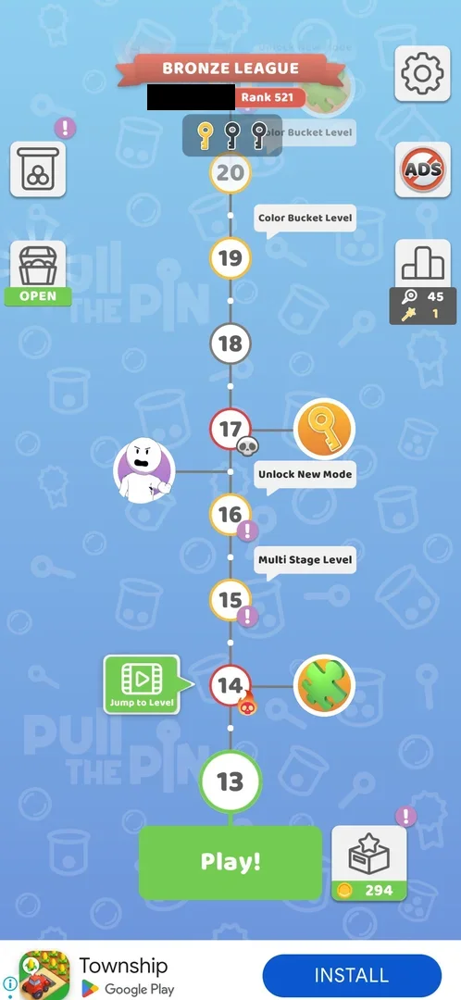
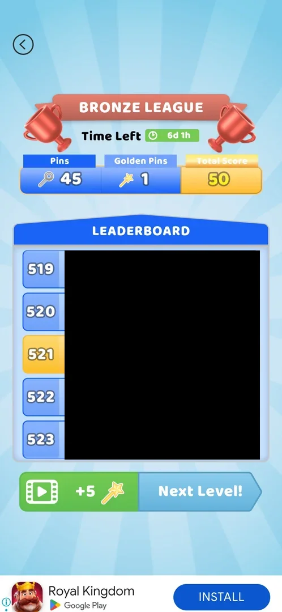
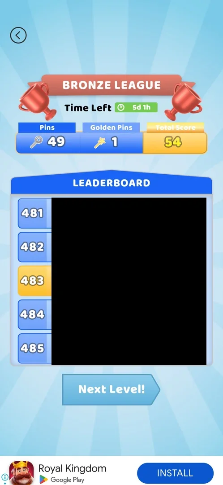
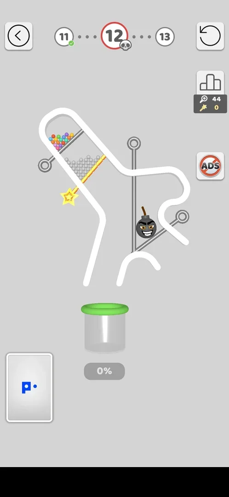
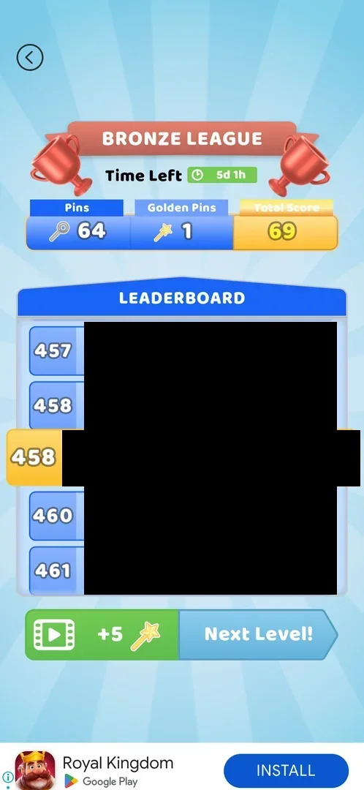
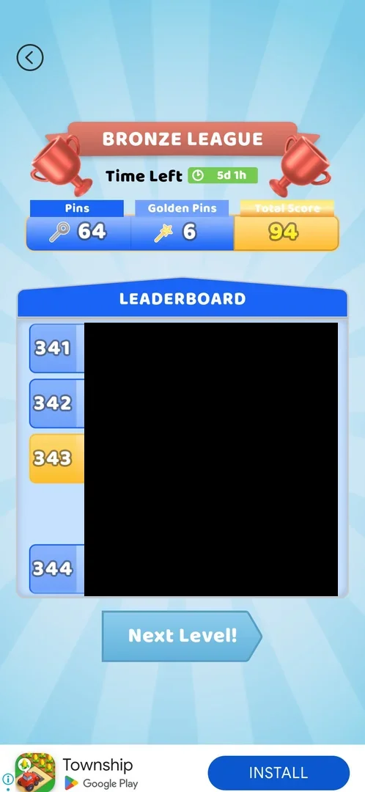

# Golden pins (league score)

A second score of the Bronze League (the league of [Pull Fest Ranking](pull-fest.md)): a golden pin with a
star head sits on a level board among the usual grey pins, and pulling it adds one **Golden Pin** to the
player's league score next to the ordinary **Pins** [^s3] [^s4]. Each golden pin counts as 5 in the league's
**Total Score** [^s4] [^s8] [^s6]. After a played win the league board also offers a video for +5 golden pins
[^s5] [^s6]. Golden pins are never spent [^s6].

## Why it appeared

Golden star-wand pin on hard L12; after the win the Bronze League board showed a Golden Pins counter (1) next
to Pins, Total Score 50, and a video offer +5 golden pins; the map league panel now shows a wand counter [^s1].
The first golden pin seen was on hard level 12 [^s3]; the map's league panel already showed the wand counter
at 0 right before that level, after the level 11 win [^s7].

## Where to find it

It has no button of its own. On the map, the dark panel under the ranking icon at the right edge shows two
counters: a magnifier-pin with the Pins and a golden wand with the Golden Pins [^s1] [^s7]. The full score is
on the Bronze League board that comes after each win [^s4] [^s2].

 [^s1]
*The map after the level 12 win: the panel under the ranking icon at the right shows Pins 45 and the golden wand counter 1 (the player's name in the league banner blacked out)*

## What it looks like

 [^s4]
*The Bronze League board after the level 12 win: Pins 45, Golden Pins 1, Total Score 50, the green video button with +5 and a wand left of Next Level! (the leaderboard names blacked out)*

The Bronze League board after a win has three boxes above the leaderboard: **Pins** (blue, a magnifier-pin
icon), **Golden Pins** (blue, a wand icon) and **Total Score** (yellow) [^s4]. Under the leaderboard a played
win shows two buttons: a green video button with "+5" and a wand on the left, **Next Level!** on the right
[^s4] [^s5].

 [^s2]
*The board after level 13 was skipped with [Jump to Level](jump-to-level.md): Pins 49, Golden Pins 1, Total Score 54, Time Left 5d 1h; no +5 video button, only Next Level! (the leaderboard names blacked out)*

## What you can do

| Tab or button | What it does |
|---|---|
| [Golden pin in a level](#golden-pin-in-a-level) | A pin with a star head; pulling it adds one Golden Pin |
| [Golden pins video](#golden-pins-video) | The green video button on the league board after a played win: a rewarded video for +5 golden pins, once per board |

### Golden pin in a level

 [^s3]
*Level 12 (a hard level): the golden pin with a yellow star head holds the grey balls; the panel at the right shows Pins 44 and the wand 0 (a banner ad blacked out)*

On level 12 one of the three pins was golden with a yellow star for a head; it held the grey balls and the
coloured ones above them [^s3]. It is pulled like any pin [^s4]. After the win the board showed Golden Pins 1
[^s4]. No golden pin was seen on levels 13 and 14 [^s8] [^s5].

### Golden pins video

 [^s4]
*The green button with a video icon, +5 and a wand, left of Next Level! on the league board*

The board after the level 14 win, before the video:

 [^s5]
*After the level 14 win (two tries): Pins 64, Golden Pins 1, Total Score 69, rank 458; the +5 video button left of Next Level! (the leaderboard names blacked out)*

Tapping the button starts a rewarded video; in version 241.5.2 it ran about 55 s and ended on a "Reward
granted" card closed with its X [^s6]. Back on the board, Golden Pins went from 1 to 6 and the Total Score from
69 to 94, the rank from 458 to 343, and the video button was gone, leaving only **Next Level!** [^s6].

*The Reward granted card closes and the league board shows Golden Pins 6, Total Score 94, only Next Level!* (clip dropped: per-dream clip limit) [^s6]
*Clip 4.7 s · [original on YouTube from 8:17](https://youtu.be/7nClZQUPXn4?t=497)*

 [^s6]
*After the +5 video: Golden Pins 6, Total Score 94, rank 343; only Next Level! is left (the leaderboard names blacked out)*

The offer was not taken after the level 12 and level 13 wins in version 241.5.1 [^s9]. After level 13 was
skipped with [Jump to Level](jump-to-level.md) the board offered no video [^s2].

## How it works

Versions 241.5.1 and 241.5.2.

| Moment | Pins | Golden Pins | Total Score | Source |
|---|---|---|---|---|
| Before level 12 (map, league panel) | 44 | 0 | — | [^s7] [^s3] |
| After the level 12 win (golden pin pulled) | 45 | 1 | 50 | [^s4] |
| After the last pull of level 13 (no golden pin seen) | 49 | 1 | 54 | [^s8] |
| After level 13 skipped by Jump to Level (241.5.2) | 49 | 1 | 54 | [^s2] |
| After the level 14 win, two tries | 64 | 1 | 69 | [^s5] |
| After the +5 video | 64 | 6 | 94 | [^s6] |

- Total Score = Pins + 5 × Golden Pins on every board seen (45 + 5 = 50, 49 + 5 = 54, 64 + 5 = 69,
  64 + 30 = 94) [^s4] [^s8] [^s5] [^s6].
- Golden pins come from two sources seen: a golden pin pulled in a level (+1, hard level 12) and the
  post-win video (+5, once per board after a played win) [^s6].
- Ordinary Pins: +1 per pin pulled, counted in a lost try as well. Level 14 was lost once (Pins 49 → 57 during
  that try) and won on the retry; the board then showed 64 [^s5].
- A skip with Jump to Level added no pins (49 before and after) and brought no +5 video [^s2].
- Sinks: none. No button on the map, the league board or Collections spends golden pins; they only add to the
  Total Score [^s6].
- No timer, no refill and no offer at 0: the count started at 0 with no other effect than a lower league
  score [^s6].
- The rank in the league: 554 before level 12, 521 after it, 505 after level 13 [^s7] [^s1] [^s8]; 458 after
  the level 14 win and 343 after the +5 video [^s5] [^s6]. The league week showed 5d 1h left on 5 October 2026
  [^s2].
- Whether golden pins appear only on hard levels is not known: the only one seen was on hard level 12 [^s3].

## Cases

| Case | What was done | Result | Source |
|---|---|---|---|
| The +5 golden pins video <!-- case:video-plus-5 --> | After the level 14 win, tapped the green +5 button, watched the video (~55 s), closed Reward granted with X | ✅ Golden Pins 1 → 6, Total 69 → 94; the button then disappears, once per board; not offered after a Jump to Level skip | [^s6] [^s2] |
| Why it appeared <!-- case:chk-appeared --> | Played hard level 12 | ✅ The golden pin on level 12, the Golden Pins box after the win | [^s1] |
| No own entry: shown on the post-win league board and as a wand counter under the pins counter in the map league panel (0 before level 12) <!-- case:chk-entry --> | Looked at the map after the level 11 and 12 wins | ✅ Wand counter 0, then 1 | [^s7] [^s1] |
| League board after a win: Pins / Golden Pins / Total Score row above the leaderboard, a +5 golden pins video button left of Next Level <!-- case:chk-screen --> | Won hard level 12 with the golden pin pulled | ✅ The board above | [^s4] |
| One golden pin adds 5 to the league Total Score <!-- case:chk-effect --> | Won level 12; finished level 13 | ✅ 45 + 1 golden = 50; 49 + 1 golden = 54 | [^s4] [^s8] |
| The balance: league board (Golden Pins) and map league panel (wand counter) <!-- case:chk-balance --> | Won level 12; finished level 13 | ✅ 0 → 1 → 1 | [^s8] |
| Sources <!-- case:chk-sources --> | Pulled a golden pin on level 12; watched the +5 video after level 14; lost and retried level 14 | ✅ Golden: +1 per golden pin in a level, +5 per post-win video (once per played win). Ordinary Pins: +1 per pin pulled, also in a lost try (49 → 57 after the loss, kept on retry) | [^s6] [^s5] |
| Sinks <!-- case:chk-sinks --> | Looked for a use on the map, the board and Collections | ✅ None: never spent, only 5 points each in the Total Score | [^s6] |
| At zero <!-- case:chk-empty --> | Started at 0 | ✅ Does not apply: no effect beyond a lower league score, no refill offer | [^s6] |
| Refill timer <!-- case:chk-refill --> | — | ✅ Does not apply: no timer; golden pins come only from levels and the post-win video | [^s6] |

## Not verified

- Whether Pins and Golden Pins reset when the league week ends (5d 1h left on 5 October 2026); a follow-up is
  set for after 10 October.
- On which levels golden pins appear (only hard level 12 seen).

[^s1]: session 20261004-005453-chrono-2FYKPJ, step 12 — [video at 11:15](https://youtu.be/rH_NzK3D4WA?t=675)
[^s2]: session 20261005-014031-chrono-2FYKPJ, step 4 — [video at 1:50](https://youtu.be/7nClZQUPXn4?t=110)
[^s3]: session 20261004-005453-chrono-2FYKPJ, step 7 — [video at 7:00](https://youtu.be/rH_NzK3D4WA?t=420)
[^s4]: session 20261004-005453-chrono-2FYKPJ, step 9 — [video at 8:29](https://youtu.be/rH_NzK3D4WA?t=509)
[^s5]: session 20261005-014031-chrono-2FYKPJ, step 17 — [video at 6:33](https://youtu.be/7nClZQUPXn4?t=393)
[^s6]: session 20261005-014031-chrono-2FYKPJ, step 19 — [video at 8:21](https://youtu.be/7nClZQUPXn4?t=501)
[^s7]: session 20261004-005453-chrono-2FYKPJ, step 6 — [video at 6:09](https://youtu.be/rH_NzK3D4WA?t=369)
[^s8]: session 20261004-005453-chrono-2FYKPJ, step 17 — [video at 12:41](https://youtu.be/rH_NzK3D4WA?t=761)
[^s9]: session 20261004-005453-chrono-2FYKPJ, step 10 — [video at 8:49](https://youtu.be/rH_NzK3D4WA?t=529)
