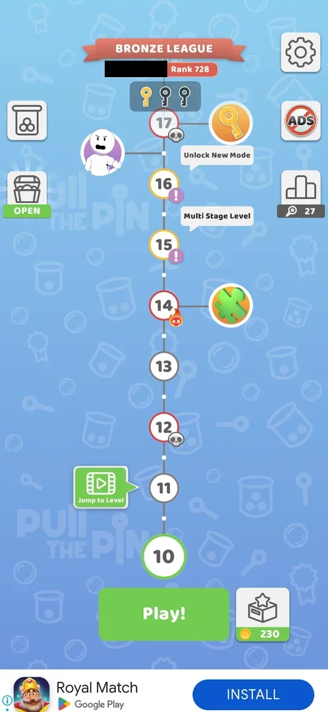
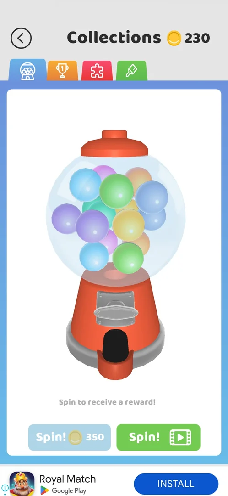
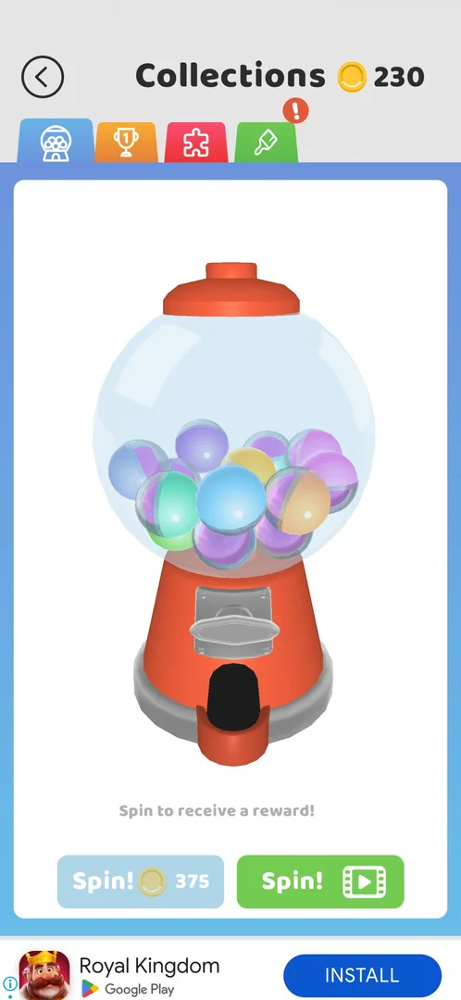
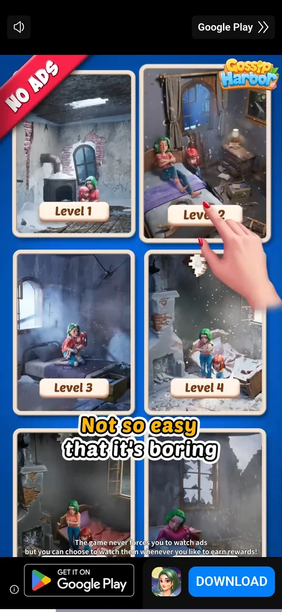
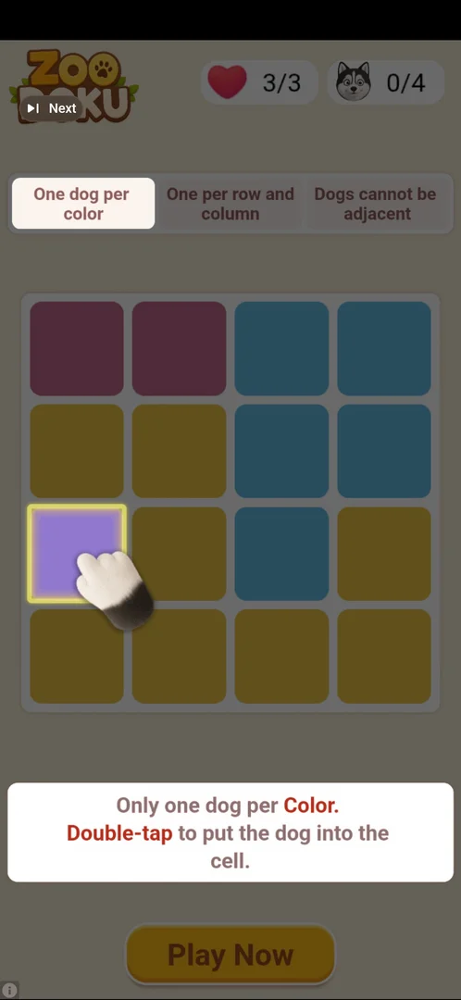
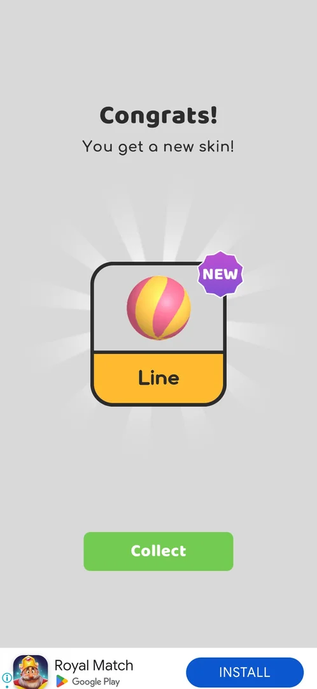
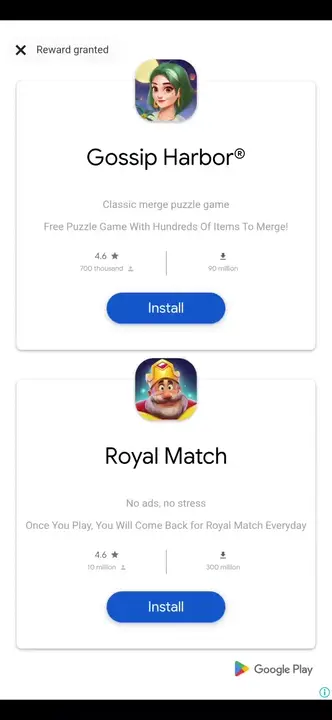

# Gumball machine

A gumball machine on the first tab of [Collections](collections.md): a spin gives a ball skin. A spin is paid
with coins (350 at first, then 375; the first spin was free) or with a rewarded video ad [^s1] [^s3] [^s4] [^s11].
Its skins are the group "Get from gumball machine" in the Balls category of Collections: nine balls [^s5].
Both spins seen so far each gave a new ball skin: Popcorn (the free spin) and Line (a video spin) [^s4] [^s10].

## Why it appeared

With Collections, on the first visit after level 3: the gumball tab opened first, with the first spin free
(a ! badge on the blue Spin!) [^s3]. No separate unlock was seen: the gumball tab is the first tab of
Collections and is there whenever the Collections button is [^s9].

## Where to find it

The map: the Collections button, a gift box with the coin balance under it, right of **Play!**. It opens
Collections, and Collections opens on the gumball tab, the first (blue) of its four tabs [^s2] [^s1]. The jar
icon at the top left of the map is not this feature: it opens the modes list
[All You Can Play!](ball-jar.md) [^s12].

 [^s2]
*Map at level 10: the Collections button (gift box, balance 230) right of Play! opens Collections on the gumball tab (the player's name in the league banner blacked out)*

## What it looks like

 [^s2]
*The gumball tab at 230 coins: the blue Spin! (350 coins) greyed out, the green Spin! with a video icon*

A gumball machine full of coloured balls, the line "Spin to receive a reward!", and two buttons: a blue
**Spin!** with the coin price and a green **Spin!** with a video icon [^s1] [^s7]. With 230 coins the blue
one is greyed out [^s1] [^s7]. The header shows "Collections" and the coin balance; a back arrow at top left
[^s7]. There is no progress bar or spin counter on the tab: only the machine and the two buttons [^s9].

## What you can do

| Tab or button | What it does |
|---|---|
| [Spin! (coins)](#spin-coins) | A paid spin: 350 coins, 375 after the video spin gave a skin; greyed out below the price; the first spin is free [^s4] [^s1] [^s11] |
| [Spin! with video](#spin-with-video) | Plays a rewarded video ad; once it was closed properly, the machine spun and gave a ball skin [^s10] |

### Spin! (coins)

 [^s11]
*After the video spin: the blue Spin! asks 375 coins (was 350), still greyed out at 230; a red ! badge on the fourth (brush) tab*

The blue **Spin!** with the coin price: 350 coins, greyed out at 230 coins [^s1] [^s7]. The first spin was
free (the button carried a ! badge) and gave the ball skin Popcorn [^s4]; see the first clip under How it
works. After the video spin gave the skin Line, the price on the button was 375 coins, and the fourth tab
(skins) had a red ! badge [^s11]. A paid spin was not made [^s6].

### Spin! with video

 [^s8]
*The rewarded video that the green Spin! starts: an ad for another game, a mute button top left, a "Google Play >>" control top right, a Download bar at the bottom*

The green **Spin!** opens a full-screen video ad for another game at once, with no confirmation [^s8].
Three tries in version 241.5.1 ended differently:

- First try: the video was still playing about 2 min 45 s after the tap; about 3 min 15 s after the tap a
  playable end card of the advertised game was showing, with an X at top right. The phone stopped accepting
  taps at that point, so the reward was not seen [^s8].
- Second try: about 1 min of video, then a playable end card that opened the Play Store sheet of the
  advertised game by itself, again about every 20 s after the player returned to the game; its "Next"
  control at top left and Back did nothing [^s9]. After a restart the map showed 230 coins and no reward
  [^s9].
- Third try: about 30 s of video, then a Google sheet headed "Reward granted" with an X at top left, listing
  other games to install. The X closed it, the machine spun at once (about 4 s) and the game showed
  "Congrats! You get a new skin!" with the ball skin **Line** (NEW) and **Collect** [^s10]. The coin balance
  stayed 230 [^s10].

 [^s9]
*The end card of the second try: a playable ad of another game, a small "Next" control at top left, Play Now at the bottom*

 [^s10]
*The video spin's reward: the ball skin Line (pink and yellow stripes), NEW, Collect*

Inferred: an interrupted video spin (the second try) gives nothing; a completed one gives a skin.

## How it works

Version 241.5.1.

| Spin | Price | Result | Source |
|---|---|---|---|
| First spin | Free (the blue Spin! with a ! badge) | The ball skin Popcorn, "Congrats! You get a new skin!", Collect | [^s4] |
| Coin spin | 350 coins; 375 after the video spin below; greyed out with fewer coins | not tried | [^s6] [^s1] [^s11] |
| Video spin | A rewarded video ad (about 30 s to over 2.5 min), then a "Reward granted" sheet or a playable end card | Completed (third try): the ball skin Line, coins unchanged; interrupted: nothing | [^s10] [^s9] |

- The coin price rose from 350 to 375 after the video spin gave a skin [^s11]. Inferred: the price grows with
  the skins owned or the spins made; whether a coin spin raises it too is not verified.
- The prize pool is the nine balls of "Get from gumball machine" in Collections > Balls: at level 10 the green
  default (equipped) and Popcorn owned, seven locked [^s5] [^s13]. With Line, three of the nine are owned
  [^s10]. Inferred: Line is the striped ball listed among the locked seven, and a spin draws one of the locked
  ones; not verified.

 [^s4]
*Clip 3 s · [original on YouTube from 21:46](https://youtu.be/cirqlD7KGWI?t=1306); the free first spin*

 [^s10]
*Clip 4.2 s · [original on YouTube from 1:39](https://youtu.be/KwWbRYgzFFk?t=99); the video spin after the "Reward granted" sheet*

## Cases

| Case | What was done | Result | Source |
|---|---|---|---|
| Collections > gumball tab (1st tab, opens by default) <!-- case:chk-entry --> | Opened Collections from the map's gift box button | ✅ It opens on the gumball tab | [^s1] [^s2] |
| 'Spin to receive a reward!': Spin 350 coins (disabled at 230 coins) or Spin with video <!-- case:chk-screen --> | Opened the tab with 230 coins | ✅ As described | [^s1] |
| Spin with video plays a rewarded ad: about 2.5 min of video (Google Play skip at top right), then a playable end card with X top right <!-- case:spin-video-ad --> | Tapped the green Spin! at 230 coins and waited | ✅ A video ad for another game, still running at about 2 min 45 s; a playable end card with an X at top right by about 3 min 15 s; the reward not reached | [^s8] |
| Spin with video, second try <!-- case:spin-video-stuck --> | Tapped the green Spin! at 230 coins; returned from the store sheet, tapped Next on the end card, pressed Back, restarted the game | ✅ About 1 min of video, then a playable end card that opened the Play Store sheet by itself about every 20 s; Next and Back did nothing; after the restart the map showed 230 coins and no reward | [^s9] |
| Spin with video, third try <!-- case:video-spin-reward --> | Tapped the green Spin! at 230 coins, waited about 30 s, closed the "Reward granted" sheet with its X | ✅ The machine spun (about 4 s): "Congrats! You get a new skin!", the ball skin Line (NEW), Collect; coins unchanged at 230 | [^s10] |
| Coin price after the video spin <!-- case:price-escalates --> | Collected Line and looked at the gumball tab | ✅ The blue Spin! asks 375 coins instead of 350; the skins tab has a ! badge | [^s11] |
| Why it appeared <!-- case:chk-appeared --> | Opened Collections from the map | ✅ The gumball tab is the first tab of Collections, there whenever the Collections button is; no separate trigger seen | [^s9] |
| The progress <!-- case:chk-progress --> | Looked at the gumball tab | ✅ No bar or counter: only the machine and the two Spin! buttons | [^s9] |
| The items <!-- case:chk-items --> | Opened Collections > Balls | ✅ Ball skins only: the group "Get from gumball machine" lists nine balls (the green default and Popcorn owned, seven locked: soccer, yin-yang, smiley, beach ball, earth, pyramid, cross) | [^s13] [^s5] |
| How an item is earned <!-- case:chk-earn --> | Made the free spin and a video spin | ✅ One spin gives one ball skin: the free first spin gave Popcorn, a completed video spin gave Line; later coin spins cost 350, then 375 coins | [^s4] [^s10] |
| Using it <!-- case:chk-use --> | Opened the tab at 230 coins | ✅ A spin costs coins (the first was free) or a rewarded video; at 230 coins the coin Spin! is greyed out | [^s9] |
| Completing it <!-- case:chk-complete --> | Looked at the gumball tab | ✅ Does not apply: the tab has no set or bar to complete | [^s9] |

## Not verified

- What a paid spin gives, and whether a coin spin also raises the price (task exp-gumball-spin).
- Whether a spin can give a skin already owned, and what happens once all nine balls are owned.
- Whether the video spin can be repeated, and whether every one gives a skin.

[^s1]: session 20261003-214021-chrono-2FYKPJ, step 1 — [video at 0:31](https://youtu.be/siJO2QCuGxI?t=31)
[^s2]: session 20261004-004411-chrono-2FYKPJ, step 3 — [video at 0:46](https://youtu.be/KwWbRYgzFFk?t=46)
[^s3]: session 20261003-203702-chrono-2FYKPJ, step 53 — [video at 22:09](https://youtu.be/cirqlD7KGWI?t=1329)
[^s4]: session 20261003-203702-chrono-2FYKPJ, step 54 — [video at 22:32](https://youtu.be/cirqlD7KGWI?t=1352)
[^s5]: session 20261003-214021-chrono-2FYKPJ, step 18 — [video at 3:53](https://youtu.be/siJO2QCuGxI?t=233)
[^s6]: session 20261003-203702-chrono-2FYKPJ, step 55 — [video at 22:59](https://youtu.be/cirqlD7KGWI?t=1379)
[^s7]: session 20261004-001002-chrono-2FYKPJ, step 1 — [video at 0:24](https://youtu.be/el_4Pddjvvk?t=24)
[^s8]: session 20261004-001002-chrono-2FYKPJ, step 2 — [video at 0:36](https://youtu.be/el_4Pddjvvk?t=36)
[^s9]: session 20261004-003223-chrono-2FYKPJ, step 12 — [video at 6:19](https://youtu.be/5wozoeTcDVI?t=379)
[^s10]: session 20261004-004411-chrono-2FYKPJ, step 5 — [video at 1:43](https://youtu.be/KwWbRYgzFFk?t=103)
[^s11]: session 20261004-004411-chrono-2FYKPJ, step 6 — [video at 2:10](https://youtu.be/KwWbRYgzFFk?t=130)
[^s12]: session 20261004-004411-chrono-2FYKPJ, step 1 — [video at 0:29](https://youtu.be/KwWbRYgzFFk?t=29)
[^s13]: session 20261003-203702-chrono-2FYKPJ, step 60 — [video at 24:39](https://youtu.be/cirqlD7KGWI?t=1479)
