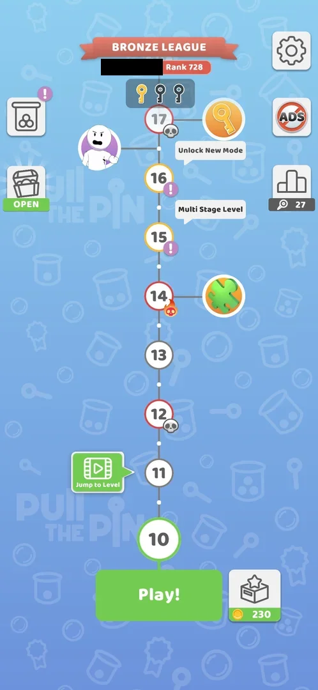
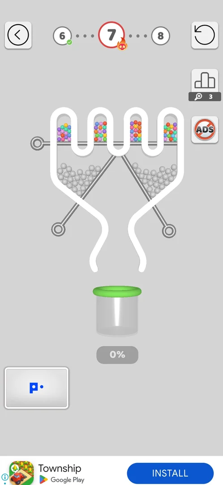
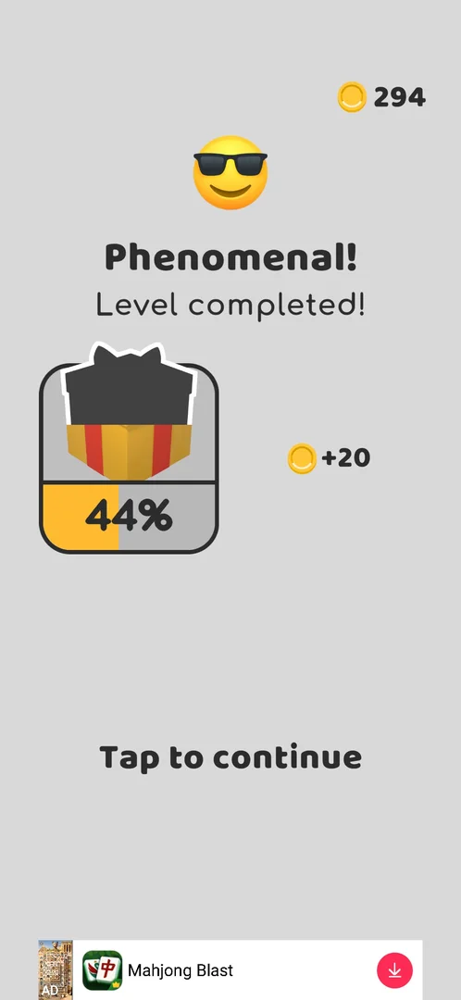
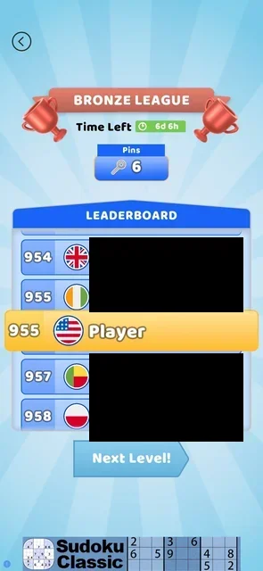
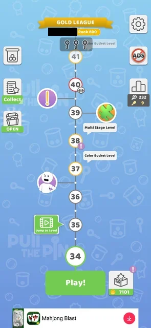
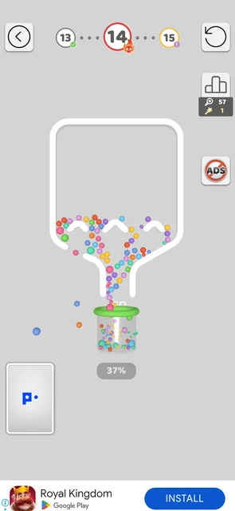

# Hard levels (skull node)

Levels marked on the map with a red ring and a skull badge (levels 7, 12, 17; level 14 with a flame skull)
[^s1]. The two played, levels 7 and 12, were pin-pull boards like the others, opened with **Play!**,
level 12 with no warning, and both were won on the first try with the same win screens as any level [^s4] [^s7]. No rule
of their own was seen: no timer, no move limit [^s3] [^s7]. Level 12 carried a golden pin that scores in the
league ([Golden pins](golden-pins.md)) [^s6]. Level 14 (flame skull) was lost once, with the same fail screen and
free Retry as an ordinary level [^s10] [^s11]. Level 27 (grey skull, version 241.5.2) was the first to open a popup,
**Boss Level!**, offering +250 coins for playing it; **No, thanks** opened a small ordinary-looking level 27
board instead, which was won [^s12] [^s13].

## Why it appeared

Map tutorial after the L3 win: skull badges on L7 and L12 (red ring); L14 has a flame skull [^s1].

## Where to find it

The map: a level node with a red ring and a skull badge at its lower right [^s1] [^s2] [^s5]. It is played like
any level, with **Play!** when it is the next level [^s3]. When the marked level becomes the current one, its
node on the map is the large green current circle with no skull badge (level 12 after the level 11 win) [^s9].

 [^s2]
*The map before level 7: level 7 with a red ring and a red skull badge; level 12 with a grey skull badge*

 [^s5]
*The map at level 10, Play! at the bottom: the next marked nodes are 12 and 17 (grey skull) and 14 (flame skull); the player's name in the league banner blacked out*

Later maps of 241.5.2 show level 27 with a grey skull, level 32 with a flame skull and level 34 with a grey skull
[^s14] [^s15]. **Play!** on level 27 opened the Boss Level! popup before the board [^s12].

## What it looks like

 [^s3]
*Level 7: the level number in the top bar has a red ring and the skull badge; the board is a usual pin-pull board*

 [^s6]
*Level 12: the header circle 12 has a red ring and the skull badge; a golden star pin holds the grey balls, a bomb sits on the right pin (a banner ad blacked out)*

On the level screen only the level number in the top bar carries the mark: a red ring and the skull badge
[^s3] [^s6]. Level 12 opened straight from Play! with no popup or warning before the board [^s7]. Level 7: four
compartments of coloured balls at the top, grey balls in two funnels under them, pins on the sides and two
crossed pins over the cup [^s3]. Level 12: coloured balls over grey ones in a slanted tube, held by a golden
pin with a star head; a vertical pin and a slanted pin with a bomb on the right [^s6]. No timer, move limit
or other rule was shown on either [^s3] [^s6].

### Boss Level! popup

 [^s12]
*Play! on the level 27 skull node: the Boss Level! popup with the share of players who pass on the first attempt (79%), Play! with +250 coins, and No, thanks under it*

Level 27 (version 241.5.2) opened this popup when Play! was tapped on the map; levels 7 and 12 had opened
straight to the board [^s7] [^s12]. The illustration shows a tall maze board with four pins and a bomb [^s12].

## What you can do

| Tab or button | What it does |
|---|---|
| [Play! +250](#play-250) | Not tried: by its label, plays the boss level for 250 coins |
| [No, thanks](#no-thanks) | Opens a small level 27 board instead of the boss [^s13] |

### Play! +250

<!-- no-frame: Play! +250 was not tapped; the button is on the popup frame above -->

The green button on the Boss Level! popup with a coin and +250 [^s12]. Not tapped: the boss board and when the
250 coins are paid were not seen.

### No, thanks

 [^s13]
*No, thanks on the Boss Level! popup: level 27 opens as a small board with two bombs, grey and coloured balls and four pins; the header still shows 27 with the red ring and skull*

The board is not the maze of the popup's picture: two compartments (grey balls, coloured balls), a bomb on the
top pin and one over the floor pin, four pins in all [^s13]. It was won on the first try with four pulls: the
top pin first, so that the two bombs meet and vanish, then the coloured balls, the grey ones, and the floor pin
[^s13]. The level counted as level 27: after the win the map moved on to level 28 [^s15]. Whether the boss could
still be played afterwards was not seen.

### Result

 [^s8]
*After the level 12 win: "Phenomenal! Level completed!", +20 coins (294), the gift box at 44%, Tap to continue*

## How it works

Versions 241.5.1 (levels 7, 12) and 241.5.2 (levels 14, 27).

- Marked levels seen on the map: 7, 12, 17 (red ring, skull badge); 14 (flame skull) [^s1]. At level 10 the
  map still shows 12 and 17 with a grey skull and 14 with a flame skull [^s5]. The skull levels are 5 apart
  (7, 12, 17); that the step continues is inferred, not verified [^s7].
- Level 7 was won on the first try in 41 s: the top pin, a pause of about 6 s, then the crossed pins [^s4].
- Level 12 was won on the first try in 97 s with two pulls: a plain pin, then the golden pin [^s7].
- After the level 7 win: the Pull Fest leaderboard (Pins 6), then "Level completed!" with +24 coins and the
  gift bar at 85%, then an interstitial video ad, as after level 6 [^s4].
- After the level 12 win: the Bronze League board (Pins 45, Golden Pins 1, Total Score 50, a video for +5
  golden pins left of Next Level!), then "Phenomenal! Level completed!" with +20 coins (294) and the gift box
  at 44%, then an interstitial [^s7] [^s8]. The normal level 11 just before gave +25 coins and the gift box
  went 32% → 44% over one win [^s8].
- No extra reward for a hard level was seen: level 12 gave fewer coins than the normal level 11 [^s8].
- Level 14 (flame skull): lost once when balls fell out of the level; "Level failed!" with the tip "Balls fell
  out of the level!", as on an ordinary level; nothing was taken (no lives, coins kept) [^s10]. Retry was free,
  played an interstitial and restarted level 14 from its first board; Skip (rewarded video) not tried [^s11].
- Level 27 (grey skull): the Boss Level! popup with "Only 79% of the players pass on the first attempt!" and
  Play! +250 coins [^s12]. No, thanks gave a different, smaller board for the same level: the boss is
  optional [^s13]. That the 250 coins are paid for winning the boss is inferred from the label, not seen.
- Skull nodes seen on the maps of 241.5.2 beyond 17: 27 (grey), 32 (flame), 34 (grey) [^s14] [^s15]. The step of
  5 from 7 to 17 does not hold beyond: 34 is 2 after 32. The map at level 34 shows the next grey skull at
  level 40 [^s16].
- Level 34 (grey skull) opened its board straight from Play!, twice, with no Boss Level! popup: four bombs and
  five pins [^s17].

## Outcomes

| Outcome | As the base or what differs | Frame |
|---|---|---|
| win <!-- case:under-win --> | As the base: the league board, then "Level completed!" (level 7: +24 coins, gift bar 85%; level 12: +20 coins, gift box 44%), then the interstitial [^s4] [^s8] |  |
| restart <!-- case:under-restart --> | not verified | — |
| quit <!-- case:under-quit --> | As the base, seen on level 34 (grey skull): the back arrow on the board returned to the map at once, no confirmation and no cost, twice; Play! reopened the same board [^s16] [^s17] |  |
| exit app <!-- case:under-exit-app --> | not verified | — |
| balls fell out <!-- case:under-balls-out --> | As the base, seen on level 14 (flame skull): "Level failed!" with the tip "Balls fell out of the level!", Skip (video) and a free Retry; still open in the map [^s10] [^s11] |  |
| colours mixed <!-- case:under-colour-mix --> | not verified: no hard level with colour cups played | — |

## Cases

| Case | What was done | Result | Source |
|---|---|---|---|
| Red ring and a skull badge on the map node (L7, L12, L17); L14 and once L7 a flame skull <!-- case:chk-announce --> | Looked at the map | ✅ Seen | [^s1] |
| Why it appeared <!-- case:chk-appeared --> | Won level 3, the map appeared | ✅ Skull badges on the first map | [^s1] |
| Where to find it <!-- case:chk-entry --> | Played level 7 from Play!; looked at the map at level 10 | ✅ The skull node on the map, played with Play! | [^s2] [^s5] |
| What it looks like: level 12 opens straight from Play with no popup or warning; only the header node 12 has a red ring and skull badge; the board looks like a normal level (2 pulls) <!-- case:chk-screen --> | Played levels 7 and 12 | ✅ The level 7 and level 12 screens above | [^s3] [^s7] |
| Level 12 plays like a base level: same pins, cup, no timer or move limit; the difficulty is only the board <!-- case:chk-differs --> | Played levels 7 and 12 | ✅ No rule of its own; both won first try | [^s7] |
| Its win: level 12 won with the same win flow as the base (league board → Next Level); the golden pin added Golden Pins 1 (score 50 = 45 pins + 5) and a video offer +5 golden pins <!-- case:chk-win --> | Won levels 7 and 12 | ✅ The same win screens as a usual level; +24 and +20 coins | [^s4] [^s7] |
| Where and how often it comes up: skull nodes at L7, L12, L17 (every 5 levels from 7); flame skull at L14 <!-- case:chk-frequency --> | Looked at the map | ✅ Levels 7, 12, 17 and 14; the step beyond 17 inferred | [^s1] [^s5] [^s7] |
| Each loss <!-- case:chk-loss --> | Lost level 14 (flame skull): balls fell out | ✅ "Level failed!" with the tip "Balls fell out of the level!" as on a normal level; nothing taken, pins pulled in the try stay on the league score | [^s10] |
| Retry and continue offers <!-- case:chk-retry --> | Tapped Retry on the level 14 fail screen | ✅ Skip (video) and Retry (free); Retry played an interstitial, then level 14 restarted from its first board | [^s11] |
| Boss Level! popup <!-- case:boss-popup --> | Tapped Play! on the map at level 27 (grey skull) | ✅ "Boss Level!": "Only 79% of the players pass on the first attempt!", Play! +250 coins, No, thanks | [^s12] |
| Boss declined <!-- case:boss-declined --> | Tapped No, thanks on the Boss Level! popup | ✅ A small level 27 board opened instead (2 bombs, grey and coloured balls, 4 pins), won first try; the boss is optional | [^s13] |

## Not verified

- Colours mixed (the Color Bucket fail) under a hard level, if one has colour cups: as the base, or what differs <!-- case:under-colour-mix -->
- Play! +250 on the Boss Level! popup: the boss board, its loss and whether the 250 coins come on a win (not tried)
- Which levels open the Boss Level! popup: level 34 (grey skull) opened its board directly, twice, while level 33 (no skull) opened a "Challenge Level!" popup; see [Boss level](boss-level.md). Whether the flame skull (32) differs
- Restart under a hard level: as the base, or what differs <!-- case:under-restart -->
- Exit the app under a hard level: as the base, or what differs <!-- case:under-exit-app -->
- Balls fell out under a hard level: seen on level 14 as the base (row above), still open in the map <!-- case:under-balls-out -->
- The difference between the grey skull and the flame skull badges (level 14 not played yet).
- Skip (video) on a hard level's fail screen.

[^s1]: session 20261003-203702-chrono-2FYKPJ, step 6 — [video at 1:57](https://youtu.be/cirqlD7KGWI?t=117)
[^s2]: session 20261003-203702-chrono-2FYKPJ, step 7 — [video at 2:10](https://youtu.be/cirqlD7KGWI?t=130)
[^s3]: session 20261003-203702-chrono-2FYKPJ, step 31 — [video at 11:17](https://youtu.be/cirqlD7KGWI?t=677)
[^s4]: session 20261003-203702-chrono-2FYKPJ, step 32 — [video at 11:54](https://youtu.be/cirqlD7KGWI?t=714)
[^s5]: session 20261004-001002-chrono-2FYKPJ, step 0 — [video at 0:00](https://youtu.be/el_4Pddjvvk?t=0)
[^s6]: session 20261004-005453-chrono-2FYKPJ, step 7 — [video at 6:48](https://youtu.be/rH_NzK3D4WA?t=408)
[^s7]: session 20261004-005453-chrono-2FYKPJ, step 9 — [video at 8:17](https://youtu.be/rH_NzK3D4WA?t=497)
[^s8]: session 20261004-005453-chrono-2FYKPJ, step 10 — [video at 8:49](https://youtu.be/rH_NzK3D4WA?t=529)
[^s9]: session 20261004-005453-chrono-2FYKPJ, step 6 — [video at 5:59](https://youtu.be/rH_NzK3D4WA?t=359)

[^s10]: session 20261005-014031-chrono-2FYKPJ, step 10 — [video at 3:49](https://youtu.be/7nClZQUPXn4?t=229)
[^s11]: session 20261005-014031-chrono-2FYKPJ, step 11 — [video at 4:21](https://youtu.be/7nClZQUPXn4?t=261)
[^s12]: session 20261006-061608-chrono-2FYKPJ, step 20 — [video at 9:45](https://youtu.be/OfYU2WgEiQU?t=585)
[^s13]: session 20261006-061608-chrono-2FYKPJ, step 21 — [video at 10:30](https://youtu.be/OfYU2WgEiQU?t=630)
[^s14]: session 20261006-061608-chrono-2FYKPJ, step 9 — [video at 4:08](https://youtu.be/OfYU2WgEiQU?t=248)
[^s15]: session 20261006-061608-chrono-2FYKPJ, step 34 — [video at 19:31](https://youtu.be/OfYU2WgEiQU?t=1171)
[^s16]: session 20261006-145232-chrono-2FYKPJ, step 20 — [video at 6:22](https://youtu.be/2PFrqVa_52w?t=382)
[^s17]: session 20261006-145232-chrono-2FYKPJ, step 21 — [video at 6:40](https://youtu.be/2PFrqVa_52w?t=400)
