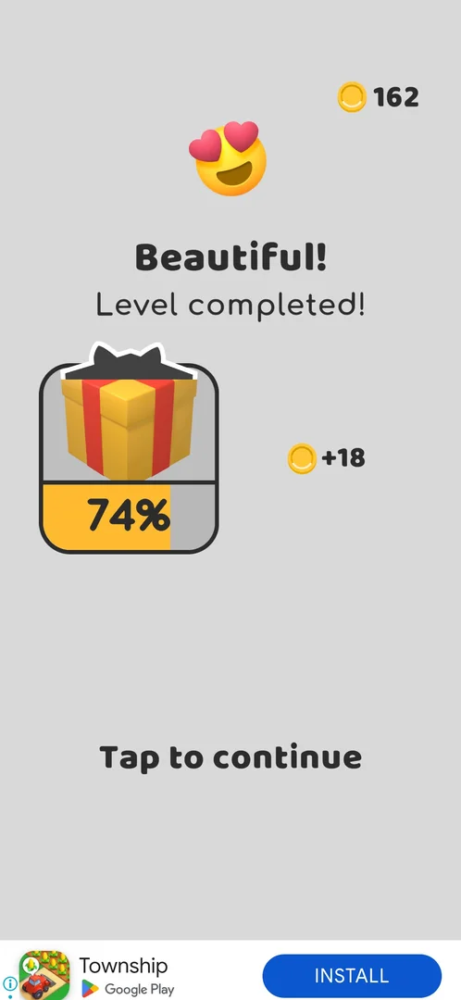
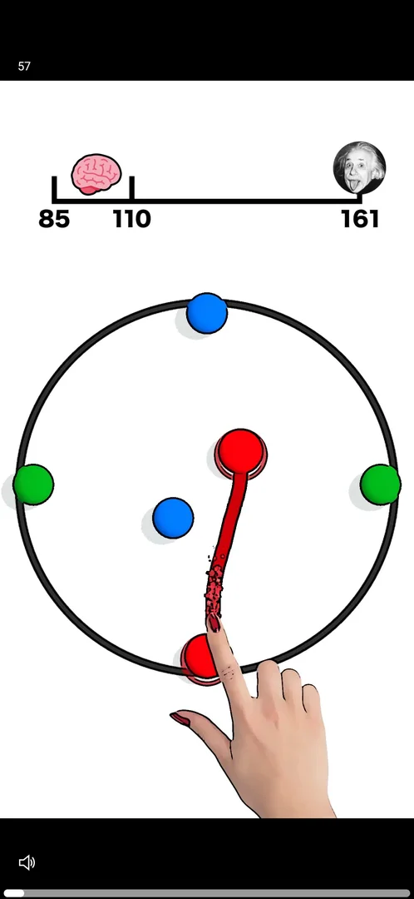
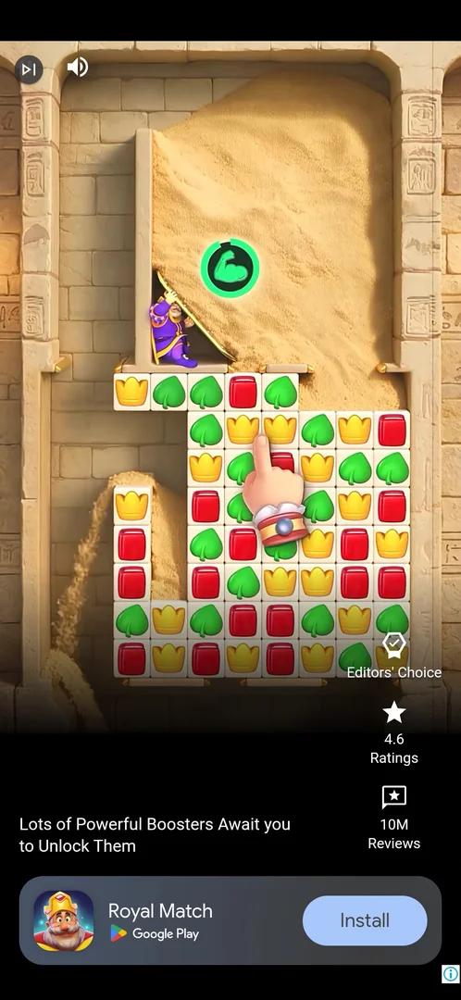
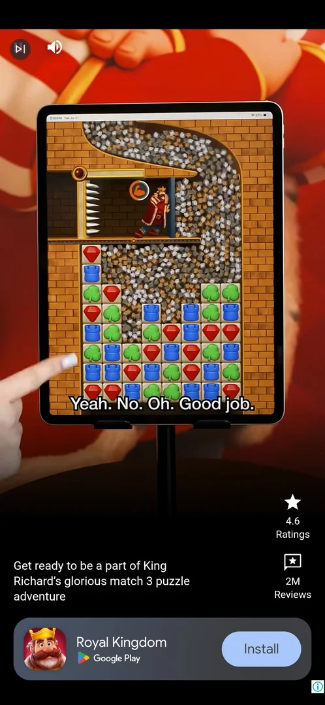
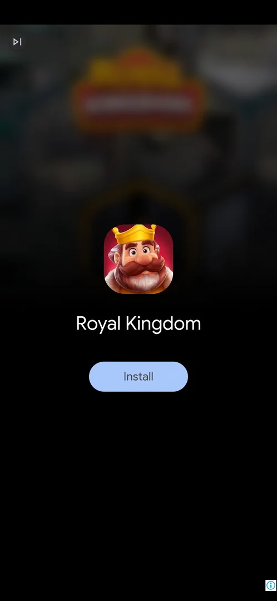
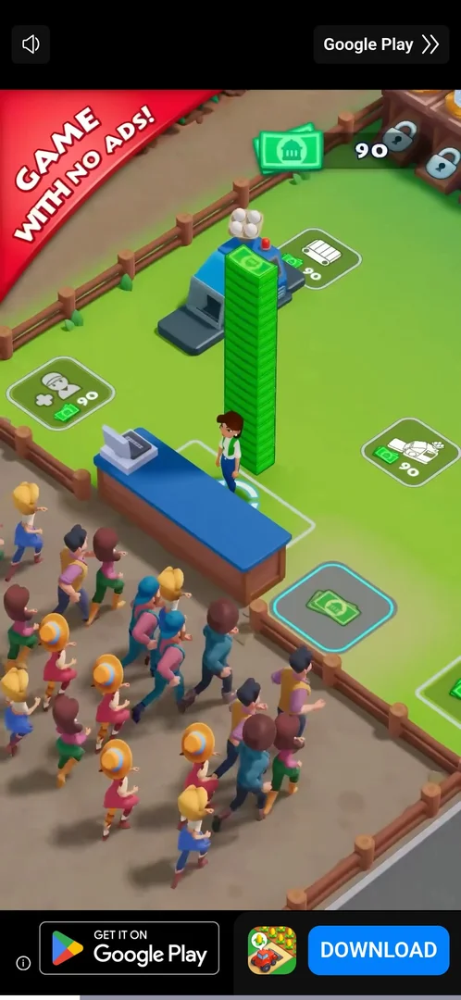
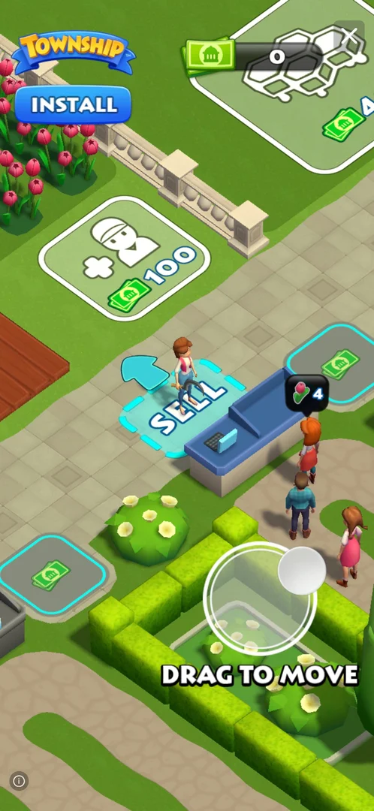
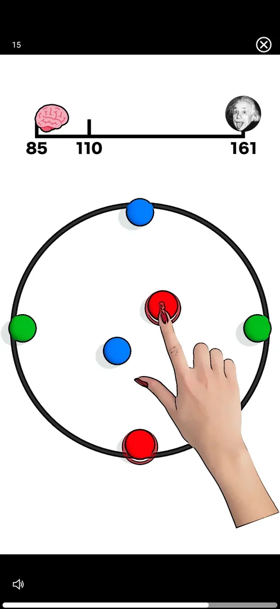
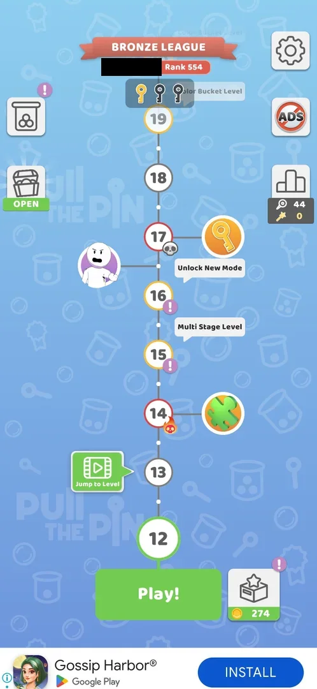

# Interstitial video ad after a win

A full-screen video ad that starts by itself when the player taps **Tap to continue** on a level's win
screen. From level 6 on it came after the wins of levels 6, 7, 8, 9, 11 and 12 [^s1] [^s4] [^s19] [^s20], but
not after a level 10 win that came about 4 min after a rewarded video [^s14]; in the Multi Stage level 10 it also came between
stages, after stage 1 and after stage 3 [^s8] [^s9]. Confirming **Restart** inside a level and **Retry** on
the fail screen also start one [^s11] [^s15]. It is not rewarded.
The video runs about 30-45 s before it can be closed, and is often followed by a playable end card and an
install sheet before the game returns to the map [^s3] [^s4].

## Why it appeared

First after the level 6 win, on Tap to continue (6th level of the install), video with a 57 s counter [^s1].

## Where to find it

No control opens it. On the win screen ("Level completed!") the tap on **Tap to continue** starts the video
instead of going to the map [^s2] [^s1]. Levels 1-5 went to the map without it [^s1]. In a Multi Stage level
it can also start by itself when a stage is completed, before the next board
[^s8]. A third route: the restart button top right of a level, then **Restart** on the "You can do better!"
popup; the screen greys out with the ad network's loading logo and the video follows [^s11]. See
[Pin-pull level](core-level.md#restart). A fourth route: **Retry** on the "Level failed!" screen; the
same loading logo, then the video [^s15]. See [Pin-pull level](core-level.md#level-failed).

 [^s2]
*The level 6 win screen: the video ad started on Tap to continue*

 [^s11]
*Level 10 right after Restart on the "You can do better!" popup: the ad loading over the greyed-out level*

 [^s19]
*Right after Tap to continue on the level 11 win screen: the screen turns grey with the ad's loading logo before the video*

## What it looks like

 [^s1]
*The video ad after level 6: a countdown (57) at top left, no close button yet; no banner under it*

A video of another app's gameplay over the whole screen, a black band at the top with a countdown at the
left, a sound icon and a progress line at the bottom [^s1]. The game's bottom banner is not shown over it
[^s5].

 [^s15]
*The interstitial after Retry on the fail screen: a skip-to-end icon at top left, an Install bar at the bottom*

 [^s19]
*After the level 11 win: the same layout, a skip-to-end icon and a sound icon at top left, an Install card at the bottom*

## What you can do

The ad's controls change from creative to creative; these are the ones the version 241.5.1 sessions met.

| Tab or button | What it does |
|---|---|
| [End card](#end-card) | After the video: the advertised app's icon and Install; its only control, the skip icon at top left, opened the Play Store |
| [Another ad format](#another-ad-format) | A second ad network's video: a sound icon at top left, "Google Play" with arrows at top right, a Download bar at the bottom |
| [Playable end card](#playable-end-card) | After the video, a playable demo of the advertised game with a faint X at top right that closes the ad |
| [Result](#result) | The map, with the win kept |

### End card

 [^s19]
*After about 50 s of video (level 11): the advertised app's icon, name and Install; only the skip icon at top left, no X*

After about 50 s the video gave way to a dark end card with the advertised app's icon, its name and an
**Install** button [^s19]. No X appeared in a further 10 s; the only control, the skip icon at top left,
opened the Play Store, and launching the game brought back the map at level 12 with the level 11 win kept
[^s21].

### Another ad format

 [^s20]
*After the level 12 win: another format, a sound icon at top left, "Google Play" with arrows at top right, GET IT ON Google Play and DOWNLOAD at the bottom; no countdown shown*

The interstitial after the level 12 win, about 3 min after the level 11 one, came in another layout: a sound
icon at top left, a "Google Play" button with arrows at top right, a bar with GET IT ON Google Play and
**DOWNLOAD** at the bottom, and no countdown on screen [^s20].

### Playable end card

 [^s20]
*After about 55 s (level 12): a playable demo of the advertised game, the game's Install at top left, a faint X at top right*

After about 55 s of video the level 12 interstitial turned into a playable demo with the advertised game's
Install at top left and a faint X at top right; the X closed the ad and brought the map [^s22].

### Result

 [^s1]
*About 30 s later: the counter at 15 and the X close button at top right*

 [^s21]
*After the level 11 interstitial (skip icon → Play Store → launching the game): the map at level 12, the win kept (the player's name in the league banner blacked out)*

## How it works

Version 241.5.1.

| After the win of | What came | How it was closed | Source |
|---|---|---|---|
| Level 6 | Video (counter from 57), X after about 30 s; then a playable end card (PLAY NOW) with a skip arrow at top right after about 8 s; then an install sheet for the advertised app | X, skip arrow, Back on the sheet → map | [^s3] |
| Level 7 | Video and end card; a skip icon at top left after about 20 s, then Close | Skip icon, Close → map | [^s6] |
| Level 8 | Video about 45 s, then a playable with a faint X at top right | X → map | [^s4] |
| Level 9 | Video about 30 s, then the end card | Skip icon, Close → map | [^s7] |
| Level 10, after stage 1 | Video (an ad for another game); the skip arrow at top left after about 20 s opened the Play Store | Relaunching the game → stage 2 | [^s8] |
| Level 10, after stage 3 | Video; the skip arrow at top left opened the Play Store again | Relaunching the game → stage 4 | [^s9] |
| Level 10 stage 4, on Restart (no win) | Loading logo, then a video for another game; the skip arrow at top left opened the Play Store | Relaunching the game → stage 4 reloaded, stages 1-3 still ticked | [^s11] [^s12] [^s13] |
| Level 10 win (stage 4), about 4 min after a rewarded video | Nothing: Puzzle Piece Found, Tap to continue, the league screen, Next Level, Wonderful +19, Get 19, then the map | — | [^s14] [^s18] |
| Level 11 loss, on Retry | Loading logo, then a video for another game with a skip icon at top left; the skip icon opened the Play Store | Launching the game → level 11 from the start | [^s15] [^s16] [^s17] |
| Level 11 win, about 5 min after the last ad | Loading logo, a video of about 50 s, then an end card with only the skip icon at top left; the skip icon opened the Play Store | Launching the game → the map at level 12, the win kept | [^s19] [^s21] |
| Level 12 win (a hard level), about 3 min after the level 11 ad | Another format ("Google Play" at top right, Download bar), about 55 s of video, then a playable with a faint X at top right | X → map | [^s20] [^s22] |

- It came after every win of levels 6-9, on **Tap to continue**, not before a level [^s4]; in level 10
  (four stages) also after stages 1 and 3, so that level brought two interstitials before its win screen
  [^s9].
- Level 10's win flow had no interstitial between Puzzle Piece Found, the Bronze League screen and Level
  completed [^s10].
- It also comes on a confirmed Restart and on Retry after a loss, with no win: so it is tied to level
  transitions, not only to wins [^s11] [^s15]. Inferred from one restart and one retry; whether every restart
  or retry brings it is not verified.
- The level 10 win of version 241.5.1 brought none; the last ad before it was the rewarded video of a gumball
  spin about 4 min earlier [^s14] [^s18]. Hypothesis: a cooldown after any full-screen ad, not verified
  (task exp-interstitial-cooldown). The Retry about 2 min after that win did bring one [^s15].
- Two wins in a row, levels 11 and 12, each brought one, about 3 min apart: no cooldown between consecutive
  interstitials was seen [^s20]. Inferred: if there is a cooldown, it follows a rewarded video, not an
  interstitial; not verified.
- Closing through the Play Store and launching the game again keeps the win: the map came back at the next
  level [^s21].
- Nothing is given for watching [^s4].
- Where the close control sits changes from creative to creative: an X at top right, a skip icon at top left
  or top right on the end card, then a Close button [^s3] [^s4].
- Each interstitial took about 30-60 s of the session, the largest time cost per level [^s4].

## Cases

| Case | What was done | Result | Source |
|---|---|---|---|
| Video ~30 s until X; then a playable end card: skip arrow top right after ~8 s, then an install sheet, closed by Back -> map <!-- case:close-flow --> | Waited for the X after the level 6 win, then skipped the end card and pressed Back | ✅ Back to the map | [^s3] |
| Interstitials after L6, L7 and L8 wins in a row (on Tap to continue); L8: video ~45 s then a playable with a faint X at top right <!-- case:after-each-win --> | Won levels 6, 7, 8 | ✅ One after each win | [^s4] |
| In the multi stage L10 interstitials came between stages (after stage 1 and after stage 3), not only after the win; the skip arrow top left opened the Play Store each time, launch brought the game back <!-- case:between-stages --> | Played level 10 (four stages) | ✅ Two interstitials inside the level | [^s8] |
| Confirming Restart in a level also plays an interstitial (not only wins); its skip control opened the Play Store <!-- case:after-restart --> | Tapped restart in level 10 stage 4, then Restart | ✅ Loading logo, a video, the Play Store on skip; relaunch back to the stage | [^s11] |
| No entry: comes by itself on Tap to continue after a level win, from L6 on <!-- case:chk-entry --> | Tapped Tap to continue | ✅ Starts by itself | [^s1] |
| Full-screen video with a countdown at top left, then a playable end card and an install sheet <!-- case:chk-screen --> | Watched it | ✅ Seen | [^s1] |
| Interstitial (not rewarded): video then playable end card, after level wins <!-- case:chk-kind --> | Watched it | ✅ An interstitial | [^s1] |
| After every win from L6 on (L6, L7, L8, L9 in a row), on Tap to continue <!-- case:chk-frequency --> | Won levels 6-9 | ✅ After every win | [^s4] |
| Not rewarded: nothing is given for watching <!-- case:chk-reward --> | Watched four | ✅ Nothing given | [^s4] |
| X after ~30-45 s (top right, sometimes faint); end card skip icon (top left or top right), then Close; an install sheet is dismissed by Back -> map <!-- case:chk-close --> | Closed four | ✅ Closed each time | [^s3] |
| Why it appeared <!-- case:chk-appeared --> | Won level 6 | ✅ First after the level 6 win | [^s1] |
| No interstitial after the level 10 win <!-- case:no-ad-after-l10 --> | Won level 10 (stage 4) about 4 min after a rewarded gumball video; went through Puzzle Piece Found, the league screen, Next Level, Wonderful +19, Get 19 | ✅ The map came with no interstitial | [^s14] |
| Interstitial on Retry after a loss <!-- case:after-retry --> | Lost level 11, tapped Retry on "Level failed!", about 2 min after the no-ad win | ✅ Loading logo, then a video; its skip icon opened the Play Store; launching the game brought level 11 back from the start | [^s15] |
| Interstitial after the level 11 win, about 5 min after the last ad <!-- case:after-win-l11 --> | Won level 11, tapped Tap to continue, waited out the video and the end card, tapped the skip icon, launched the game | ✅ Loading logo, about 50 s of video, an end card with only the skip icon, which opened the Play Store; the launch brought the map at level 12 with the win kept | [^s19] [^s21] |
| Interstitials after two wins in a row <!-- case:back-to-back --> | Won levels 11 and 12, about 3 min apart | ✅ One after each win, in two different formats: no cooldown between consecutive wins | [^s20] |
## Not verified

- Whether a loss brings it before Retry is tapped (it came on Retry, once [^s15]); whether Skip on the fail screen does.
- Whether every restart or retry brings it, or only some.
- Why the level 10 win brought none: a cooldown after the rewarded video is a hypothesis (task exp-interstitial-cooldown).
- Which stages of a Multi Stage level bring it (level 10: after stages 1 and 3, not after stage 2).
- Whether No Ads removes it.

[^s1]: session 20261003-203702-chrono-2FYKPJ, step 27 — [video at 9:02](https://youtu.be/cirqlD7KGWI?t=542)
[^s2]: session 20261003-203702-chrono-2FYKPJ, step 26 — [video at 8:53](https://youtu.be/cirqlD7KGWI?t=533)
[^s3]: session 20261003-203702-chrono-2FYKPJ, step 30 — [video at 10:39](https://youtu.be/cirqlD7KGWI?t=639)
[^s4]: session 20261003-203702-chrono-2FYKPJ, step 42 — [video at 16:18](https://youtu.be/cirqlD7KGWI?t=978)
[^s5]: session 20261003-203702-chrono-2FYKPJ, step 49 — [video at 19:12](https://youtu.be/cirqlD7KGWI?t=1152)
[^s6]: session 20261003-203702-chrono-2FYKPJ, step 36 — [video at 13:11](https://youtu.be/cirqlD7KGWI?t=791)
[^s7]: session 20261003-203702-chrono-2FYKPJ, step 52 — [video at 20:59](https://youtu.be/cirqlD7KGWI?t=1259)

[^s8]: session 20261003-211035-chrono-2FYKPJ, step 7 — [video at 3:00](https://youtu.be/Mpfk4cqdltQ?t=180)
[^s9]: session 20261003-211035-chrono-2FYKPJ, step 12 — [video at 5:29](https://youtu.be/Mpfk4cqdltQ?t=329)
[^s10]: session 20261003-211035-chrono-2FYKPJ, step 16 — [video at 6:59](https://youtu.be/Mpfk4cqdltQ?t=419)
[^s11]: session 20261003-214021-chrono-2FYKPJ, step 27 — [video at 6:07](https://youtu.be/siJO2QCuGxI?t=367)
[^s12]: session 20261003-214021-chrono-2FYKPJ, step 28 — [video at 6:49](https://youtu.be/siJO2QCuGxI?t=409)
[^s13]: session 20261003-214021-chrono-2FYKPJ, step 29 — [video at 7:04](https://youtu.be/siJO2QCuGxI?t=424)
[^s14]: session 20261004-004411-chrono-2FYKPJ, step 16 — [video at 4:39](https://youtu.be/KwWbRYgzFFk?t=279)
[^s15]: session 20261004-004411-chrono-2FYKPJ, step 20 — [video at 6:20](https://youtu.be/KwWbRYgzFFk?t=380)
[^s16]: session 20261004-004411-chrono-2FYKPJ, step 21 — [video at 7:00](https://youtu.be/KwWbRYgzFFk?t=420)
[^s17]: session 20261004-004411-chrono-2FYKPJ, step 22 — [video at 7:05](https://youtu.be/KwWbRYgzFFk?t=425)
[^s18]: session 20261004-004411-chrono-2FYKPJ, step 4 — [video at 1:00](https://youtu.be/KwWbRYgzFFk?t=60)
[^s19]: session 20261004-005453-chrono-2FYKPJ, step 4 — [video at 3:33](https://youtu.be/rH_NzK3D4WA?t=213)
[^s20]: session 20261004-005453-chrono-2FYKPJ, step 11 — [video at 9:10](https://youtu.be/rH_NzK3D4WA?t=550)
[^s21]: session 20261004-005453-chrono-2FYKPJ, step 6 — [video at 5:59](https://youtu.be/rH_NzK3D4WA?t=359)
[^s22]: session 20261004-005453-chrono-2FYKPJ, step 12 — [video at 10:56](https://youtu.be/rH_NzK3D4WA?t=656)
