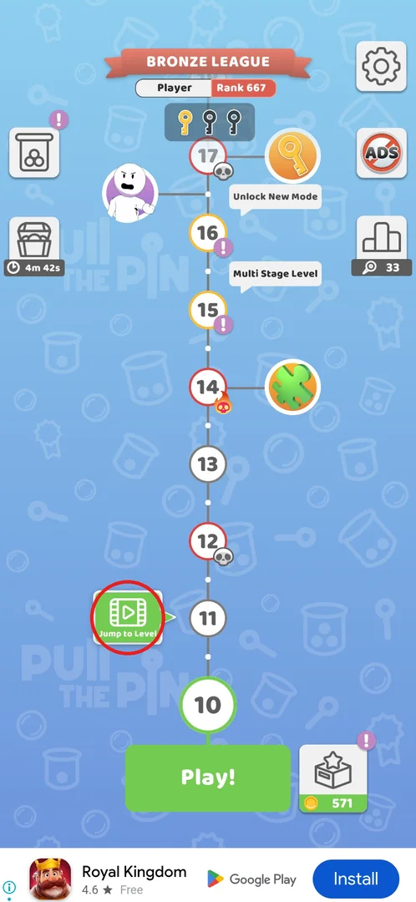
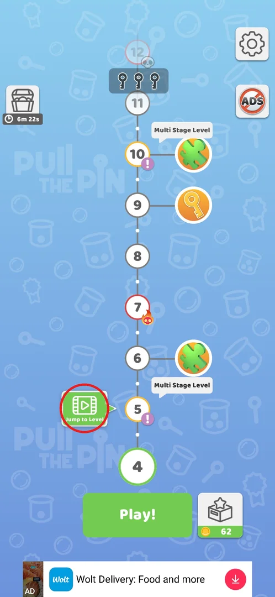
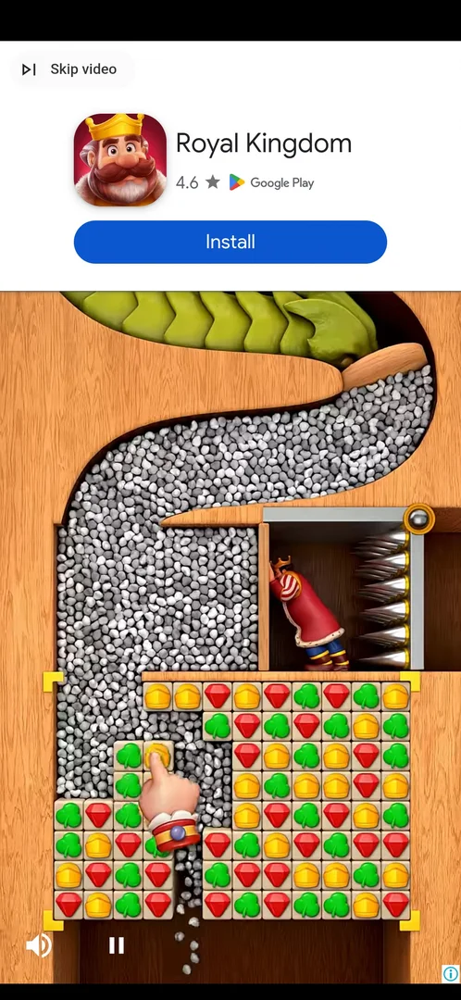
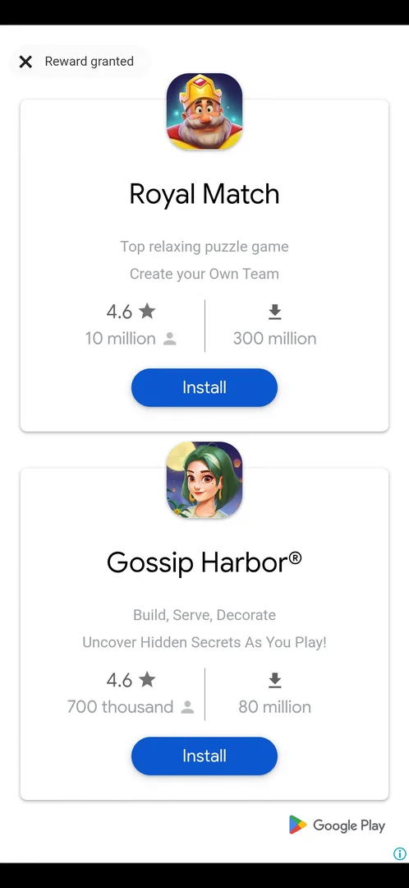
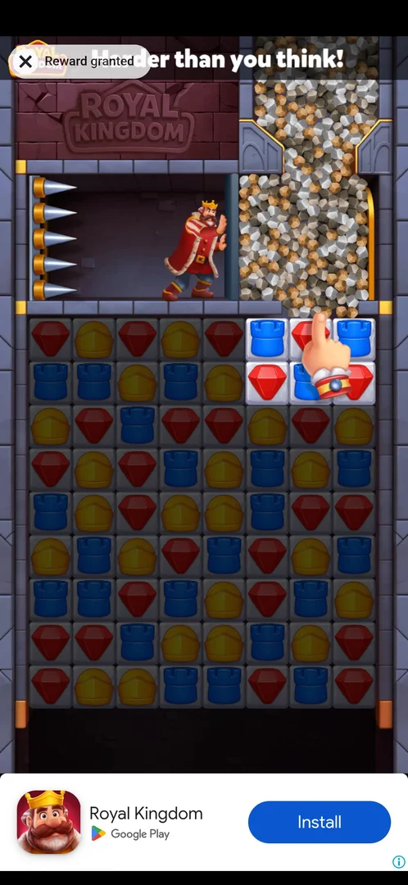
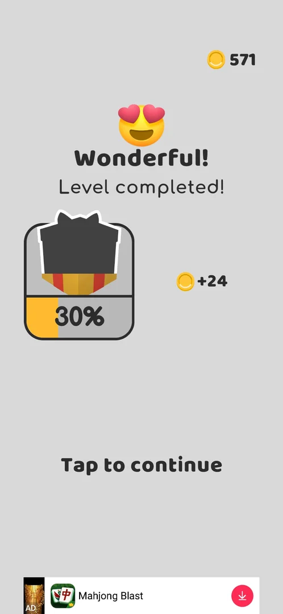
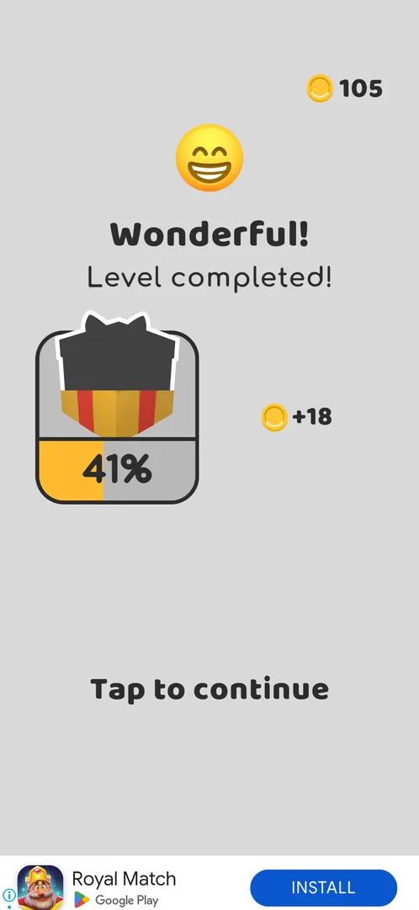

# Jump to Level for a video

Jump to Level lets the player skip the current level by watching a rewarded video. The skipped level
counts as passed with the full win reward (coins, gift box progress, league pins), and the map moves on
to the next level[^s5][^s4]. It is the way past a level the player cannot or does not want to solve.

## Where to find it

On the level map, the main screen of the game. The green **Jump to Level** button with a film icon sits
on the left of the path and points at the node just above the current level (the big green node over
the **Play!** button)[^s1][^s6]. After a jump the button moves up one node with the current level[^s8].

 [^s1]

 [^s6]

## What it looks like

<!-- no-screen: Jump to Level has no game screen of its own; the button starts a rewarded video at once -->

There is no confirmation window: the tap starts a Google rewarded video straight away[^s2]. The video
shows **Skip video** at the top left while it plays; at the end the top-left control becomes an X with
**Reward granted**[^s2][^s7][^s3]. On v241.5.1 the reward came after two ads in a row, about 30 s in
all[^s9].

## What you can do

| Tab or button | What it does |
|---|---|
| [Skip video](#skip-video) | Jumps to the end of the playing video |
| [Reward granted](#reward-granted) | The X beside it closes the ad once the reward is granted |
| [Tap to continue](#tap-to-continue) | Leaves the "Level completed!" screen for the map, now at the next level |

### Skip video

The rewarded video that the button starts; **Skip video** at the top left jumps to its end[^s2][^s7].

 [^s2]

### Reward granted

The end of the video: the X next to **Reward granted** closes the ad and returns to the game[^s3][^s7].

 [^s3]

 [^s7]

### Tap to continue

After the ad the game shows the same "Wonderful! Level completed!" screen as after a win, with the
coins and the gift box progress for the skipped level; **Tap to continue** goes back to the map[^s5][^s4].

 [^s4]

 [^s5]

## How it works

- Cost: one rewarded video; no coins are spent[^s2][^s5].
- The level skipped is the current one (the node over **Play!**): level 4 -> 5 on v241.3.1, level 9 ->
  10 on v241.5.1[^s8][^s1].
- Reward: the full win reward of the level. v241.3.1: +18 coins and +11% of the gift box (to 41%)[^s5].
  v241.5.1: +24 coins (547 -> 571), gift box 22% -> 30%, and the league screen (Bronze League, pins)
  before "Level completed!", as after a normal win[^s9][^s4].
- Other pop-ups can come between the ad and the result: on v241.3.1 the Daily Rewards window opened
  first (see [Daily rewards](daily-rewards.md))[^s5].
- The '!' mark on the skipped-to level disappeared after the jump; the player took it for the mark of a
  new mechanic or tutorial on that level (inferred)[^s8].

## Cases

| Case | What was done | Result | Source |
|---|---|---|---|
| Skip a level | Tapped Jump to Level next to level 5 with level 4 current (v241.3.1) | The video starts at once (Skip video, then "Reward granted" and X); level 4 counts as passed with the full reward: +18 coins, +11% gift; the map moves to level 5 | ✅ [^s5][^s8] |
| Full win reward | Tapped Jump to Level with level 9 current (v241.5.1) | Two ads, about 30 s; league screen, then "Level completed!": +24 coins, gift 22% -> 30%; current level 10 | ✅ [^s9][^s4][^s1] |

## Not verified

- Whether Jump to Level is offered on every level, including the hard (skull) and multi-stage levels.
- Whether it has a daily limit or a cooldown.
- What happens if the video is closed before "Reward granted".
- Whether the "No Ads" purchase removes or changes it.

[^s1]: session 20261001-054205-chrono-2FYKPJ, step 56
[^s2]: session 20260930-192115-chrono-2FYKPJ, step 54 — [video at 11:02](https://youtu.be/BVqoYRE5kRU?t=662)
[^s3]: session 20261001-054205-chrono-2FYKPJ, step 53
[^s8]: session 20260930-192115-chrono-2FYKPJ, step 58 — [video at 13:15](https://youtu.be/BVqoYRE5kRU?t=795)
[^s4]: session 20261001-054205-chrono-2FYKPJ, step 55
[^s5]: session 20260930-192115-chrono-2FYKPJ, step 57 — [video at 12:48](https://youtu.be/BVqoYRE5kRU?t=768)
[^s6]: session 20260930-192115-chrono-2FYKPJ, step 53 — [video at 10:47](https://youtu.be/BVqoYRE5kRU?t=647)
[^s7]: session 20260930-192115-chrono-2FYKPJ, step 55 — [video at 11:53](https://youtu.be/BVqoYRE5kRU?t=713)
[^s9]: session 20261001-054205-chrono-2FYKPJ, step 54
