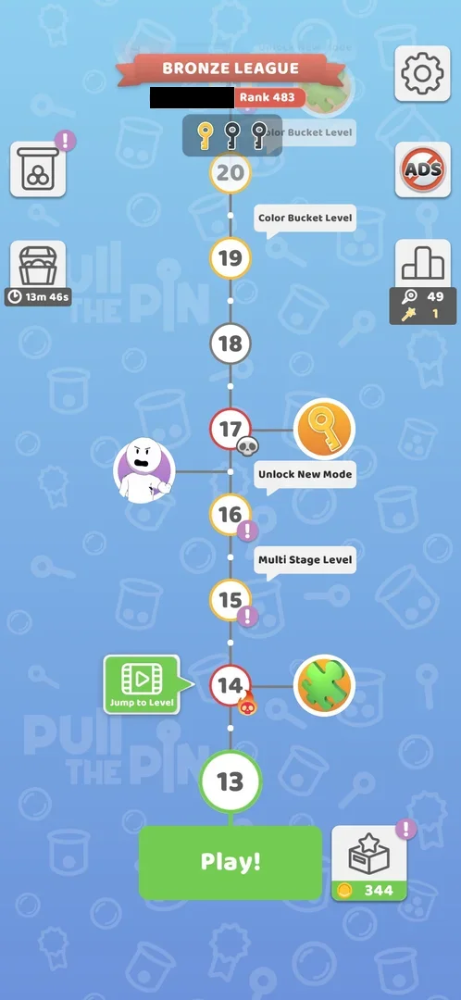
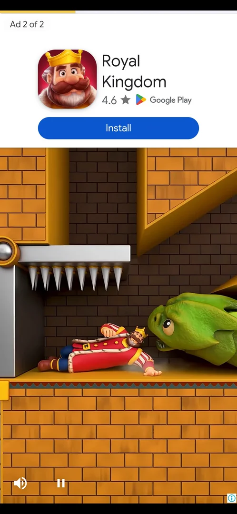
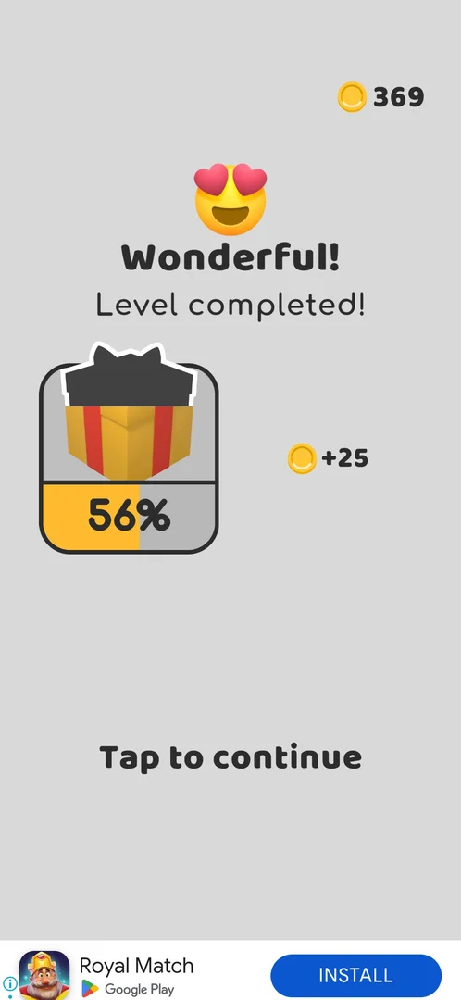

# Jump to Level (video)

A green **Jump to Level** button with a video icon on the map, beside the level after the one to play next
[^s6] [^s2]. One tap starts a rewarded video at once; after it the current level counts as won, with the usual
win screens and coins, and the map moves one level on [^s3] [^s5].

## Why it appeared

On the map next to the next level from the first map visit (L5, later L7) [^s1].

## Where to find it

The map: a green speech-bubble button with a film-strip icon and the words "Jump to Level", left of the node
after the current level [^s2]. Its place moves with progress: beside level 5 when level 4 was next, level 7
when level 6 was next, level 11 when level 10 was next [^s6] [^s1] [^s7]; in version 241.5.2 beside level 14
when level 13 was next, and beside level 15 right after the skip [^s2] [^s5].

 [^s2]
*The map at level 13: the green Jump to Level button left of level 14, above Play! (the player's name in the league banner blacked out)*

## What it looks like

There is no offer screen: the tap shows a black frame, then a rewarded video ad starts [^s3].

 [^s3]
*About 12 s after the tap: the rewarded video, "Ad 2 of 2" at the top left*

The video was two ads in a row, about 30 s in all, and ended on a "Reward granted" card with an X at the top
left [^s5].

### Result

 [^s4]
*After the skip of level 13: the usual "Level completed!" screen with +25 coins (344 → 369) and the gift box at 56%*

After the X on "Reward granted", the game opened the level 13 screen (12 done, 13 current, 14 next), not level
14 [^s8]. Its back arrow led into the usual post-win flow: the [Level race](race.md) offer popup, the Bronze
League board, then "Level completed!" with +25 coins and gift box progress [^s9] [^s10] [^s4]. **Tap to
continue** returned to the map at level 14, with Jump to Level now beside level 15 [^s5].

## How it works

Version 241.5.2.

| Item | Value | Source |
|---|---|---|
| Cost | a rewarded video (two ads, about 30 s) | [^s5] |
| Confirmation before the video | none: the tap starts it | [^s3] |
| What it gives | the current level counts as won: +25 coins, gift box progress, the map moves on one level | [^s4] [^s5] |
| League Pins | unchanged (49 before and after) | [^s10] |
| +5 golden pins video on the league board | not offered after a skip | [^s10] |
| Cooldown | none seen: shown again at once, beside the next node | [^s5] |

## Cases

| Case | What was done | Result | Source |
|---|---|---|---|
| Why it appeared <!-- case:chk-appeared --> | Won level 3, the map appeared | ✅ The button on the first map | [^s1] |
| Where to find it <!-- case:chk-entry --> | Looked at the map at levels 13 and 14 | ✅ Green Jump to Level video button on the map, left of the node after the current level (level 14 when at 13, level 15 when at 14) | [^s5] |
| What it looks like <!-- case:chk-screen --> | Tapped the button | ✅ No offer screen: a black load frame, then a rewarded video (two ads, ~30 s, Reward granted card with X) | [^s5] |
| The kind <!-- case:chk-kind --> | Watched the video | ✅ A rewarded video that skips the current level | [^s5] |
| How often it shows <!-- case:chk-frequency --> | Looked at the map right after the skip | ✅ Shown again at once, now beside level 15; no cooldown seen | [^s5] |
| Rewarded: what watching gives <!-- case:chk-reward --> | Watched to the end, closed Reward granted | ✅ Level 13 counts as won: its screen shows briefly; back leads to the race popup, the league board (Pins unchanged at 49), Level completed +25 coins and gift box progress; the map moves to level 14 | [^s5] |
| How it closes <!-- case:chk-close --> | Tapped the button, then the X on Reward granted | ✅ Cannot be declined: no confirmation before the video; the X on Reward granted returns to the game | [^s5] |

## Not verified

- Whether the button is on every level, including hard and multi-stage levels, and any daily limit.
- What happens when the video is closed before it ends.

[^s1]: session 20261003-203702-chrono-2FYKPJ, step 19 — [video at 6:13](https://youtu.be/cirqlD7KGWI?t=373)
[^s2]: session 20261005-014031-chrono-2FYKPJ, step 0 — [video at 0:00](https://youtu.be/7nClZQUPXn4?t=0)
[^s3]: session 20261005-014031-chrono-2FYKPJ, step 1 — [video at 0:31](https://youtu.be/7nClZQUPXn4?t=31)
[^s4]: session 20261005-014031-chrono-2FYKPJ, step 5 — [video at 2:01](https://youtu.be/7nClZQUPXn4?t=121)
[^s5]: session 20261005-014031-chrono-2FYKPJ, step 6 — [video at 2:23](https://youtu.be/7nClZQUPXn4?t=143)
[^s6]: session 20261003-203702-chrono-2FYKPJ, step 5 — [video at 1:43](https://youtu.be/cirqlD7KGWI?t=103)
[^s7]: session 20261003-203702-chrono-2FYKPJ, step 52 — [video at 20:59](https://youtu.be/cirqlD7KGWI?t=1259)
[^s8]: session 20261005-014031-chrono-2FYKPJ, step 2 — [video at 1:30](https://youtu.be/7nClZQUPXn4?t=90)
[^s9]: session 20261005-014031-chrono-2FYKPJ, step 3 — [video at 1:41](https://youtu.be/7nClZQUPXn4?t=101)
[^s10]: session 20261005-014031-chrono-2FYKPJ, step 4 — [video at 1:50](https://youtu.be/7nClZQUPXn4?t=110)
