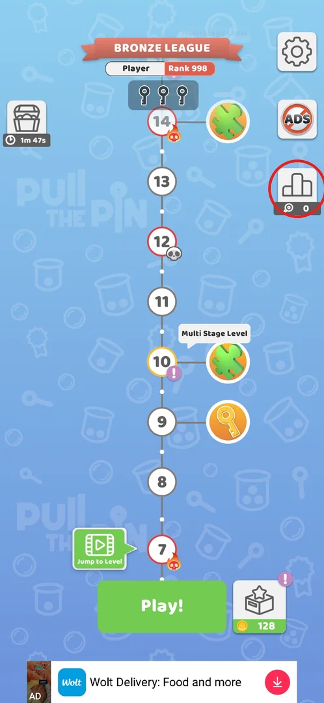
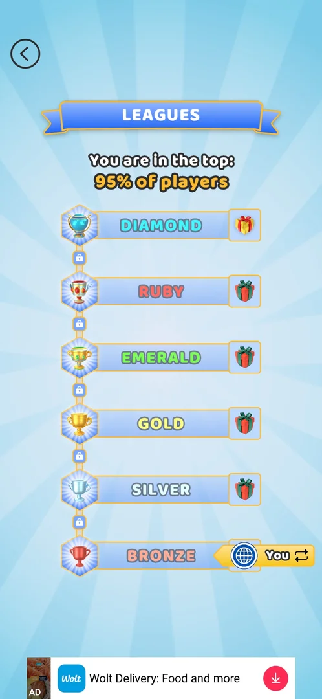
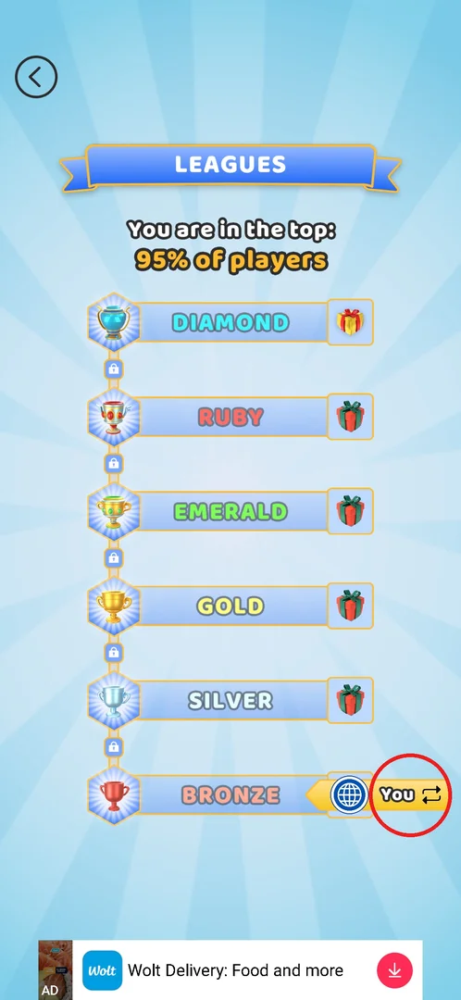
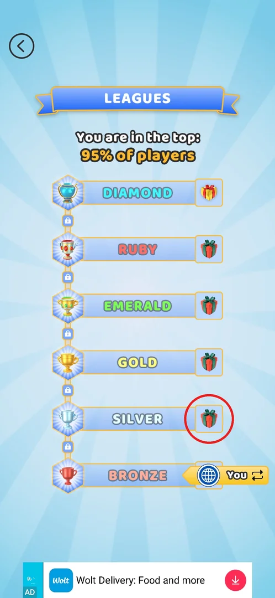
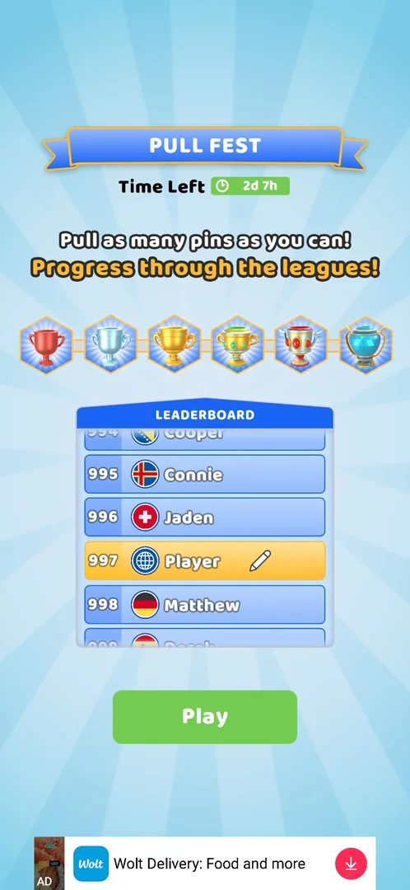
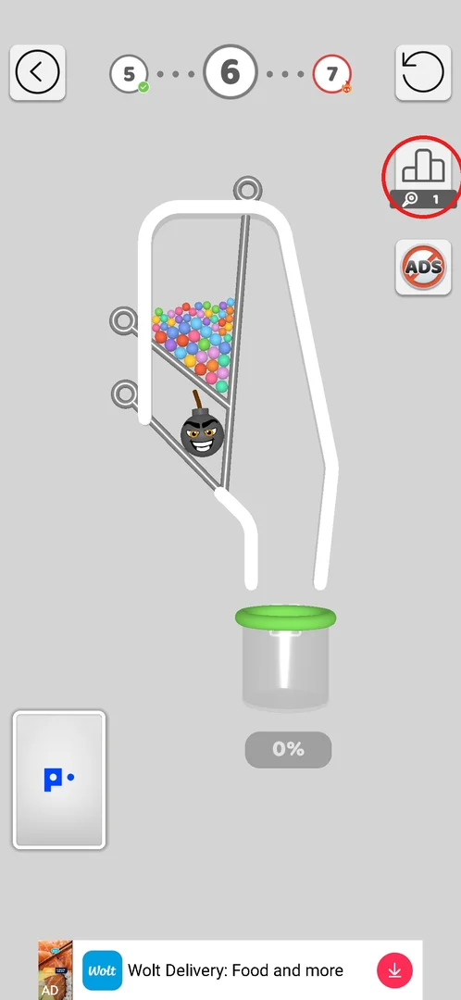
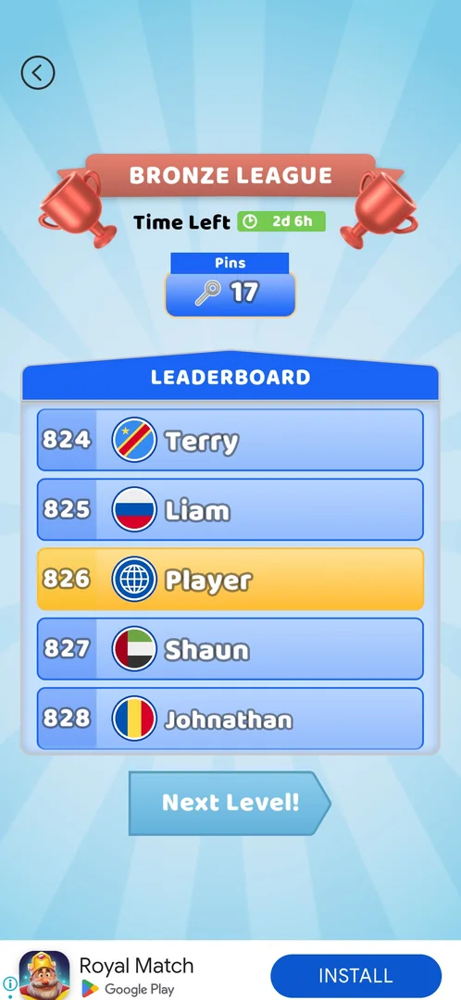

# Leagues (Bronze to Diamond ladder)

> Recheck on v241.5.1: documented on 241.3.1; Google Play has 241.5.1.

Leagues are a competitive ladder that opens after level 5. Every pin the player pulls counts as a
point, and those points set the player's place on a leaderboard against about a thousand other
names. The leaderboard runs on a timer of a few days. There are six tiers, from Bronze up to
Diamond, and each tier has a gift [^s1] [^s2] [^s3].
The game also calls the competition "Pull Fest": "Pull as many pins as you can! Progress through the
leagues!" [^s4]. Leagues and the Pull Fest ranking look like one
ladder under two names. That is inferred and not verified.

## Where to find it

When level 5 is won, two things appear on the level map. At the top is a red **BRONZE LEAGUE**
banner with the player's name and rank, starting at Rank 998. On the right, under the No ADS button, is a
new podium button with a pins counter under it: a pin icon (a ring on a rod) and the number (circled). The game hints at it with "Pull Fest Ranking!"
[^s1]. Tapping the podium button opens the Leagues screen
[^s2]. Tapping the banner left the map as it was
[^s5]. The banner and button were first seen behind a "Tap to
continue" overlay, which took one tap to clear [^s6].

 [^s5]

## What it looks like

The screen has a blue **LEAGUES** ribbon and the line "You are in the top: 95% of players". Below
them are six tiers stacked from the bottom up: Bronze, Silver, Gold, Emerald, Ruby and Diamond.
Each tier has its own cup on the left and a gift box on the right, and a padlock sits between each
pair of tiers. A yellow **You ⇄** marker with a globe points at the player's current tier, which
was Bronze. A back arrow at the top left returns to the map, and a banner ad runs along the bottom
[^s2] [^s7]. Nothing on this
screen reacts to a tap: neither the gifts nor the tier rows [^s8].

 [^s2]

## What you can do

| Tab or button | What it does |
|---|---|
| [You](#you) | The You ⇄ marker with a globe: shows the player's current tier. What the ⇄ switches is not known |
| [Gifts](#gifts) | The gift box on each tier: shows the tier's reward. A tap does nothing |
| [Pull Fest](#pull-fest) | Screen before a level, the Pull Fest intro: timer, the six cups, the leaderboard, **Play** |
| [Pins counter](#pins-counter) | The podium button's counter in a level: counts the pins pulled, which are the league points |
| [League results](#league-results) | Screen after a level: shows the tier, timer, points and leaderboard place, then **Next Level!** |

### You

The yellow **You ⇄** marker with a globe sits on the player's current tier (circled). On the
leaderboards, the player's row carries the same globe instead of a country flag
[^s2] [^s4]. One tap on the globe
next to Player on a leaderboard caused no visible change [^s9]. A
tap on the ⇄ marker on the Leagues screen was not tried [^s8].

 [^s2]

### Gifts

Every tier has a gift box on its right. Diamond's box is gold and the other tiers' boxes are red
[^s2]. Tapping the Silver gift (circled) brought up no preview,
and the screen stayed as it was. Tapping the Bronze row did nothing as well
[^s10] [^s8]. The only known
content of a gift comes from the skins menu: one wall and one pin are marked "UNLOCK BY REACHING
DIAMOND LEAGUE" [^s11] [^s12]. The
player also noted that Diamond gives a theme [^s2].

 [^s10]

### Pull Fest

The first time the player tapped **Play!** on the map after the league opened, the **PULL FEST**
screen came up before level 6 [^s4]. It shows:

- **Time Left 2d 7h**;
- "Pull as many pins as you can! Progress through the leagues!";
- the six league cups in a row;
- a **LEADERBOARD** that can scroll. The player was in 997th place. Their row has a pencil (the
  player inferred it renames them; not tried), and the other rows have names with country flags;
- a green **Play** button, which starts the level [^s13].

 [^s4]

### Pins counter

Once the league is open, a level shows a podium button with a pins counter (a pin icon, a ring on a rod,
and the number) on the right, under the restart button and above No ADS (circled) [^s13]. The counter goes
up by one for every pin pulled: it read 0 and then 1 after the first pin in level 6
[^s14]. The same counter sits under the podium button on the map
[^s1] [^s15].

 [^s14]

### League results

After a level is won, a **BRONZE LEAGUE** screen comes up. It shows the time left, the points
under the label **Pins**, and the leaderboard scrolled to the player's place. **Next Level!** moves
on [^s16] [^s3]. After level 6, the
screens came in this order: the puzzle piece, then this screen, then the win screen with coins
[^s17]. Here are the readings from three levels:

- after level 6: 3 pins, rank 968 [^s16];
- after level 7: Time Left 2d 6h, 14 pins, rank 862 [^s3];
- after level 8: 17 pins, rank 826 [^s9].

 [^s9]

## How it works

All of the following was seen on v241.3.1.

- **Unlock:** after level 5. The player starts in Bronze League at rank 998
  [^s1].
- **Points:** one point for each pin pulled. Pins pulled in lost attempts count too: the total went
  from 6 to 14 over two attempts at level 7 [^s3].
- **Rank:** after level 6 the rank went from 998 to 997 and then to 968, a gain of 29 places for 3
  pins [^s4] [^s16]. The rank also
  changes when the player is not playing: it went from 936 to 906 in about 10 minutes while the
  game was closed. The player inferred that the other names are bots
  [^s15] [^s4].
- **Timer:** 2d 7h was left on 2026-09-30 at about 19:40, and 2d 6h at about 20:23. The end
  would then be about 2026-10-03 02:00–03:00, the same time as the weekly trophy track. The player
  inferred that the ladder is weekly [^s4] [^s3] [^s18].
- **Rewards:** each of the six tiers has a gift. Reaching Diamond League unlocks one wall and one
  pin skin [^s2] [^s11] [^s12].

## Cases

| Case | What was done | Result | Source |
|---|---|---|---|
| Open the ladder | Tapped the podium button on the map | Leagues screen opened with six tiers, each with a gift | [^s2] |
| Tap the league banner | Tapped BRONZE LEAGUE on the map | The map stayed as it was | [^s5] |
| Tap a gift or tier | Tapped the Silver gift and the Bronze row | No reaction: the screen does not respond to taps | [^s10] [^s8] |
| League points = pins pulled, also in lost attempts | Played levels 6–8 | 1 point per pin, lost attempts included (6 → 14 over two attempts, 17 after level 8) | [^s14] [^s3] [^s9] |
| Rank | Watched it after each level and after a pause | 998 → 997 → 968 → about 956; later 936 → 906 (without play) → 862 → 826 | [^s16] [^s15] [^s3] [^s19] |
| The You ⇄ (globe) button: what it switches | Tapped the globe next to Player on the leaderboard | No visible change | [^s9] |
| How rank grows and the Bronze → Silver promotion with its gift | — | not verified | |

## Not verified

- What the ⇄ on the You marker switches. A tap on the leaderboard globe changed nothing, and the
  marker on the Leagues screen itself was never tapped [^s9].
- Promotion when the timer runs out (about 2026-10-03 02:00–03:00): what place is needed, and
  what the gift holds.
- Whether the pencil on the player's leaderboard row renames them.
- Whether "Pull Fest" and Leagues are the same ladder.

[^s1]: session 20260930-192115-chrono-2FYKPJ, step 73 — [video at 16:22](https://youtu.be/BVqoYRE5kRU?t=982)
[^s2]: session 20260930-192115-chrono-2FYKPJ, step 76 — [video at 17:02](https://youtu.be/BVqoYRE5kRU?t=1022)
[^s3]: session 20260930-201034-chrono-2FYKPJ, step 57 — [video at 16:29](https://youtu.be/JGEX3-Rfkdw?t=989)
[^s4]: session 20260930-192115-chrono-2FYKPJ, step 80 — [video at 17:52](https://youtu.be/BVqoYRE5kRU?t=1072)
[^s5]: session 20260930-192115-chrono-2FYKPJ, step 75 — [video at 16:49](https://youtu.be/BVqoYRE5kRU?t=1009)
[^s6]: session 20260930-192115-chrono-2FYKPJ, step 74 — [video at 16:39](https://youtu.be/BVqoYRE5kRU?t=999)
[^s7]: session 20260930-192115-chrono-2FYKPJ, step 79 — [video at 17:41](https://youtu.be/BVqoYRE5kRU?t=1061)
[^s8]: session 20260930-192115-chrono-2FYKPJ, step 78 — [video at 17:26](https://youtu.be/BVqoYRE5kRU?t=1046)
[^s9]: session 20260930-201034-chrono-2FYKPJ, step 66 — [video at 20:10](https://youtu.be/JGEX3-Rfkdw?t=1210)
[^s10]: session 20260930-192115-chrono-2FYKPJ, step 77 — [video at 17:15](https://youtu.be/BVqoYRE5kRU?t=1035)
[^s11]: session 20260930-201034-chrono-2FYKPJ, step 11 — [video at 2:53](https://youtu.be/JGEX3-Rfkdw?t=173)
[^s12]: session 20260930-201034-chrono-2FYKPJ, step 14 — [video at 3:25](https://youtu.be/JGEX3-Rfkdw?t=205)
[^s13]: session 20260930-192115-chrono-2FYKPJ, step 81 — [video at 18:13](https://youtu.be/BVqoYRE5kRU?t=1093)
[^s14]: session 20260930-192115-chrono-2FYKPJ, step 82 — [video at 18:37](https://youtu.be/BVqoYRE5kRU?t=1117)
[^s15]: session 20260930-201034-chrono-2FYKPJ, step 46 — [video at 11:15](https://youtu.be/JGEX3-Rfkdw?t=675)
[^s16]: session 20260930-192115-chrono-2FYKPJ, step 85 — [video at 19:41](https://youtu.be/BVqoYRE5kRU?t=1181)
[^s17]: session 20260930-192115-chrono-2FYKPJ, step 86 — [video at 20:00](https://youtu.be/BVqoYRE5kRU?t=1200)
[^s18]: session 20260930-201034-chrono-2FYKPJ, step 7 — [video at 2:16](https://youtu.be/JGEX3-Rfkdw?t=136)
[^s19]: session 20260930-201034-chrono-2FYKPJ, step 69 — [video at 22:15](https://youtu.be/JGEX3-Rfkdw?t=1335)
