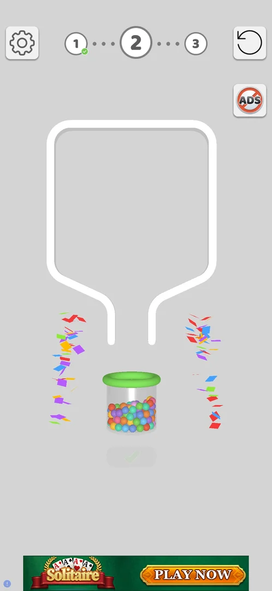
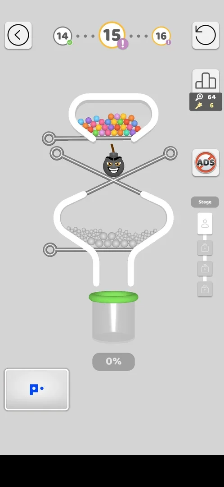
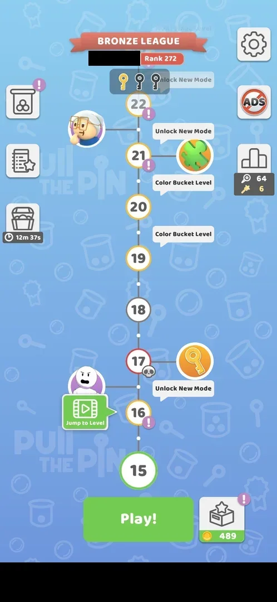

# Level path header

A row of numbered circles at the top of the level screen showing the previous, the current and the next
level. It is the only progress display on the level screen [^s1]. The same numbered path, drawn upward, is
the level map that opens after level 3: the current level at the bottom above **Play!**, the coming levels
above it with their badges and labels [^s5]. Neither the circles nor the map nodes can be tapped: the path
only shows progress [^s6] [^s7].

## Why it appeared

Level screen header: previous, current, next level circles [^s1].

## Where to find it

The top of the level screen, between the gear (Settings) and the restart button; it is on every level
[^s1] [^s2].

 [^s2]
*The level path between the gear and restart: 1 done, 2 current, 3 next*

From level 4 on, the path is also the map, which opens on launch and from which **Play!** starts the current
level [^s5]; how the game reaches it after level 3 and from a level's back arrow is on
[Pin-pull level](core-level.md#back-arrow).

## What it looks like

 [^s3]
*Level 2 won, before the win screen: the header is unchanged until the next level opens*

The current level is a large circle with a bold number; the next level a smaller circle to its right, the
previous one a smaller circle to its left with a green tick; dotted lines join them [^s2]. On level 1
only two circles show, 1 (current) and 2 (next) [^s4].

 [^s6]
*Level 15 (version 241.5.2), a Multi Stage level: 14 checked, 15 current with a purple ! badge, 16 next with a small !; the Stage column on the right; a local-language banner ad blacked out*

On a special level the circles carry badges: at level 15, a [Multi Stage level](multi-stage.md) (a
**Stage** column with four steps on the right of the board), the current circle 15 has a purple **!**
badge and the next circle 16 a small purple **!**; the previous circle 14 has a green check [^s6].

### The map

 [^s5]
*The map at level 13 (version 241.5.2): the path runs up from 13 to 20; the player's name in the league banner blacked out*

On the map at level 13 (version 241.5.2) [^s5]:

- the current level, 13, is a large green-ringed node right above the green **Play!**; the next levels
  14 to 20 run upward, joined by a dotted line;
- badges on nodes: a skull with a flame on 14, a skull on 17 ([Hard levels](hard-levels.md)), a purple **!**
  on 15 and 16;
- labels beside nodes: **Multi Stage Level** at 15 ([Multi Stage level](multi-stage.md)), **Unlock New Mode**
  with a key icon at 17, **Color Bucket Level** at 19 and at 20; a puzzle piece icon beside 14
  ([Puzzle pieces](puzzle-pieces.md)) and a character portrait between 16 and 17;
- **Jump to Level** with a video icon left of node 14 ([Jump to Level](jump-to-level.md));
- around the path: the Bronze League banner with the rank (483) at the top and three keys under it, one gold
  ([Map keys](map-keys.md)); the gear and ADS top right; the league panel with 49 pins and 1 golden pin on the
  right; a jar and the map chest with a 14m 38s timer on the left; the gift box with the coin balance (344)
  right of **Play!**; a banner ad along the bottom edge.

The entry points on the map are the same as in version 241.5.1 [^s5].

 [^s7]
*The map at level 15 (version 241.5.2): the path from 15 to 22; the player's name in the league banner and a local-language banner ad blacked out*

On the map at level 15 (version 241.5.2) [^s7]:

- the current level, 15, is the large green-ringed node above **Play!**; the next levels 16 to 22 run upward;
- badges: a purple **!** on 16, 21 and 22; a skull on 17 ([Hard levels](hard-levels.md));
- labels: **Unlock New Mode** at 17 (with a key icon) and at 21 (with a puzzle piece icon), two **Color
  Bucket Level** labels between 19 and 21, **Multi Stage Level** and **Unlock New Mode**
  faint at the top beyond 22;
- **Jump to Level** beside 16; the [Daily tasks](daily-tasks.md) button (clipboard with a star) is new in
  the left column, under the jar.

Tapping node 16 and its purple **!** did nothing [^s7].

## How it works

Versions 241.5.1 and 241.5.2. The circles are not buttons: tapping the purple **!** on circle 15 of the
header did nothing, nor did tapping node 16 or its **!** on the map [^s6] [^s7]. The header moves on by one
level when the next level opens: the won level becomes the left circle with a green check, the new level
the large middle circle [^s4] [^s2] [^s6]. A badge marks the level's type: the skull a hard level on the map,
the purple **!** at least the Multi Stage level 15 [^s6] [^s7]. Hypothesis: the purple **!** marks any special
level (multi-stage or a new mode), not verified (experiment exp-level-path-badge). On the map the current node stays at the bottom
above **Play!**; a level whose win was not saved stays the current node (level 13, see
[Pin-pull level](core-level.md#result)) [^s5].

## Cases

| Case | What was done | Result | Source |
|---|---|---|---|
| Always shown in the level screen header <!-- case:chk-entry --> | Played levels 1 and 2 | ✅ On both levels | [^s1] |
| Previous (checked), current, next level circles between gear and restart <!-- case:chk-screen --> | Played levels 1 and 2 | ✅ 1 → 2 on level 1; 1 ✓ → 2 → 3 on level 2 | [^s1] |
| Why it appeared <!-- case:chk-appeared --> | First launch | ✅ On the level screen from level 1 | [^s1] |
| No entry points: header circles and their badges are not tappable; map nodes and their ! not tappable either <!-- case:chk-entries --> | Tapped the ! on header circle 15, node 16 and its ! on the map | ✅ Nothing happened | [^s6] |
| Green check on the previous (won) level; purple ! on special levels (L15 multi-stage, L16, map nodes 21-22); skull on hard levels on the map (L17) <!-- case:chk-badges --> | Looked at the map and the header at level 15 | ✅ Seen; what the ! means beyond multi-stage is a hypothesis | [^s6] |
| The header shifts by one level per win: previous gets the green check, current is the big ring; the badge reflects the level type <!-- case:chk-changes --> | Compared the header at levels 2 and 15 | ✅ Seen | [^s6] |

## Not verified

- What the purple ! marks on levels other than Multi Stage (16, 21, 22): hypothesis a special level, experiment exp-level-path-badge.
- What Unlock New Mode at 17 and 21 unlocks.

[^s1]: session 20261003-193015-chrono-2FYKPJ, step 5 — [video at 1:53](https://youtu.be/JjeHh2uiLgE?t=113)
[^s2]: session 20261003-193015-chrono-2FYKPJ, step 4 — [video at 1:43](https://youtu.be/JjeHh2uiLgE?t=103)
[^s3]: session 20261003-193015-chrono-2FYKPJ, step 7 — [video at 2:25](https://youtu.be/JjeHh2uiLgE?t=145)
[^s4]: session 20261003-193015-chrono-2FYKPJ, step 2 — [video at 0:55](https://youtu.be/JjeHh2uiLgE?t=55)
[^s5]: session 20261005-013818-chrono-2FYKPJ, step 1 — [video at 0:29](https://youtu.be/q_WyVbvA1og?t=29)
[^s6]: session 20261005-125008-chrono-2FYKPJ, step 12 — [video at 3:26](https://youtu.be/rULKLs8ztsM?t=206)
[^s7]: session 20261005-125008-chrono-2FYKPJ, step 10 — [video at 3:02](https://youtu.be/rULKLs8ztsM?t=182)
