# Map chest with timer

A chest button at the left edge of the level map with a countdown of 15 minutes under it. When the countdown
ends the label changes to **OPEN** [^s1] [^s2] [^s11]. A tap on the OPEN chest opens a chest screen; a tap on
the chest there gives a prize, and then a new 15-minute countdown starts [^s13] [^s17]. The prize is not
always the same (version 241.5.2): the first chest opened gave 241 coins, which can be taken as they are or
multiplied x2 to x5 for a video [^s14] [^s17]; the second gave one [puzzle piece](puzzle-pieces.md), with a
video offer of another [^s21]. While the countdown runs, a tap on the chest does
nothing [^s3].

## Why it appeared

On the map from its first visit after L3, timer 13m36s counting down [^s1].

## Where to find it

The level map, left edge, the third button from the top (under the ball jar and the Daily tasks clipboard):
a chest icon in a grey square with a clock and the time left under it
[^s4]. When the time is up the label reads **OPEN** in green
[^s2]; it still read OPEN at the start of the next session, at level 10
[^s5]. On 241.5.2 it turned to OPEN at level 15, on the map, when the countdown ran out [^s11], still read
OPEN when the game was started again at 15:11 [^s12], turned to OPEN again at level 18 [^s19], and still read
OPEN at level 18 in the next session, at about 23:13 [^s22].

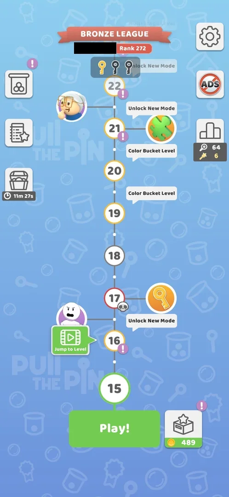 [^s4]
*The map at level 15 (version 241.5.2): the chest button at the left edge, 11m 27s under it*

## What it looks like

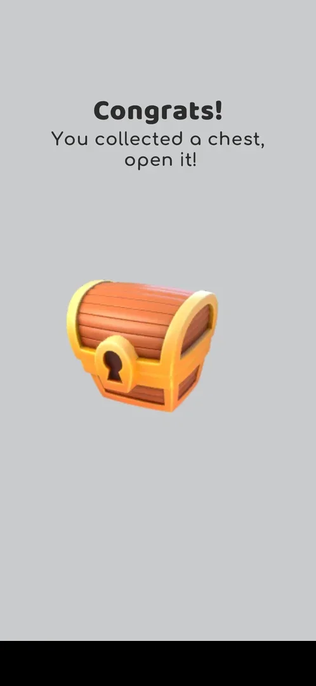 [^s13]
*A tap on the OPEN chest: "Congrats! You collected a chest, open it!" with one closed wooden chest (the banner ad at the bottom blacked out)*

A tap on the chest button while it reads **OPEN** opens a grey full screen: the title **Congrats!**, the line
"You collected a chest, open it!" and one closed wooden chest with a keyhole in the middle. There is no
button: the chest itself is tapped [^s13] [^s15]. The second chest showed the same screen
[^s22].

## What you can do

| Tab or button | What it does |
|---|---|
| [Chest button](#chest-button) | Opens the chest screen when it reads OPEN; does nothing while the countdown runs |
| [The chest](#the-chest) | Opens the chest and shows the prize: coins or a puzzle piece |
| [Get xN](#get-xn) | Coin prize: a video for the prize times the lit multiplier |
| [Get 241](#get-241) | Coin prize: takes the prize as it is |
| [Puzzle Piece Found!](#puzzle-piece-found) | Puzzle prize: the piece placed in its puzzle |
| [Get Another](#get-another) | Puzzle prize: a video for one more piece; not tapped |
| [Tap to continue](#tap-to-continue) | Puzzle prize: back to the map, a new countdown |

### Chest button

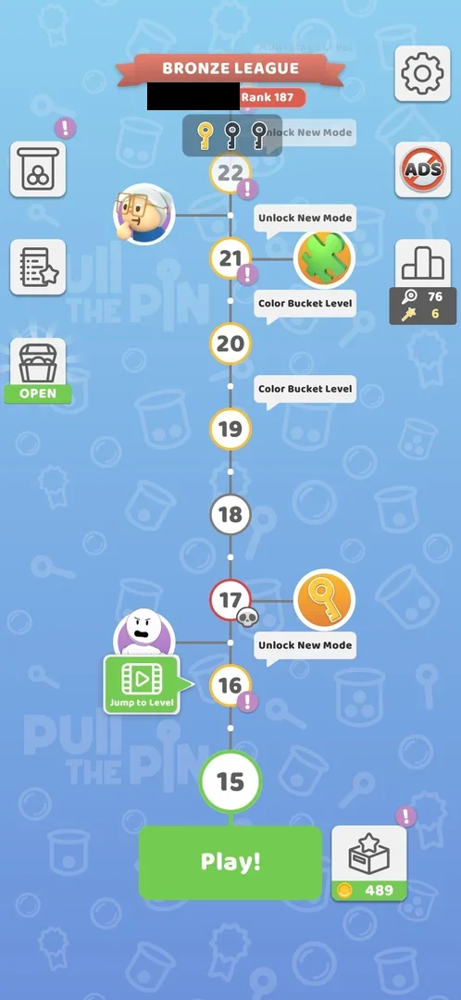 [^s12]
*The map at level 15: the chest button reads OPEN (the player's name blacked out)*

At OPEN it opens the chest screen [^s15]; with 11m 15s left a tap changed nothing: no popup and no info
[^s3].

### The chest

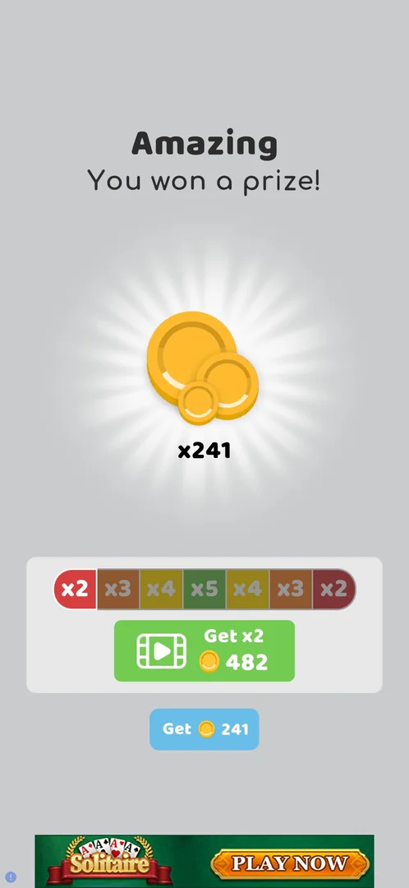 [^s14]
*The prize: x241 coins; the multiplier bar with the video button (Get x2, 482) and the plain Get 241*

The only control on the chest screen; a tap opens it and shows the prize. The first time it was
**Amazing — You won a prize!**: a stack of coins with **x241**, a bar of seven multipliers x2 x3 x4 x5 x4 x3
x2 with one lit cell moving along it, a green video button **Get xN** with the amount for the lit cell, and a
blue **Get 241** under it [^s14] [^s16]. The second time it was a puzzle piece: see
[Puzzle Piece Found!](#puzzle-piece-found) [^s21].

### Get xN

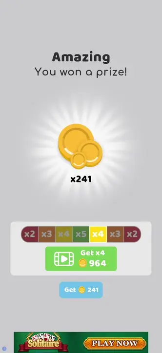 [^s14]
*Clip 3 s · [original on YouTube from 0:47](https://youtu.be/r5lFTdFC8_s?t=47)*

The lit cell moves along the bar and the button shows the prize times that cell: Get x2 482, Get x4 964,
Get x5 1205 for a 241-coin prize [^s14]. Not tapped: which multiplier is applied after the video is not
known.

### Get 241

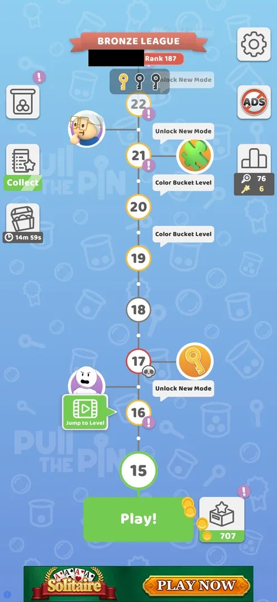 [^s17]
*The map right after Get 241: a new countdown of 14m 59s under the chest, 707 coins (the player's name blacked out)*

Taken in this session: the coins went from 489 on the map before to 707 on the map after, with coins still
flying into the counter, and the chest showed a new countdown of 14m 59s [^s12] [^s17].

### Puzzle Piece Found!

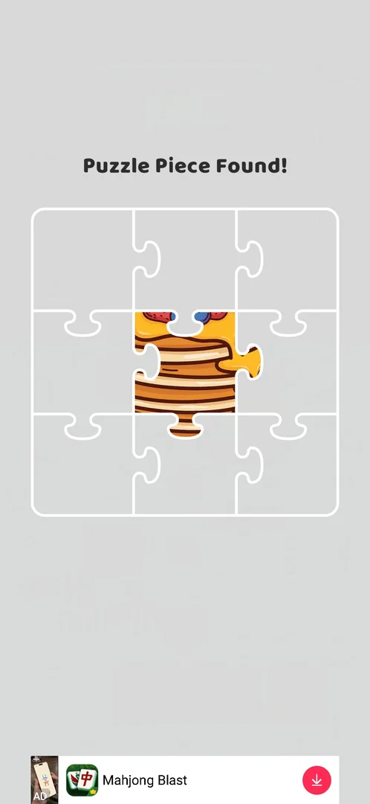 [^s21]
*The second chest's prize: Puzzle Piece Found! with the centre piece of a 3x3 pancake picture*

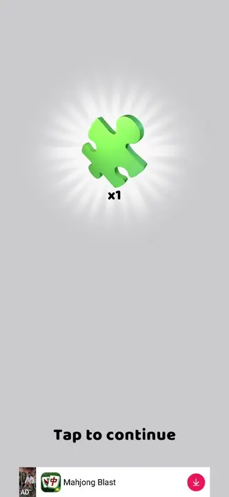 [^s21]
*Clip 4.2 s · [original on YouTube from 3:36](https://youtu.be/sunhCvwxYTk?t=216)*

The second chest, opened at level 18, gave no coins: a green puzzle piece with **x1**, then the screen
**Puzzle Piece Found!** with a 3x3 frame in which only the centre piece is filled, part of a picture of a
stack of pancakes [^s21]. The coins stayed at 1781
[^s23]. The pieces are collected in [Puzzle pieces](puzzle-pieces.md).

### Get Another

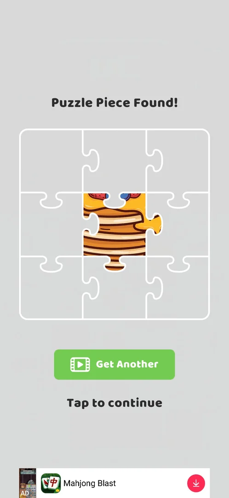 [^s21]
*A moment after the piece is placed: Get Another (with a video icon) and Tap to continue*

A green button with a video icon under the puzzle, shown a moment after the piece was placed
[^s21]. Not tapped: whether it gives one more piece after a rewarded video was
not seen.

### Tap to continue

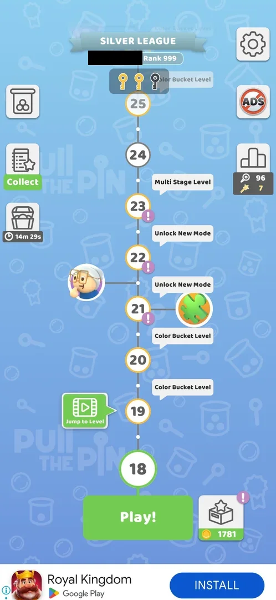 [^s23]
*The map after Tap to continue: the chest button at the left edge with a new countdown of 14m 29s (the player's name blacked out)*

Under Get Another. It returned to the map, where the chest showed a new countdown of **14m 29s** and the coins
were unchanged at 1781 [^s23].

## How it works

Version 241.5.1, first session:

 [^s6]
*The map after the level 3 win: the chest button at the left edge, 13m 36s under it*

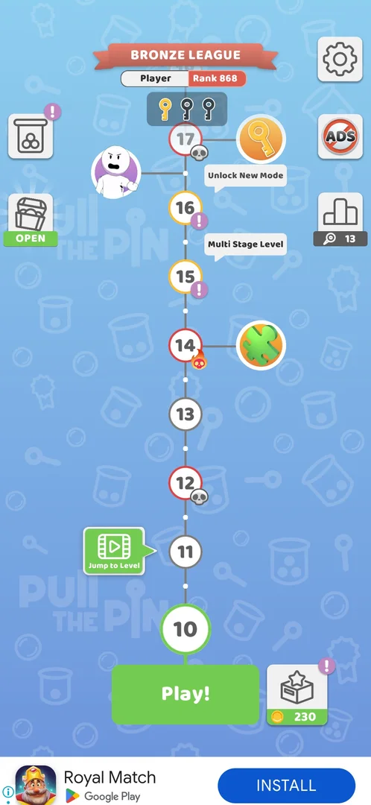 [^s2]
*The map after the level 9 win: the chest button reads OPEN*

| When | Under the chest |
|---|---|
| Map after the level 3 win | 13m 36s [^s6] |
| Map after the level 5 win | 8m 56s [^s1] |
| Map after the level 6 win | 5m 48s [^s7] |
| Map after the level 9 win | OPEN [^s2] |
| Map at level 10, the next session | OPEN [^s5] |

Version 241.5.2, at level 15. The chest that read OPEN at level 10 was showing a countdown again; how it
went from OPEN back to a timer on 241.5.1 was not seen.

| Local time | What happened since the last reading | Under the chest | Timer fell / time passed |
|---|---|---|---|
| 12:51 | Session start | 14m 20s [^s8] | — |
| 14:18:14 | Game closed, then started again | 11m 27s [^s4] | 2m 53s / about 87 min |
| 14:18:25 | Map, a tap on the chest | 11m 15s [^s3] | 12 s / 11 s |
| 14:21:52 | Settings, level 15 stage 1 (about 54 s), an ad of about 97 s, a game restart | 9m 47s [^s9] | 1m 40s / 3m 39s |
| 14:25:09 | Level 15 stages 1-2 (about 75 s), an ad of about 95 s, a game restart | 8m 24s [^s10] | 1m 23s / 3m 17s |
| 14:29:52 | On the map the whole time | 3m 41s [^s10] | 4m 43s / 4m 43s |
| about 14:55:00 | Game closed (session ended), then started again | 3m 16s [^s11] | 25 s / about 25 min |
| about 14:57:15 | On the map the whole time | 1m 02s [^s11] | 2m 14s / 2m 15s |
| about 14:58:20 | On the map the whole time | OPEN [^s11] | the 1m 02s ran out / 65 s |
| 15:11:13 | Game closed (session ended), then started again | OPEN [^s12] | — |
| 15:11:55 | Chest opened, Get 241 | 14m 59s [^s17] | a new countdown |
| 15:17:09 | Level 15 stages 2-4 with a between-stage ad of about 80 s (it opened the store, the game was started again), the win screens | 11m 03s [^s18] | 3m 56s / 5m 14s |
| 15:18:50 | Map, the new-mode popup, All You Can Play!, back to the map; no ad | 9m 22s [^s20] | 1m 41s / 1m 41s |
| 15:30:24 | Levels 16 and 17 with their win screens, two interstitials of about 100 s and about 155 s | 1m 42s [^s19] | 7m 40s / 11m 34s |
| 15:32:39 | On the map the whole time | OPEN [^s19] | the 1m 42s ran out / 2m 15s |
| about 23:13 | Game closed, then started again; a Sketchman level and an ad | OPEN [^s22] | — |
| about 23:14 | Chest opened (puzzle piece), Tap to continue about 30 s later | 14m 29s [^s23] | a new countdown |

- A full countdown is 15 minutes: it restarts at 14m 59s right after the prize is taken [^s17]. After the
  puzzle prize the map showed 14m 29s, about 30 s after the chest was tapped open and a few seconds after Tap
  to continue; inferred: the new countdown starts when the chest is opened, not when the prize screen is
  left [^s21] [^s23].
- Prizes seen, one per chest: 241 coins (first chest, level 15), one puzzle piece of a 3x3 pancake picture
  (second chest, level 18) [^s16] [^s21]. How the prize is chosen is not known.
- On the map, and on game screens with no ad, the timer runs at the speed of the clock [^s10] [^s11] [^s20],
  and at zero the label turns to OPEN [^s11] [^s19].
- It runs while a level is played: 3m 56s came off between 15:11:55 and 15:17:09, while the map was on
  screen for only a few seconds of that span (level 15 was started right after the chest) [^s18].
- It does not run while the game is closed: it fell 25 s in the about 25 minutes between the sessions at
  14:18 and 14:55 on 5 October [^s11], and 2m 53s in about 87 minutes between the sessions at 12:51 and
  14:18 [^s4].
- Inferred: it stands still during ads. In every span with ads it fell by about the time spent outside
  the ads: 5m 14s minus an ad of about 80 s is about 3m 54s (fell 3m 56s); 11m 34s minus about 4m 15s of
  ads is about 7m 20s (fell 7m 40s); the same held for the two spans of session 20261005-141756 (fell
  1m 40s and 1m 23s for about 1m 45s and 1m 24s outside ads and restarts) [^s9] [^s10] [^s18] [^s19]. The ad
  times are read from the session record to within about 20 s, so this is not exact.
- The chest is not opened by itself: it stayed at OPEN across a closed game and a new session [^s12].

## Cases

| Case | What was done | Result | Source |
|---|---|---|---|
| Map, left side: chest icon with a timer; shows a green OPEN label when ready (seen at L10, 21:48) <!-- case:chk-entry --> | Looked at the map | ✅ The chest button at the left edge, a timer or OPEN | [^s4] |
| Why it appeared <!-- case:chk-appeared --> | Won level 3, the map appeared | ✅ The chest with its timer on the first map | [^s1] |
| Tap on OPEN chest: grey screen 'Congrats! You collected a chest, open it!' with a chest; tap the chest to open <!-- case:chk-screen --> | Tapped the chest button at OPEN | ✅ The chest screen with one wooden chest | [^s15] |
| Progress is only the timer: 15 min, then OPEN; restarts at 15:00 after opening <!-- case:chk-progress --> | Took the prize, read the button | ✅ A new countdown at 14m 59s | [^s17] |
| No items or tiers seen: one wooden chest, coin prize (241 this time) <!-- case:chk-items --> | Opened the chest twice | ✅ One wooden chest both times; the prize differed: 241 coins, then one puzzle piece | [^s16] [^s21] |
| Earned by time: the 15 min timer; no other source seen <!-- case:chk-earn --> | Read the timer over three sessions | ✅ Only the timer. The map's note "runs only while the map is shown" does not hold: it also runs in levels (see How it works) | [^s17] [^s18] |
| Tapping the opened chest shows 'Amazing, You won a prize!' x241 coins; Get 241 or video Get xN on a moving x2-x5 bar <!-- case:chk-use --> | Tapped the chest | ✅ The prize screen | [^s16] |
| Reward 241 coins (plain Get); coins 489 -> 707+ on the map; the chest timer restarts at 14m59s <!-- case:chk-complete --> | Tapped Get 241 | ✅ 241 coins, a new countdown | [^s17] |
| Tapping the chest while its timer runs (11m15s) does nothing: no popup, no info <!-- case:closed-tap --> | Tapped the chest with 11m 15s left | ✅ Nothing happened | [^s3] |
| The chest timer runs while the map is on screen <!-- case:timer-map-only --> | Stayed 283 s on the map, then compared with a span mostly in level 15, ads and restarts | ✅ 283 s on the map took 283 s off (8m 24s to 3m 41s); 416 s mostly elsewhere took 183 s off (11m 27s to 8m 24s). ⚠️ That the timer runs *only* on the map is contradicted by the next session: it runs in levels too | [^s10] [^s18] |
| On the map the timer runs at the speed of the clock and ends in OPEN <!-- case:timer-wall-speed-map --> | Stayed on the map from 3m 16s | ✅ 3m 16s to 1m 02s in 135 s; OPEN about 200 s after the first reading | [^s11] |
| The timer stands still while the game is closed <!-- case:timer-stops-app-closed --> | Read the timer at the end of one session and the start of the next | ✅ 3m 41s at 14:29:52, 3m 16s at 14:55: 25 s off in about 25 minutes | [^s11] |
| Chest timer 14m59s (map) -> 11m03s after playing L15 stages 2-4 with an interstitial: it ran during the level too <!-- case:timer-in-level --> | Played level 15 right after opening the chest | ✅ 3m 56s off in 5m 14s, almost all of it in the level and its ad | [^s18] |
| Video Get xN with the moving x2-x5 bar on the chest prize: what multiplier lands and the reward <!-- case:video-multiplier --> | — | not verified: Get 241 was taken | [^s14] |

## Not verified

- The video Get xN: which multiplier is applied, the ad, the coins credited <!-- case:video-multiplier -->
- How the prize is chosen (coins or a puzzle piece; other kinds?), and what the puzzle prize's Get Another
  video gives
- Whether the new countdown starts when the chest is opened or when the prize screen is left
- Whether the timer stands still during ads (inferred above, not tested in isolation)

[^s1]: session 20261003-203702-chrono-2FYKPJ, step 19 — [video at 6:13](https://youtu.be/cirqlD7KGWI?t=373)
[^s2]: session 20261003-203702-chrono-2FYKPJ, step 52 — [video at 21:42](https://youtu.be/cirqlD7KGWI?t=1302)
[^s3]: session 20261005-141756-chrono-2FYKPJ, step 1 — [video at 0:28](https://youtu.be/pvvfGQcAObg?t=28)
[^s4]: session 20261005-141756-chrono-2FYKPJ, step 0 — [video at 0:00](https://youtu.be/pvvfGQcAObg?t=0)
[^s5]: session 20261003-214021-chrono-2FYKPJ, step 30 — [video at 7:35](https://youtu.be/siJO2QCuGxI?t=455)
[^s6]: session 20261003-203702-chrono-2FYKPJ, step 5 — [video at 1:43](https://youtu.be/cirqlD7KGWI?t=103)
[^s7]: session 20261003-203702-chrono-2FYKPJ, step 30 — [video at 10:57](https://youtu.be/cirqlD7KGWI?t=657)
[^s8]: session 20261005-125008-chrono-2FYKPJ, step 1 — [video at 0:34](https://youtu.be/rULKLs8ztsM?t=34)
[^s9]: session 20261005-141756-chrono-2FYKPJ, step 12 — [video at 3:31](https://youtu.be/pvvfGQcAObg?t=211)
[^s10]: session 20261005-141756-chrono-2FYKPJ, step 23 — [video at 6:37](https://youtu.be/pvvfGQcAObg?t=397)
[^s11]: session 20261005-145445-chrono-2FYKPJ, step 0 — [video at 0:00](https://youtu.be/64S3_7O6jSs?t=0)
[^s12]: session 20261005-151039-chrono-2FYKPJ, step 0 — [video at 0:00](https://youtu.be/r5lFTdFC8_s?t=0)
[^s13]: session 20261005-151039-chrono-2FYKPJ, step 1 — [video at 0:36](https://youtu.be/r5lFTdFC8_s?t=36)
[^s14]: session 20261005-151039-chrono-2FYKPJ, step 2 — [video at 0:50](https://youtu.be/r5lFTdFC8_s?t=50)
[^s15]: session 20261005-151039-chrono-2FYKPJ, step 3 — [video at 1:04](https://youtu.be/r5lFTdFC8_s?t=64)
[^s16]: session 20261005-151039-chrono-2FYKPJ, step 4 — [video at 1:54](https://youtu.be/r5lFTdFC8_s?t=114)
[^s17]: session 20261005-151039-chrono-2FYKPJ, step 5 — [video at 2:17](https://youtu.be/r5lFTdFC8_s?t=137)
[^s18]: session 20261005-151039-chrono-2FYKPJ, step 17 — [video at 5:51](https://youtu.be/r5lFTdFC8_s?t=351)
[^s19]: session 20261005-151039-chrono-2FYKPJ, step 37 — [video at 18:05](https://youtu.be/r5lFTdFC8_s?t=1085)

[^s20]: session 20261005-151039-chrono-2FYKPJ, step 21 — [video at 7:42](https://youtu.be/r5lFTdFC8_s?t=462)

[^s21]: session 20261005-230946-chrono-2FYKPJ, step 9 — [video at 3:40](https://youtu.be/sunhCvwxYTk?t=220)
[^s22]: session 20261005-230946-chrono-2FYKPJ, step 8 — [video at 3:27](https://youtu.be/sunhCvwxYTk?t=207)
[^s23]: session 20261005-230946-chrono-2FYKPJ, step 10 — [video at 4:10](https://youtu.be/sunhCvwxYTk?t=250)
