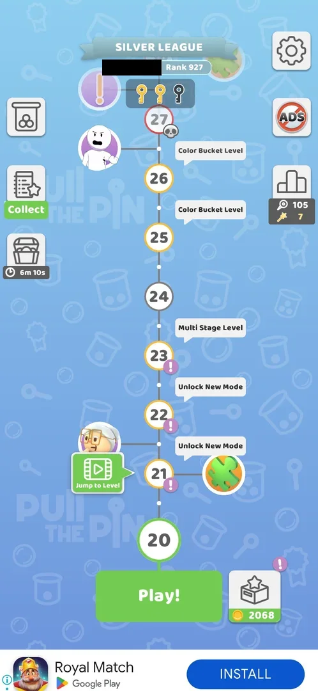
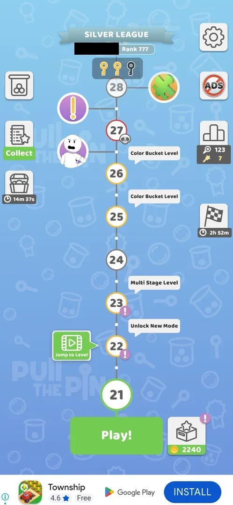
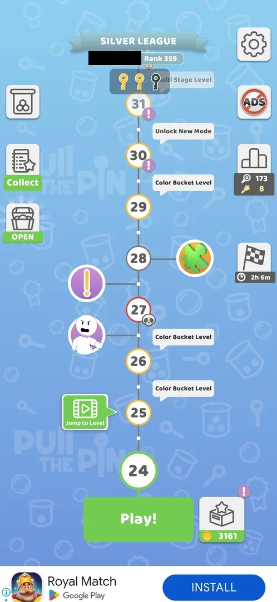
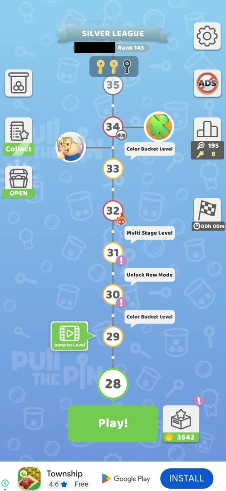
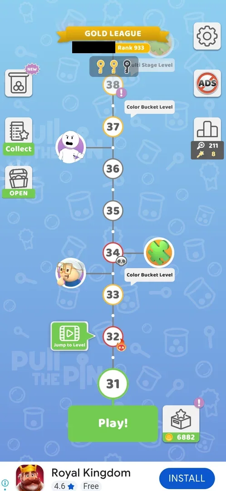
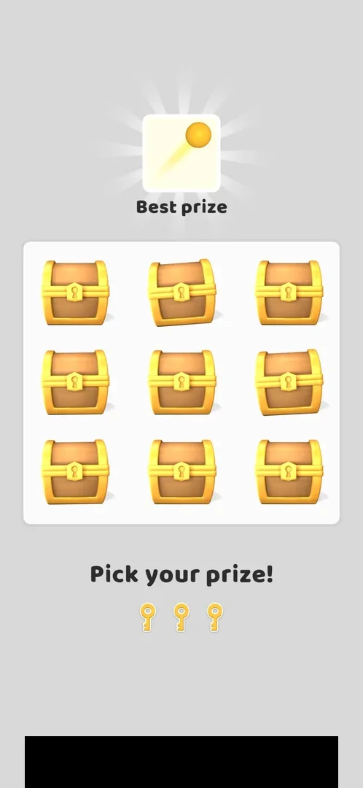
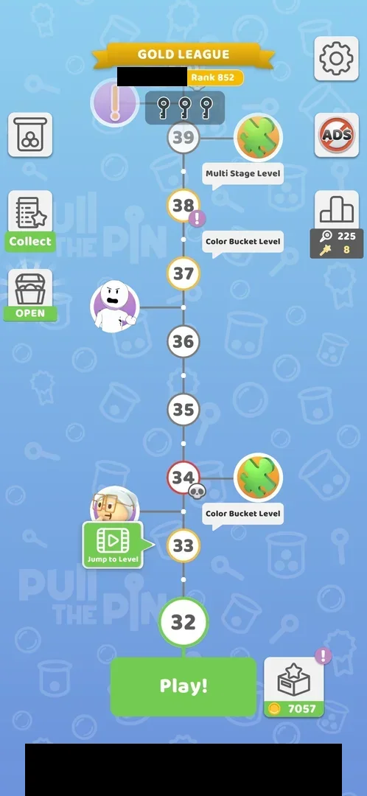
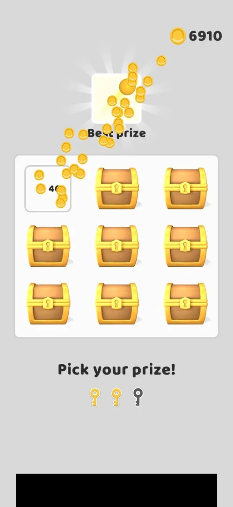
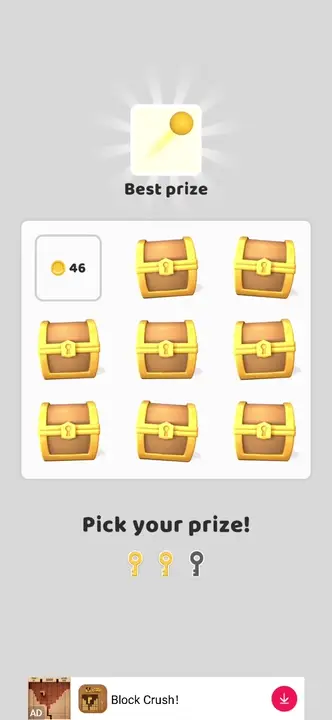
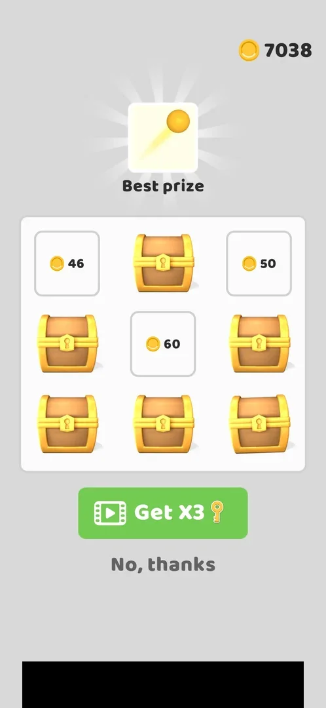

# Keys on the map (key nodes, 3-key gate at L11-12)

Keys are collected on the map: some level nodes have an orange key badge beside them, and a box of three key
slots pinned at the top of the map fills as these levels are won. Winning level 9 filled the first slot,
winning level 17 (a hard, skull level) the second [^s1] [^s2] [^s5]. The third key came with the win of
level 31, a Multi Stage Level with no key badge seen beside it [^s17] [^s19]. Three keys open a prize room
right after that level: nine closed chests, one chest per key; the three picks paid 46, 50 and 60 coins, and
a video offers three more keys [^s19] [^s21]. Back on the map the three slots are empty again [^s22].

## Why it appeared

Key node on level 9: winning L9 filled 1 of the 3 key slots above L17 [^s1].

## Where to find it

The level map: the round orange key badges beside some level nodes, and the row of three keyhole slots in a
dark box under the league banner at the top [^s2]. The box stays at the top while the map scrolls; the
labels of the nodes behind it show through at its right ("Unlock New Mode" at level 15, "Color Bucket Level"
at level 18) [^s3] [^s5]. On the first map a tutorial tooltip points at a key node: "Get unique rewards
buried in the levels!" [^s4]. The chest room has no button of its own: it opens by itself when the level that
brings the third key is won [^s19].

 [^s3]
*The map at level 15: the key slot box at the top, first slot gold; the orange key badge beside level 17*

## What it looks like

On the map there is only the slot box [^s1] [^s5]. Before level 9 the three slots are grey outlines of keys
[^s2]; each key won turns one slot gold [^s1] [^s5].

 [^s1]
*The map after the level 9 win: the first of three key slots gold*

 [^s2]
*The map before level 4: the orange key node beside level 9; three empty key slots at the top*

 [^s5]
*The map at level 18, after the level 17 win: two gold keys and one empty slot; no key badge between levels 18 and 25 (the player's name and a local banner ad blacked out)*

 [^s9]
*The map at level 20: two keys of three; the skull level 27 just under the key box, no key badge in sight (the player's name blacked out)*

 [^s11]
*The map at level 21 on 6 October: still two keys of three; up to level 28 the nodes beside the path are Jump to Level, a Sketchman face, a purple ! and a puzzle piece, none of them a key (the player's name blacked out)*

 [^s13]
*The map at level 24, after the level 23 win: still two keys of three; up to level 31 no node carries a key badge (the player's name blacked out)*

 [^s16]
*The map at level 28, after the level 27 win: still two keys of three; the nodes up to level 35 are a flame skull (32), a skull with a puzzle node beside it (34) and a grandmother face by 33-34, none of them a key (the player's name blacked out)*

 [^s17]
*The map at level 31, after the level 28 to 30 wins: still two keys of three; up to level 38 no node carries a key badge, level 31 included (the player's name blacked out)*

The prize room, right after the level 31 win: a "Best prize" card under a glow at the top, a 3 by 3 grid of
closed gold chests, "Pick your prize!" and the three gold keys under it [^s19].

 [^s19]
*The chest room right after the level 31 win: the Best prize card on top, nine closed chests, three keys under "Pick your prize!" (a banner ad blacked out)*

The Best prize card shows a yellow ball with a light streak behind it; the game does not name it on this
screen [^s19]. Inferred from the picture: a cosmetic ball item such as a trail from Collections; not verified.

After the room, the map shows the slot box empty again [^s22]:

 [^s22]
*The map at level 32, after the chest room: all three key slots grey, 0 of 3 (the player's name and a banner ad blacked out)*

## What you can do

| Tab or button | What it does |
|---|---|
| [Chests](#chests) | A tap on a closed chest spends one key and opens it |
| [Get X3](#get-x3) | After the keys run out: three more keys for a video |
| [No, thanks](#no-thanks) | Leaves the room without the video; it appears a few seconds after Get X3 |

### Chests

A tap on a closed chest turns it into a tile with its prize; the coins fly to the counter at the top right,
and one of the three keys under "Pick your prize!" turns grey [^s20]. The three picks (top left, top right,
centre) gave 46, 50 and 60 coins [^s21].

 [^s20]
*The first chest opened (top left): a 46-coin tile, coins flying to the counter, two gold keys left (a banner ad blacked out)*

 [^s20]
*Clip 3 s · [original on YouTube from 7:17](https://youtu.be/f6pSE4U3c18?t=437)*

### Get X3

When the last key is spent, the key row is replaced by a green "Get X3" button with a video icon and a key;
"No, thanks" appears under it a few seconds later [^s21]. The six other chests stay closed, and the Best prize
was not in the three opened ones [^s21]. Get X3 was not taken: what three more picks give is not verified.

 [^s21]
*The room after the three picks: 46, 50 and 60 coins, six chests closed, Get X3 (video) and No, thanks (a banner ad blacked out)*

### No, thanks

"No, thanks" under Get X3 closes the room; the six closed chests are not shown opened [^s21] [^s23]. Next come
the Gold League board with Next Level!, then "Amazing! Level completed!" with the level's +19 coins and Tap to
continue, an interstitial ad, and the map [^s23] [^s24] [^s22].

 [^s21]
*No, thanks: the grey text under Get X3 (a banner ad blacked out)*

## How it works

| Moment | Version | Key slots |
|---|---|---|
| Map after the level 3 win | 241.5.1 | 0 of 3 [^s2] |
| Map after the level 9 win (key badge level) | 241.5.1 | 1 of 3 [^s1] |
| Map at level 15 | 241.5.2 | 1 of 3; next key badge at level 17 [^s3] |
| Map at level 18, after the level 17 win (key badge level) | 241.5.2 | 2 of 3; no key badge visible up to level 25 [^s5] |
| Map at level 18, next session | 241.5.2 | 2 of 3; still no key badge up to level 25 [^s10] |
| Map at level 20, after the level 18 and 19 wins | 241.5.2 | 2 of 3; no key badge visible up to level 27 [^s9] |
| Map at level 21, after the level 20 win (6 October) | 241.5.2 | 2 of 3; no key badge visible up to level 28 [^s11] |
| Map at level 22, after the level 21 win | 241.5.2 | 2 of 3; no key badge visible up to level 29 [^s12] |
| Map at level 24, after the level 22 and 23 wins | 241.5.2 | 2 of 3; no key badge visible up to level 31 [^s13] |
| Map at level 25, after the level 24 win | 241.5.2 | 2 of 3; no key badge visible up to level 32 [^s14] |
| Map at level 27, after the level 25 and 26 wins | 241.5.2 | 2 of 3; no key badge visible up to level 34 [^s15] |
| Map at level 28, after the level 27 win (skull level) | 241.5.2 | 2 of 3; no key badge visible up to level 35 [^s16] |
| Map at level 28, next session | 241.5.2 | 2 of 3 [^s18] |
| Map at level 31, after the level 28, 29 and 30 wins | 241.5.2 | 2 of 3; no key badge visible up to level 38 [^s17] |
| Level 31 (Multi Stage, 4 stages) won | 241.5.2 | 3 keys in the chest room, all spent there [^s19] [^s21] |
| Map at level 32, after the chest room | 241.5.2 | 0 of 3 [^s22] |

- A level with a key badge gives one key when it is won: level 9 and level 17 [^s1] [^s5]. Levels 10 to 16
  gave none [^s3] [^s5]. Levels 18 to 30 gave none either, level 27 a skull level like level 17 [^s9] [^s11] [^s13] [^s16] [^s17].
- Level 31 gave the third key although no key badge was seen beside it on the maps at levels 24 to 31
  [^s13] [^s17] [^s19]. Inferred: either a key level is not always marked, or the badge was hidden by the
  current level's node; not verified.
- There is no refill timer: keys come only from levels [^s5].
- Three keys open the chest room at once, after the last stage of the level and before the league board and
  the "Level completed!" screen [^s19] [^s23] [^s24].
  One key opens one chest [^s20].
- Version 241.5.2, the first room: the three picks paid 46, 50 and 60 coins, 156 in all; the counter went
  from 6882 on the map before the level to 7038 after the third pick [^s25] [^s21].
  The level's own +19 coins came later, on the win screen (7057) [^s24].
- The room spends all three keys: on the next map the box is back at 0 of 3 [^s22].
- The label "Unlock New Mode" belongs to level nodes, not to the keys. Inferred from the maps of 241.5.2: it
  sits above levels 16, 21 and 22 [^s6] [^s7], the levels at which All You Can Play! unlocks Sketchman IQ
  Test (16), Challenge (21) and Merge Balls (22); the label above level 16 was gone once level 16 was reached
  and the IQ Test unlocked [^s7] [^s8]. On the map at level 24 the label sits above level 30, the unlock level
  of Protect The Balloon in the same menu [^s13]. An earlier version of this page read it as the keys' label.

## Cases

| Case | What was done | Result | Source |
|---|---|---|---|
| Why it appeared <!-- case:chk-appeared --> | Won level 9 | ✅ The first slot filled | [^s1] |
| No own screen: the map shows a key row pinned at its top (3 slots) and key nodes beside levels (L9 taken, L17 next, orange key icon) <!-- case:chk-entry --> | Looked at the map at level 15 | ✅ The key row at the top of the map and the key badges by the levels | [^s3] |
| No own screen: the key bar pinned at the top of the map; after the L17 win it shows 2 of 3 gold <!-- case:chk-screen --> | Won level 17, back to the map | ✅ 2 of 3 gold, no key screen | [^s5] |
| Balance = the 3 key slots at the top of the map: 1 gold (from the L9 key node), 2 empty, at progress L15 <!-- case:chk-balance --> | Looked at the map at level 15 | ✅ 1 of 3 | [^s3] |
| Key nodes beside map levels: L9 and L17 (hard skull level) each gave 1 key on winning that level; no other node visible up to L25 <!-- case:chk-sources --> | Won levels 9 and 17 | ✅ One key each | [^s5] |
| No refill timer: keys come only from key nodes on map levels <!-- case:chk-refill --> | Watched the slots over three sessions | ✅ No timer | [^s5] |
| What it does <!-- case:chk-effect --> | Won level 31 with two keys in the box | Seen, still open in the map: three keys open the chest room, one chest per key | [^s19] [^s20] |
| Sinks <!-- case:chk-sinks --> | Opened three chests | Seen, still open in the map: one key per chest, no other use seen | [^s21] |
| At zero <!-- case:chk-empty --> | Spent the three keys, No, thanks, back to the map | Seen, still open in the map: Get X3 keys for a video in the room; the map box back at 0 of 3 | [^s21] [^s22] |
| Find the third key node (beyond L25) and record what 3 keys open <!-- case:third-key --> | Won level 31 | not verified in the map: the third key came with level 31, no badge was seen beside it; the room is recorded under three-keys-open | [^s17] [^s19] |
| Third key node expected near L27 <!-- case:l27-guess --> | Looked at the map at level 20, then at levels 21, 22 and 24; won level 27 | ✅ Refuted: no key badge beside level 27 on any map, and after the level 27 win the box still showed two keys of three | [^s9] [^s11] [^s13] [^s16] [^s17] |
| No key badge up to level 29 <!-- case:no-key-to-l29 --> | Won level 21, looked at the map at level 22 | ✅ Nodes up to level 29 in view, none with a key badge; the box still 2 of 3 | [^s12] |
| No key badge up to level 31 <!-- case:no-key-to-l31 --> | Won levels 22 and 23, looked at the map at level 24 | ✅ Nodes up to level 31 (the next Multi Stage Level) in view, none with a key badge; the box still 2 of 3 | [^s13] |
| No key badge up to level 32 <!-- case:no-key-to-l32 --> | Won level 24, looked at the map at level 25 | ✅ Nodes up to level 32 (a hard level with a flame skull) in view, Multi Stage Level by 31, Unlock New Mode by 30; none with a key badge; the box still 2 of 3 | [^s14] |
| No key badge up to level 34 <!-- case:no-key-to-l34 --> | Won levels 25 and 26, looked at the map at level 27 | ✅ Nodes up to level 34 (a skull level with a puzzle node) in view, a grandmother face by 33-34; none with a key badge; the box still 2 of 3 | [^s15] |
| No key badge up to level 35 <!-- case:no-key-to-l35 --> | Won level 27, looked at the map at level 28 | ✅ Nodes up to level 35 in view, none with a key badge; the box still 2 of 3 after the wins of levels 24 to 27 | [^s16] |
| No key badge up to level 38 <!-- case:no-key-to-l38 --> | Won levels 28, 29 and 30, looked at the map at level 31 | ✅ Nodes up to level 38 in view (32 hard with a flame skull, 34 boss skull, Color Bucket bubbles, 38 with a purple !), none with a key badge; the box still 2 of 3 | [^s17] |
| Three keys open a 3x3 chest room after the level win: Pick your prize, one key per chest <!-- case:three-keys-open --> | Won level 31 (Multi Stage) with two keys in the box; opened three chests | ✅ The chest room opened after the last stage; the three picks paid 46, 50 and 60 coins | [^s19] [^s21] |
| Get X3 keys by video after the 3 keys are used: what the next picks give, is the best prize reachable <!-- case:more-keys-video --> | — | not verified: No, thanks was taken |  |
| No key badge up to level 39, after the chest room <!-- case:no-key-to-l39 --> | Looked at the map at level 32 after the chest room | ✅ Nodes up to level 39 in view (34 boss skull with a puzzle node, Color Bucket bubbles, 39 Multi Stage Level), none with a key badge; the box 0 of 3 | [^s22] |
| After the chest room the key slots reset to 0/3 on the map <!-- case:keys-reset --> | Left the room with No, thanks, went through the win screens to the map | ✅ All three slots grey on the map at level 32 | [^s22] |

## Not verified

- What it does: seen on this page (three keys open the chest room), still open in the map <!-- case:chk-effect -->
- Sinks: seen on this page (one key per chest), still open in the map <!-- case:chk-sinks -->
- At zero: seen on this page (Get X3 by video; the box back at 0 of 3), still open in the map <!-- case:chk-empty -->
- The third key: level 31 gave it, but how a key level is marked when no badge is drawn is not known <!-- case:third-key -->
- Get X3: what three more picks by video give, and whether the Best prize can be won <!-- case:more-keys-video -->
- What the Best prize is (a yellow ball with a streak on its card)
- Where the next round's keys come from: the map at level 32 shows no key badge up to level 39 (case no-key-to-l39 above)
- Whether tapping the key box or a key badge opens anything (not tried)

[^s1]: session 20261003-203702-chrono-2FYKPJ, step 52 — [video at 21:42](https://youtu.be/cirqlD7KGWI?t=1302)
[^s2]: session 20261003-203702-chrono-2FYKPJ, step 7 — [video at 2:10](https://youtu.be/cirqlD7KGWI?t=130)
[^s3]: session 20261005-141756-chrono-2FYKPJ, step 0 — [video at 0:00](https://youtu.be/pvvfGQcAObg?t=0)
[^s4]: session 20261003-203702-chrono-2FYKPJ, step 6 — [video at 1:57](https://youtu.be/cirqlD7KGWI?t=117)
[^s5]: session 20261005-151039-chrono-2FYKPJ, step 37 — [video at 18:59](https://youtu.be/r5lFTdFC8_s?t=1139)
[^s6]: session 20261005-151039-chrono-2FYKPJ, step 0 — [video at 0:00](https://youtu.be/r5lFTdFC8_s?t=0)
[^s7]: session 20261005-151039-chrono-2FYKPJ, step 21 — [video at 7:42](https://youtu.be/r5lFTdFC8_s?t=462)
[^s8]: session 20261005-151039-chrono-2FYKPJ, step 20 — [video at 6:57](https://youtu.be/r5lFTdFC8_s?t=417)
[^s9]: session 20261005-235042-chrono-2FYKPJ, step 30 — [video at 11:02](https://youtu.be/PZ3ujKA8euo?t=662)
[^s10]: session 20261005-235042-chrono-2FYKPJ, step 0 — [video at 0:00](https://youtu.be/PZ3ujKA8euo?t=0)
[^s11]: session 20261006-030951-chrono-2FYKPJ, step 1 — [video at 0:20](https://youtu.be/nuXkt-gY2qg?t=20)
[^s12]: session 20261006-033538-chrono-2FYKPJ, step 20 — [video at 7:22](https://youtu.be/j9sNlnJxE4Y?t=442)
[^s13]: session 20261006-033538-chrono-2FYKPJ, step 55 — [video at 20:41](https://youtu.be/j9sNlnJxE4Y?t=1241)
[^s14]: session 20261006-061608-chrono-2FYKPJ, step 9 — [video at 4:15](https://youtu.be/OfYU2WgEiQU?t=255)
[^s15]: session 20261006-061608-chrono-2FYKPJ, step 19 — [video at 8:47](https://youtu.be/OfYU2WgEiQU?t=527)
[^s16]: session 20261006-061608-chrono-2FYKPJ, step 34 — [video at 20:10](https://youtu.be/OfYU2WgEiQU?t=1210)
[^s17]: session 20261006-091133-chrono-2FYKPJ, step 46 — [video at 20:26](https://youtu.be/nKqzeXFw6rA?t=1226)
[^s18]: session 20261006-091133-chrono-2FYKPJ, step 0 — [video at 0:00](https://youtu.be/nKqzeXFw6rA?t=0)
[^s19]: session 20261006-113518-chrono-2FYKPJ, step 16 — [video at 6:57](https://youtu.be/f6pSE4U3c18?t=417)
[^s20]: session 20261006-113518-chrono-2FYKPJ, step 17 — [video at 7:19](https://youtu.be/f6pSE4U3c18?t=439)
[^s21]: session 20261006-113518-chrono-2FYKPJ, step 20 — [video at 8:00](https://youtu.be/f6pSE4U3c18?t=480)
[^s22]: session 20261006-113518-chrono-2FYKPJ, step 24 — [video at 9:13](https://youtu.be/f6pSE4U3c18?t=553)

[^s23]: session 20261006-113518-chrono-2FYKPJ, step 21 — [video at 8:25](https://youtu.be/f6pSE4U3c18?t=505)
[^s24]: session 20261006-113518-chrono-2FYKPJ, step 22 — [video at 8:40](https://youtu.be/f6pSE4U3c18?t=520)
[^s25]: session 20261006-113518-chrono-2FYKPJ, step 5 — [video at 1:47](https://youtu.be/f6pSE4U3c18?t=107)
