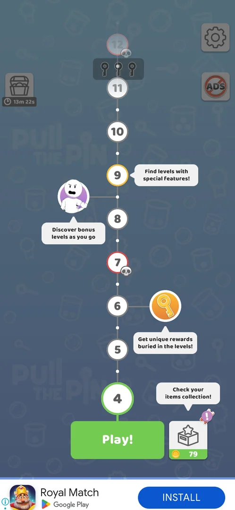
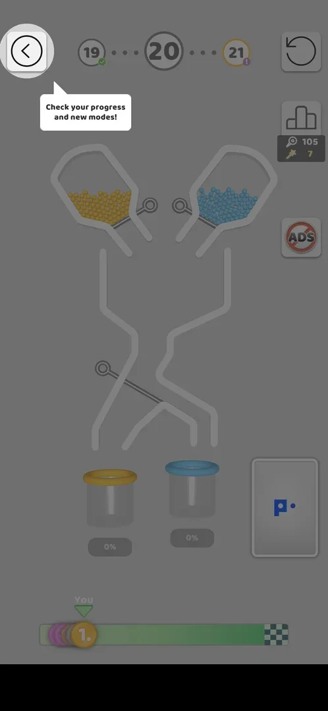

# Map tutorial tooltips

A one-screen tutorial for the level map: the map is dimmed and four speech-bubble tooltips point at the
map's features — the items collection, rewards in levels, bonus levels and special levels
[^s1]. It came once, on the first map visit, and a tap dismissed it
[^s2]. It cannot be called up again: Settings and the map have no help
button [^s3]. Single tooltips of the same kind come later, one at a time, with a new feature: at level 20,
right after a race was joined, a spotlight on the level's back arrow and then a tooltip by the map's race
button [^s5] [^s6].

## Why it appeared

First tap on Play! on the map after the L3 win [^s1].

## Where to find it

No control opens it. After the level 3 win the map appears for the first time; the first tap on **Play!**
brings the tooltips instead of level 4 [^s4] [^s1].

 [^s4]
*The first map, after the level 3 win: the green Play! button whose first tap brought the tooltips*

## What it looks like

 [^s1]
*The dimmed map with four tooltips; the pointed-at controls stay bright*

| Tooltip | Points at |
|---|---|
| "Check your items collection!" | The box button right of Play! (Collections, coin balance 79) |
| "Get unique rewards buried in the levels!" | An orange key node beside a level |
| "Discover bonus levels as you go" | A character node between levels 8 and 9 |
| "Find levels with special features!" | Level 9 |

Source: [^s1]. The rest of the map is dimmed; the level nodes with skull
badges (7 and 12) stay visible [^s1].

### Later tooltips

 [^s5]
*Level 20 right after the race was joined: the spotlight on the back arrow (a local banner ad blacked out)*

In version 241.5.2, after **Go!** on the race offer before level 20, the level opened dimmed with the back
arrow at the top left in a bright circle and a tooltip under it: "Check your progress and new modes!" [^s5].
The back arrow led to the map, where a second tooltip, "Go go! Daily race!", sat beside the new race button
with "Tap to continue" (see [Level race](race.md#where-to-find-it)) [^s6]. Neither tooltip had a skip button
[^s5] [^s6].

## How it works

Version 241.5.1. One overlay with all four tooltips at once, no steps and no hand
[^s1]. A tap on Play! dismissed it; the next tap on Play! opened Daily Rewards
[^s2]. No skip button was seen [^s1].

Version 241.5.2. The [Settings](settings.md) screen (the gear at the top right of the map) holds only Sound,
Vibration, Rate us and Privacy, with no help or How to play entry, and the map has no help icon
[^s3]: the four-tooltip overlay is shown once.

Version 241.5.2, later tooltips: one at a time, tied to a feature just met (the race at level 20) [^s5] [^s6].

## Cases

| Case | What was done | Result | Source |
|---|---|---|---|
| One dimmed overlay with four tooltips: items collection (box button), unique rewards in levels (key node), bonus levels (character node), levels with special features (L9) <!-- case:chk-steps --> | Tapped Play! on the first map | ✅ Seen | [^s1] |
| No entry: shows by itself on the first Play! tap on the map after the L3 win <!-- case:chk-entry --> | Tapped Play! | ✅ By itself | [^s1] |
| Dimmed map with four speech-bubble tooltips <!-- case:chk-screen --> | Looked at it | ✅ Seen | [^s1] |
| A tap dismisses it; the next Play! tap opens Daily Rewards <!-- case:chk-end --> | Tapped Play! again | ✅ Dismissed; Daily Rewards next | [^s2] |
| Why it appeared <!-- case:chk-appeared --> | Won level 3, tapped Play! | ✅ The first map visit | [^s1] |
| No replay: Settings has only Sound, Vibration, Rate us, Privacy; no help or How to play button; the map has no help icon <!-- case:chk-replay --> | Opened Settings from the gear on the map at level 15 | ✅ No way to see it again | [^s3] |
| Whether it can be skipped <!-- case:chk-skip --> | — | not verified: needs a fresh install |  |

## Not verified

- Whether it can be skipped, and what happens when the app is left while it is shown (needs a fresh
  install) <!-- case:chk-skip -->

[^s1]: session 20261003-203702-chrono-2FYKPJ, step 6 — [video at 1:57](https://youtu.be/cirqlD7KGWI?t=117)
[^s2]: session 20261003-203702-chrono-2FYKPJ, step 8 — [video at 2:20](https://youtu.be/cirqlD7KGWI?t=140)
[^s3]: session 20261005-141756-chrono-2FYKPJ, step 2 — [video at 0:46](https://youtu.be/pvvfGQcAObg?t=46)
[^s4]: session 20261003-203702-chrono-2FYKPJ, step 5 — [video at 1:43](https://youtu.be/cirqlD7KGWI?t=103)

[^s5]: session 20261005-235042-chrono-2FYKPJ, step 32 — [video at 11:59](https://youtu.be/PZ3ujKA8euo?t=719)
[^s6]: session 20261005-235042-chrono-2FYKPJ, step 33 — [video at 12:10](https://youtu.be/PZ3ujKA8euo?t=730)
