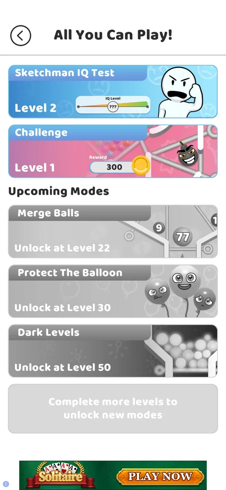
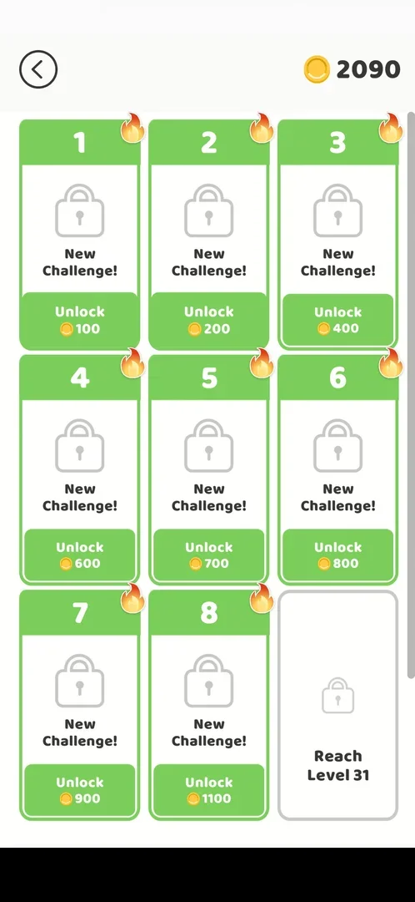
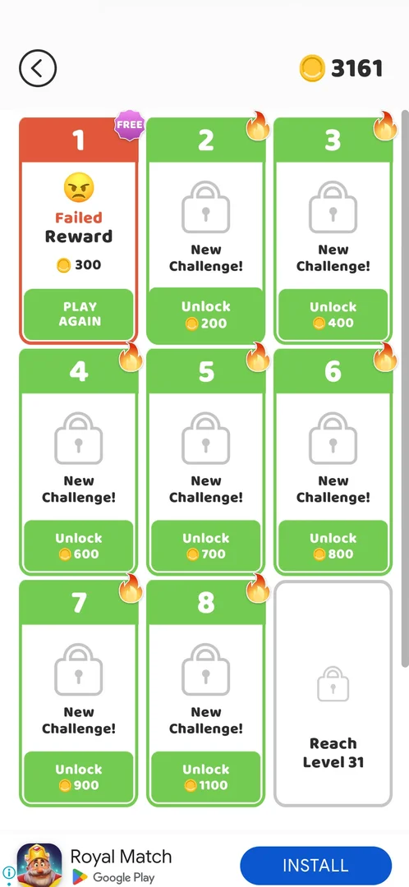
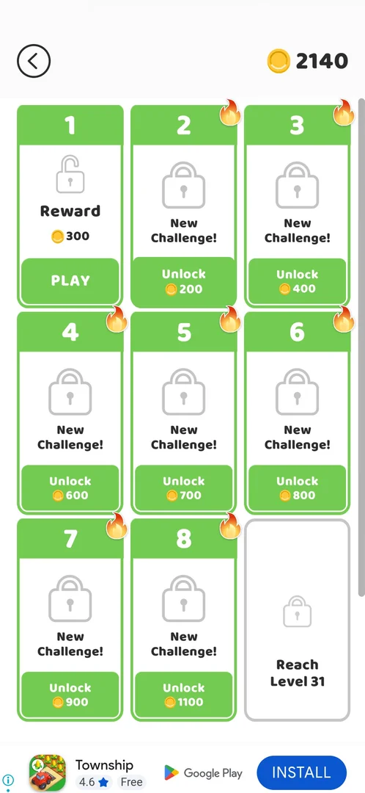
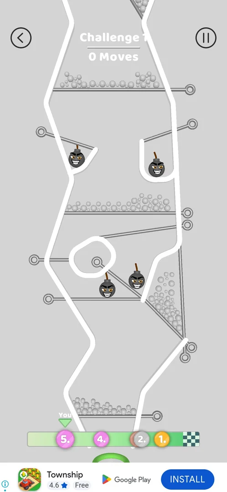
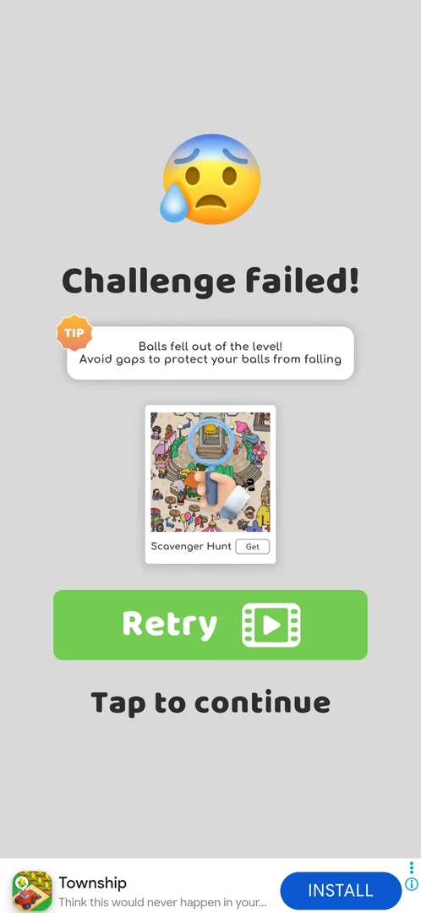
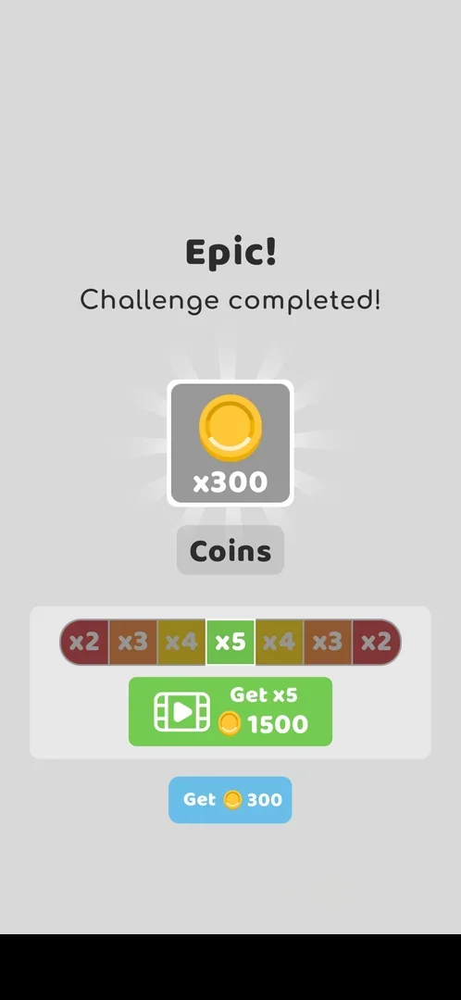
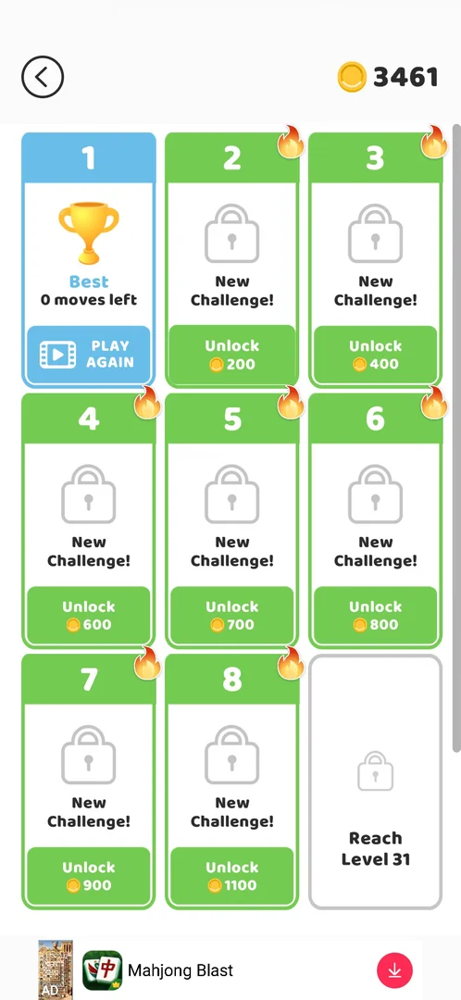

# Challenge

A game mode in the [All You Can Play!](ball-jar.md) menu that opens with the level 20 win. Its screen is a
grid of numbered challenges, each bought once with coins (100 to 1100 coins for challenges 1 to 8), with a
ninth that needs level 31 [^s1] [^s2]. A challenge is one tall pin-pull board with a limit of 10 moves, bombs
and grey balls that colored balls paint, and a race bar at the bottom; Challenge 1 promises 300 coins
[^s9] [^s11]. Right after a loss a failed challenge can be tried again only after a rewarded video [^s10]
[^s11]; about 25 minutes later the same card offered **PLAY AGAIN** for free [^s15] [^s16]. Challenge 1 was
unlocked, lost three times and won on the fourth try, which paid 300 coins with an x2-x5 video multiplier
offered on top [^s17] [^s18].

## Why it appeared

Listed in the All You Can Play! modes menu from the start, under Upcoming Modes with "Unlock at Level 21"
(seen at level 10, version 241.5.1) [^s3]. It opened after the level 20 win, with
level 21 current: the jar button on the map showed a NEW badge and the menu had a Challenge card with NEW
[^s4] [^s1].

## Where to find it

The map: the jar button at the top left (with a NEW badge after the unlock) opens All You Can Play!; the mode
is the second card, **Challenge**, under the Sketchman IQ Test card [^s1].

 [^s1]
*All You Can Play! after the level 20 win: the Challenge card (NEW, Level 1, Reward 300) is the second card (a local banner ad blacked out)*

 [^s6]
*The menu on the next visit: the Challenge card (Level 1, Reward 300) no longer has the NEW badge; tapping it opens the grid*

Before the unlock the card was greyed out with "Unlock at Level 21", and a tap on it did nothing
[^s3] [^s5].

 [^s3]
*All You Can Play! at level 10 (version 241.5.1): the Challenge card still locked, "Unlock at Level 21"*

## What it looks like

 [^s2]
*The Challenge screen at the first opening: eight locked challenges with coin prices and a ninth locked by level (a local banner ad blacked out)*

The card opens a grid [^s2] [^s7]:

- a back arrow at the top left and the coin balance at the top right;
- cards 1 to 8, each with a padlock, **New Challenge!**, a flame badge on its corner and a green **Unlock**
  button with a coin price;
- card 9, grey, with a padlock and **Reach Level 31**.

A card changes with its state: bought (an open padlock, **Reward 300**, **PLAY**) [^s8]; failed (a red
header, an angry face, **Failed**, **Reward 300**, **PLAY AGAIN** with a video icon) [^s10], or the same with a
purple **FREE** badge on its corner and no video icon on PLAY AGAIN [^s15]; completed (a blue header, a gold
trophy, **Best** and the moves left, **PLAY AGAIN** with a video icon) [^s18].

 [^s15]
*The grid about 25 minutes after the last video retry: card 1 still Failed, now with a FREE badge; coins 3161*

## What you can do

| Tab or button | What it does |
|---|---|
| [Unlock](#unlock) | Buys a challenge for its coin price, at once |
| [Challenge board](#challenge-board) | **PLAY** on a bought card starts its board |
| [Challenge failed!](#challenge-failed) | The fail screen: **Retry** by video, later **Tap to continue** |
| [PLAY AGAIN](#play-again) | On a failed card: starts the board again after a rewarded video, or for free when the card has a FREE badge |
| [Epic! Challenge completed!](#epic-challenge-completed) | The win screen: **Get 300**, or **Get xN** by video with a moving x2-x5 multiplier |
| [Completed card](#completed-card) | The card after a win: trophy, Best, PLAY AGAIN by video |

### Unlock

 [^s8]
*After Unlock on card 1: an open padlock, Reward 300, PLAY; the flame badge on card 1 is gone; coins 2240 to 2140*

A tap on **Unlock 100** on card 1 bought it at once, with no confirmation: the balance went from 2240 to
2140, card 1 showed an open padlock, Reward 300 and **PLAY**, and its flame badge was gone [^s7] [^s8].

### Challenge board

 [^s9]
*Challenge 1 as it opens: the camera at the bottom of the board, the cup under it, the race bar with You in 5th place*

- The header reads **Challenge 1** and a move counter; a back arrow on the left and a pause button on the
  right [^s9].
- The board is taller than the screen. As it opens, the camera is at the bottom (the cup, the counter at 0)
  [^s9]; then it shows the top of the board with the counter at 10 [^s11]. Inferred: an opening pan from the
  cup to the top while the counter fills to 10.
- On the board of Challenge 1: a shelf of colored balls at the top, grey balls on two shelves and in a
  triangle pocket on the right, four bombs (two in side pockets, two in the middle), and the cup at the
  bottom [^s9] [^s13].
- Each pull takes one move off the counter: three pulls took it from 10 to 7 [^s13].
- The camera follows the falling balls, so the board moves after a pull [^s11].
- Colored balls paint the grey balls they touch [^s11].
- Two bombs that meet explode and disappear [^s13]:

*A pull drops a middle bomb onto the other; both explode and the middle of the board is cleared; the counter reads 7 Moves* (clip dropped: per-dream clip limit) [^s13]
*Clip 5.2 s · [original on YouTube from 13:07](https://youtu.be/nuXkt-gY2qg?t=787); one pull, the two middle bombs meet and blow each other up*

- The race bar at the bottom: a green track to a chequered flag with five numbered markers; You is 5th
  [^s9]. The markers stood in the same places throughout the three tries [^s9] [^s13].

### Challenge failed!

 [^s12]
*The fail screen some seconds after the loss: TIP with the cause, an ad tile, Retry (video) and the later Tap to continue*

The screen reads **Challenge failed!** with a **TIP** that names the cause (here: the balls fell out of the
level, with advice to avoid gaps), an ad tile for another game, and **Retry** with a video icon; there is
no free retry [^s11]. Right after the loss only Retry is there [^s14]; **Tap to continue** appeared under it
later (seen about 25 s after the loss) [^s12]. What Tap to continue leads to was not seen.

*The pull at the tip of the grey-ball triangle: the grey balls pour out of the side of the board, and the Challenge failed! screen comes up* (clip dropped: per-dream clip limit) [^s14]
*Clip 4.5 s · [original on YouTube from 14:06](https://youtu.be/nuXkt-gY2qg?t=846); the pull opens the triangle at the side, the balls fall out of the level, the fail screen follows*

After the first try an interstitial ad played and covered the end of the board; the fail screen was not
seen, and the game came back on the grid with card 1 failed [^s10].

### PLAY AGAIN

 [^s10]
*Card 1 after the first loss: red header, Failed, Reward 300 still offered, PLAY AGAIN by video; coins still 2140 (an English store ad at the bottom)*

On a failed card **PLAY AGAIN** plays a rewarded video, then starts the board again; the 100 coins paid for
the unlock are not refunded and are not asked for again [^s10] [^s11].

At the next visit, about 25 minutes after the last video retry, the failed card had a purple **FREE** badge
on its corner and no video icon on PLAY AGAIN; a tap started the board at once, with no video [^s15] [^s16].
What turns the retry free (the time since the loss, or a count of retries) was not seen.

### Epic! Challenge completed!

 [^s17]
*The win screen of Challenge 1: x300 coins, the moving multiplier bar at x5 (Get x5 1500 by video) and Get 300 (a local banner ad blacked out)*

The fourth try was won with the last of the 10 moves: the counter went from 1 to 0 and the balls fell into
the cup [^s17]:

*The last pull opens the floor under the pile of painted balls; the balls pour into the cup, the counter at 0 Moves* (clip dropped: per-dream clip limit) [^s17]
*Clip 3.9 s · [original on YouTube from 22:31](https://youtu.be/j9sNlnJxE4Y?t=1351); the tenth pull drops the painted balls into the cup (a local banner ad blacked out)*

The screen reads **Epic!** and **Challenge completed!**, with a coin card **x300 Coins**. Under it a bar of
cells x2, x3, x4, x5, x4, x3, x2 with one lit cell, and a green **Get xN** button with a video icon whose
number follows the lit cell (Get x5 1500 at x5); under that a blue **Get 300** [^s17]. **Get 300** paid
300 coins with no video: the balance went from 3161 to 3461 and the game went back to the grid [^s18].
The video multiplier was not tried. The same kind of bar comes with the map chest prize (see
[Map chest](map-chest.md)).

### Completed card

 [^s18]
*Card 1 after the win: blue header, trophy, "Best 0 moves left", PLAY AGAIN by video; coins 3461*

After the win card 1 turned blue with a gold trophy, **Best** "0 moves left" (the win came on the last
move) and **PLAY AGAIN** with a video icon [^s18]. Cards 2 to 8 stayed locked with their prices and their
flame badges [^s18]. What a replay of a completed challenge pays was not seen.

## How it works

Version 241.5.2.

| Challenge | 1 | 2 | 3 | 4 | 5 | 6 | 7 | 8 | 9 |
|---|---|---|---|---|---|---|---|---|---|
| Unlock | 100 | 200 | 400 | 600 | 700 | 800 | 900 | 1100 | Reach Level 31 |

Source: [^s2].

- The unlock price is paid once; a challenge stays bought after a loss [^s10].
- Moves: 10 per try on Challenge 1 [^s11].
- Reward: 300 coins for Challenge 1, still shown after a loss [^s1] [^s10]; paid on the win with **Get 300**,
  or x2 to x5 with a video (up to 1500) [^s17] [^s18].
- A retry right after a loss costs one rewarded video: **Retry** on the fail screen or **PLAY AGAIN** on the
  grid [^s11]. About 25 minutes later PLAY AGAIN was free (FREE badge) [^s15] [^s16].
- Four tries of Challenge 1 [^s10] [^s11] [^s14] [^s16] [^s17]:

| Try | Started by | Result |
|---|---|---|
| 1 | PLAY after Unlock 100 | Lost; an interstitial covered the end, the cause not seen |
| 2 | PLAY AGAIN (video) | Lost with 2 moves left: the balls fell out of the level |
| 3 | Retry (video) | Lost: the balls fell out of the level |
| 4 | PLAY AGAIN (FREE badge, no video), the next session | Won with the last of 10 moves; Get 300 taken |

Whether the challenges must be bought in order and what the flame badge means were not seen.

## Cases

| Case | What was done | Result | Source |
|---|---|---|---|
| Why it appeared <!-- case:chk-appeared --> | Opened All You Can Play! at level 10, then after the level 20 win | ✅ Listed and locked until level 21; NEW card after the level 20 win | [^s3] |
| Where to find it <!-- case:chk-entry --> | Tapped the jar on the map, then the Challenge card | ✅ The jar (NEW badge after the unlock), then the second card, Challenge, with NEW, Level 1, Reward 300 | [^s1] |
| What it looks like <!-- case:chk-screen --> | Opened the card | ✅ A grid of nine cards: 1-8 locked, New Challenge!, flame badge, Unlock for 100-1100 coins; 9 Reach Level 31; coins and back arrow at the top | [^s2] |
| Unlock <!-- case:unlock-paid --> | Tapped Unlock 100 on card 1 | ✅ Bought at once, no confirmation; coins 2240 to 2140; open padlock, Reward 300, PLAY; the flame badge gone | [^s8] |
| Rules <!-- case:chk-rules --> | Played Challenge 1 three times | ✅ A tall pin-pull board, the camera follows the balls; 10 moves counted down; colored balls paint grey ones; two bombs that meet explode; race bar with You 5th of five | [^s11] |
| A loss <!-- case:chk-loss --> | Lost Challenge 1 three times | ✅ Challenge failed! with a TIP naming the cause, Retry by video only, Tap to continue later; on the grid the card red, Failed, Reward 300 kept, PLAY AGAIN by video; the unlock not refunded; an interstitial can come first and hide the fail screen | [^s11] |
| Limits <!-- case:chk-limits --> | Retried after the losses | ✅ Each retry costs a rewarded video (Retry or PLAY AGAIN); the unlock price is paid once | [^s11] |
| A win <!-- case:chk-win --> | Won Challenge 1 on the fourth try | ✅ Epic! Challenge completed!: x300 coins, Get 300 or Get xN (x2-x5) by video | [^s17] |
| Win screen <!-- case:win --> | Won Challenge 1 with the last of 10 moves | ✅ Epic! Challenge completed!, x300 coins, a moving x2-x5 multiplier with Get xN by video (1500 at x5), or Get 300 | [^s17] |
| Reward paid <!-- case:reward-300 --> | Tapped Get 300 | ✅ Coins 3161 to 3461; the card blue with a trophy, Best 0 moves left, PLAY AGAIN by video | [^s18] |
| Free retry later <!-- case:retry-free-later --> | Opened the grid about 25 minutes after the video retries, tapped PLAY AGAIN | ✅ A FREE badge on the failed card; the board started with no video | [^s16] |
| Progression inside the mode <!-- case:chk-progression --> | — | not verified: only challenge 1 bought |  |

## Not verified

- Progression inside the mode: whether challenges must be bought in order, what a replay of a won challenge (PLAY AGAIN by video) pays, what the flame badge means <!-- case:chk-progression -->
- Get xN by video on the win screen: whether the lit cell is where the bar stops
- What makes PLAY AGAIN free on a failed card: the time since the loss (about 25 minutes here) or something else
- What **Tap to continue** on the fail screen leads to
- Whether the race bar moves during a challenge and what the race gives

[^s1]: session 20261006-012240-chrono-2FYKPJ, step 19 — [video at 11:16](https://youtu.be/jf_j5LiHuRs?t=676)
[^s2]: session 20261006-012240-chrono-2FYKPJ, step 20 — [video at 11:29](https://youtu.be/jf_j5LiHuRs?t=689)
[^s3]: session 20261003-211035-chrono-2FYKPJ, step 1 — [video at 0:19](https://youtu.be/Mpfk4cqdltQ?t=19)
[^s4]: session 20261006-012240-chrono-2FYKPJ, step 18 — [video at 10:17](https://youtu.be/jf_j5LiHuRs?t=617)
[^s5]: session 20261003-211035-chrono-2FYKPJ, step 2 — [video at 0:53](https://youtu.be/Mpfk4cqdltQ?t=53)
[^s6]: session 20261006-030951-chrono-2FYKPJ, step 2 — [video at 0:45](https://youtu.be/nuXkt-gY2qg?t=45)
[^s7]: session 20261006-030951-chrono-2FYKPJ, step 3 — [video at 0:53](https://youtu.be/nuXkt-gY2qg?t=53)
[^s8]: session 20261006-030951-chrono-2FYKPJ, step 4 — [video at 1:03](https://youtu.be/nuXkt-gY2qg?t=63)
[^s9]: session 20261006-030951-chrono-2FYKPJ, step 5 — [video at 1:14](https://youtu.be/nuXkt-gY2qg?t=74)
[^s10]: session 20261006-030951-chrono-2FYKPJ, step 11 — [video at 6:18](https://youtu.be/nuXkt-gY2qg?t=378)
[^s11]: session 20261006-030951-chrono-2FYKPJ, step 19 — [video at 10:19](https://youtu.be/nuXkt-gY2qg?t=619)
[^s12]: session 20261006-030951-chrono-2FYKPJ, step 27 — [video at 14:35](https://youtu.be/nuXkt-gY2qg?t=875)
[^s13]: session 20261006-030951-chrono-2FYKPJ, step 23 — [video at 13:11](https://youtu.be/nuXkt-gY2qg?t=791)
[^s14]: session 20261006-030951-chrono-2FYKPJ, step 26 — [video at 14:10](https://youtu.be/nuXkt-gY2qg?t=850)

[^s15]: session 20261006-033538-chrono-2FYKPJ, step 57 — [video at 20:34](https://youtu.be/j9sNlnJxE4Y?t=1234)
[^s16]: session 20261006-033538-chrono-2FYKPJ, step 58 — [video at 20:49](https://youtu.be/j9sNlnJxE4Y?t=1249)
[^s17]: session 20261006-033538-chrono-2FYKPJ, step 67 — [video at 22:35](https://youtu.be/j9sNlnJxE4Y?t=1355)
[^s18]: session 20261006-033538-chrono-2FYKPJ, step 68 — [video at 22:59](https://youtu.be/j9sNlnJxE4Y?t=1379)
