# Sketchman IQ Test

A game mode in the [All You Can Play!](ball-jar.md) menu, the first mode to unlock: it opened when level 15
was won (the card said "Unlock at Level 16"), with a popup "You unlocked a new Game Mode!" [^s1] [^s8]. The
mode has its own grid of numbered **Sketchman** levels; level 1 is open and pays a reward of 250 coins, the
next ones are locked and can be opened for a video [^s10]. A Sketchman level is a
pin-pull board with one cup and an **IQ Score** gauge [^s11], played by the rules of the
[core game](core-level.md): pull the pins so the balls fill the cup [^s15]. Level 1 was won on version 241.5.2: the win
screen "Amazing!" shows an IQ of 150 and pays the 250 coins, and the game then goes straight to the next main
level [^s15] [^s16]. A won level can be replayed only for a video [^s17]. A Sketchman level cannot be lost: balls that miss the cup only lower the IQ and the coins on the result screen, down to IQ 50 and 0 coins with an empty cup [^s22] [^s23].

## Why it appeared

Unlocked by winning L15 (progress 16): 'You unlocked a new Game Mode!' popup on the next Play, Show Me! opens
All You Can Play with Sketchman IQ Test NEW, Level 1 [^s5].

In order, on version 241.5.2 [^s3] [^s8] [^s5]:

1. After the level 15 win and its coin screen, the map dimmed and a tooltip **Play more modes!** pointed at
   the jar button at the top left, with "Tap to continue".
2. The next **Play!** on the map did not start level 16: a popup **Congratulations!** with a jar of balls,
   "You unlocked a new Game Mode!" and a green **Show Me!** button with a NEW badge.
3. **Show Me!** opened All You Can Play! with the mode's card at the top.

Before, at level 10 on 241.5.1, the card was listed greyed out under Upcoming Modes with "Unlock at Level 16",
and a tap on it did nothing [^s1] [^s2].

## Where to find it

The map: the jar button at the top left opens **All You Can Play!**; the mode is the first card, **Sketchman
IQ Test**, above "Upcoming Modes" [^s5] [^s12]. The jar button had a purple !
badge from the unlock until All You Can Play! was opened [^s3] [^s9]. A tap on the card opens the mode's
level grid [^s10]. The card still had its NEW badge on the second visit, after
the menu had been opened once [^s12].

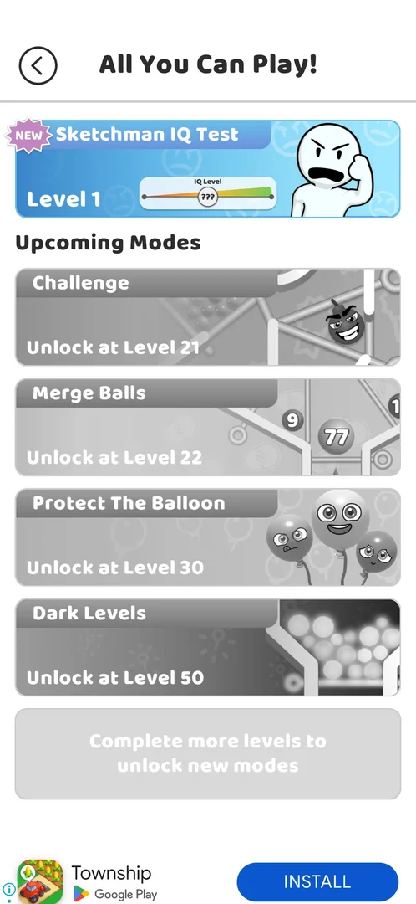 [^s12]
*All You Can Play! at level 18: the Sketchman IQ Test card at the top opens the mode; the other four modes greyed under Upcoming Modes*

 [^s1]
*Before: All You Can Play! at level 10 (241.5.1), the Sketchman IQ Test card greyed with "Unlock at Level 16"*

## What it looks like

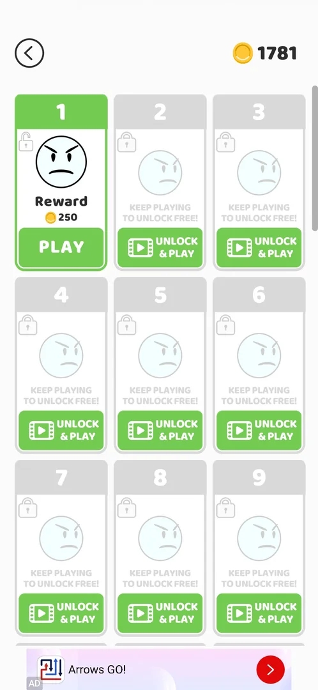 [^s10]
*The mode's screen: a grid of numbered levels, level 1 open with PLAY, the rest locked (the coin counter top right)*

A white screen with a back arrow at the top left and the coin counter at the top right (1781, and 1802 on the
next visit), and a scrolling grid of numbered level cards, three per row [^s10] [^s18]:

- **Level 1**: green, an open lock, an angry stick-figure face, **Reward 250** coins and a green **PLAY**
  button.
- **Levels 2 and up** (2 to 9 on screen, the grid scrolls further): grey, a closed lock, a faded face, the
  line "Keep playing to unlock free!" and a green **UNLOCK & PLAY** button with a video icon.

The card in All You Can Play! is in colour once unlocked: the NEW badge, the name, **Level 1**, a gauge
labelled "IQ Level" with ??? on it, and the angry stick-figure character [^s5]. Locked, the same card was
greyscale with "Unlock at Level 16" in place of the level [^s1].

On 6 October, with the main game at level 20, the mode's card in All You Can Play! read **Level 2**, but on the
grid level 2 and all the others were still locked with "Keep playing to unlock free!"; level 1 kept its trophy,
MAX and PLAY AGAIN; coins 2068 [^s24].

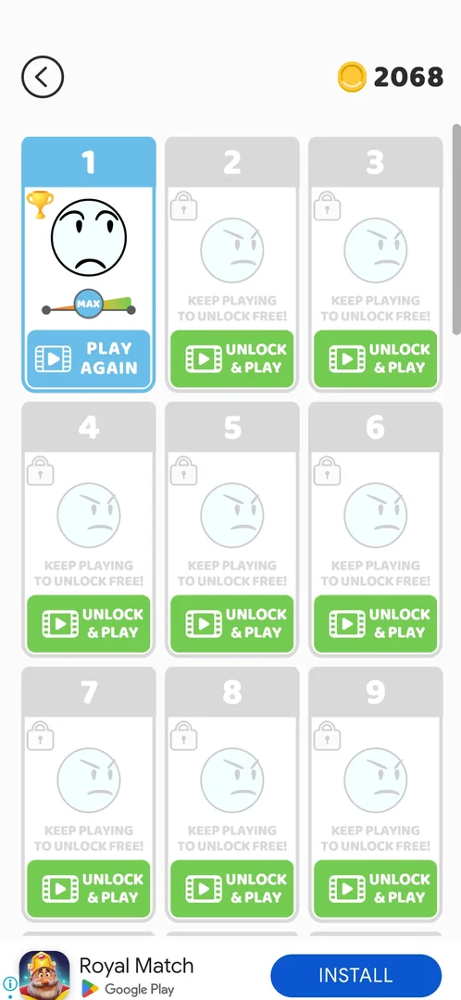 [^s24]
*The grid at main level 20: only level 1 is open, although the mode's card says Level 2*

## What you can do

| Tab or button | What it does |
|---|---|
| [Show Me!](#show-me) | On the unlock popup: opens All You Can Play! |
| [Sketchman level](#sketchman-level) | PLAY on an open level card: the level's board |
| [Amazing!](#amazing) | The win screen: the IQ reached, Try again! for a video, Get 250 coins |
| [Grid after a win](#grid-after-a-win) | The won level's card: a trophy, IQ at MAX, PLAY AGAIN for a video |
| [Partial result](#partial-result) | The result screen when only part of the balls reach the cup: a lower IQ and fewer coins |
| [Phenomenal! (empty cup)](#phenomenal-empty-cup) | The result screen with no ball in the cup: IQ 50, Get 0; no fail screen |
| [Try again!](#try-again) | On a result screen: a rewarded video, then the same level from the start |
| [Leave Sketchman](#leave-sketchman) | X in a level: asks to stay or leave; leaving loses the level's progress |
| [UNLOCK & PLAY](#unlock--play) | On a locked level card: a video; not tapped |

### Show Me!

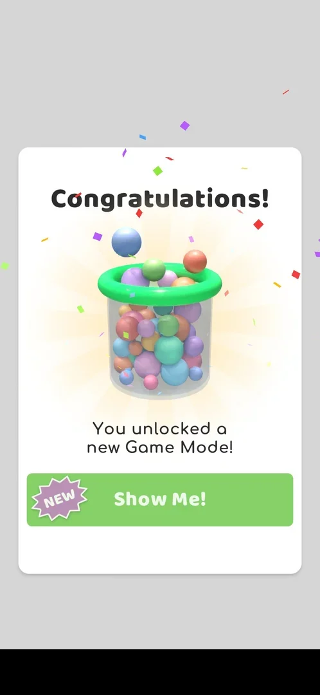 [^s8]
*The unlock popup on the first Play! after the level 15 win: a jar of balls, "You unlocked a new Game Mode!", Show Me! with a NEW badge*

Opened All You Can Play! with the unlocked card at the top [^s5].

### Sketchman level

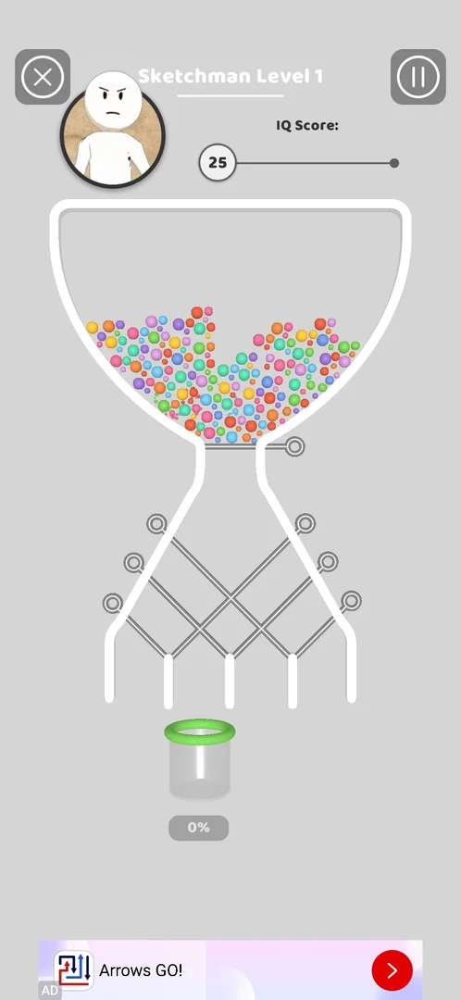 [^s11]
*Sketchman Level 1 as it opens: the board, the cup at 0% under it, the IQ Score gauge at 25 at the top*

PLAY on level 1 opened **Sketchman Level 1** [^s11]:

- At the top: an X button at the left, a pause button at the right, the Sketchman character in a round
  portrait, and an **IQ Score** gauge with a marker at **25** at its left end.
- The board: an hourglass-shaped flask full of coloured balls, a pin across its neck, and under it six pins
  crossing over five chutes; one cup under the chutes with **0%** under it.

Played on the next visit, level 1 was the same board, with the gauge at **10** as it opened [^s19]. It is won
like a level of the [core game](core-level.md): four pulls (the pin in the neck, then three of the crossing
pins in turn) led the balls down one chute into the cup, which showed 54% while they poured [^s20] [^s21] [^s15].
The IQ Score marker read **0** from the first pull to the end of the board [^s20] [^s21]. Inferred: the gauge
counts down with time from the moment the level opens (25 one visit, 10 the next, 0 seconds later); not
verified.

*Sketchman level 1: the last pin is pulled and the balls pour from the chute into the cup* (clip dropped: per-dream clip limit) [^s15]
*Clip 3 s · [original on YouTube from 5:30](https://youtu.be/PZ3ujKA8euo?t=330); the last pull of level 1*

### Amazing!

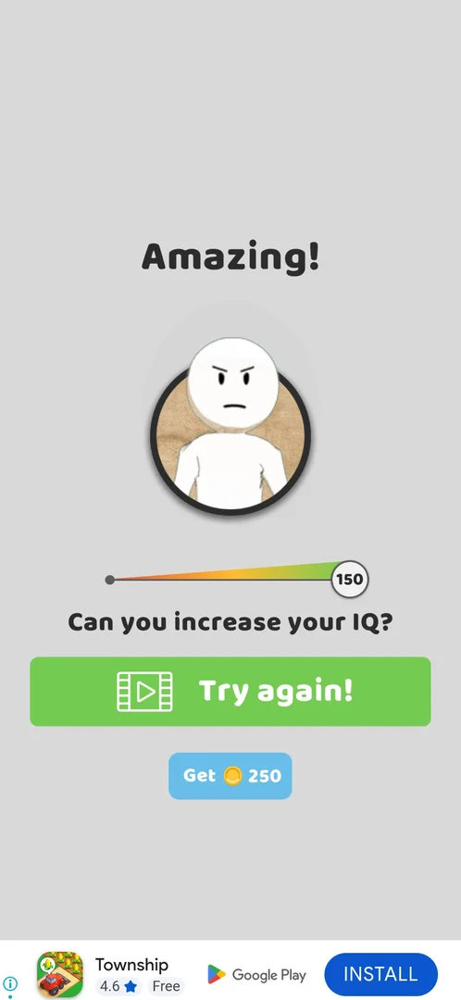 [^s15]
*The win screen of Sketchman level 1: IQ 150, Try again! for a video or Get 250*

When the cup was full the win screen came: the title **Amazing!**, the Sketchman portrait, a gauge from red to
green with its marker at **150**, the line "Can you increase your IQ?", a large green **Try again!** button
with a video icon and a small blue **Get 250** coins button [^s15]. Try again! was not tapped.

**Get 250** sent the coins flying to the counter (1802 to 2036 in the frame taken during the animation, 2052
when it ended) and then opened main level 19 directly, not the Sketchman grid or the map [^s16] [^s17]. The
league pins counter on the level 19 screen read 104, up from 100 [^s16].

### Grid after a win

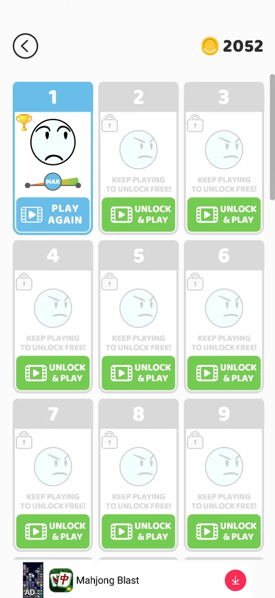 [^s17]
*The grid after the level 1 win: level 1 replayable for a video, level 2 still locked*

Back in the mode after the win (the map at level 19), the level 1 card was blue with a gold trophy, a frowning
face, a small gauge reading **MAX** and a blue **PLAY AGAIN** button with a video icon. Level 2 and up were
still grey and locked with "Keep playing to unlock free!" and UNLOCK & PLAY. Coins: 2052 [^s17].

**PLAY AGAIN** started a rewarded video of about 60 s; its end opened the Play Store by itself, and launching
the game again returned to Sketchman level 1, ready to play [^s25] [^s26].

### Partial result

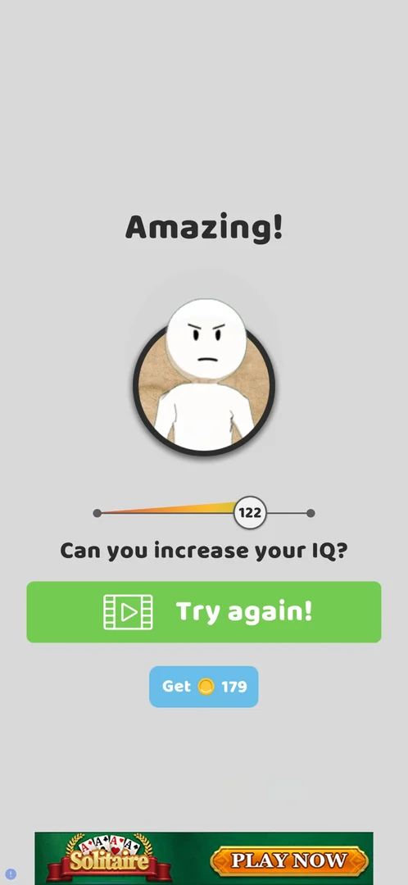 [^s22]
*The result of level 1 with every pin pulled: 71% of the balls in the cup, IQ 122, Get 179*

Level 1 replayed with every pin pulled at once, so that most balls ran into the side chutes: 71% of the balls
reached the cup and no fail screen came. The result screen was the same as the win screen, with **Amazing!**,
the gauge at **122** instead of 150 and **Get 179** coins instead of 250 [^s22].

### Phenomenal! (empty cup)

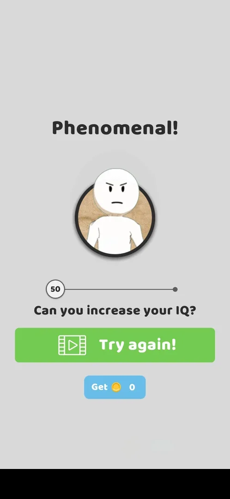 [^s23]
*The result with no ball in the cup: IQ 50, Get 0 (a local banner ad blacked out)*

With the pins pulled so that every ball ran past the cup (0%), there was still no fail screen: the headline
read **Phenomenal!**, the gauge stood at **50** at its left end, and the buttons were **Try again!** (video) and
**Get 0** [^s23]. **Get 0** left the mode for the board of main level 20, as Get 250 had led to the main
level before [^s27].

### Try again!

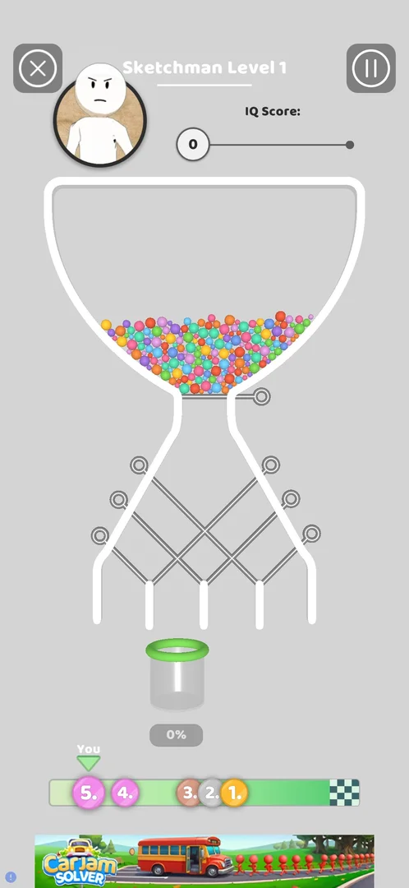 [^s29]
*After Try again! and its video: the same level from the start*

The large green button on every result screen. On the 71% result it started a rewarded video of about 60 s
(its end opened the Play Store by itself; launching the game came back), then the same Sketchman level 1 from
the start [^s28] [^s29].

### Leave Sketchman

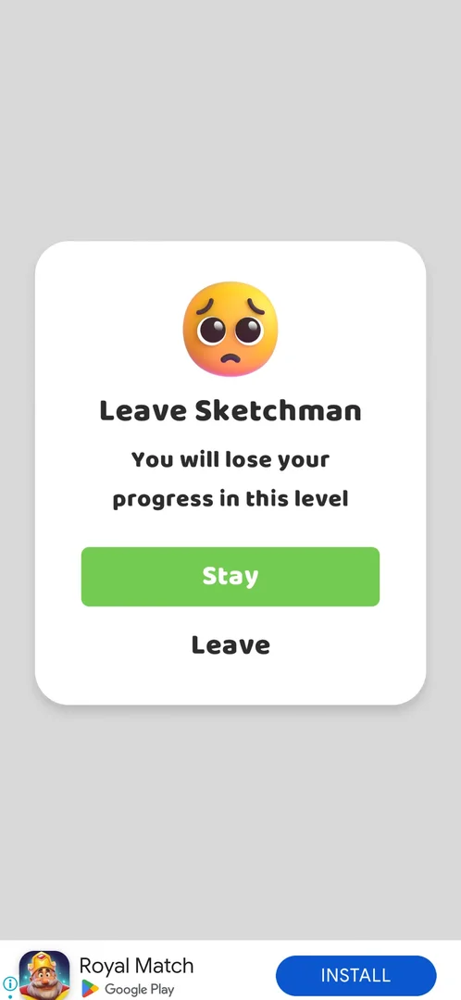 [^s13]
*X in a Sketchman level: the popup Leave Sketchman with Stay and Leave*

The X in a level opens **Leave Sketchman**: "You will lose your progress in this level", a green **Stay** and
a plain **Leave** [^s13]. **Leave** (with no pin pulled) was followed by a
full-screen interstitial ad, and after it the game opened the board of main level 18, not the level grid or
All You Can Play! [^s14]. See [Interstitial ads](interstitial.md).

### UNLOCK & PLAY

<!-- no-frame: not tapped; the button is seen only on the level grid above -->

On every locked level card, under "Keep playing to unlock free!", with a video icon
[^s10]. Not tapped: whether it plays a rewarded video and opens the level was not
seen.

## How it works

Version 241.5.2.

- Unlocks when level 15 is won; the popup comes on the next Play! on the map [^s8].
- Opens at Level 1 of the mode [^s5]. Level 1 pays **250 coins** as its reward (the amount on its card)
  [^s10]; the win paid them with Get 250 [^s16].
- The win screen showed IQ 150 on level 1; the won card shows MAX [^s15] [^s17]. Try again! (a video) is offered
  on the win screen to raise the IQ [^s15].
- Each level is played free once when it opens; a won level is replayed only by PLAY AGAIN, for a video [^s17].
- Level 2 was still locked right after the level 1 win, with the main game at level 19 [^s17].
- After Get 250 the game opens the next main level, not the mode [^s16].
- Levels 2 and up are locked: "Keep playing to unlock free!" or UNLOCK & PLAY with a video
  [^s10]. Winning level 1 did not open level 2 [^s17]. Hypothesis: a level unlocks free after some more main
  levels are won, not verified.
- The IQ Score gauge in a level read 25 as level 1 opened once [^s11] and 10 the next time [^s19], and 0 from
  the first pull on [^s20]; the card's IQ Level gauge reads ??? before any level is played [^s5].
- Leaving a level loses its progress (the popup's text) and was followed by an interstitial ad
  [^s13] [^s14].
- The other modes on the same menu: Challenge at level 21, Merge Balls at 22, Protect The Balloon at 30, Dark
  Levels at 50, and a grey line "Complete more levels to unlock new modes" [^s5].
- On the map the label "Unlock New Mode" sat above level 16 before the unlock and was gone after it; the
  same label sits above levels 21 and 22 [^s7] [^s9]. See [Keys on the map](map-keys.md).

Results of level 1 on version 241.5.2 [^s22] [^s23] [^s15]:

| Balls in the cup | Headline | IQ | Coins |
|---|---|---|---|
| all (100%) | Amazing! | 150 (MAX on the card) | 250 |
| 71% | Amazing! | 122 | 179 |
| 0% | Phenomenal! | 50 | 0 |

Inferred from the three results: the IQ and the coins grow with the share of balls in the cup; the exact rule
is not verified (follow-up exp-iq-partial-coins). After each Sketchman result the race marker moved right
("You moved") as after a main level ([Level race](race.md)) [^s27].

## Cases

| Case | What was done | Result | Source |
|---|---|---|---|
| Why it appeared <!-- case:chk-appeared --> | Won level 15, tapped Play!, then Show Me! | ✅ The unlock popup, then the card with NEW and Level 1 | [^s5] |
| Map top-left jar button (All You Can Play!), first card 'Sketchman IQ Test' with NEW badge, Level 1, IQ Level ??? gauge; also reached by Show Me! on the unlock popup <!-- case:chk-entry --> | Opened All You Can Play! from the jar button and tapped the card | ✅ The card opens the mode's level grid | [^s12] [^s10] |
| What it looks like <!-- case:chk-screen --> | Opened the mode, played and won level 1 | ✅ The level grid, the level board with the IQ Score gauge, the win screen and the grid after the win | [^s10] [^s15] [^s17] |
| Rules <!-- case:chk-rules --> | Played level 1 | ✅ Pin-pull rules: fill the cup; the IQ Score gauge read 10 at the start, 0 from the first pull; the win screen shows the IQ reached (150) | [^s19] [^s15] |
| A win <!-- case:chk-win --> | Won level 1 | ✅ "Amazing!": IQ 150, Try again! for a video or Get 250 coins | [^s15] |
| A loss <!-- case:chk-loss --> | Played level 1 to lose on purpose: every pin pulled, then all the balls sent past the cup | ✅ Does not apply: a Sketchman level never fails; a poor result is a result screen with a lower IQ and fewer coins (0%: IQ 50, Get 0), Try again! by video | [^s23] |
| Progression inside the mode <!-- case:chk-progression --> | Looked at the grid after the level 1 win | ✅ Levels open one by one; a won level gets a trophy and an IQ gauge at MAX; replay is PLAY AGAIN for a video | [^s17] |
| Limits <!-- case:chk-limits --> | Looked at the grid after the level 1 win | ✅ Each level free once when it opens; replay for a video; the next level free with more main progress or at once for a video; level 2 not free right after the level 1 win at main level 19 | [^s17] |
| Level board: a pin-pull board (hourglass, top pin and 6 crossing pins, one cup with fill %) <!-- case:board --> | PLAY on level 1 | ✅ Sketchman Level 1: the hourglass board, one cup at 0%, the IQ Score gauge at 25 | [^s11] |
| X in a Sketchman level asks 'Leave Sketchman? You will lose your progress in this level' <!-- case:leave --> | Tapped X, then Leave | ✅ The popup with Stay and Leave; Leave gave an interstitial, then main level 18 | [^s13] [^s14] |
| No fail screen <!-- case:no-fail --> | Replayed level 1 with 71%, then 0% of the balls in the cup | ✅ 71%: Amazing!, IQ 122, Get 179; 0%: Phenomenal!, IQ 50, Get 0; full cup: IQ 150, 250 coins | [^s22] |
| Try again! and Get on a result <!-- case:retry-offer --> | Tapped Try again! on the 71% result, Get 0 on the 0% result | ✅ Try again! is a rewarded video, then the same level from the start; Get, even Get 0, leads to the main level (level 20), not the grid | [^s27] |
| PLAY AGAIN on a won level <!-- case:replay-video --> | Tapped PLAY AGAIN on level 1 (MAX) | ✅ A rewarded video of about 60 s (its end opened the Play Store; launch returned to the level), then level 1 | [^s26] |
| Sketchman results count for the race <!-- case:race-counts --> | Watched the race after each result | ✅ "You moved" right after each Sketchman result | [^s27] |
| After the win <!-- case:after-win --> | Tapped Get 250 | ✅ Coins 1802 to 2052 with the animation; main level 19 opened directly, not the grid; league pins 100 to 104 | [^s16] [^s17] |

## Not verified

- How many main levels open level 2 free (still locked at main level 20 though the card says Level 2); what UNLOCK & PLAY gives after the video
- The rule from the share in the cup to the IQ and the coins (three points known: 100%, 71%, 0%)
- Hypothesis: the IQ Score gauge counts down with time from the level's start, not verified

[^s1]: session 20261003-211035-chrono-2FYKPJ, step 1 — [video at 0:19](https://youtu.be/Mpfk4cqdltQ?t=19)
[^s2]: session 20261003-211035-chrono-2FYKPJ, step 2 — [video at 0:53](https://youtu.be/Mpfk4cqdltQ?t=53)
[^s3]: session 20261005-151039-chrono-2FYKPJ, step 17 — [video at 5:51](https://youtu.be/r5lFTdFC8_s?t=351)
[^s5]: session 20261005-151039-chrono-2FYKPJ, step 20 — [video at 6:57](https://youtu.be/r5lFTdFC8_s?t=417)
[^s7]: session 20261005-151039-chrono-2FYKPJ, step 0 — [video at 0:00](https://youtu.be/r5lFTdFC8_s?t=0)
[^s8]: session 20261005-151039-chrono-2FYKPJ, step 19 — [video at 6:40](https://youtu.be/r5lFTdFC8_s?t=400)
[^s9]: session 20261005-151039-chrono-2FYKPJ, step 21 — [video at 7:42](https://youtu.be/r5lFTdFC8_s?t=462)

[^s10]: session 20261005-230946-chrono-2FYKPJ, step 2 — [video at 0:43](https://youtu.be/sunhCvwxYTk?t=43)
[^s11]: session 20261005-230946-chrono-2FYKPJ, step 3 — [video at 0:59](https://youtu.be/sunhCvwxYTk?t=59)
[^s12]: session 20261005-230946-chrono-2FYKPJ, step 1 — [video at 0:32](https://youtu.be/sunhCvwxYTk?t=32)
[^s13]: session 20261005-230946-chrono-2FYKPJ, step 4 — [video at 1:12](https://youtu.be/sunhCvwxYTk?t=72)
[^s14]: session 20261005-230946-chrono-2FYKPJ, step 6 — [video at 2:41](https://youtu.be/sunhCvwxYTk?t=161)

[^s15]: session 20261005-235042-chrono-2FYKPJ, step 17 — [video at 5:33](https://youtu.be/PZ3ujKA8euo?t=333)
[^s16]: session 20261005-235042-chrono-2FYKPJ, step 18 — [video at 5:59](https://youtu.be/PZ3ujKA8euo?t=359)
[^s17]: session 20261005-235042-chrono-2FYKPJ, step 21 — [video at 6:54](https://youtu.be/PZ3ujKA8euo?t=414)
[^s18]: session 20261005-235042-chrono-2FYKPJ, step 12 — [video at 4:27](https://youtu.be/PZ3ujKA8euo?t=267)
[^s19]: session 20261005-235042-chrono-2FYKPJ, step 13 — [video at 4:42](https://youtu.be/PZ3ujKA8euo?t=282)
[^s20]: session 20261005-235042-chrono-2FYKPJ, step 14 — [video at 5:21](https://youtu.be/PZ3ujKA8euo?t=321)
[^s21]: session 20261005-235042-chrono-2FYKPJ, step 16 — [video at 5:29](https://youtu.be/PZ3ujKA8euo?t=329)

[^s22]: session 20261006-012240-chrono-2FYKPJ, step 9 — [video at 3:40](https://youtu.be/jf_j5LiHuRs?t=220)
[^s23]: session 20261006-012240-chrono-2FYKPJ, step 13 — [video at 6:31](https://youtu.be/jf_j5LiHuRs?t=391)
[^s24]: session 20261006-012240-chrono-2FYKPJ, step 5 — [video at 1:20](https://youtu.be/jf_j5LiHuRs?t=80)
[^s25]: session 20261006-012240-chrono-2FYKPJ, step 6 — [video at 1:34](https://youtu.be/jf_j5LiHuRs?t=94)
[^s26]: session 20261006-012240-chrono-2FYKPJ, step 7 — [video at 3:00](https://youtu.be/jf_j5LiHuRs?t=180)
[^s27]: session 20261006-012240-chrono-2FYKPJ, step 14 — [video at 6:59](https://youtu.be/jf_j5LiHuRs?t=419)
[^s28]: session 20261006-012240-chrono-2FYKPJ, step 10 — [video at 4:22](https://youtu.be/jf_j5LiHuRs?t=262)
[^s29]: session 20261006-012240-chrono-2FYKPJ, step 11 — [video at 5:48](https://youtu.be/jf_j5LiHuRs?t=348)
