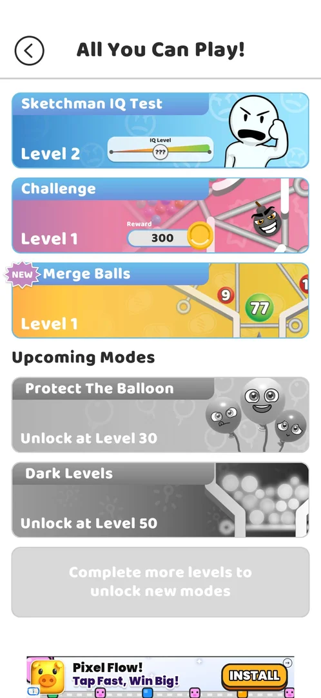

# Merge Balls

A game mode in the [All You Can Play!](ball-jar.md) menu, locked until level 22 [^s1]. It unlocked once level
21 was won: the next tap on **Play!** for level 22 showed a "You unlocked a new Game Mode!" popup, and its
**Show Me!** button opened the menu with a new **Merge Balls** card (NEW, Level 1) [^s4] [^s3]. The mode was
not opened or played yet: what is known is its card, its unlock level and the unlock popup.

## Why it appeared

Listed in the All You Can Play! modes menu, opened from the jar icon on the map at level 10, as a greyed card
with "Unlock at Level 22" (version 241.5.1) [^s1]. It unlocked with level 22 current, after the level 21 win
(version 241.5.2) [^s4].

## Where to find it

The map: the jar icon at the top left opens All You Can Play!; the mode is the third card, **Merge Balls**,
under Sketchman IQ Test and Challenge [^s3]. Right after the unlock the **Show Me!** button of the unlock
popup leads there directly [^s4] [^s3].

 [^s3]
*All You Can Play! after the unlock: the Merge Balls card, third from the top, with the NEW badge and Level 1*

Before the unlock the card sat under Upcoming Modes, greyed, with "Unlock at Level 22"; a tap on it did
nothing [^s1] [^s2]:

 [^s1]
*All You Can Play! at level 10 (version 241.5.1): the Merge Balls card with "Unlock at Level 22"*

## What it looks like

<!-- no-screen: the Merge Balls card was not tapped in the session that unlocked it -->

Only the card was seen: the name, a yellow picture of a board with numbered balls (9, 77) between pins, and
the level, **Level 1** [^s3]. The mode's own screen was not opened.

## What you can do

| Tab or button | What it does |
|---|---|
| [Show Me!](#show-me) | On the unlock popup: opens All You Can Play! with the new card |

### Show Me!

 [^s4]
*The popup after Play! on level 22: Congratulations!, a jar of balls, "You unlocked a new Game Mode!" and Show Me!*

The popup came on the tap on **Play!** for level 22, before the level: **Congratulations!**, a picture of a
jar of coloured balls with confetti, "You unlocked a new Game Mode!" and a green **Show Me!** button with a
NEW badge [^s4]. Show Me! opened All You Can Play! with the Merge Balls card marked NEW [^s3]. The popup does
not name the mode. The back arrow of the menu returned to the map, and the next Play! started level 22
[^s3].

## How it works

Version 241.5.2.

- Unlock: the card read "Unlock at Level 22" [^s1]; the unlock popup came at the first Play! with level 22
  current, after the level 21 win [^s4].
- Rules, rewards and limits of the mode: not seen.

## Cases

| Case | What was done | Result | Source |
|---|---|---|---|
| Why it appeared <!-- case:chk-appeared --> | Opened All You Can Play! at level 10; later won level 21 and tapped Play! | ✅ Listed and locked until level 22; unlocked with the popup at the level 22 Play! | [^s1] [^s4] |
| Where to find it <!-- case:chk-entry --> | Tapped Show Me! on the unlock popup | not verified: the card (third, NEW, Level 1) is seen in the menu; what it opens was not tapped | [^s3] |
| What it looks like <!-- case:chk-screen --> | — | not verified: the mode's screen not opened |  |
| Rules <!-- case:chk-rules --> | — | not verified: not played |  |
| A win <!-- case:chk-win --> | — | not verified: not played |  |
| A loss <!-- case:chk-loss --> | — | not verified: not played |  |
| Progression inside the mode <!-- case:chk-progression --> | — | not verified: not played |  |
| Limits <!-- case:chk-limits --> | — | not verified: not played |  |

## Not verified

- Where to find it: what a tap on the Merge Balls card opens <!-- case:chk-entry -->
- What it looks like: the mode's screen <!-- case:chk-screen -->
- Rules: the goal and how it differs from the core game (the card shows numbered balls) <!-- case:chk-rules -->
- A win: its screen and what it pays <!-- case:chk-win -->
- A loss: its screen, what it costs and the retry offers <!-- case:chk-loss -->
- Progression inside the mode: levels, stars, a best score <!-- case:chk-progression -->
- Limits: attempts, energy, a timer or a schedule; what more attempts cost <!-- case:chk-limits -->

[^s1]: session 20261003-211035-chrono-2FYKPJ, step 1 — [video at 0:19](https://youtu.be/Mpfk4cqdltQ?t=19)
[^s2]: session 20261003-211035-chrono-2FYKPJ, step 2 — [video at 0:53](https://youtu.be/Mpfk4cqdltQ?t=53)
[^s3]: session 20261006-033538-chrono-2FYKPJ, step 22 — [video at 8:12](https://youtu.be/j9sNlnJxE4Y?t=492)
[^s4]: session 20261006-033538-chrono-2FYKPJ, step 21 — [video at 7:53](https://youtu.be/j9sNlnJxE4Y?t=473)
