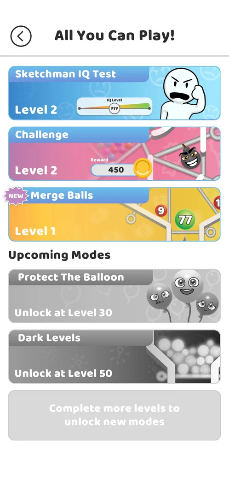
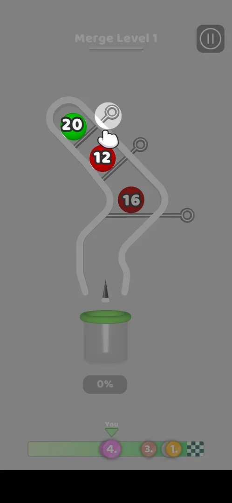
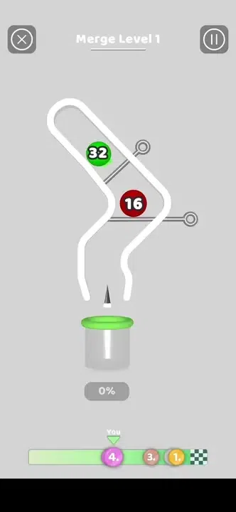
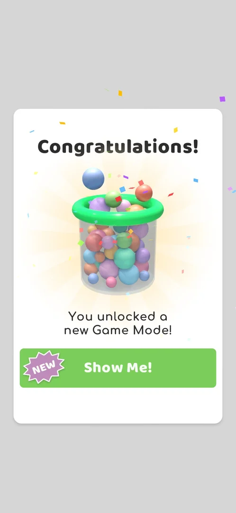
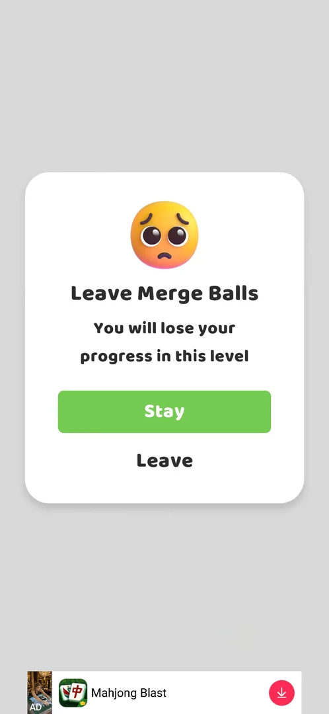

# Merge Balls

A game mode in the [All You Can Play!](ball-jar.md) menu, locked until level 22 [^s1]. Its levels are pin
boards with numbered balls: pulling a pin lets the balls roll, and two balls that meet merge into one ball
carrying the sum of their numbers (20 and 12 became 32) [^s5]. Under the board are a spike, a jar and a
percentage gauge, and at the bottom a race bar with four racers [^s7]. Only the first pull of Merge Level 1
(a guided tutorial) was played: the goal, the win and the loss are not seen yet.

## Why it appeared

Listed in the All You Can Play! modes menu, opened from the jar icon on the map at level 10, as a greyed card
with "Unlock at Level 22" (version 241.5.1) [^s1]. It unlocked with level 22 current: after the level 21
win, the tap on **Play!** for level 22 showed the unlock popup, and the menu then had the Merge Balls card
with a NEW badge (version 241.5.2) [^s4] [^s3] [^s5].

## Where to find it

The map: the jar icon at the top left (it carried a NEW badge after the unlock) opens All You Can Play!; the
mode is the third card, **Merge Balls**, under Sketchman IQ Test and Challenge, with a yellow picture of a board with numbered balls (9, 77) between
pins and the mode's level, **Level 1** [^s6] [^s3]. A tap on the card
starts the mode's current level, Merge Level 1 [^s7]. Right after the unlock the **Show Me!** button of the
unlock popup leads to the menu directly [^s4] [^s3].

 [^s6]
*All You Can Play! at level 24: the Merge Balls card, third from the top, with the NEW badge and Level 1*

Before the unlock the card sat under Upcoming Modes, greyed, with "Unlock at Level 22"; a tap on it did
nothing [^s1] [^s2]:

 [^s1]
*All You Can Play! at level 10 (version 241.5.1): the Merge Balls card with "Unlock at Level 22"*

## What it looks like

 [^s7]
*Merge Level 1: the tutorial hand on the top pin; the spike, the jar and the 0% gauge under the board; the race bar at the bottom*

The level screen is titled **Merge Level 1**, with an X button at the top left and a pause button at the top
right [^s7] [^s5]. On the board are three numbered balls (20 green, 12 and 16 red) held by three pins in a
bent tube; below the tube's two exits stand a spike and a jar, and under the jar a gauge reading **0%**
[^s7]. Below that, a race bar: four racers, numbered by place (1, 3 and 4 visible), on the way towards a chequered finish, with the
player's racer, 4th, marked **You** [^s7]. A banner ad sits at the bottom [^s7]. On the first level a grey
overlay and an animated hand point at the top pin [^s7].

 [^s5]
*Clip 3 s · [original on YouTube from 1:02](https://youtu.be/QrD_qekwXHQ?t=62)*

## What you can do

| Tab or button | What it does |
|---|---|
| [Show Me!](#show-me) | On the unlock popup: opens All You Can Play! with the new card |
| [Leave Merge Balls](#leave-merge-balls) | The X of a Merge level: asks to stay or leave |

### Show Me!

 [^s4]
*The popup after Play! on level 22: Congratulations!, a jar of balls, "You unlocked a new Game Mode!" and Show Me!*

The popup came on the tap on **Play!** for level 22, before the level: **Congratulations!**, a picture of a
jar of coloured balls with confetti, "You unlocked a new Game Mode!" and a green **Show Me!** button with a
NEW badge [^s4]. Show Me! opened All You Can Play! with the Merge Balls card marked NEW [^s3]. The popup does
not name the mode. The back arrow of the menu returned to the map, and the next Play! started level 22
[^s3].

### Leave Merge Balls

 [^s8]
*The X of a Merge level: Leave Merge Balls, with Stay and Leave*

The X at the top left of a Merge level opens **Leave Merge Balls**: "You will lose your progress in this
level", a green **Stay** button and **Leave** under it [^s8]. **Leave** was followed by a full-screen video
ad ([interstitial](interstitial.md)) with a skip control after a wait, then the All You Can Play! modes list [^s9].

## How it works

Version 241.5.2.

- Unlock: the card read "Unlock at Level 22" [^s1]; the unlock popup came at the first Play! with level 22
  current, after the level 21 win [^s4].
- Merging: in Merge Level 1, pulling the top pin dropped ball 20 onto ball 12, and they became one ball,
  32 [^s5]. Inferred: balls that touch add up their numbers; whether colour matters is not seen.
- The spike, the jar, the % gauge and the race bar were seen but not in action: what fills the gauge, what
  the spike does and what moves the racers are not verified [^s7].
- Leaving a level mid-way loses its progress (the popup's text) and was followed by a video ad [^s8] [^s9].
- Rewards and limits of the mode: not seen.

## Cases

| Case | What was done | Result | Source |
|---|---|---|---|
| Why it appeared <!-- case:chk-appeared --> | Opened All You Can Play! at level 10; later won level 21 and tapped Play! | ✅ Listed and locked until level 22; unlocked with the popup at the level 22 Play!, card with NEW | [^s1] [^s4] [^s5] |
| Where to find it <!-- case:chk-entry --> | Jar icon on the map, then the Merge Balls card | ✅ The card (third, NEW, Level 1) starts Merge Level 1; also reached by Show Me! on the unlock popup | [^s6] [^s7] [^s3] |
| What it looks like <!-- case:chk-screen --> | Opened Merge Level 1 | ✅ Title, X and pause, the pin board with numbered balls, a spike above a jar, the % gauge, the 4-racer race bar, a banner ad; Level 1 guided by a tutorial hand | [^s7] |
| Rules <!-- case:chk-rules --> | — | not verified: the goal not seen | |
| Merging by sum <!-- case:merge-by-sum --> | Pulled the top pin as the hand showed | not verified in full: green 20 fell on red 12 and became green 32; whether the falling ball's colour is always kept, and what the spike and the colours do, not seen | [^s5] |
| A win <!-- case:chk-win --> | — | not verified: no level finished |  |
| A loss <!-- case:chk-loss --> | — | not verified: no level finished |  |
| Progression inside the mode <!-- case:chk-progression --> | — | not verified: only Merge Level 1 opened |  |
| Limits <!-- case:chk-limits --> | — | not verified |  |
| Leaving a level <!-- case:leave-confirm --> | X, then Leave | ✅ Leave Merge Balls popup (progress lost); Leave played a video ad, then the modes list | [^s8] [^s9] |

## Not verified

- Rules: the goal (the jar, the spike, the % gauge) and how it differs from the core game <!-- case:chk-rules -->
- Merging by sum: whether the falling ball's colour is always kept; what the spike and the colours do (task exp-merge-spike) <!-- case:merge-by-sum -->
- A win: its screen and what it pays <!-- case:chk-win -->
- A loss: its screen, what it costs and the retry offers <!-- case:chk-loss -->
- Progression inside the mode: levels, stars, a best score; whether the race bar is in-level progress or the map's race event (task exp-merge-race-bar) <!-- case:chk-progression -->
- Limits: attempts, energy, a timer or a schedule; what more attempts cost <!-- case:chk-limits -->

[^s1]: session 20261003-211035-chrono-2FYKPJ, step 1 — [video at 0:19](https://youtu.be/Mpfk4cqdltQ?t=19)
[^s2]: session 20261003-211035-chrono-2FYKPJ, step 2 — [video at 0:53](https://youtu.be/Mpfk4cqdltQ?t=53)
[^s3]: session 20261006-033538-chrono-2FYKPJ, step 22 — [video at 8:12](https://youtu.be/j9sNlnJxE4Y?t=492)
[^s4]: session 20261006-033538-chrono-2FYKPJ, step 21 — [video at 7:53](https://youtu.be/j9sNlnJxE4Y?t=473)
[^s5]: session 20261006-060944-chrono-2FYKPJ, step 3 — [video at 1:05](https://youtu.be/QrD_qekwXHQ?t=65)
[^s6]: session 20261006-060944-chrono-2FYKPJ, step 1 — [video at 0:29](https://youtu.be/QrD_qekwXHQ?t=29)
[^s7]: session 20261006-060944-chrono-2FYKPJ, step 2 — [video at 0:40](https://youtu.be/QrD_qekwXHQ?t=40)
[^s8]: session 20261006-060944-chrono-2FYKPJ, step 4 — [video at 1:31](https://youtu.be/QrD_qekwXHQ?t=91)
[^s9]: session 20261006-060944-chrono-2FYKPJ, step 5 — [video at 1:40](https://youtu.be/QrD_qekwXHQ?t=100)
