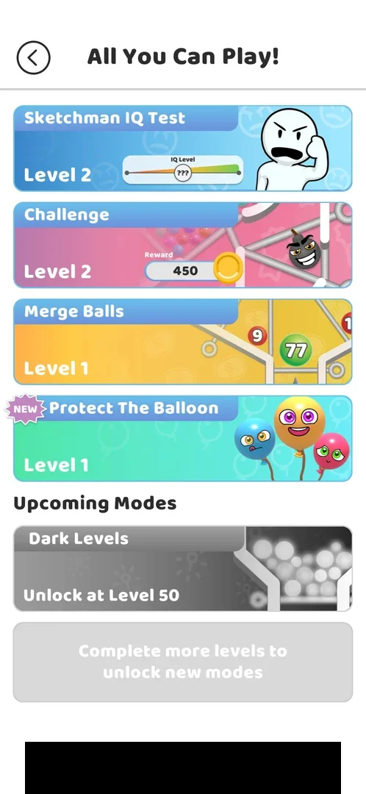
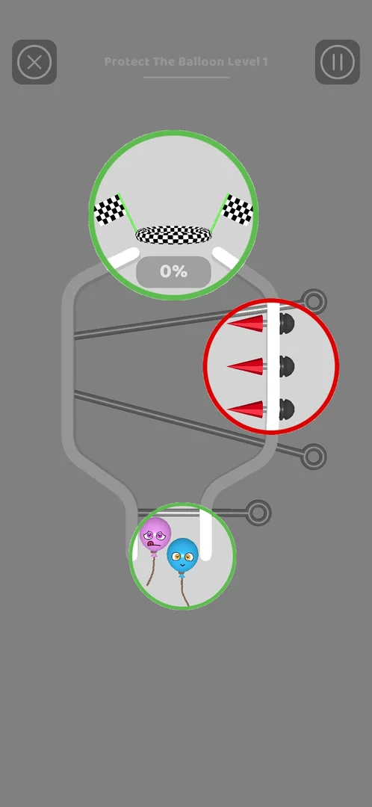
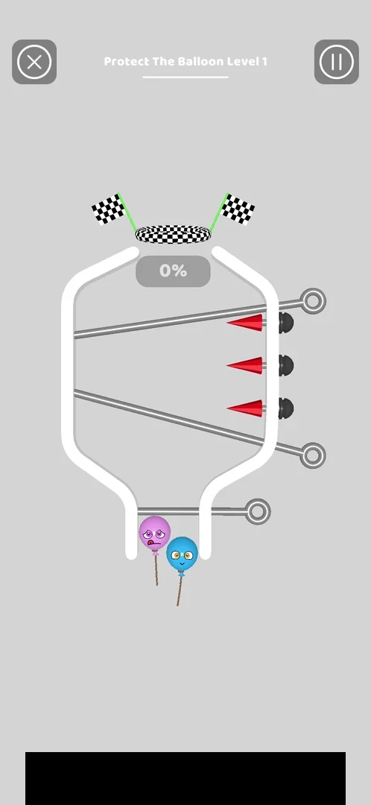
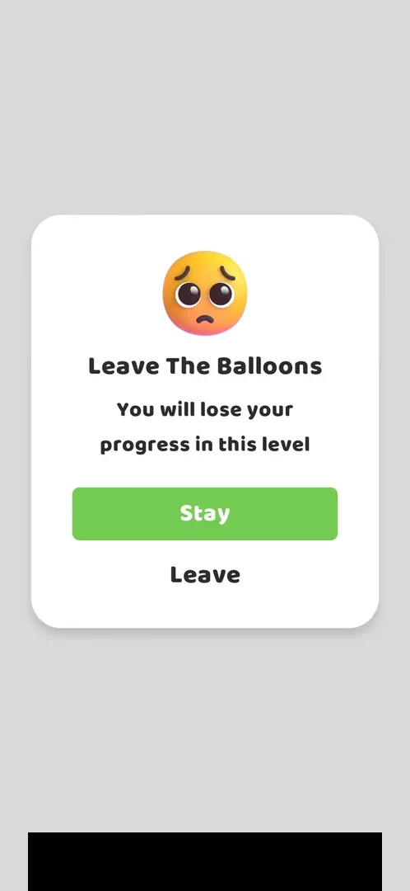

# Protect The Balloon

A game mode in the [All You Can Play!](ball-jar.md) menu, unlocked at level 30 [^s4] [^s6].
Its levels turn the core game upside down: instead of balls falling into a cup, balloons on strings sit at the
bottom of a bottle-shaped board and a checkered finish ring waits at the top, with pins across the bottle and
red spikes on its wall [^s1]. Only Level 1 was opened and left without a pull: how a level is won or lost was
not seen [^s3] [^s7].

## Why it appeared

Modes list card with NEW badge after reaching level 30 (Congratulations popup on Play L30) [^s2]. A tap on
Play for level 30 brought a "Congratulations! You unlocked a new Game Mode!" popup with Show Me! and No,
thanks [^s6]; at level 10 the card was already listed under Upcoming Modes,
greyed out, "Unlock at Level 30" [^s4].

## Where to find it

The map: the jar icon at the top left opens All You Can Play!; after the unlock the icon carries a NEW badge
[^s8]. In the list the mode is the card **Protect The Balloon**, the fourth
card, after Sketchman IQ Test, Challenge and Merge Balls, with a NEW badge and "Level 1" [^s2].

 [^s5]
*The map: the jar icon at the top left opens All You Can Play! (here at level 10, before the unlock)*

 [^s2]
*All You Can Play! at level 31: the Protect The Balloon card with a NEW badge and "Level 1"; Dark Levels the only upcoming mode, at level 50 (a banner ad blacked out)*

The NEW badge was gone from the card after the mode had been opened once [^s7].

## What it looks like

A tap on the card opens "Protect The Balloon Level 1" at once, with no menu between [^s1]. The level opens
dimmed, with three parts of the board ringed: the finish ring at the top and the balloons at the bottom in
green, the spikes on the right wall in red [^s1]. After about three seconds the rings go and the board is
shown plain ([Level 1](#level-1)) [^s1].

 [^s1]
*Level 1 as it opens: the finish ring and the balloons ringed in green, the spikes in red*

Inferred from the colours, not verified: green marks the goal and the pieces to protect, red the danger.

## What you can do

| Tab or button | What it does |
|---|---|
| [Level 1](#level-1) | The board: pins to pull (not tried) |
| [Leave The Balloons](#leave-the-balloons) | The popup of X (top left): leave the level or stay |
| [Pause](#pause) | The button at the top right; not tried |

### Level 1

The board is a bottle: two balloons with faces, purple and blue, on strings in the narrow neck at the bottom
under a short horizontal pin; two long slanted pins across the bottle; three red spikes on the right wall
between them; at the top a checkered ring between two checkered flags, and a 0% gauge under it [^s1].
The title "Protect The Balloon Level 1" is at the top between X and pause [^s1].

 [^s1]
*Level 1: the balloons at the bottom, the pins and the spikes in the bottle, the finish ring with its 0% gauge at the top (a banner ad blacked out)*

No pin was pulled. Inferred from the board, not verified: the balloons rise when the neck pin is pulled, the
gauge counts the balloons that reach the ring, and a balloon that touches a spike pops.

### Leave The Balloons

X asks "Leave The Balloons": "You will lose your progress in this level", with a green Stay button and Leave
under it [^s3]. Leave goes back to the All You Can Play! list [^s7].

 [^s3]
*The popup after X: Leave The Balloons, Stay or Leave (a banner ad blacked out)*

### Pause

<!-- no-frame: not tried -->
The pause button at the top right of the level was not tapped; what it opens is not known [^s1].

## How it works

Version 241.5.2. Unlocked at level 30, free: it was unlocked by reaching the level, no coins or video [^s4]
[^s6]. The mode has its own levels, starting at Level 1 [^s2]. The rules, the
reward and any limits were not seen.

## Cases

| Case | What was done | Result | Source |
|---|---|---|---|
| Why it appeared <!-- case:chk-appeared --> | Opened All You Can Play! at level 10; tapped Play on level 30 | ✅ Listed there, locked until level 30; unlocked with a Congratulations popup on Play for level 30 | [^s4] [^s6] |
| Map: modes jar > All You Can Play! list > Protect The Balloon card (NEW badge, Level 1) <!-- case:chk-entry --> | Tapped the jar icon on the map at level 31, then the card | ✅ The card opens Level 1 directly | [^s2] [^s1] |
| Protect The Balloon Level 1: bottle-shaped board, two balloons on strings held under a neck pin at the bottom, two slanted pins across the bottle, three red spikes on the right wall, checkered finish ring with flags at the top, 0% gauge; X (top left) and pause (top right); X asks 'Leave The Balloons' Stay/Leave <!-- case:chk-screen --> | Opened Level 1, waited, tapped X, then Leave | ✅ As described; Leave returns to the modes list | [^s1] [^s3] |
| Rules <!-- case:chk-rules --> | — | not verified: no pin pulled |  |
| A win <!-- case:chk-win --> | — | not verified |  |
| A loss <!-- case:chk-loss --> | — | not verified |  |
| Progression inside the mode <!-- case:chk-progression --> | — | not verified |  |
| Limits <!-- case:chk-limits --> | — | not verified |  |

## Not verified

- Rules: what pulling the pins does to the balloons, what the gauge counts <!-- case:chk-rules -->
- A win: its screen and what it pays <!-- case:chk-win -->
- A loss: whether a popped balloon ends the level, its screen, the retry offers <!-- case:chk-loss -->
- Progression inside the mode: the next levels and how they open <!-- case:chk-progression -->
- Limits: attempts, energy, a timer or a schedule <!-- case:chk-limits -->
- What Show Me! on the unlock popup does (No, thanks was taken)
- What Pause offers

[^s1]: session 20261006-113518-chrono-2FYKPJ, step 2 — [video at 0:31](https://youtu.be/f6pSE4U3c18?t=31)
[^s2]: session 20261006-113518-chrono-2FYKPJ, step 1 — [video at 0:18](https://youtu.be/f6pSE4U3c18?t=18)
[^s3]: session 20261006-113518-chrono-2FYKPJ, step 3 — [video at 1:04](https://youtu.be/f6pSE4U3c18?t=64)
[^s4]: session 20261003-211035-chrono-2FYKPJ, step 1 — [video at 0:19](https://youtu.be/Mpfk4cqdltQ?t=19)
[^s5]: session 20261003-211035-chrono-2FYKPJ, step 0 — [video at 0:00](https://youtu.be/Mpfk4cqdltQ?t=0)

[^s6]: session 20261006-091133-chrono-2FYKPJ, step 30 — [video at 13:26](https://youtu.be/nKqzeXFw6rA?t=806)
[^s7]: session 20261006-113518-chrono-2FYKPJ, step 4 — [video at 1:15](https://youtu.be/f6pSE4U3c18?t=75)
[^s8]: session 20261006-113518-chrono-2FYKPJ, step 0 — [video at 0:00](https://youtu.be/f6pSE4U3c18?t=0)
